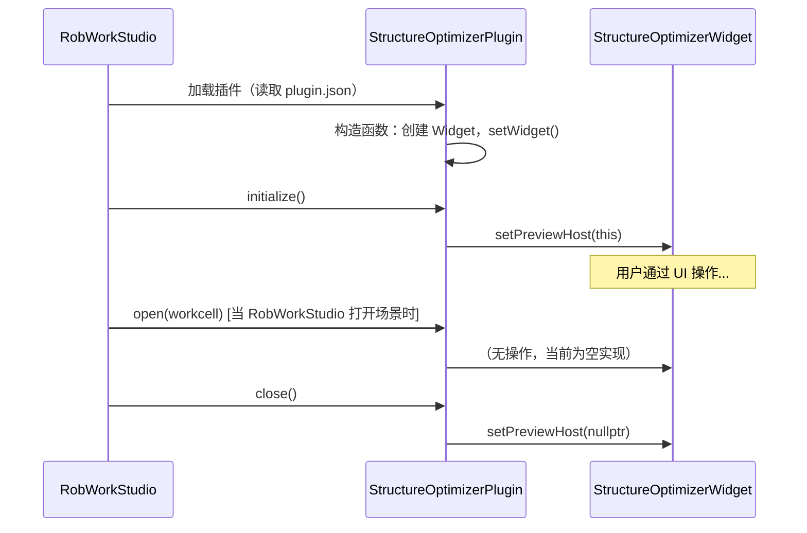
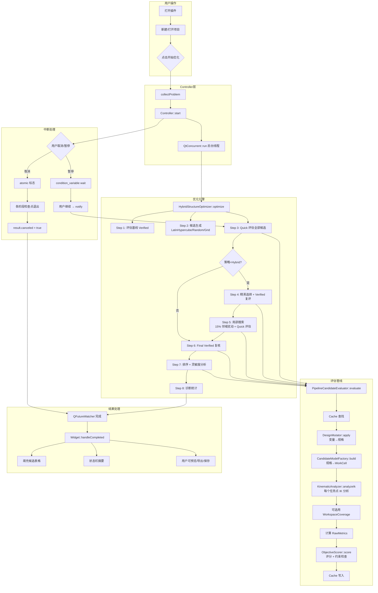
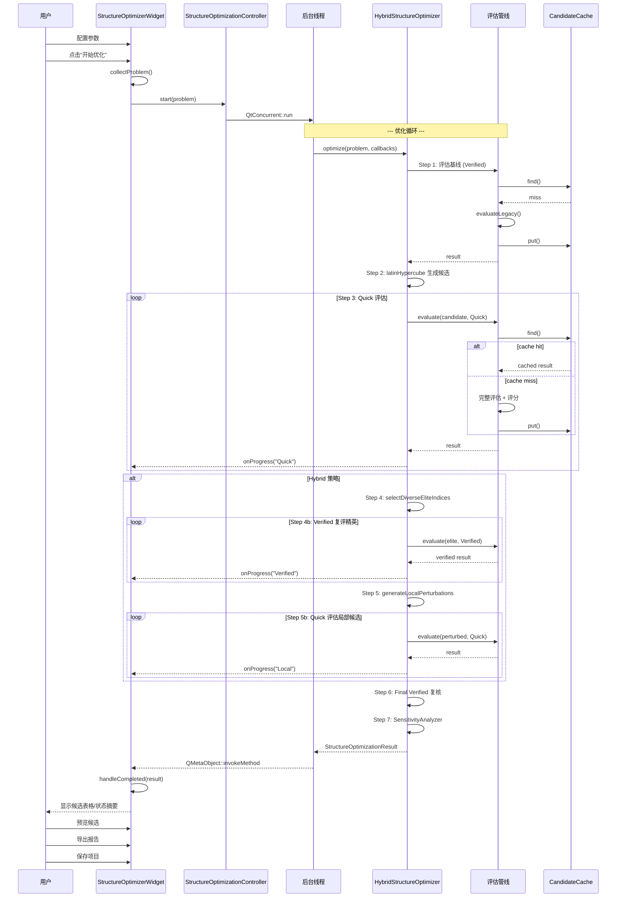

# StructureOptimizer 插件架构全解析

## 目录

1. [总览架构与分层](#1-总览架构与分层)
2. [核心数据结构 — StructureOptimizationTypes](#2-核心数据结构)
3. [插件入口与生命周期](#3-插件入口与生命周期)
4. [控制层 — Controller + UiLogic](#4-控制层)
5. [UI 层 — Widget + TableModel](#5-ui-层)
6. [优化枢纽 — HybridStructureOptimizer](#6-优化枢纽)
7. [候选生成 — CandidateGenerator](#7-候选生成)
8. [设计变异 — DesignMutator](#8-设计变异)
9. [模型构建 — CandidateModelFactory](#9-模型构建)
10. [评估管线 — Evaluator + KinematicEngineeringEvaluator](#10-评估管线)
11. [多目标评分 — ObjectiveScorer](#11-多目标评分)
12. [约束检查 — Validation](#12-约束检查)
13. [工作空间覆盖率 — WorkspaceCoverage](#13-工作空间覆盖率)
14. [灵敏度分析 — SensitivityAnalyzer](#14-灵敏度分析)
15. [缓存系统 — CandidateCache](#15-缓存系统)
16. [项目序列化与导出](#16-项目序列化与导出)
17. [完整处理流程图](#17-完整处理流程图)
18. [关键设计决策总结](#18-关键设计决策总结)

---

## 1. 总览架构与分层

该插件位于 `RobWorkStudio/src/rwslibs/structureoptimizer/`，总计约 65 个源文件，是一个**面向机器人运动学结构的参数优化工具**。核心目标是：在给定一组可调设计变量（关节位置、DH 参数、连杆几何等）的范围内，自动搜索出最优的机器人结构参数组合，使得机器人能够最好地完成指定任务点集。

**四层架构：**

```
┌───────────────────────────────────────────────────────┐
│  Plugin Layer (插件入口)                               │
│  StructureOptimizerPlugin                             │
├───────────────────────────────────────────────────────┤
│  UI Layer (用户交互)                                   │
│  StructureOptimizerWidget + TableModel x4              │
├───────────────────────────────────────────────────────┤
│  Controller Layer (运行控制)                           │
│  StructureOptimizationController                      │
├───────────────────────────────────────────────────────┤
│  Optimization Engine (优化引擎)                         │
│  ┌──────────────────────────────────────────────┐     │
│  │ HybridStructureOptimizer (算法入口)           │     │
│  │ ├─ StructureCandidateGenerator (采样生成)    │     │
│  │ ├─ StructureDesignMutator (变量→规格变异)    │     │
│  │ ├─ CandidateModelFactory (规格→WorkCell)    │     │
│  │ ├─ KinematicEngineeringEvaluator (IK评估)   │     │
│  │ ├─ StructureObjectiveScorer (多目标评分)     │     │
│  │ ├─ StructureWorkspaceCoverage (覆盖评估)    │     │
│  │ └─ StructureSensitivityAnalyzer (灵敏度)   │     │
│  └──────────────────────────────────────────────┘     │
├───────────────────────────────────────────────────────┤
│  I/O Layer (序列化与导出)                              │
│  ProjectAdapter / Json / Csv / ExportService / Report │
└───────────────────────────────────────────────────────┘
```

### 文件映射

#### 核心类型（1 组）
| 文件 | 角色 |
|------|------|
| `StructureOptimizationTypes.hpp` | 所有数据结构、枚举定义 |
| `StructureOptimizationStrategy.hpp` | 抽象接口 `IStructureCandidateEvaluator` + Strategy 基类 |
| `StructureOptimizationObjectiveProfile.hpp` | 目标函数配置/降级兼容 |

#### 插件入口（1 组）
| 文件 | 角色 |
|------|------|
| `StructureOptimizerPlugin.hpp/.cpp` | RobWorkStudio 插件入口 |
| `plugin.json` | Qt 插件元数据声明 |
| `resources.qrc` | Qt 资源文件 |
| `structureoptimizer_icon.png` | 插件图标 |

#### 算法核心（6 组）
| 文件 | 角色 |
|------|------|
| `HybridStructureOptimizer.hpp/.cpp` | 优化主算法（8 步流程） |
| `SystemEngineeringOptimizer.hpp/.cpp` | Pipeline → Hybrid 适配层 |
| `EngineeringEvaluatorPipeline.hpp/.cpp` | 评估器拓扑编排管线 |
| `KinematicEngineeringEvaluator.hpp/.cpp` | IEngineeringEvaluator 实现：运动学评估 |
| `StructureCandidateGenerator.hpp/.cpp` | 三种采样策略 |
| `StructureDesignMutator.hpp/.cpp` | 设计变量 → RobotModelSpec 变异 |
| `CandidateModelFactory.hpp/.cpp` | RobotModelSpec → WorkCell 运行时模型 |
| `StructureCandidateCache.hpp/.cpp` | 候选结果缓存（哈希键） |
| `StructureObjectiveScorer.hpp/.cpp` | 多目标评分 + 硬约束检查 |
| `StructureWorkspaceCoverage.hpp/.cpp` | 工作空间覆盖栅格评估 |
| `StructureSensitivityAnalyzer.hpp/.cpp` | 最佳解灵敏度分析 |
| `StructureCandidateEvaluator.hpp/.cpp` | 传统 IStructureCandidateEvaluator 实现 |
| `StructureOptimizationValidation.hpp/.cpp` | 问题完整性验证 |

#### UI 层（4 组）
| 文件 | 角色 |
|------|------|
| `StructureOptimizerWidget.hpp/.cpp` | 主 UI 组件（5 标签页） |
| `StructureOptimizationUiLogic.hpp/.cpp` | UI 逻辑（建议变量/可运行性检查） |
| `StructureVariableTableModel.hpp/.cpp` | 设计变量表格模型 |
| `OptimizationTaskTableModel.hpp/.cpp` | 任务点表格模型 |
| `StructureConstraintTableModel.hpp/.cpp` | 约束条件表格模型 |
| `StructureCandidateTableModel.hpp/.cpp` | 候选结果表格模型 |
| `CandidatePreviewController.hpp/.cpp` | 候选 3D 预览控制 |
| `StructureOptimizationController.hpp/.cpp` | 异步运行控制器 |

#### 文件 I/O 与导出（4 组）
| 文件 | 角色 |
|------|------|
| `StructureOptimizationProjectAdapter.hpp/.cpp` | 项目文件的打开/保存 |
| `StructureOptimizationProjectFactory.hpp/.cpp` | 从模型快照创建项目 |
| `StructureOptimizationJson.hpp/.cpp` | JSON 序列化 |
| `StructureOptimizationDocument.hpp/.cpp` | S60 当前权威 Envelope 的 schema 目录 |
| `StructureOptimizationMigration.hpp/.cpp` | S61 旧版 JSON 单向迁移 |
| `OptimizationRunSnapshot.hpp/.cpp` | S62 运行输入冻结与状态快照 |
| `OptimizationRunStore.hpp/.cpp` | S62 候选结果/证据资源存储 |
| `StructureOptimizationWorkflowResolver.hpp/.cpp` | S63 工作流失效与运行前置条件解析 |
| `OptimizationPreflight.hpp/.cpp` | S64 纯核心启动前置检查 |
| `StructureOptimizationCsv.hpp/.cpp` | CSV 导出（候选/任务明细/审计） |
| `StructureOptimizationExportService.hpp/.cpp` | 一站式导出服务 |
| `StructureCandidateExporter.hpp/.cpp` | 候选模型 XML 导出 |
| `StructureOptimizationReportWriter.hpp/.cpp` | Markdown 报告生成 |

#### 测试（1 组）
| 文件 | 角色 |
|------|------|
| `StructureOptimizationTest.cpp` | 回归测试 |

---

## Phase 0 contract boundary (2026-08-18)

The refactoring implementation begins by freezing core-only contracts without
changing the legacy optimizer, candidate compiler, or UI path:

- `StructureOptimizationContracts.hpp/.cpp` defines the orthogonal candidate
  lifecycle, feasibility/evidence/quality projection, completion facts, and
  stable diagnostics.  Legacy `StructureCandidateStatus` remains supported
  through one explicit projection.
- `KinematicConventions.hpp/.cpp` is the single mathematical convention for
  the canonical model: `T_parent_child = T_parent_jointZero * Motion(axis,
  q_input + zeroOffset) * T_jointMotion_child`; lengths are metres and angles
  are radians.  DH and Euler values are not truth sources here.
- `EngineeringRequirementArtifactAdapter` accepts frozen requirement execution
  data only.  It verifies the v4 execution contract, provenance and
  fingerprints; a v3 artifact requested for Verified evaluation fails with
  `REQ_V3_REQUIRES_REFREEZE`.
- JSON writes no NaN or infinity: unavailable numbers are represented by
  `null` plus explicit availability.  Root extensions are preserved and
  unknown enum values fail parsing rather than silently defaulting.

These boundaries are covered by focused tests and by the full registered
StructureOptimizer suite.  Phase 1 adds the canonical model as a core-only
shadow; no UI or optimization workflow is switched until its FK equivalence
gate has passed.

## Phase 6 persistence, migration, and workflow invalidation (2026-08-21)

Phase 6 makes persistence an explicit protocol boundary rather than a side
effect of the legacy serializer:

- `StructureOptimizationDocument` is the only current JSON Envelope. Each
  canonical partition has its own schema version, SI units are validated at the
  write/read boundary, and unknown root fields are preserved as extensions.
- `StructureOptimizationMigration` accepts legacy JSON read-only and emits a
  migration report plus a canonical Envelope; it never writes legacy fields
  back into the current document.
- `OptimizationRunSnapshot` freezes all input and toolchain fingerprints.
  `OptimizationRunStore` writes candidate results and evidence as independent,
  checksummed project-relative resources, keeping runtime pointers out of the
  main configuration.
- `StructureOptimizationWorkflowResolver` turns current/persisted identity
  comparisons into stable stale and blocking codes. A stale project cannot
  reuse an old cache or silently resume an incompatible run.
- `OptimizationPreflight` is the pure-core start gate. It reports structured
  findings for missing inputs, stale fingerprints, unavailable capabilities,
  invalid normalization/evidence, and unsafe search sizes before any worker is
  started.

The `current_json_envelope`, `legacy_json_migration`, `run_snapshot`,
`run_store`, `workflow_resolver`, `model_staleness`, `preflight_core`, and
`phase6_integration` suites provide both isolated diagnostics and a continuous
cross-boundary gate.

---

## 2. 核心数据结构

[StructureOptimizationTypes.hpp](StructureOptimizationTypes.hpp) 是整个插件的数据类型中枢，所有模块都依赖它。

### 枚举

| 枚举 | 值 | 含义 |
|------|-----|------|
| `StructureVariableKind` | JointPositionX/Y/Z, JointRotationRoll/Pitch/Yaw, DhA/DhD, BaseHeight, TcpOffsetX/Y/Z, LinkRadius/Width/Height | 可优化的结构设计变量种类 |
| `StructureConstraintKind` | ModelValid, RequiredTaskReachable/CollisionFree, MinimumJointMargin, MaximumTotalLength/BaseHeight/CrossSection/LinkSlenderness, MinimumWorkspaceCoverage | 约束条件种类 |
| `StructureStrategyKind` | Random, Grid, Hybrid | 搜索策略 |
| `StructureEvaluationStage` | Quick, Verified | 评估阶段（粗评 vs 精评） |
| `StructureCandidateStatus` | Pending, Feasible, Infeasible, Failed, Canceled | 候选解状态 |

### 核心结构体

#### StructureOptimizationProblem — 优化问题的完整定义

```cpp
struct StructureOptimizationProblem {
    RobotDesignContext              context;      // 机器人设计上下文（含基线模型规格）
    std::vector<OptimizationTaskPoint> tasks;     // 任务点列表（带 required 标记）
    std::vector<StructureDesignVariable> variables; // 设计变量列表
    std::vector<StructureConstraint> constraints;   // 约束条件列表
    StructureOptimizationWeights    weights;       // 多目标权重
    std::vector<ObjectiveTerm>      objectives;    // 通用指标目标（P1 起可持久化）
    std::vector<ConstraintRule>     metricConstraints; // 通用指标约束
    StructureEvaluationConfig       evaluation;    // 评估配置
    StructureOptimizationRunConfig  run;           // 运行配置
};
```

#### StructureDesignVariable — 单个可优化变量

```cpp
struct StructureDesignVariable {
    std::string id;             // 唯一标识符
    std::string label;          // 显示标签
    std::string targetName;     // 目标关节/坐标系名称
    std::string unit;           // 物理单位
    StructureVariableKind kind; // 变量种类
    double currentValue;        // 当前值
    double minimum, maximum;    // 取值范围
    double step;                // 搜索步长
    double preferredValue;      // 工程师偏好值
    double preferenceWeight;    // 偏好权重 [0,1]
    bool enabled;               // 是否参与优化
    bool syncAssociatedGeometry;// 是否自动同步关联连杆几何
};
```

#### StructureCandidateResult — 单个候选解的完整结果

```cpp
struct StructureCandidateResult {
    int index;                                  // 候选解索引
    std::vector<double> values;                 // 设计变量值
    StructureCandidateStatus status;            // 状态
    StructureEvaluationStage stage;             // 评估阶段
    bool feasible;                              // 是否满足所有硬约束
    double totalScore;                          // 加权综合得分 [0, 100]
    StructureRawMetrics raw;                    // 原始指标
    StructureComponentScores scores;            // 分量得分
    std::vector<std::string> violatedConstraints; // 违反的约束 ID
    std::vector<std::string> warnings;          // 警告
};
```

#### StructureOptimizationResult — 一次优化运行的完整结果

```cpp
struct StructureOptimizationResult {
    bool canceled;                              // 是否被取消
    std::string startedAt, completedAt;         // ISO 8601 时间
    int baselineCandidateIndex;                 // 基线候选解索引
    int bestCandidateIndex;                     // 最佳候选解索引
    std::vector<StructureCandidateResult> candidates; // 所有候选解
    StructureRunDiagnostics diagnostics;         // 运行诊断
    StructureSensitivityResult sensitivity;      // 灵敏度分析结果
    std::vector<AnalysisWarning> warnings;       // 全局警告
};
```

#### StructureRawMetrics — 候选解原始评估指标

```cpp
struct StructureRawMetrics {
    bool modelValid;
    int requiredTaskCount, requiredReachableCount;
    int optionalTaskCount, optionalReachableCount;
    double weightedReachability;         // 加权可达性 [0,1]
    double manipulabilityP10;            // 可操作度 10 分位数
    double jointMarginP10;               // 关节裕度 10 分位数
    double minimumJointMargin;           // 全局最小关节裕度
    double collisionFreeRate;            // 无碰撞样本比例 [0,1]
    double workspaceCoverage;            // 工作空间覆盖率 [0,1]
    bool   workspaceCoverageDataInsufficient;
    std::size_t workspaceOccupiedCellCount;
    std::size_t workspaceTotalCellCount;
    double totalKinematicLength;         // 运动链总长度 (m)
    double baseHeight;                   // 基座高度 (m)
    double maxCrossSection;              // 最大横截面积 (m^2)
    double maxLinkSlenderness;           // 最大连杆长细比
    double engineeringPreference;        // 工程偏好吻合度 [0,1]
    double modelBuildSeconds;            // 各阶段耗时
    double kinematicEvaluationSeconds;
    double workspaceEvaluationSeconds;
    std::vector<StructureTaskMetric> taskMetrics; // 各任务点指标
};
```

---

## 3. 插件入口与生命周期

[StructureOptimizerPlugin](StructureOptimizerPlugin.hpp) 是标准的 RobWorkStudio Qt 插件。

```cpp
class StructureOptimizerPlugin : public rws::RobWorkStudioPlugin,
                                  public IWorkCellPreviewHost
{
    Q_OBJECT
    Q_PLUGIN_METADATA(IID "dk.sdu.mip.Robwork.RobWorkStudioPlugin/0.1" FILE "plugin.json")
    Q_INTERFACES(rws::RobWorkStudioPlugin)

public:
    StructureOptimizerPlugin();
    ~StructureOptimizerPlugin() override;

    void open(rw::models::WorkCell* workcell) override;
    void close() override;
    void initialize() override;

    void loadSceneFile(const QString& filename);
    QString currentWorkCellPath() override;
    bool openWorkCell(const QString& path, QString* error) override;

private:
    StructureOptimizerWidget* _widget;
};
```

**生命周期**：



**关键点**：
- 通过 `plugin.json` 声明为 RobWorkStudio 插件，在 RobWorkStudio 启动时自动加载
- `initialize()` 创建 `StructureOptimizerWidget` 并注册为预览宿主
- `loadSceneFile()` / `openWorkCell()` 代理到 RobWorkStudio 核心的工作区管理
- 作为 `IWorkCellPreviewHost`，为候选预览提供 WorkCell 加载能力
- `currentWorkCellPath()` 从 WorkCell 的属性图读取场景文件路径

---

## 4. 控制层

### StructureOptimizationController

[Controller](StructureOptimizationController.cpp) 是异步运行控制器，基于 `QtConcurrent::run` + `QFutureWatcher` 实现。

**状态控制**：

```cpp
struct OptimizationControlState {
    std::atomic_bool canceled{false};
    std::atomic_bool paused{false};
    std::mutex mutex;
    std::condition_variable condition;
};
```

**运行流程**：

```cpp
start(problem)
  ├─ 创建 OptimizationControlState（共享指针）
  ├─ setPaused(false) / setRunning(true)
  ├─ QtConcurrent::run（后台线程）
  │     ├─ 组装 StructureOptimizationCallbacks
  │     │   ├─ isCancellationRequested → control->canceled.load()
  │     │   ├─ waitIfPaused → condition_variable wait（支持 resume 时 notify）
  │     │   └─ onProgress → QMetaObject::invokeMethod 跨线程发射信号
  │     ├─ try { return runFunction(snapshot, callbacks); }
  │     └─ catch → 封装为 result.warnings 返回
  └─ _watcher.setFuture(future) → 监听完成
```

**回调机制**（线程安全桥接）：

```
后台线程                      UI 线程
───────                      ───────
isCancellationRequested →    atomic 直读
waitIfPaused →               condition_variable → notify_all（从 resume() 触发）
onProgress →                 QMetaObject::invokeMethod + Qt::QueuedConnection
```

**默认运行函数**：

```cpp
static StructureOptimizationResult runDefaultOptimization(
    const StructureOptimizationProblem& problem,
    const StructureOptimizationCallbacks& callbacks)
{
    KinematicEngineeringEvaluator evaluator(problem);
    EngineeringEvaluatorPipeline pipeline;
    pipeline.addEvaluator(evaluator);
    SystemEngineeringOptimizer optimizer;
    return optimizer.optimize(problem, pipeline, callbacks);
}
```

**信号与槽**：

| 信号 | 触发时机 |
|------|---------|
| `progressChanged(StructureProgress)` | 每完成一个候选解或一批评估 |
| `completed(StructureOptimizationResult)` | 优化正常完成 |
| `failed(QString)` | 异常退出（exception 含 candidates 为空） |
| `runningChanged(bool)` | 运行状态变化 |
| `pausedChanged(bool)` | 暂停/继续状态变化 |

### StructureOptimizationUiLogic

UiLogic 提供两个静态工具方法，不依赖 Qt：

**`suggestVariables(context)`**：从模型规格自动建议可优化变量
- 遍历 `transformJoints` → 为每个非零位置分量创建 `JointPositionX/Y/Z` 变量
- ToolFrame 类型关节 → 额外创建 `TcpOffsetX/Y/Z` 变量
- 检查 `robotBaseFrame.pos[2]` → 创建 `BaseHeight` 变量
- 遍历 `drawables` → 为 `autoLinkGeometry` 的几何创建 `LinkRadius/Width/Height` 变量
- 每个建议变量默认范围是 currentValue 的 ±30%，步长 0.001m

**`hasRunnableInputs(problem)`**：检查问题是否可运行
- 调用 `validateProblem()` 检查上下文完整性
- 至少一个启用变量
- 至少一个启用任务点
- 返回失败原因字符串

---

## 5. UI 层

### StructureOptimizerWidget

[Widget](StructureOptimizerWidget.cpp) 是一个 5 标签页的 Qt 界面，约 500 行。

**标签页结构**：

| 标签页 | UI 组件 | 关联 Model |
|--------|---------|------------|
| 设计变量 | `QTableView` | `StructureVariableTableModel`（可编辑表格） |
| 任务与约束 | `QTableView` + `QGroupBox` | `OptimizationTaskTableModel` + `StructureConstraintTableModel` |
| 优化设置 | `QFormLayout`（ComboBox + SpinBox + 权重 Grid） | 直接绑定 UI 控件 |
| 候选方案 | `QTableView` + 预览按钮 | `StructureCandidateTableModel` |
| 报告导出 | 四个按钮 | 触发 Adapter / ExportService |

**优化设置页面的控件**：

| 控件 | 配置项 | 默认值 |
|------|--------|--------|
| `QComboBox` | 策略（Hybrid/Random/Grid） | Hybrid |
| `QSpinBox` | 候选数量 | 300 |
| `QSpinBox` | 精英数量 | 20 |
| `QSpinBox` | 局部精修精英数 | 5 |
| `QSpinBox` | 最终复核数 | 3 |
| `QSpinBox` | 局部搜索轮数 | 20 |
| `QSpinBox` | 网格步数 | 3 |
| `QSpinBox` | 随机种子 | 1 |
| `QDoubleSpinBox` x6 | 各目标权重 | 0.35/0.20/0.15/0.15/0.10/0.05 |

**核心交互流程**：

```
用户点击"开始优化"
  → collectProblem() 读取所有 UI 状态
  → _controller->start(problem) 启动异步
  → handleProgress() 实时更新 _progressLabel
  → handleCompleted()
      ├─ _candidateModel->setResult(result) → 表格填充
      └─ 状态栏：最终复核数 / 缓存命中 / 灵敏度等级 / 覆盖信息
  → 用户可：
      ├─ 点击"预览候选" → CandidatePreviewController
      ├─ 保存项目 → Adapter::saveProject
      ├─ 导出结果 → ExportService::exportAll
      └─ 从模型快照新建 → ProjectFactory
```

**数据流**：

```
UI 控件 ←→ collectProblem()  →  StructureOptimizationProblem
                                          ↓
                                    Controller::start()
                                          ↓
                                  HybridStructureOptimizer
                                          ↓
                                 StructureOptimizationResult
                                          ↓
                                  Widget::handleCompleted()
                                          ↓
                               _candidateModel->setResult()
```

**候选预览**（`CandidatePreviewController` [CandidatePreviewController.hpp](CandidatePreviewController.hpp)）：
- 通过 `IWorkCellPreviewHost` 接口加载候选的 WorkCell 到 RobWorkStudio 3D 视图
- 只支持可行候选的预览
- 包含 `clearPreview()` 清除预览

### 候选结果表格（StructureCandidateTableModel）

[TableModel](StructureCandidateTableModel.hpp) 的列：

| 列 | 含义 |
|----|------|
| IndexColumn (0) | 候选解索引 |
| FeasibleColumn (1) | 是否可行 |
| TotalScoreColumn (2) | 综合得分 |
| ReachabilityColumn (3) | 可达性 |
| ManipulabilityColumn (4) | 可操作度 |
| JointMarginColumn (5) | 关节裕度 |
| CollisionColumn (6) | 碰撞分 |
| TotalLengthColumn (7) | 总长度 |
| ImprovementColumn (8) | 改进率（相对基线） |

---

## 6. 优化枢纽 — HybridStructureOptimizer

[HybridStructureOptimizer](HybridStructureOptimizer.cpp) 是**整个插件的核心算法**，约 480 行，实现了 `StructureOptimizationStrategy::optimize()`。

### 总体流程（8 步）

```
optimize(problem, evaluator, callbacks)
│
├─ Step 1: 评估基线
│     baseline.values = variables[].currentValue
│     evaluator.evaluate(…, Verified)
│     result.baselineCandidateIndex = 0
│
├─ Step 2: 候选生成
│     switch(strategy) {
│       Random → randomUniform(variables, count, seed)
│       Grid   → grid(variables, steps, maxCount)
│       Hybrid → latinHypercube(variables, count, seed)  ← 默认
│     }
│
├─ Step 3: Quick 评估全部候选
│     for each candidate:
│       check cancel → check pause
│       evaluate(Quick)
│       onProgress("Quick")
│
├─ Step 4: 精英选择 + Verified 复评（仅 Hybrid）
│     sortForDecision(candidates)
│     eliteIndices = selectDiverseEliteIndices(candidates, variables, eliteCount)
│     for each elite:
│       evaluate(Verified)  // 复评
│       onProgress("Verified")
│
├─ Step 5: 局部搜索（仅 Hybrid）
│     verifiedElites ← 过滤出 Verified 且 feasible 的精英
│     localEliteIndices = selectDiverseEliteIndices(verifiedElites, variables, localEliteCount)
│     for each local elite:
│       generateLocalPerturbations(centre, count, rng)
│         // 15% 邻域半径均匀扰动
│       evaluate(Quick)  // 快速评估局部候选
│       onProgress("Local")
│
├─ Step 6: Final Verified 复核
│     sortForDecision(candidates)
│     for top finalVerificationCount:
│       evaluate(Verified)
│       onProgress("FinalVerified")
│
├─ Step 7: 寻找最佳解 + 灵敏度分析
│     sortForDecision(candidates)
│     best = 第一个 feasible && Verified 的候选
│     if best exists:
│       sensitivity = SensitivityAnalyzer.analyze(best)
│     else:
│       warning = "No feasible verified candidate"
│
└─ Step 8: 诊断统计
      diag.generatedCandidates = …
      diag.evaluatedCandidates = …
      diag.cacheHits = cache.hitCount()
      diag.totalSeconds = elapsed
```

### 多样性精英选择算法

`selectDiverseEliteIndices` 使用非贪心策略，在质量和多样性之间平衡：

```
for each slot to fill:
  for each remaining candidate:
    priority = feasibilityPriority(1000 if feasible else 0)
             + candidate.totalScore
             + minDistanceToSelected * 5
  选择 priority 最高的候选
```

其中 `minDistanceToSelected` 是设计空间中的归一化欧氏距离。系数 5 确保距离相近但分数略高的候选不会反复被选中。

### 局部扰动生成

```cpp
generateLocalPerturbations(variables, centre, count, rng)
  for each perturbation:
    for each variable:
      range = variable.maximum - variable.minimum
      local = range * 0.15    // 15% 邻域
      offset = uniform(-1,1) * local
      val = clamp(centre + offset, variable.minimum, variable.maximum)
```

### 取消与暂停的整合

- 每个阶段（Quick/Verified/Local/FinalVerified/灵敏度）开始每批候选前检查 `isCancellationRequested()`
- `waitIfPaused()` 通过 `condition_variable` 阻塞，在 resume 时 `notify_all()`
- 取消后立即停止后续阶段，但已完成的候选保留在结果中
- 灵敏度分析被取消时，保留已完成扰动，鲁棒性等级设为 "Unknown"

---

## 7. 候选生成 — CandidateGenerator

[StructureCandidateGenerator](StructureCandidateGenerator.cpp) 提供三种采样策略，使用自实现的 LCG 随机数保证跨平台重复性。

### randomUniform()

```cpp
static std::vector<std::vector<double>> randomUniform(
    variables, count, seed)

// 自实现 LCG（Numerical Recipes）
state = 1664525u * state + 1013904223u;
t = state / 4294967296.0;  // [0, 1)

for each candidate:
  for each variable:
    if enabled:
      val = min + t * (max - min)
      values[j] = quantize(val, variable)  // 量化为步长整数倍
    else:
      values[j] = currentValue
```

### latinHypercube()

拉丁超立方采样，比纯随机更均匀地覆盖设计空间：

```cpp
static std::vector<std::vector<double>> latinHypercube(
    variables, count, seed)

// 对每个变量:
for each variable j:
  if disabled: samples[j] = all currentValue
  else:
    range = max - min
    stratumWidth = range / count
    for each stratum i:
      val = min + i * stratumWidth + uniform(0, stratumWidth)
      samples[j][i] = quantize(val)
    shuffle(samples[j])  // 打乱层内顺序，消除相关性

// 组装: candidate i 取每个变量第 i 个（已置乱）样本
for each candidate i:
  for each variable j:
    candidates[i][j] = samples[j][i]
```

### grid()

里程表（odometer）式遍历所有组合：

```cpp
static std::vector<std::vector<double>> grid(
    variables, stepsPerVariable, maximumCount)

// 用里程表 counter 遍历 enabled 变量
while candidates.size() < maximumCount:
  for each enabled variable k:
    stepSize = (max - min) / stepsPerVariable
    val = min + counter[k] * stepSize
    candidates[i][k] = quantize(val)
  // 进位（odometer advance）
  counter[last]++
  if counter[k] >= steps: counter[k]=0, counter[k-1]++
```

### quantize()

将连续值量化为步长的整数倍：

```cpp
static double quantize(double value, const StructureDesignVariable& variable)
{
    if (variable.step <= 0.0) return value;
    double q = variable.minimum +
               round((value - variable.minimum) / variable.step) * variable.step;
    return clamp(q, variable.minimum, variable.maximum);
}
```

---

## 8. 设计变异 — DesignMutator

[StructureDesignMutator](StructureDesignMutator.cpp) 将候选解的设计变量值**应用到模型规格**上，返回变异后的 `RobotModelSpec`。

### 执行流程

```
apply(baselineSpec, variables, values)
│
├─ 1. 验证
│     ├─ values.size() == variables.size()
│     └─ 每个 enabled 变量: isfinite(value) && min <= value <= max
│
├─ 2. 类别一致性检查
│     └─ 禁止混用 DH 变量和 Transform 变量
│
├─ 3. 逐一应用变量值
│     switch (var.kind) {
│       JointPositionX/Y/Z    → spec.transformJoints[i].pos[axis] = val
│       JointRotationR/P/Y    → spec.transformJoints[i].rpyDeg[axis] = val
│       DhA                   → spec.dhJoints[i].a = val
│       DhD                   → spec.dhJoints[i].d = val
│       BaseHeight            → spec.robotBaseFrame.pos[2] = val
│       TcpOffsetX/Y/Z        → spec.transformJoints[i].pos[axis] = val (查找 ToolFrame)
│       LinkRadius            → spec.drawables[i].radius = val
│                              + spec.collisionModels[i].radius = val
│       LinkWidth             → spec.drawables[i].dimensions[0] = val
│                              + spec.collisionModels[i].dimensions[0] = val
│       LinkHeight            → spec.drawables[i].dimensions[2] = val
│                              + spec.collisionModels[i].dimensions[2] = val
│     }
│
├─ 4. 运动学同步
│     if usedTransformVars:
│       RobotModelXmlWriter::refreshDhProjectionFromTransform(spec)
│     if usedDhVars:
│       RobotModelXmlWriter::applyDhInputToTransform(spec)
│
├─ 5. 连杆几何同步
│     RobotModelXmlWriter::applyLinkGeometry(spec)
│
└─ 返回 StructureMutationResult{ok, spec, warnings}
```

**设计要点**：
- `StructureMutationResult` 包含 `ok` 标志和 `warnings` 列表
- 失败时保留错误信息，便于缓存失败结果避免重试
- 支持两种运动学描述（DH 参数和 Transform 矩阵）的互转同步
- `syncAssociatedGeometry` 标记的变量会在应用后重新计算关联的连杆几何

---

## 9. 模型构建 — CandidateModelFactory

[CandidateModelFactory](CandidateModelFactory.cpp) 将 **RobotModelSpec** 转化为可用的 **WorkCell 运行时模型**。

### 核心接口

```cpp
struct CandidateModelArtifact {
    rw::core::Ptr<rw::models::WorkCell> workcell;
    rw::core::Ptr<rw::models::Device> device;
    rw::kinematics::State state;
    rw::core::Ptr<const rw::kinematics::Frame> tcpFrame;
    rw::core::Ptr<rw::proximity::CollisionDetector> collisionDetector;
    std::shared_ptr<QTemporaryDir> temporaryDirectory;
};

struct CandidateModelBuildRequest {
    RobotModelSpec spec;
    std::string deviceName;
    std::string tcpFrame;
    bool checkCollision = true;
};
```

### 构建步骤

```cpp
build(request)
│
├─ 1. 创建 QTemporaryDir 临时目录
│
├─ 2. resolveExternalAssetPaths(spec)
│     └─ 将 spec 中所有相对路径（drawable/collision/sceneGeometry 的 filePath）
│        解析为相对于 spec.saveDirectory 的绝对路径
│
├─ 3. spec.saveDirectory = tempDir  // 指向临时目录
│     spec.generateScene = true      // 强制生成场景文件
│
├─ 4. RobotModelXmlWriter::saveFiles(spec) → 输出 XML 到临时目录
│
├─ 5. WorkCellLoader::Factory::load(scenePath) → 加载 WorkCell
│
├─ 6. wc->findDevice(deviceName) → 提取 Device
│
├─ 7. wc->getDefaultState() → 获取默认 State
│
├─ 8. 解析 TCP Frame
│     if tcpFrame 指定: wc->findFrame(tcpFrame)
│     else: device->getEnd()
│
├─ 9. if checkCollision:
│       makeKinematicAnalysisCollisionDetector(wc) → CollisionDetector
│
└─ 返回 CandidateModelBuildResult{ok, artifact, warnings}
```

**几何资源路径解析机制**：
```cpp
void CandidateModelFactory::resolveExternalAssetPaths(RobotModelSpec& spec)
{
    // 所有相对路径都相对于 spec.saveDirectory（即项目文件所在目录）
    for (auto& drawable : spec.drawables)
        if (isRelative(drawable.filePath))
            drawable.filePath = sourceDir + "/" + drawable.filePath;
    // 同样处理 collisionModels 和 sceneGeometries...
}
```

---

## 10. 评估管线

[KinematicEngineeringEvaluator](KinematicEngineeringEvaluator.cpp) 是评估的核心实现，约 460 行。同时作为传统路径和 Pipeline 路径的执行者。

### evaluateLegacy() 评估步骤

```
evaluateLegacy(candidate, stage, callbacks, cache)
│
├─ 0. Cache 查找
│     if cache->find(problem, values, stage, cached) → candidate = cached; return
│
├─ 1. 候选设置
│     candidate.stage = stage
│     candidate.status = Pending
│
├─ 2. DesignMutator::apply() → 修改 RobotModelSpec
│     if !mutResult.ok → status = Failed; cache.put; return
│
├─ 3. CandidateModelFactory::build() → 构建 WorkCell
│     if !buildResult.ok → status = Failed; cache.put; return
│
├─ 4. KinematicAnalyzer 设置
│     analyzer.setThresholds(problem.evaluation.thresholds)
│
├─ 5. 评估每个任务点
│     for each task:
│       ┌─ KinematicAnalyzer::analyzeIk(device, tcp, state, task, collisionDetector)
│       ├─ 结果: usableSolutionCount, reachable, manipulability, jointMargin, inCollision
│       └─ 填充 StructureTaskMetric
│
├─ 6. 工作空间采样（可选）
│     if coverageBox.enabled:
│       analyzer.sampleWorkspace(device, tcp, state, config, detector, callbacks)
│       StructureWorkspaceCoverage::analyze(samples, box)
│       处理 DataInsufficient 和 Cancel 情况
│
├─ 7. 计算原始指标 (StructureRawMetrics)
│     ├─ requiredReachableCount / optionalReachableCount
│     ├─ weightedReachability = requiredReachable / requiredCount
│     ├─ manipulabilityP10 / jointMarginP10 (10 分位数)
│     ├─ collisionFreeRate
│     ├─ workspaceCoverage
│     ├─ totalKinematicLength / baseHeight / maxCrossSection / maxLinkSlenderness
│     └─ engineeringPreference (变量值与偏好值的吻合度)
│
├─ 8. StructureObjectiveScorer::score() → 评分 + 约束检查
│
└─ 9. cache->put(problem, values, stage, candidate)
```

### 两阶段评估语义

| 方面 | Quick | Verified |
|------|-------|----------|
| 采样量 | `quickWorkspace.sampleCount` | `verifiedWorkspace.sampleCount` |
| 碰撞检测 | 仅覆盖率启用时检查 | 完整碰撞检测 |
| 碰撞检测器 | 仅在覆盖率采样时使用 | 用于 IK 中的碰撞检查 |
| 工作空间覆盖 | 可选执行 | 可选执行 |

### Pipeline 评估路径

`SystemEngineeringOptimizer` 中的 `PipelineCandidateEvaluator` 是适配器：

```cpp
class PipelineCandidateEvaluator : public IStructureCandidateEvaluator {
    void evaluate(problem, candidate, stage, callbacks, cache) {
        // 1. 查 Cache
        if (cache->find(...)) return;

        // 2. 创建 CandidateEvaluationContext + EvaluationRequest
        CandidateEvaluationContext context;
        context.variableValues = candidate.values;
        // ...

        // 3. 调用 pipeline.evaluate()
        EngineeringEvaluationResult result = _pipeline.evaluate(context, request, callbacks);

        // 4. 从 result.metrics 反填 candidate 的 raw 字段
        candidate.raw.weightedReachability = metricOr(result, "kinematics.reachability.weighted");
        candidate.raw.manipulabilityP10 = metricOr(result, "kinematics.manipulability.p10");
        // ... 其他指标
        candidate.raw.requiredTaskCount = static_cast<int>(metricOr(result, "kinematics.task.required.count"));
        // ...

        // 5. ObjectiveScorer::score()
        scorer.score(problem, candidate);

        // 6. 处理 EngineeringConstraintResult
        for (auto& constraint : result.constraints)
            if (constraint.hard && !constraint.satisfied)
                candidate.feasible = false;

        // 7. cache->put()
    }
};
```

---

## 11. 多目标评分 — ObjectiveScorer

[StructureObjectiveScorer](StructureObjectiveScorer.cpp) 实现了完整的评分体系。

### 分量评分函数

```cpp
// 高值更好的指标：线性插值后 clamp
double scoreHighValueIsBetter(double value, double bad, double good)
{
    if (good <= bad) return value >= good ? 1.0 : 0.0;
    return clamp((value - bad) / (good - bad), 0.0, 1.0);
}

// 低值更好的指标：1 - 线性插值后 clamp
double scoreLowValueIsBetter(double value, double good, double bad)
{
    if (bad <= good) return value <= good ? 1.0 : 0.0;
    return 1.0 - clamp((value - good) / (bad - good), 0.0, 1.0);
}
```

### 分量评分

| 分量 | 计算公式 | good/bad 阈值 |
|------|---------|---------------|
| reachability | `clamp(weightedReachability, 0, 1)` | 直接映射 |
| manipulability | `scoreHighValueIsBetter(p10, 1e-5, 1e-2)` | bad=1e-5, good=1e-2 |
| jointMargin | `scoreHighValueIsBetter(p10, 0.02, 0.20)` | bad=0.02, good=0.20 |
| collision | `clamp(collisionFreeRate, 0, 1)` | 直接映射 |
| compactness | `scoreLowValueIsBetter(totalLength, 0.8, 2.5)` | good=0.8m, bad=2.5m |
| preference | `clamp(engineeringPreference, 0, 1)` | 直接映射 |

### 加权总分

```cpp
// 传统权重（ObjectiveProfile 向后兼容）
totalScore = Σ(weight[i] * score[i]) * 100

// 通用目标（P1 起持久化的 objectives）
totalScore = Σ(objective.weight * normalize(value, objective)) * 100
```

默认权重：| 可达 | 可操作 | 关节裕度 | 碰撞 | 紧凑 | 偏好 |
|------|--------|----------|------|------|------|
| 0.35 | 0.20 | 0.15 | 0.15 | 0.10 | 0.05 |

### 排序规则（sortForDecision）

```cpp
sort(candidates, {
    1. feasible 降序（可行优先）
    2. requiredReachableCount 降序
    3. collisionFreeRate 降序
    4. totalScore 降序
    5. totalKinematicLength 升序（越短越好）
    6. index 升序（稳定排序）
})
```

### 硬约束检查

遍历所有启用的硬约束，逐项比对 raw 字段：

| 约束种类 | 检查条件 |
|---------|---------|
| ModelValid | `raw.modelValid == true` |
| RequiredTaskReachable | `requiredReachableCount >= requiredTaskCount` |
| RequiredTaskCollisionFree | `collisionFreeRate >= constraint.threshold` |
| MinimumJointMargin | `minimumJointMargin >= constraint.threshold` |
| MaximumTotalLength | `totalKinematicLength <= constraint.threshold` |
| MaximumBaseHeight | `baseHeight <= constraint.threshold` |
| MaximumCrossSection | `maxCrossSection <= constraint.threshold` |
| MaximumLinkSlenderness | `maxLinkSlenderness <= constraint.threshold` |
| MinimumWorkspaceCoverage | `workspaceCoverage >= constraint.threshold` |

任一违反 → `candidate.feasible = false`，约束 ID 加入 `violatedConstraints`。

---

## 12. 约束检查 — Validation

[StructureOptimizationValidation](StructureOptimizationValidation.hpp) 对 `StructureOptimizationProblem` 执行一致性/完整性验证，返回 `vector<AnalysisWarning>`。

**检查项**：
- 上下文完整（robotName + transformJoints/dhJoints 非空）
- 至少一个启用变量
- 变量 ID 唯一性
- 变量边界合法（minimum < maximum, finite）
- 变量来源一致性（不混用 DH 与 Transform）
- 至少一个启用任务点
- 权重合法（和为有效值）
- 候选/精英数合理（> 0）
- 覆盖网格单元格数在合法范围

**非阻塞设计**：返回警告列表而非 bool，UI 层根据警告严重程度决定是否阻止运行。

---

## 13. 工作空间覆盖率 — WorkspaceCoverage

[StructureWorkspaceCoverage](StructureWorkspaceCoverage.cpp) 从无碰撞可达样本计算 TCP 位置的栅格覆盖率。

### 算法

```cpp
analyze(samples, box)
│
├─ 1. 验证包围盒合法性
│     cells[axis] > 0 && finite(min/max) && max > min
│
├─ 2. totalCells = cells[0] * cells[1] * cells[2]
│
├─ 3. 对每个样本：
│     if isUsable(sample)：
│       └─ 无碰撞 && (status == Pass || status == Warning)
│     ↓
│     cellFor(sample, box) → 3D 栅格索引
│       ├─ coordinate = sample.tcpPosition[axis]
│       ├─ fraction = (coordinate - minimum) / (maximum - minimum)
│       └─ index = floor(fraction * cells[axis])
│     ↓
│     occupied.insert(cellIndex)
│
└─ 4. coverage = occupied.size() / totalCells
```

### 关键设计

- **只统计无碰撞且状态通过的样本**：`isUsable()` 过滤掉碰撞和失败样本
- **`DataInsufficient` 标记**：采样完全为空（`workspaceSamples.empty()`）时设置 `workspaceCoverageDataInsufficient = true`，让调用者知悉覆盖率不可信
- **取消处理**：采样期间用户取消 → `sampleWorkspace()` 返回空列表或部分结果 → 评估器检测取消标志 → 候选状态设为 Canceled
- **只启用时执行**：`coverageBox.enabled == true` 时才执行

---

## 14. 灵敏度分析 — SensitivityAnalyzer

[StructureSensitivityAnalyzer](StructureSensitivityAnalyzer.cpp) 对最佳候选解的每个启用变量进行微扰测试，识别最敏感的变量。

### 算法

```
analyze(problem, best, evaluator, callbacks, cache)
│
└─ for each 启用变量:
      ├─ 确定扰动方向
      │     if best - step >= min: 测试 -step
      │     if best + step <= max: 测试 +step
      │
      ├─ for each 方向:
      │     ├─ 复制候选 + 修改当前变量值
      │     ├─ Verified 复评
      │     ├─ if !feasible:
      │     │     scoreDrop = 100.0
      │     │     variableEverInfeasible = true
      │     └─ else:
      │           scoreDrop = best.totalScore - perturbed.totalScore (最小 0)
      │
      ├─ 记录该变量最差下降
      └─ if worstDrop > 10 || everInfeasible:
            criticalVariableIds.push_back(var.id)
```

### 统计量

| 统计量 | 计算 |
|--------|------|
| `maximumScoreDrop` | 所有扰动中的最大得分下降 |
| `meanScoreDrop` | 每变量的最大下降的平均值 |
| `criticalVariableIds` | 最差下降 > 10 或扰动后不可行的变量 |

### 鲁棒性等级

| 等级 | 条件 |
|------|------|
| A | `maximumScoreDrop ≤ 2%` |
| B | `maximumScoreDrop ≤ 5%` |
| C | `maximumScoreDrop ≤ 10%` |
| D | `maximumScoreDrop > 10%` |
| Unknown | 分析被用户取消 |

### 协作取消

如果用户在灵敏度分析途中取消：
- 保留已完成的所有扰动条目
- 跳过后续变量
- 鲁棒性等级设为 `Unknown`
- `result.entries` 中保留已收集的数据

---

## 15. 缓存系统 — CandidateCache

[StructureCandidateCache](StructureCandidateCache.cpp) 通过量化值 + 配置哈希的多维 Key 实现。

### Key 结构

```cpp
struct Key {
    std::vector<long long> quantizedValues;  // 按 step 量化后的变量值
    std::size_t modelHash;                   // 基线模型 JSON 的哈希
    std::size_t taskEnvironmentHash;         // 任务环境 JSON 的哈希
    std::size_t evaluatorHash;              // 评估器 ID + 版本
    std::size_t configurationHash;          // 评估配置哈希
    StructureEvaluationStage stage;          // Quick / Verified
};
```

### makeKey 计算过程

```
makeKey(problem, values, stage)
│
├─ 1. quantizedValues
│     for each enabled variable:
│       diff = values[i] - variable.minimum
│       qv = llround(diff / variable.step)
│       key.quantizedValues.push_back(qv)
│
├─ 2. modelHash = hash(toJson(context.modelSpec))
│
├─ 3. taskEnvironmentHash = hash(toJson(context))
│
├─ 4. evaluatorHash = hash(evaluatorId + "@" + evaluatorVersion)
│
├─ 5. configurationHash = hashCombine(
│       thresholds (6 个双精度值),
│       quickWorkspace config (5 个字段),
│       verifiedWorkspace config (5 个字段),
│       coverageBox (enabled + 3*min + 3*max + 3*cells),
│       checkCollision,
│       hash(problemJson) // 包含目标/约束等
│     )
│
└─ 6. key.stage = stage
```

### 失效条件

任何以下配置变化都会自动使缓存失效：
- 变量范围/步长改变 → quantizedValues 变化
- 基线模型变化 → modelHash 变化
- 任务点变化 → taskEnvironmentHash 变化
- 评估器 ID 或版本变化 → evaluatorHash 变化
- 阈值、采样参数、覆盖盒、碰撞开关变化 → configurationHash 变化
- 评估阶段不同 → stage 不同

### 性能

```cpp
class StructureCandidateCache {
    std::map<Key, StructureCandidateResult> _cache;
    std::size_t _hits;          // 命中计数，用于诊断
    // put() / find() / clear()  / hitCount() / size()
};
```

使用 `std::map`（红黑树）而非 `std::unordered_map`，因为 Key 包含 vector 和多个 size_t，比较操作比哈希计算更稳定。

---

## 16. 项目序列化与导出

### 项目持久化

[StructureOptimizationProjectAdapter](StructureOptimizationProjectAdapter.cpp) 使用 JSON 格式读写项目文件。

**文件格式**：

```json
{
    "schemaVersion": 1,
    "type": "StructureOptimizationProject",
    "problem": { /* StructureOptimizationProblem 的 JSON 表示 */ },
    "ui": {
        "selectedCandidateIndex": -1
    }
}
```

**加载流程**：
```cpp
loadProject(path, problem, selectedCandidateIndex, error)
├─ 1. 读取 JSON 文件
├─ 2. 验证 type == "StructureOptimizationProject" && schemaVersion == 1
├─ 3. 解析 problem 字段
│     └─ StructureOptimizationJson::problemFromJson()
├─ 4. 检查 context 有效性
├─ 5. 解析相对路径（模型目录相对于项目文件）
└─ 6. 读取 UI 状态
```

**保存流程**：
```cpp
saveProject(path, problem, selectedCandidateIndex, error)
├─ 1. 验证 context 有效性
├─ 2. 序列化 problem → JSON
├─ 3. 组装根对象（schemaVersion + type + problem + ui）
└─ 4. QSaveFile 原子写入
```

### 项目工厂

[StructureOptimizationProjectFactory](StructureOptimizationProjectFactory.cpp) 从 `RobotModelSpec` 创建新项目：

```cpp
create(spec, problem, error)
├─ 设置 robotName / deviceName
├─ 建议初始设计变量
├─ 保持任务点列表为空
└─ 返回 true/false
```

### 一站式导出服务

[StructureOptimizationExportService](StructureOptimizationExportService.cpp) 一次导出所有交付件：

```cpp
exportAll(problem, result, request)
├─ 创建输出目录
├─ project.structure-optimization.json   ← ProjectAdapter::saveProject
├─ result.structure-optimization.json    ← Json::resultToJson
├─ candidates.csv                        ← Csv::candidatesCsv
├─ task-details.csv                      ← Csv::taskDetailCsv
├─ audit.csv                             ← Csv::auditCsv
├─ report.md                             ← ReportWriter::write
└─ candidate-N/ 目录                     ← CandidateExporter::exportModel
```

### CSV 导出

[StructureOptimizationCsv](StructureOptimizationCsv.hpp) 提供三类 CSV：

| CSV | 内容 | 每行 |
|-----|------|------|
| `candidates.csv` | 候选列表 | 一个候选的所有指标 + 得分 |
| `task-details.csv` | 任务明细 | 每个候选 × 每个任务点的指标 |
| `audit.csv` | 审计证据 | 评估器版本、阶段计数、缓存命中率、采样配置等 |

### Markdown 报告

[StructureOptimizationReportWriter](StructureOptimizationReportWriter.hpp) 生成人类可读的报告，包含：
- 问题摘要（变量数、任务点数、约束数）
- 运行配置（策略、候选数、种子）
- 最佳候选详情
- 灵敏度分析结果
- 关键变量标注

### 候选模型 XML 导出

[StructureCandidateExporter](StructureCandidateExporter.hpp) 将候选解导出为完整的机器人模型 XML：
```
1. Mutator::apply() → 修改 spec
2. RobotModelXmlWriter::saveFiles(spec, targetDir) → 输出 XML
3. 复制依赖的外部几何资源
```

---

## 17. 完整处理流程图



### 时序图



### 数据流图

```mermaid
flowchart LR
    subgraph 输入
        A[RobotModelSpec] --> B[StructureOptimizationProblem]
        C[任务点] --> B
        D[设计变量] --> B
        E[约束条件] --> B
        F[运行配置] --> B
    end

    subgraph 处理
        B --> G[HybridStructureOptimizer]
        G --> H[候选生成]
        H --> I[候选池<br/>vector<double>]
        I --> J[KinematicEngineeringEvaluator<br/>.evaluateLegacy()]
        J --> K[StructureCandidateResult]
        K --> L{总评}
        L --> M[StructureOptimizationResult]
    end

    subgraph 输出
        M --> N[候选列表]
        M --> O[诊断 statistics]
        M --> P[灵敏度分析]
        N --> Q[候选表格 UI]
        N --> R[CSV 导出]
        N --> S[XML 模型导出]
        O --> T[状态栏]
        P --> U[鲁棒性等级]
    end

    subgraph 缓存
        J --> V[Cache::Key<br/>量化值+配置哈希]
        V --> W[Cache::Map<br/>Key→Result]
        W --> J
    end
```

---

## 18. 关键设计决策总结

| 决策 | 选择 | 理由 |
|------|------|------|
| **采样策略** | Latin Hypercube（Hybrid 默认） | 比纯随机更均匀覆盖设计空间，比网格更高效 |
| **精英选择** | 多样性优先（`totalScore + minDistance*5`） | 防止精英聚集在局部最优附近，增加搜索探索性 |
| **评估体系** | 双路径共存（传统 `evaluateLegacy` + Pipeline） | 向后兼容 + 逐步迁移到 `IEngineeringEvaluator` 生态 |
| **两阶段评估** | Quick → Verified | Quick 低精度快速筛选，Verified 高精度确认，平衡精度与效率 |
| **缓存** | `std::map<量化值+配置哈希, 结果>` | 配置参数变则缓存失效，安全；量化保证整数比较的命中率 |
| **异步运行** | `QtConcurrent::run` + `QFutureWatcher` | 非阻塞 UI，支持取消/暂停 |
| **取消粒度** | 原子标志 + 阶段间检查点 | 快速响应取消，避免必须等待当前候选评估完成 |
| **暂停机制** | `condition_variable` `wait/notify` | 评估期间阻塞，恢复时精确续行，无竞态 |
| **灵敏度** | ±step 单变量扰动，Verified 重评估 | 局部灵敏度分析，识别关键变量 |
| **项目文件** | JSON 格式（schemaVersion=1） | 可读性好，支持版本迁移和手工编辑 |
| **模型构建** | 写入临时目录 → 加载 WorkCell | 避免污染原始模型，支持并行评估 |
| **几何资源** | 相对路径解析（相对于项目文件） | 项目可移植，不依赖绝对路径 |
| **问题验证** | 返回警告列表（UI 自行判断严重性） | 灵活，不阻碍用户配置 |
| **随机数** | 自实现 LCG（非 std::mt19937） | 保证跨平台种子完全一致，结果可重复 |
| **排序** | 多级排序（可行→可达→碰撞→总分→长度） | 确定性择优，不依赖随机平局 |
## Phase 1 Guided Workflow

The Qt widget keeps the existing variable, task, constraint, settings, candidate,
and export tabs and adds a thin orchestration bar above them. Templates update
only first-phase structure and kinematic fields. `StructureOptimizationUiLogic::preflight`
returns blocking `Fail` findings and non-blocking `Warning` findings, so the same
diagnostics drive both the summary label and the start gate.

Baseline evaluation uses a separate controller future that evaluates the current
variable values once with `KinematicEngineeringEvaluator` at `Verified` precision;
it never invokes candidate generation or ranking. Candidate comparison consumes
stable candidate indices and computes score, reachability, manipulability,
joint-margin, collision, and kinematic-length deltas against the result baseline.
Trajectory, dynamics, motor, and reducer evaluators remain extension points.

## Phase 1 canonical-model shadow (2026-08-19)

The optional `CanonicalModelShadow` is a persistence and audit boundary, not a
replacement evaluator input.  It contains a fully serializable
`KinematicBaselineSnapshot` generated only by an explicit WorkCell/SerialDevice/TCP
import.  Project creation and source-aware loading may refresh the shadow's
`Current`/`Stale`/`Invalid` state, while old projects retain
`CanonicalModelMissing`.  The legacy `RobotModelSpec`, variables, candidate
compiler, scorer, and evaluation pipeline remain unchanged in this phase.
