# optimization 单元详细设计（L4 业务域——阶段 B/OPT-B 与阶段 D/OPT-D）

| 字段 | 值 |
| --- | --- |
| 单元 | optimization（**L4 业务域单元**——ARCHITECTURE §3.1/§3.3：计算库＋Qt Widgets 插件二分结构；设计变量/候选补丁、约束编排、候选生成、评估器组合、Pareto 非支配、Quick/Verified、缓存与种子、预检、候选应用与一站式导出） |
| 文档版本 | v0.1（2026-10-06，首版草案，WP-20-T01 交付物） |
| 文档状态 | **`Draft`**（未冻结；本文只做详细设计，不自行宣布任何验收通过；本文自审不等于实现测试通过） |
| 主 WP | WP-H（WP-12、WP-20、WP-21——DTB §0.1 主 WP 映射；单元任务主责 WP-20/WP-21） |
| 上游 | `REQUIREMENTS.md` v1.16（`Accepted`，唯一需求权威）、`ARCHITECTURE.md` v0.13（`Draft`）、`development-task-breakdown.md` v0.53（`Draft`） |
| 构建落位 | `RobWork/RobWorkStudio/src/rwslibs/industrialrobot/optimization/`（**当前仅公共头保留位 README，尚未落位任何源码**——见 §1.3/§3.6） |
| 实现口径 | 从头构建（REQUIREMENTS v1.9 确立）：不继承、不恢复 `old/` 历史实现；旧结构优化器（structureoptimizer）仅作功能范围对照（需求附录 A.5），其"六维加权评分""混合寻优"等被裁决排除项**不恢复**（需求附录 B） |
| 任务编号 | 本卡决策 `DOPT-x`；待裁决项 `P-OPT-x`；验证用例 `OPT-VER-x`；诊断码前缀 `OPT-`（diagnostics.md §4.5 业务域命名空间清单已登记 `OPT`，码值注册归 diagnostics StableCodeRegistry——见 §6.6） |

> **文档地位**：本文是 optimization 单元的唯一详细设计。依据 ARCHITECTURE §3.1（optimization 行：变量/约束/指标、Pareto、预检、缓存与种子、一站式导出）、§3.3（业务域二分：`ird_optimization` 计算库零 Qt＋`ird_optimization_plugin` 界面）、§7.2（六类端口）、§7.10（评估器组合与优化域）与 REQUIREMENTS §15.0（OPT-B/OPT-D 权威范围分期表、OPT-01～12），把优化输入快照与运行身份、设计变量与 CandidatePatch、约束体系与阶段锁、八项指标与 Pareto 非支配、候选生成与评估器编排、Quick/Verified 与缓存确定性、Preflight 与基线评估、execution 协作（取消/并行/暂停/检查点）、候选应用与方案分支、evidence 证据与当前性、一站式导出、公共接口与验证方案写到可直接实现的深度。本文不修改 REQUIREMENTS/ARCHITECTURE/其他单元卡；发现上游冲突或待对齐项一律登记（§16），不擅自解决。
>
> **阶段口径声明（先读）**：本卡覆盖两层范围——**OPT-B（阶段 B/R1，静态子集）**为 WP-20 落位范围，**OPT-D（阶段 D/R2，全量联合优化）**为 WP-21 落位范围。凡标注"OPT-D（R2）"的内容为设计预留与边界登记，**不构成 R1 验收承诺**；P-04（扰动/鲁棒性协议）未冻结前 OPT-D 联合优化不得启用（REQUIREMENTS 附录 C 硬前置）。需求已删除独立 OPT-C（REQUIREMENTS §15.0，F-02），本文不重新引入任何"阶段 C 优化"语义——阶段 C（WP-16～19）不存在优化切片。

## 目录

- §1 文档信息、输入版本与当前代码状态
- §2 需求承接、R1/R2 分期与职责边界
- §3 单元组成、依赖、构建目标与实际代码状态
- §4 优化输入快照、身份与运行生命周期
- §5 设计变量、CandidatePatch 与阶段锁
- §6 约束体系、Preflight 与评估器能力声明
- §7 目标指标、缺失值与 Pareto 非支配
- §8 候选生成、评估器编排、Quick/Verified 与缓存
- §9 execution 协作、并行、取消、暂停和检查点
- §10 候选应用、方案分支、回填和历史结果
- §11 evidence、ResultEnvelope、当前性与一站式导出
- §12 公共接口和跨单元协作
- §13 验证方案及故障注入矩阵
- §14 阶段 B/D 实现任务拆分和后续交接
- §15 需求—设计—验证追踪矩阵
- §16 设计决策、风险、待裁决项与变更记录
- §17 交付前自审、未执行声明与交付报告

---

## 1. 文档信息、输入版本与当前代码状态

### 1.1 输入文件实测台账（2026-10-06 磁盘实况）

| 输入 | 磁盘版本/状态 | 读取日期 | 与本单元的关系 |
| --- | --- | --- | --- |
| `REQUIREMENTS.md` | v1.16（2026-09-09 签署，`Accepted`；签署后变更 C1～C8 已留痕） | 2026-10-06 | **唯一需求权威**：§15.0 优化范围分期表（OPT-B/OPT-D 权威范围）、OPT-01～12、§8.1 表 1～4（评估模式/证据汇总/合法组合/各域 RequiredEvidenceProfile——表 4 优化行）、CON-01～06、EVI-01/02、TASK-01～03、ERR-01、PM-12、NFR-COR/PERF/REL 家族、AT-09/10/11/12/30/34/35、附录 C（P-04 已登记延期、P-06）、附录 D（P-01 冻结容差表） |
| `ARCHITECTURE.md` | v0.13（2026-09-27，`Draft`） | 2026-10-06 | §2.3 分层与 Qt 约束、§3.1 单元总表（optimization 行）、§3.2 四条构建红线、§3.3 业务域二分、§3.5 单元依赖表、§4 进程/线程/任务生命周期/迟到结果、§6.1 `.rwdesign` 存储、§7.1 命令与可确认诊断流、§7.2 六类端口、§7.3 确定性编译链、§7.6 快照/切片/包络/当前性管线、§7.10 评估器组合与优化域（本单元架构锚）、S3 走查（静态优化运行与候选采用）、§10.2（R2 不新增架构机制）、SA 决策登记册 |
| `DETAILED-DESIGN.md` | 索引（2026-09-22 状态行；optimization＝"待产出"，主 WP-H） | 2026-10-06 | 单元分类与"单元详设最低结构"要求；本卡产出后索引行刷新归治理任务，本卡不代改 |
| `development-task-breakdown.md` | v0.53（`Draft`） | 2026-10-06 | §2.21 WP-20-T01～T11（OPT-B 全量任务卡）、§2.22 WP-21-T01～T08（OPT-D 任务卡）、§2.24 WP-23-T06～T09（横切基准）、§3 需求追踪矩阵 OPT/PM/NFR 行、§4.3 O-28（P-04 延期登记）、§5 执行约定（双模式构建/DoD/红线/三段式） |
| `acceptance-protocol.md` | v1.7（2026-10-05） | 2026-10-06 | 三段式验收流程、验收者独立性、证据落位 `traceability/acceptance/` |
| `traceability/unit-status.json` | optimization：`status=planned`、`designCompletion=not-written`、`implementationStatus=not-verified`、`masterWps=["WP-H"]`（schema `ird-unit-status/1`） | 2026-10-06 | 落位状态记录（本卡产出后其刷新归治理任务，本卡不代改——与姊妹卡同口径） |
| `units/core.md` | v0.11（2026-09-11，`Draft-Structured`/contract-review） | 2026-10-06 | TaskIdentity 五元组、Id128 强类型、EvaluationMode/TaskOutcome/EngineeringStatus/TaskState 词表、SourcedValue/ValueProvenance、UnitToken/Quantity 换算唯一实现、closeWithin/附录 D 比较公式、ContentIdentity/ContentDigester、DiagCode 句法与 DiagnosticRecord |
| `units/testkit.md` | v0.9（2026-09-11，`Draft-Structured`） | 2026-10-06 | 黄金数据集 DatasetManifest/ToleranceProfile、SetMatchTraits（Pareto 非支配验证需域侧 traits 特化）、DeterministicEnv/ReproRecord、Fault 故障注入、ird-test-report.json 留痕 |
| `units/project.md` | v0.19（卡头；变更记录至 v0.20，`Draft`） | 2026-10-06 | ProjectCommandService/CommandEnvelope/ICommandHandler/CommandPlan（含 `MetadataChange.createBranchWithBase`）、`project.create-branch` 内置命令、StaleRevisionRejected=`PRJ-STALE-REVISION-REJECTED`、§10.7"optimization 采用（OPT-08）＝`project.create-branch`＋域命令组合"、IResultArchivePort、`results/<run-id>/`、`checkpoints/<task-key>/`、P-PR-9（命令 token 语法争议） |
| `units/evidence.md` | v1.3（2026-09-13，`Draft-Structured`；§9 评估器接口/注册表为已冻结设计基线） | 2026-10-06 | IEngineeringEvaluator/EvaluatorDescriptor/IEvaluationContext/EvaluationRequest/EvaluationOutput、EvaluatorRegistry/manifest、AnalysisSnapshot/InputSlice/inputBaselineId、RequiredEvidenceProfile（"opt" 域）、aggregateVerdict 五级汇总、ResultEnvelope::make 合法组合、computeCurrentness、judgeCacheHit/judgeCheckpointCompatibility、checkComparisonBaselinesConsistent、§13 交接行（B·optimization） |
| `units/runtime.md` | v0.17（2026-09-27，`Draft-Structured`） | 2026-10-06 | RuntimeSnapshot（评估准备注入/worker materialize）、ICanonicalModelCompiler/CompileRequest、RuntimeNameMap（⑥名称端口）、`ratioPerJoint`（OPT-02 StageB 连续变量）、编译缓存判定（O-8，CON-04/OPT-06） |
| `units/policy.md` | v0.15（`Draft-Structured`） | 2026-10-06 | EngineeringPolicySet 字段与内容身份（进切片与缓存键）、IPolicyProvider/ICollisionEvaluator/CollisionQueryKind::SampleSet（OPT-B 静态约束形态）、IJointLimitEvaluator、P-POL-3（惯量比阈值归属待裁决）、§13 交接行（B·optimization） |
| `units/execution.md` | v0.12（2026-09-19，`Draft`） | 2026-10-06 | ITaskScheduler/TaskSubmission/SubmitResult、ITaskController（requestCancel/requestPause/requestResume）、九态状态机、TaskCapability/EvaluatorRuntimeCapabilities、CheckpointRecord/ICheckpointCoordinator、IExecutionCacheCoordinator、RunRegistry 九步接纳、ResourceController（65%/70%）、worker 池与崩溃隔离、§13 交接行（OPT-B/OPT-D） |
| `units/diagnostics.md` | v0.13（2026-09-15，`Draft`） | 2026-10-06 | StableCodeRegistry 登记协议（§4.5：装配期、ownerUnit、前缀＝单元短前缀）、DiagnosticRecord/DiagnosticEntry/DiagContext、ConfirmableFinding（worker 禁令）、§4.6 内置码表（**当前无任何 OPT-\* 码**——本卡 §6.6 承接登记义务）、§12.1（OPT-\* 业务领域码注册"B/C/D 随各域卡"） |
| `units/ui.md` | v1.76（2026-10-05，`Draft`） | 2026-10-06 | StageId::Optimization 阶段挂位、IPluginUiRegistrar 静态白名单（八 token 含 `optimization`）、ICommandRegistry（SA-16 命令入口）、IUiProjectionStore 只读投影红线、IStageNavigationModel/readinessSnapshot |
| `units/io.md` | 卡头 v0.9（变更链至 v1.0，`Draft`） | 2026-10-06 | ICsvWriter/IJsonWriter（canonical 确定性）、IAtomicFileWriter（原子写出）、IPackageExporter（模型包/证据包）、§10.10/§13.2 optimization 行（OPT-12 导出通道消费面） |
| `units/reporting.md` | v0.16（2026-09-20，`Draft`） | 2026-10-06 | §5.1 SectionId 第 6 项 `optimization-candidates`（B 级，optimization 提供章节）、IReportSectionProvider、共用导出规则（canonical/原子/限定语）、EvidenceBundle 复用、契约过期阻断正式导出基座 |
| `units/modeling.md` | v0.40（2026-10-05，`Draft`） | 2026-10-06 | RobotDesign 字段（basePlacement/JointEntry/LinkEntry/ToolDefinition/DrivetrainDesign.ratioPerJoint）、MDL-06 断言分域、SegmentSpec 物性估算段元输入（§5.3，mdl-property-formula/1）、默认材料密度表键值、Model Diff（§9.4.9）、`apply-robot-design` 命令 token（无点形态）、§12.1 optimization 行（候选不经修订、采用守卫归 OPT-08）、MDL-12-S1/MDL-21（R2） |
| `units/requirements.md` | v0.16（2026-10-04，`Draft`） | 2026-10-06 | TaskPoint/WorkRegion/OperatingCondition/RequiredCaseSet 冻结解析（§6.2，I-REQ-9：mandatory≡Must）、`req.*` DependencyKey 四键、§8.2 下游消费契约（optimization＝Must 集/必验集硬约束输入）、IOperatingConditionService::resolveRequiredCases |
| `units/kinematics.md` | v0.15（2026-09-29，`Draft`） | 2026-10-06 | `kin.task-points-batch`/`kin.region-coverage` 评估器（OPT-B 硬约束计算供给方）、IkOutcomeKind 五类结局与"搜索未果≠不可行"铁律、AnalysisConfiguration（KIN-13，seed/线程入身份）、KIN-\* 诊断码、§12 交接行（optimization 静态硬约束编排协议） |
| `units/trajectory.md` | v0.1（2026-10-06，首版草案，**未入 git**——工作区未跟踪文件，如实登记） | 2026-10-06 | `trj-sequence-plan` 评估器（OPT-D 节拍指标与轨迹联合硬约束供给面）、totalDurationS 节拍口径、TRJ-\* 诊断码、§19.1/§19.2 交接行（优化域经③端口组合消费） |
| `units/dynamics.md` | v0.1（2026-10-06，首版草案，**未入 git**——如实登记） | 2026-10-06 | `dyn-rnea-analysis` 评估器（OPT-D 动力学内层）、PowerEnergySummary.positiveEnergyJ（关节侧正机械功来源）、峰值窗/RMS、§13.3 交接章（R1 OPT-B 不消费动力学作为退出硬约束） |
| `units/drivetrain.md` | v0.1（2026-10-06，首版草案，**未入 git**——如实登记） | 2026-10-06 | `dt.mapping` 评估器（电机侧工作点唯一映射）、传动比 c 口径（c＝Δq_joint/Δθ_motor）、P-DT-10（ratioPerJoint 数值口径跨卡统一——点名本卡产出时裁决）、§16.3 交接章（R2 优化消费，本卡为内层服务） |
| `units/selection.md` | v0.1（2026-10-06，首版草案，**未入 git**——如实登记） | 2026-10-06 | `sel.combination-check` 评估器（OPT-D 器件匹配内层）、CatalogIdentity/CatalogVersion、SEL-06 成本/质量/裕量事实、SEL-09-S1（R2 直线传动）、§17.3 交接章（OPT-07 器件成本/质量/最小驱动裕量指标事实） |
| `units/workflow.md` | **不存在**（待产出） | 2026-10-06 | 七阶段门控消费 StageReadinessSnapshot；本卡仅声明对阶段门控的只读投影预期，不定义 workflow 契约 |
| `old/` 历史资产 | 仓库根（src/plans/specs，523 文件，可读） | — | 仅功能范围对照（需求附录 A.5 structureoptimizer 台账）；**不作为语义来源，不继承、不恢复** |

**缺失文件**：`units/optimization.md`（本卡产出前不存在——本次创建）；`units/workflow.md`（未产出，不影响本卡）。**未发现上游文档间与本单元直接冲突的语义**；发现的待对齐项（IRD-OPT-STAGE-LOCKED 码名、候选物化通道、ratio 数值口径等）逐项登记于 §16.3，不在本文擅自解决。

### 1.2 上游基线核实结论（对提示基线的逐项复核）

| 基线声明 | 复核结果 |
| --- | --- |
| `REQUIREMENTS.md` v1.16 / `Accepted` | ✅ 与磁盘一致（文档头版本表） |
| `ARCHITECTURE.md` v0.13 / `Draft` | ✅ 与磁盘一致 |
| unit-status.json：optimization＝`planned`/`not-written`/`not-verified`，masterWps＝WP-H | ✅ 与磁盘一致（条目见 §1.1） |
| optimization 代码目录仅公共头保留位 README | ✅ 与磁盘一致：`optimization/include/sdurws/ird/optimization/README.md` 为目录树内唯一文件（见 §1.3） |
| 不得把 README/CMake 占位/任务登记/接口名称/UI 标签视为已实现 | ✅ 承诺：本文所有"已实现"表述仅指磁盘实测存在的产品源码；当前为零 |

### 1.3 optimization 代码目录磁盘实测（2026-10-06）

```text
RobWork/RobWorkStudio/src/rwslibs/industrialrobot/optimization/
└── include/sdurws/ird/optimization/README.md     ← 唯一文件：公共头保留位（不参与编译）
```

README 占位原文："本目录为 optimization 单元公共头保留位（命名空间 sdurws/ird/optimization）。源码随对应任务卡（见 doc/industrial-robot-design/units/optimization.md §9）落地；本文件不参与编译。"（其引用的"§9"是占位期提示，不代表本卡章节号——本卡落位后以本卡实际章节为准。）

CMake 侧：`industrialrobot/CMakeLists.txt` 以 `IRD_MODULES` 列表统一注册 20 单元 INTERFACE 目标（第 53～56 行含 `selection optimization workflow`），即当前仅存在 **INTERFACE 占位目标** `sdurws_ird_optimization`（无源文件、无别名外消费）——这是骨架期统一占位，不构成实现；WP-20-T02 落位时由 `optimization/CMakeLists.txt` 升级为真实库（目标名不变，DTB §5.1"INTERFACE→真实库升级时目标名不变"）。**无** `_plugin`/`_test`/`_contract_test`/`_worker` 目标，**无**源码、测试或契约测试落位——与 unit-status.json `not-verified` 一致。

---

## 2. 需求承接、R1/R2 分期与职责边界

### 2.1 需求承接总表（OPT 家族逐条）

| 需求 | P/发布 | 本卡承接章节 | 承接要点 |
| --- | --- | --- | --- |
| OPT-01 新机型/改型两种初始化 | P0，B/D，R1/R2 | §8.2 | 新机型＝从模板基线全局探索；改型＝以当前修订为基线、未授权参数默认锁定（§5.4）；两种初始化共用同一管线，仅初始化参数与锁定集不同 |
| OPT-02 变量类型与改型锁定 | P0，B/D，R1/R2 | §5 | 连续/量化/枚举/离散器件四类变量（§5.2）；`drivetrain.ratio` StageB 绑定（可编辑并编译进候选，V12-02）；离散器件变量归 OPT-D（§5.6） |
| OPT-03 硬约束先行与阶段分期 | P0，B/D，R1/R2 | §6 | 阶段 B 仅运动学与碰撞静态硬约束；轨迹/动力/器件联合硬约束归 OPT-D；阶段 B 激活联合约束→`OPT-STAGE-LOCKED` 拒绝 |
| OPT-04 Pareto 非支配 | P0，B/D，R1/R2 | §7.4 | 非支配排序＋可选容差支配；**禁止单一加权总分**（需求附录 B"加权总分候选评分"＝裁决排除） |
| OPT-05 分层联合策略 | P0，D，R2 | §8.5 | 结构/传动外层探索→轨迹/动力内层校核→器件匹配反馈；经③评估器端口组合，不经业务单元互链 |
| OPT-06 Quick/Verified/局部改进/缓存/并行/检查点/种子 | P0，B/D，R1/R2 | §8.3/§8.4/§9 | 阶段 B 子集＝Quick 筛选→Verified 复核＋会话内缓存＋确定性种子＋取消（§15.0 执行边界）；并行/检查点/暂停继续归 OPT-D（AT-35） |
| OPT-07 八项指标全展示与默认目标分期 | P0，B/D，R1/R2 | §7 | 阶段 B 默认目标＝尺寸包络/结构质量/最小关节裕量；OPT-D 默认＝节拍/结构质量/器件成本；其余指标显示"—"（不伪造数值，ERR-01/UX-03） |
| OPT-08 候选归属与采用守卫 | P0，B/D，R1/R2 | §10 | 候选归属 `OptimizationRunResult`，不产生项目修订；"设为当前方案"＝`project.create-branch`＋域命令组合（project.md §10.7）＋新修订＋完整复算 |
| OPT-09 灵敏度与鲁棒性复核 | P0，D，R2 | §8.6 | 三模式接口就绪；**P-04 未冻结前不得启用**（附录 C 硬前置），启用前 Preflight 阻塞＋`OPT-ROBUSTNESS-PROTOCOL-MISSING` |
| OPT-10 搜索策略接口扩展 | P1，D，R2 | §8.2 | 接口扩展点（`ICandidateGenerator`）；首版可用策略明示；不预建空算法占位 |
| OPT-11 Preflight 与基线评估 | P0，B，R1 | §6.4/§8.2 | 阻塞/警告计数与逐项定位；Evaluate Baseline 作为候选比较基准 |
| OPT-12 一站式导出 | P1，B，R1 | §11.4 | 六工件导出契约；契约过期阻断正式导出；文件层经 io/reporting 共用规则 |

关联承接：CON-01～06（§4/§8.4/§11）、EVI-01/02（§6.3/§7/§11）、TASK-01～03（§9）、ERR-01（诊断字段，§6.6）、PM-12（方案分支，§10.2）、NFR-COR-02/03/04（§8.4/§7.3/§11）、NFR-PERF-02/04/05/06（§9）、NFR-REL-02/03（§9）、ARC-01～05（端口/快照/策略/名称，各章）、MDL-08（Model Diff 消费，§10.4）、SEL-10/AT-30（回填失效，§10.5）。

### 2.2 OPT-B 与 OPT-D 能力边界图（阶段矩阵可视化）

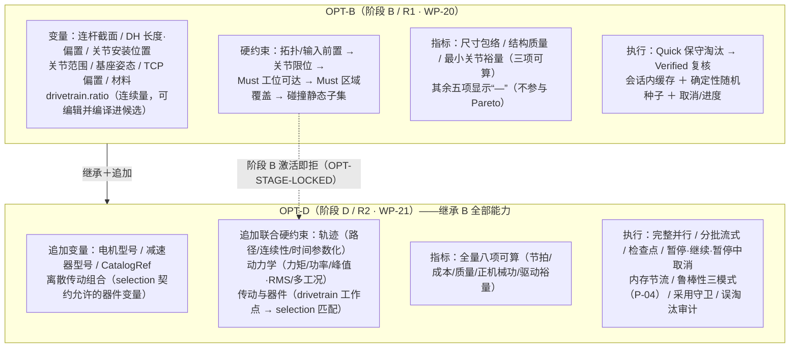

**边界红线（逐条可判）**：

1. 阶段 B **不得**以 PTP/笛卡尔轨迹成功、避障成功、时间参数化成功、节拍、动力学力矩/功率/能量、电机/减速器/负载能力、驱动器工作点、复杂器件联合约束、R2 鲁棒性/灵敏度结论中的任何一项作为优化退出条件（REQUIREMENTS §15.0/OPT-03；trajectory.md §2.2、dynamics.md §13.3 同口径）。
2. 阶段 B **不得静默忽略**用户配置的未支持变量——未列入 OPT-B 的变量在研究定义校验时拒绝或标记不可用，并给出阶段锁定诊断（`OPT-STAGE-LOCKED`），不降级、不丢弃。
3. `drivetrain.ratio` 在 R1 **不得被阶段锁错误拒绝**（AT-09 回归反例，V12-02）：传动比是 StageB 连续变量，可编辑并编译进候选；但"完整驱动性能评估（电机/减速器能力匹配）"归 OPT-D——"参数可编辑"与"性能可评估"为两个阶段口径。
4. 阶段 B 后五项指标显示"—"：不显示为零、不用估算值冒充正式指标、不参与 Pareto、不因这些指标为空而判候选动力学或器件不可行（NFR-COR-03：不得静默转 0）。
5. 阶段 B 激活 R2 约束、R2 目标、暂停/继续或检查点 → 拒绝＋阶段锁定诊断；阶段锁定**不静默降级为 R1**、不被 UI 呈现为普通候选淘汰（§6.5）。
6. 阶段 D 在 P-04 未冻结时拒绝启动正式联合优化（Preflight 阻塞项）；阶段 D 使用未注册的轨迹/动力学/drivetrain/selection 评估器时拒绝正式运行（§6.4）。
7. R1 首版不启用：直线传动目录（SEL-09-S1 前未启用）、含 `prismatic` 的正式产品链（MDL-12-S1 前未启用）、`mimic`/闭环/`planar`/`floating` 链（维持阻断，M-6）、含移动关节的旋转传动静默等效（SEL-09：范围外诊断 DataInsufficient，不得静默套用）。R2 放开前置＝`SEL-09-S1`（选型层先行）→`MDL-12-S1`（产品链正式计算，仅六/七轴）＋`MDL-21`（耦合矩阵统一消费）；**4/5 轴不因任何子项自动放开**（§2.1 支持矩阵，AT-36 反例仍被阻止）。

### 2.3 阶段 B 与阶段 D 功能矩阵

| 能力 | OPT-B（阶段 B/R1） | OPT-D（阶段 D/R2） | 需求锚 |
| --- | --- | --- | --- |
| 新机型初始化 | ✅ | ✅（继承） | OPT-01 |
| 改型初始化＋未授权参数默认锁定 | ✅ | ✅（继承） | OPT-01/02 |
| 连续/量化/枚举变量（结构＋传动比） | ✅ | ✅（继承） | OPT-02 |
| 离散器件变量（电机/减速器/组合） | ❌（研究定义引用即拒） | ✅ | OPT-02/§15.0 |
| `drivetrain.ratio` 可编辑并编译进候选 | ✅ | ✅（继承） | OPT-02（V12-02） |
| 静态硬约束（拓扑/前置/限位/可达/覆盖/碰撞子集） | ✅ | ✅（继承，先行执行） | OPT-03 |
| 轨迹/动力学/传动/器件联合硬约束 | ❌（激活即拒） | ✅ | OPT-03/05 |
| 三项静态指标 | ✅（可算） | ✅（继承） | OPT-07 |
| 节拍/器件成本/器件质量/正机械功/最小驱动裕量 | ❌（显示"—"） | ✅ | OPT-07 |
| 默认 Pareto 目标 | 尺寸包络/结构质量/最小关节裕量 | 节拍/结构质量/器件成本 | OPT-07/§15.0 |
| 用户显式激活其他目标 | 仅三项静态内激活 | 其余五项按条件激活（§7.3） | OPT-07 |
| Pareto 非支配（含容差支配） | ✅ | ✅（继承） | OPT-04 |
| Quick 筛选→Verified 复核 | ✅ | ✅（继承） | OPT-06 |
| 会话内缓存 | ✅ | ✅（规模化） | OPT-06/CON-04 |
| 确定性随机种子 | ✅ | ✅（继承） | OPT-06/NFR-COR-02 |
| 取消与进度 | ✅（平台既有能力） | ✅（继承） | OPT-06/AT-34 |
| 并行评估 | ❌（不作 B 期验收承诺） | ✅（8 线程 ≥4×，NFR-PERF-05） | OPT-06/§15.0 |
| 检查点/恢复 | ❌ | ✅（NFR-PERF-06） | OPT-06/AT-35 |
| 用户暂停/继续/暂停中取消 | ❌ | ✅（V12-06 四条边界） | OPT-06/AT-35 |
| 内存节流与资源不足诊断 | ❌（平台机制存在但非 B 期验收项） | ✅（NFR-PERF-04） | §15.0 |
| 灵敏度/鲁棒性三模式 | ❌ | ✅（P-04 冻结后） | OPT-09 |
| 采用守卫（设为当前方案） | ✅ | ✅（继承） | OPT-08/AT-12 |
| 误淘汰审计 | ❌ | ✅（5%/≥200/≤1%/95%≤3%） | §15.0/AT-35 |
| Preflight | ✅ | ✅（追加联合项） | OPT-11 |
| 基线评估 | ✅ | ✅（继承） | OPT-11 |
| 一站式导出 | ✅ | ✅（审计列扩充） | OPT-12/AT-34 |

### 2.4 职责边界：拥有／消费／不拥有

**optimization 拥有**：

| # | 所有权 | 说明 |
| --- | --- | --- |
| O1 | 优化变量定义（变量词表、类型、边界、编码、锁定规则） | OPT-02；变量绑定到 modeling/runtime 权威字段，但变量词表与锁定语义归本单元 |
| O2 | `CandidatePatch`（候选补丁）与候选身份/候选差异 | ARCH §7.10"基线 RobotDesign ＋ 变量补丁"；patch 是候选描述，不是项目修订 |
| O3 | 输入前置检查（Preflight）与优化运行身份 | OPT-11 |
| O4 | 约束组合与阶段锁（优化退出条件的编排权） | OPT-03；约束的**计算**消费各域评估器，编排与淘汰归本单元 |
| O5 | 目标指标配置（激活/方向/分层） | OPT-07 |
| O6 | 候选生成（搜索策略接口与首版策略） | OPT-10 |
| O7 | 评估器能力编排（优化域评估器＋跨域评估组合顺序） | ③端口组合（ARCH §7.10） |
| O8 | Quick/Verified 层级控制（筛选/复核编排） | OPT-06 |
| O9 | Pareto 非支配筛选、稳定排序、重复候选去重 | OPT-04；testkit `SetMatchTraits` 域侧特化（testkit.md §5.4） |
| O10 | 候选淘汰原因（逐候选/逐约束/逐评估器记录） | EVI-01/§8.1；SEL-06 同型先例 |
| O11 | 基线评估流程与运行级统计（审计计数） | OPT-11/OPT-12 |
| O12 | 优化结果导出契约（字段与清单定义） | OPT-12；文件写出经 io/reporting 共用规则 |
| O13 | 候选应用请求的命令组装（不执行修订） | OPT-08；提交经①端口（§10） |
| O14 | 优化域稳定诊断码（`OPT-` 前缀登记义务） | diagnostics §4.5/§12.1（§6.6） |
| O15 | 优化域 RequiredEvidenceProfile（"opt"）实例化与 OPT 评估器 | evidence §13 交接行："须自行提供：OPT 评估器；候选补丁与编译身份（表 4 优化行）" |
| O16 | 优化指标 ID 注册表（八项指标的域内唯一定义点） | core.md §2.4 对照行："指标 ID 注册表｜各业务域单元" |

**optimization 消费**（全部经公共端口或运行时注入，R-1/R-2 红线内）：

| 来源单元 | 消费内容 | 端口/形态 |
| --- | --- | --- |
| core | 身份五元组、SourcedValue/ValueProvenance、单位换算唯一实现、EvaluationMode/TaskOutcome/EngineeringStatus 词表、closeWithin 比较公式、ContentIdentity/ContentDigester、DiagCode 句法 | 接口依赖（L4→L2 公共头） |
| project | 只读修订/分支/对象查询（②）；命令提交（①）；`results/<run-id>/`、`checkpoints/` 归档端口；StaleRevisionRejected 语义 | ①②端口接口依赖 |
| modeling | RobotDesign 参数化字段语义（变量绑定的权威落点）、候选编译命令面、Model Diff 数据实体 | ①端口命令组合＋公共数据契约；不直链 modeling 计算库 |
| requirements | 任务/区域/工况/必验范围（RequiredCaseSet 冻结解析） | 经 AnalysisSnapshot 冻结消费（requirements.md §8.2）；不直链 |
| kinematics | Must 工位可达/Must 区域覆盖/关节限位裕量/碰撞静态子集评估器 | ③端口（`kin.task-points-batch`/`kin.region-coverage`） |
| trajectory | 路径/连续性/时间参数化/节拍评估器 | ③端口（`trj-sequence-plan`）——OPT-D |
| dynamics | 力矩/功率/能量/峰值/RMS 评估器 | ③端口（`dyn-rnea-analysis`）——OPT-D |
| drivetrain | 电机侧工作点映射结果 | ③端口（`dt.mapping`）——OPT-D |
| selection | 器件目录匹配与组合可行性、成本/质量/裕量事实 | ③端口（`sel.combination-check`）——OPT-D |
| policy | EngineeringPolicySet（经快照 policyRef 只读消费）、共享碰撞评估（SampleSet 形态）、关节限位校验 | ④端口 |
| evidence | AnalysisSnapshot/InputSlice/RequiredEvidenceProfile/ResultEnvelope/当前性/评估器注册表/缓存与检查点兼容判定 | ③端口＋公共契约 |
| execution | 任务提交/取消/暂停/检查点/缓存治理/worker/资源节流 | 接口依赖（L4→L3 公共头） |
| runtime | RuntimeSnapshot（候选编译产物）、IRobotDesignReader、RuntimeNameMap | 接口依赖（L4→L2 公共头） |
| diagnostics | 稳定码注册表、诊断目录、ConfirmableFinding（仅命令边界） | 接口依赖 |
| ui | 优化控制面板/候选表/比较视图的挂位与命令入口；只读结果投影 | 插件界面目标（Qt Widgets）；真值不在 ui |
| io/reporting | CSV/JSON 安全写出、原子写出、模型包导出、报告章节注册与共用导出规则 | 接口依赖（L4→L3） |

**optimization 不拥有**（越权即 review 打回）：

| # | 非所有权 | 真值所有者 |
| --- | --- | --- |
| N1 | RobotDesign 与 CanonicalModel 真值 | modeling（权威参数化）/ runtime（规范模型） |
| N2 | 项目修订、分支、锁、事务与磁盘写入 | project（PA-1、SA-03/09/17） |
| N3 | 任务需求真值（任务点/区域/工况/必验范围） | requirements（冻结进快照后只读消费） |
| N4 | FK/IK、轨迹规划、碰撞算法、动力学算法 | kinematics/trajectory/policy/dynamics |
| N5 | drivetrain 映射公式、目录导入底层解析、器件能力与组合判定 | drivetrain/io/selection |
| N6 | EngineeringPolicySet、判定阈值（含惯量比阈值——P-POL-3 待裁决） | policy |
| N7 | RequiredEvidenceProfile 权威定义（内容归需求表 4）、ResultEnvelope 最终接纳、ResultCurrentness | 需求/evidence |
| N8 | 任务状态机、进程管理、worker 生命周期、检查点写入、缓存淘汰 | execution |
| N9 | 正式工程判定（aggregateVerdict 汇总）与单一加权总分 | evidence /（总分＝不存在，裁决排除） |
| N10 | 报告渲染、CSV/JSON 底层安全解析、文件写入 | reporting/io |
| N11 | Qt UI 真值；撤销/重做实现 | ui（投影）/ project（逆命令） |
| N12 | 未经批准的新状态、阈值、证据等级和工程规则 | 一律不发明——发现缺口登记 §16.3 |
| N13 | worker 进程目标与调度器 | execution（`sdurws_ird_execution_worker` 是产品唯一 worker 目标，DTB §5.1） |

---

## 3. 单元组成、依赖、构建目标与实际代码状态

### 3.1 目标形态（WP-20-T02 落位后的建议布局；当前磁盘仅占位 README——§1.3，不得把本节写成已有实现）

```text
optimization/
├── CMakeLists.txt                     ← WP-20-T02：INTERFACE 占位升级为真实库
├── include/sdurws/ird/optimization/   ← 公共头（R-2：跨单元只允许消费这些头）
│   ├── Types.hpp                      ← OptimizationStage/CandidateStatus/MetricId/淘汰原因词表
│   ├── Variable.hpp                   ← 变量定义/绑定/边界/锁定（O1）
│   ├── CandidatePatch.hpp             ← CandidatePatch/候选身份/稳定序列化（O2）
│   ├── Constraint.hpp                 ← 约束描述与执行记录（O4）
│   ├── Objective.hpp                  ← 目标指标配置与八项指标词表（O5）
│   ├── Run.hpp                        ← OptimizationRunResult/运行身份/审计计数
│   ├── EvaluatorPorts.hpp             ← 优化域评估器 descriptor/依赖声明（O7/O15）
│   ├── Preflight.hpp                  ← PreflightReport 与 allowances（O3）
│   ├── Pareto.hpp                     ← 非支配集/稳定排序/支配比较（O9）
│   ├── Export.hpp                     ← 导出清单与字段契约（O12）
│   └── Applier.hpp                    ← 候选应用命令组装（O13）
├── src/                               ← 计算库实现（零 Qt）
├── plugin/                            ← sdurws_ird_optimization_plugin（Qt Widgets 界面）
├── test/                              ← sdurws_ird_optimization_test
├── contract_test/                     ← sdurws_ird_optimization_contract_test
└── （不建 worker/ 子目录——见 §3.3 第 4 条）
```

### 3.2 构建目标与依赖红线

| 目标 | 层/形态 | Qt | 说明 |
| --- | --- | --- | --- |
| `sdurws_ird_optimization` | L2 计算库（STATIC） | **零 Qt**（R-3） | WP-20-T02 升级落位；别名 `RWS::ird::optimization`；C++17 显式 `CXX_STANDARD 17` |
| `sdurws_ird_optimization_plugin` | L4 插件界面 | Qt Widgets（唯一允许面） | WP-20-T10；只消费端口与只读投影，不持算法/判定真值 |
| `sdurws_ird_optimization_test` | 模型测试 | 无 | 可直调计算库（NFR-MNT-01）；gtest 经 vcpkg `find_package(GTest CONFIG REQUIRED)` |
| `sdurws_ird_optimization_contract_test` | 契约测试 | 无 | 跨单元契约（与 evidence/execution/project/kinematics/testkit 联合） |
| worker 目标 | **不建** | — | 本单元不拥有 worker 调度与进程生命周期；若未来需要 `optimization_worker`，只能作为 execution 装配的薄进程适配器（不复制调度器/缓存治理/业务判定）——当前无此需求，不预建 |

**依赖白名单（§3.5 ARCH 依赖表 + §7.2 端口的落地面）**：`sdurws_ird_optimization` 允许链接 core/evidence/runtime/policy/execution/project/io/reporting/diagnostics 的公共接口（L4→L2/L3）；**禁止**链接 modeling/requirements/kinematics/trajectory/dynamics/selection/optimization 之外任何业务域计算库，也禁止上述业务域之间经本单元形成互链——跨业务能力只经③评估器端口与 evidence 公共头（R-1/R-2）。构建门禁（ird_gates）对表外同层边/业务互链零容忍。

### 3.3 与磁盘实况的差异清单（本卡产出时点）

1. 已实现文件：**无**（目录树仅 README 占位）。
2. 代码占位：`industrialrobot/CMakeLists.txt` 的 INTERFACE 目标 `sdurws_ird_optimization`（§1.3）。
3. 公共头保留位：`include/sdurws/ird/optimization/README.md`。
4. CMake 目标：仅 INTERFACE 占位；`_plugin/_test/_contract_test` 未登记。
5. 测试目标：无；contract test：无；plugin：无；worker：无（且按 §3.2 不预建）。
6. 缺失目录：`src/`、`plugin/`、`test/`、`contract_test/` 均不存在。
7. 与 unit-status.json 差异：**无差异**——`planned/not-written/not-verified` 与磁盘一致；本卡产出后 `designCompletion` 的刷新（`not-written→written`）与 `status`（`planned→draft`）由治理任务执行，本卡不代改（DETAILED-DESIGN.md 状态表同理）。

### 3.4 单元详设最低结构对照（DETAILED-DESIGN.md 要求）

职责与非职责（§2.4）✅；输入输出契约（§4/§11/§12）✅；公共接口（§12）✅；数据模型（§4/§5/§7）✅；状态机（§4.5/§9.2）✅；错误与诊断（§6.6）✅；依赖（§3.2）✅；单元测试（§13）✅；与主 WP 的任务映射（§14）✅；开放问题（§16）✅。

---

## 4. 优化输入快照、身份与运行生命周期

### 4.1 优化输入快照（复用 evidence 既有契约，不新造第二套）

优化运行**不自有快照类型**：一切输入经 evidence `AnalysisSnapshot`（CON-01/PA-3）。优化域组装快照时锚定：

| 快照要素 | 优化域消费口径 |
| --- | --- |
| `project/branch/revision`（core::ProjectId/BranchId/RevisionId） | 运行开始前锚定当前修订；**运行开始后输入冻结**（§4.4） |
| `caseSet`（RequiredCaseSet） | 必验工况集合＝需求侧冻结解析（requirements.md §6.2，`mandatory≡(level==Must)`，I-REQ-9）；硬约束"必验工况覆盖"与 EVI-02 全覆盖检查的分母 |
| `objectClosure` | 基线 RobotDesign/`robot-drivetrain`/TCP/场景几何等对象的 (oid, cv) 闭包——候选编译与基线身份的来源 |
| `configurationRefs` | `config.opt`（本卡新增 Configuration 条目，§4.3）＋`config.ik` 等其他域配置 |
| `policyRef` | 已解析 EngineeringPolicySet 内容身份（CON-06）——策略进切片与缓存键 |
| `nameMapRef` | RuntimeNameMap 内容身份（CON-06）——结果接纳前名称反解 |
| `samplingPlans` | 区域覆盖评估的采样计划（KIN-04 冻结样本集；优化复评不得增删更换样本） |
| `snapshotId` | 快照内容身份（SHA-256，builder 计算非申报） |

**不混用规则**：一次优化运行绑定唯一修订、唯一需求/工况基准、唯一策略与评估器版本集合；方案比较（含基线 vs 候选、候选 vs 候选）必须使用同一需求与工况基准——Pareto 比较前经 evidence `checkComparisonBaselinesConsistent`（inputBaselineId/requiredCaseSetId/样本集身份全等，evidence §6.5；EV-COV-4：采样预算改变→样本基准改变→不可直接比较）。

### 4.2 身份体系（六层身份与承载类型）

| 身份 | 含义 | 承载类型 | 生成者 | 说明 |
| --- | --- | --- | --- | --- |
| **输入身份** | 项目、分支、修订与输入切片的内容身份 | `core::ProjectId/BranchId/RevisionId`＋`snapshotId`＋`sliceId`＋`inputBaselineId` | evidence（builder/切片） | sliceId＝缓存键与失效判据（CON-05）；inputBaselineId＝输入基准身份（仅模型/需求/工况集/冻结样本集条目参与，排除求解类 Configuration——D-04 双层） |
| **运行身份** | 一次优化运行的身份 | `OptimizationRunId`（本卡，规范文本 `opt-run-<32hex>`，Id128 语义） | optimization（运行启动时） | **不进入** core TaskIdentity 五元组；运行下挂 1..N 个 execution 任务（§9.1），每个任务各自持有 execution 生成的 `TaskId`/`core::RunId`；OptimizationRunResult.tasks[] 登记映射。不新造 core Id128 tag（core 冻结 tag 集不动），文本前缀 `opt-run-` 仅为本域日志/导出可读性 |
| **尝试身份** | 初次运行、恢复运行或重试运行的身份 | `core::AttemptId`（`att-<十进制>`，≥1） | execution | 检查点恢复/暂停继续→同任务 RunId 新 AttemptId（旧 attempt 移入 supersededAttempts）；**恢复运行不得改变原始输入快照** |
| **候选身份** | 基线＋CandidatePatch 的唯一身份 | `CandidateId`（`cnd-<64hex>`，内容寻址） | optimization（确定性计算） | `CandidateId ＝ SHA-256( baselineRootOid ‖ baselineRootCv ‖ CandidatePatchId )`——同一补丁作用于同一基线必得同 CandidateId（跨运行稳定），天然去重；**不含**显示单位、UI 排序状态、运行配置 |
| **补丁身份** | CandidatePatch 的内容身份 | `CandidatePatchId`（core::ContentIdentity，SHA-256） | optimization（ContentDigester） | 对 patch canonical 字节计算（§5.3）；空补丁有确定身份（基线候选） |
| **结果身份** | 候选评估输出与证据事实的身份 | evidence `ResultEnvelope` 绑定的 `TaskIdentity` 五元组＋`payload` digest | execution/评估器 | 优化域评估器（`opt-static-screen`）的评估结果同样经 envelope 冻结；结果身份≠候选身份（一次候选可在多次运行中被评估，各自有结果身份） |
| **当前性** | 结果是否仍适合当前输入，不改变历史结果 | evidence `ResultCurrentness`（Current/Superseded/NotEvaluable） | evidence（computeCurrentness） | **缓存命中≠当前**（evidence §8.2；EX-T08 落位登记）；Superseded 保留为原快照历史证据（CON-02） |

辅助身份：`EvaluatorSetId`＝evidence `EvaluatorRegistry::manifest()` 摘要（`IRDRGM1` 编码，按 key 字典序 {key, contractVersion, profileIdentity}）——优化运行记录其评估器集合摘要，用于复现与兼容核对；`PolicyIdentity`＝快照 `policyRef.policyContentIdentity`（policy.md 冻结口径——不存在名为 PolicyIdentity 的独立类型，本文引用其内容身份字段）。

### 4.3 优化运行描述类型（公共数据模型）

```cpp
// optimization/include/sdurws/ird/optimization/Types.hpp（设计基线，Draft）
namespace sdurws::ird::optimization {

/// 优化阶段词表（本域自有——core 无 EvaluationStage 枚举，不与之混用）。
/// stage-b＝OPT-B 静态子集（R1）；stage-d＝OPT-D 联合优化（R2，P-04 冻结后启用）。
enum class OptimizationStage { StageB, StageD };
inline std::string_view toToken(OptimizationStage s) noexcept;   // "stage-b" / "stage-d"

/// 优化运行目标状态（§9.2 状态机；区别于 execution 九态任务状态机与 core::TaskOutcome）。
enum class RunPhase { Draft, Preflight, QuickScreening, VerifiedReview,
                      RobustnessReview, Completed, Canceled, Failed, Interrupted };

/// 候选在运行结果中的状态（候选状态 ≠ 任务状态 ≠ 工程判定——§7.5 正交表）。
enum class CandidateStatus { Pending, ScreenedOut, Infeasible, DataInsufficient,
                             EvaluationFailed, Feasible, ParetoNondominated };

/// 八项比较指标词表（OPT-07；域内唯一指标 ID 定义点——core.md §2.4 对照行）。
enum class MetricId { Envelope, StructuralMass, MinJointMargin,
                      CycleTime, DeviceCost, DeviceMass,
                      JointPositiveWork, MinDriveMargin };
std::string_view toToken(MetricId m) noexcept;   // "opt.metric.envelope" 等 8 个稳定 token

/// 随机种子（确定性来源之一；语义与 KIN-13 一致：0 非法，不做静默替换——NFR-COR-03）。
using RandomSeed = std::uint64_t;                // ≥1

/// 优化域预算（候选数/复核数/墙钟；内存与 worker 资源预算归 execution ResourceBudget，
/// 本类型不复制资源治理字段——N8 非所有权）。
struct OptimizationBudget {
    std::uint32_t maxCandidates = 256;        // 候选总数上限（含基线）
    std::uint32_t maxVerifiedCandidates = 64; // Verified 复核上限
    std::uint32_t maxGenerations  = 1;        // 生成代数上限（R1 固定 1；R2 搜索策略可用）
    std::uint64_t maxWallClockS   = 8 * 3600; // 墙钟上限，s（NFR-PERF-06 基准口径）
};

/// 并行配置声明（R1：threadCount 固定 1，仅入身份不做并行承诺；R2 由 execution 编排）。
struct ParallelConfiguration {
    std::uint32_t threadCount = 1;            // ≥1；进入 config.opt canonical（KIN-13 同型）
    std::uint32_t maxInFlightBatches = 1;     // R1 恒 1；R2 由 execution 派发治理
};

/// 优化分析配置（config.opt；canonical 定序序列化后进入 configurationRefs→sliceId）。
/// schemaVersion 1；任何字段变化 ⇒ 新 sliceId ⇒ 缓存不命中 ⇒ 新运行（§4.6）。
struct OptimizationConfiguration {
    std::uint32_t   schemaVersion = 1;
    OptimizationStage stage        = OptimizationStage::StageB;
    RandomSeed      seed           = 1;       // ≥1（I-OPT-2）
    ParallelConfiguration parallel {};        // threadCount 入身份（NFR-COR-02）
    OptimizationBudget budget {};
    std::string     strategyId     = "opt.strategy.seeded-lhs";  // §8.2 首版策略
    ObjectiveSet    objectives {};            // 激活目标＋方向＋可选支配容差（§7）
    std::vector<VariableBinding> variables {};  // 变量绑定＋锁定/授权状态（§5.2）
    // 不含碰撞开关（V13-01：碰撞启用只读引用快照内已解析策略）；
    // 不含判定阈值（归 policy，NFR-MNT-07）。
};

/// 优化运行完整描述（冻结面）。
struct OptimizationRunSpec {
    core::ProjectId project;  core::BranchId branch;  core::RevisionId revision;
    core::ContentIdentity snapshotId;          // 组装完成的快照身份（§4.1）
    OptimizationConfiguration config;
    evidence::RequiredEvidenceProfileRef profile;   // "opt" 域 Profile 引用
    std::string     createdBy;                 // 创建者（会话/用户标识，审计用）
    std::chrono::system_clock::time_point createdAtUtc;
};

}  // namespace sdurws::ird::optimization
```

`config.opt` canonical 序列化（内容身份来源）：magic `"IRDOPTC1"` ＋ u32 schemaVersion ＋ 阶段/种子/线程/预算/策略 token 定序定宽编码 ＋ 目标集（按 MetricId 枚举序位图＋每目标容差三元组）＋ 变量绑定表（按 bindingToken 字典序）。计算归 core::ContentDigester（D-05）；**编码由 optimization 实现，身份由 evidence/快照体系承载**（序列化三层分工，core.md §6.3）。

### 4.4 运行生命周期（运行状态与冻结语义）

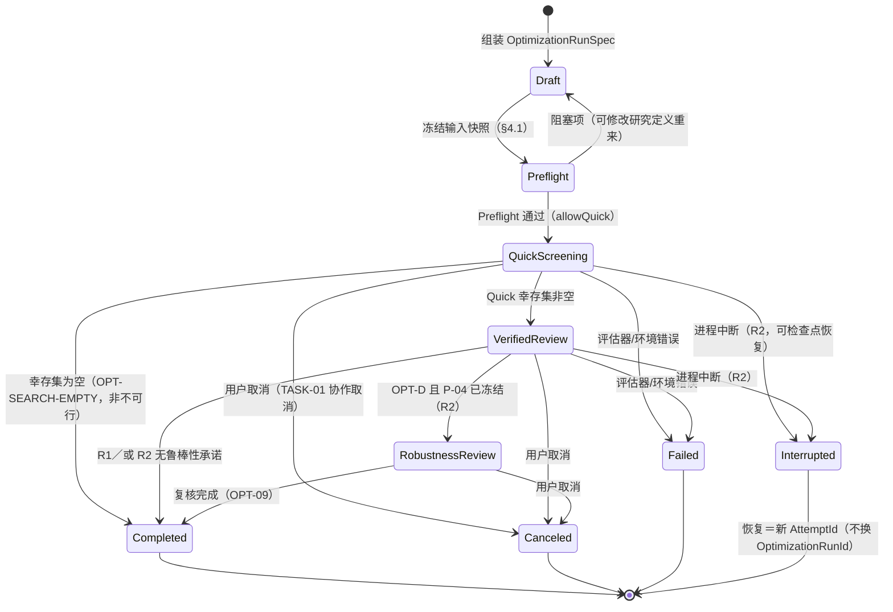

**冻结与身份不变式（I-OPT-1～6）**：

- **I-OPT-1 输入冻结**：运行进入 Preflight 前完成快照组装并冻结；运行期间不得混用多个修订，不得混用不同需求、工况、策略或评估器版本。修改研究定义＝新 OptimizationRunSpec（旧运行归档保留）。
- **I-OPT-2 种子合法**：`seed ≥ 1`；0 非法（I-KIN-4 同型拒绝，NFR-COR-03：不静默替换）。
- **I-OPT-3 相同输入→等价结果**：同输入快照＋同版本集合＋同 config.opt（含种子/线程/预算/策略/目标/变量）⇒ 等价候选集合与稳定排序（NFR-COR-02）；不要求浮点文件逐字节相同；并行归约满足附录 D 第 8 项容差（相对 1×10⁻¹²，逐元素）。
- **I-OPT-4 恢复不改输入**：检查点恢复/暂停继续产生新 AttemptId，原 snapshotId/sliceId/config.opt 不变（execution §7.3 同源）。
- **I-OPT-5 迟到拒绝**：按项目、分支、修订、运行和尝试身份核对（TASK-03/ARCH §4.5）——候选批结果经 execution RunRegistry 五元组接纳，失配即拒绝，绝不写入新项目/新修订。
- **I-OPT-6 历史归档**：运行完成（含取消/失败）后 OptimizationRunResult 与候选评估结果随任务归档至原修订 `results/<run-id>/`；归档后不可修改；新修订产生后旧结果由 evidence 判定 Current/Superseded（§11.2），**不删除、不改写**。

### 4.5 修改变更→缓存失效的映射（失效输入清单）

| 变更项 | 生效机制 | 结果 |
| --- | --- | --- |
| 变量配置（绑定/边界/锁定） | config.opt 变化 ⇒ 新 sliceId | 缓存不命中 ⇒ 重算 ⇒ **新运行** |
| 约束配置（激活集） | config.opt 变化 | 同上 |
| 目标配置（激活/方向/支配容差） | config.opt 变化 | 同上 |
| 随机种子 / 线程数 / 预算 / 策略 | config.opt 变化（threadCount 入 canonical——KIN-13 同型"改线程数＝新身份＝重算"） | 同上 |
| 基线模型 / 需求 / 工况集 / 冻结样本集 | inputBaselineId 变化（D-04 基准类条目） | 旧结果 Superseded（SampleBaselineChanged/ObjectContentChanged）＋新运行 |
| EngineeringPolicySet 内容身份 | policyRef 变化 ⇒ sliceId 变化 | 同上（PolicyChanged） |
| 评估器契约版本 / 算法版本 / 契约版本 | sliceId（contractVersion）与 EvaluatorSetId 变化 | 缓存 Incompatible（contract-mismatch）；旧结果 Superseded（EvaluatorContractChanged） |
| 电机成本 / 目录成本数据 | 成本对象不在 OPT-B 切片 | OPT-B 不失效（AT-05 正例）；器件成本指标激活时（OPT-D）成本条目在切片 ⇒ 失效（◐，evidence §5.3） |
| 求解配置（config.ik 等） | 其域切片条目变化 | 消费该配置的候选评估缓存不命中 |

**缓存命中不代表结果 Current**（两回事）：命中只声明"对该键可复用"；当前性由 evidence `computeCurrentness` 另行计算——Superseded 的历史缓存照样可命中同键请求（evidence §8.2/execution §8.2 逐字口径）。optimization 不复制第二套兼容逻辑（N8）。

### 4.6 与任务身份的关系（TASK-01～03 承接）

- 优化运行下每次 execution 任务提交时由 execution 生成 `TaskId`（`tsk-<32hex>`）与派发登记 `core::RunId`；**同 TaskId 内崩溃恢复/暂停继续不换 TaskId，仅新 AttemptId**；重跑＝新 TaskId/新 RunId（可 resumeFrom 检查点）。
- 请求与完成事件携带五元组（TASK-03）；优化编排器聚合候选批结果时同样执行五元组核对（I-OPT-5），核对逻辑复用 execution RunRegistry 语义，不自建第二套接纳（§9.3）。

---

## 5. 设计变量、CandidatePatch 与阶段锁

### 5.1 变量模型总览

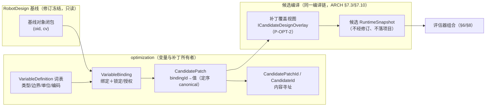

- optimization 不直接修改 RobotDesign（N1）：候选＝基线闭包＋补丁覆盖的**临时编译产物**，不经修订、不落项目对象库（modeling.md §12.1："候选不经修订，采用守卫归 OPT-08"）。
- CandidatePatch 是候选描述，不是项目修订（O2）；"设为当前方案"走 §10 命令组合。
- 改型项目未授权参数默认锁定；修改锁定参数在**生成阶段**拒绝（§5.4），不进入评估。

### 5.2 变量定义与绑定

```cpp
// Variable.hpp（设计基线，Draft）
namespace sdurws::ird::optimization {

/// 变量值类别（OPT-02：连续/量化/枚举/离散器件）。
enum class VariableKind { Continuous, Quantized, Enumeration, DiscreteDevice };

/// 变量绑定的权威字段定位 token（绑定词表归本域；值语义以 modeling/runtime 冻结字段为准）。
/// 变量绑定 token 全表（"变量 ID"列见 §5.3 表）：如 "mdl.joint[3].dh.a"、"mdl.link[2].section.size"。
using BindingToken = std::string;

/// 单个变量绑定：声明哪个权威字段可被补丁修改、值域与锁定状态。
struct VariableBinding {
    BindingToken    bindingId;        // 稳定 token，如 "dh-a-3"（研究内唯一，字典序进 canonical）
    VariableKind    kind;
    core::UnitToken unit;             // 单位（SI 因子换算唯一实现 core::convert——NFR-MNT-03）
    double          lowerBound;       // 连续/量化：下界（含），SI 单位
    double          upperBound;       // 连续/量化：上界（含），SI 单位；必须 lower<upper
    double          step;             // 量化：步长 >0（Continuous 恒 0）；枚举/离散无意义置 0
    std::vector<std::string> enumValues;   // 枚举/离散：封闭值域（如材料键、目录 modelId）
    double          defaultValue;     // 连续/量化默认（基线值）；枚举用 defaultValueIndex
    std::uint32_t   defaultValueIndex = 0;
    bool            locked = false;   // 锁定：生成阶段拒绝出现在补丁中（§5.4）
    bool            authorized = true;// 改型授权（§5.4：未授权默认 locked）
    std::string     authorityFieldPath;  // 权威字段定位（如 "robot-design/joints[3]/dh/a"）
    std::string     diagSubject;      // 关联对象 ObjectId 文本（诊断定位）
};

/// 变量定义词表（域内唯一定义点；R1 固定 9 类，R2 追加离散器件类）。
const std::vector<VariableDefinition>& builtinVariableDefinitions(OptimizationStage stage);

}  // namespace sdurws::ird::optimization
```

### 5.3 R1 变量表（OPT-B；REQUIREMENTS §15.0 权威清单）

| # | 变量 | 绑定 token 形态 | 类型 | 单位 | 边界与约束 | 权威来源（冻结字段） |
| --- | --- | --- | --- | --- | --- | --- |
| 1 | 连杆截面尺寸 | `mdl.link[i].section.*` | 连续（尺寸参数） | m | >0；仅当该连杆 `shape` 为 Primitive 时可绑定（Mesh 基线→锁定＋警告 `OPT-VAR-UNBINDABLE`） | modeling LinkEntry `shape.collision`（GeometryRef Primitive）＋物性重估算经 `mdl-property-formula/1`（P-OPT-2） |
| 1b | 连杆截面类型 | 同上 | 枚举（SolidCylinder/HollowCylinder/Box） | — | R1 绑定基线已有类型**不启用**类型枚举切换（登记 §16.3 P-OPT-4） | modeling §5.3 SegmentSpec primitive 词表 |
| 2 | DH 长度 aᵢ | `mdl.joint[i].dh.a` | 连续 | m | 基线 `authority==StandardDH` 才可绑定；显式权威基线→不可绑定＋引导用 joint-placement 变量 | JointEntry `dhDerived.d`/`a`（StandardDH 权威；Explicit 态只读派生，I-MDL-8） |
| 3 | DH 偏置 dᵢ | `mdl.joint[i].dh.d` | 连续 | m | 同上 | 同上 |
| 4 | 关节安装位置 | `mdl.joint[i].origin.t` | 连续（3 分量） | m | 基线 `authority==Explicit` 才可绑定；与同关节 DH 变量互斥激活（权威互斥） | JointEntry `origin`（T_parent_joint 平移分量） |
| 5 | 关节范围 | `mdl.joint[i].bounds` | 连续对（qmin,qmax） | rad（转动）/m（移动） | qmin<qmax（MDL-06④ 硬断言同式）；仅有限限位关节；continuous 关节→变量 5b | JointEntry `bounds` |
| 5b | 工程工作范围 | `mdl.joint[i].working-range` | 连续对 | rad | 仅 continuous 关节；有限区间（MDL-12）；分析消费属性**不回写 bounds**（V12-01） | JointEntry `workingRange` |
| 6 | 基座姿态 | `mdl.base.orientation` | 连续（EAA 3 分量）或枚举（ground/inverted/wall） | rad | 预设与 custom 互斥；custom 必填 3 分量（MDL-22）；位置（basePosition）R1 不作变量（需求未列入） | 根对象 `basePlacement`（预设轴向唯一产出点＝runtime `installationPresetRotation()`，P-RT-4） |
| 7 | TCP 偏置 | `mdl.tcp[key].offset` | 连续（平移 m＋旋转 rad，可子集声明） | m / rad | 键必须已存在（不新增 TCP 键）；默认 TCP 引用不破坏 | ToolDefinition `tcpList[].offset`（T_tool_tcp） |
| 8 | 材料 | `mdl.link[i].material` | 枚举 | — | 值域＝modeling 默认材料键集（steel/aluminum/cast-iron/titanium-alloy/engineering-plastic，密度 kg/m³ 随键）；覆盖用户已提供物性时须显式授权（改写 Provided 值） | LinkEntry `body.material`（MaterialRef）＋估算链 |
| 9 | 传动比 | `mdl.drivetrain.ratio[j]` | 连续 | 无量纲 | >0 且有限（I-MDL-11）；**c 口径：c＝Δq_joint/Δθ_motor**（drivetrain.md §5.3，P-DT-10 本卡采用 c 口径并与 drivetrain/runtime 一致） | DrivetrainDesign `ratioPerJoint[]`（SourcedValue） |

R2 追加（OPT-D，§5.6）：电机型号/减速器型号（离散，目录 `modelId`）、`CatalogRef`（REQUIREMENTS §15.0 用词——落位为 selection `CatalogIdentity{catalogId, version, contentIdentity}`，selection 卡未定义名为 CatalogRef 的类型，本文引用时注明出处）、离散传动组合（`DeviceCombinationId` 规范序列）、其他由最新 `selection.md` 明确支持的离散器件变量（随 SEL-09-S1 扩展）。

**量化变量说明**：`VariableKind::Quantized`（`step`>0，值按步长网格确定性对齐后进补丁 canonical）由变量类型系统全阶段支持——OPT-02 要求的是类型能力；R1 内置变量词表暂无强制量化变量（传动比按 §15.0 为连续量），其边界与对齐语义由用例 OPT-VER-105 覆盖。

**变量一般约束（I-OPT-7～10）**：

- **I-OPT-7 权威互斥**：同一权威字段不得被两个绑定同时激活（如 DH 长度与关节安装位置同关节互斥）——研究定义校验拒绝并定位（`OPT-INPUT-INVALID`）。
- **I-OPT-8 显示单位不入身份**：变量值一律 SI 真值进补丁；显示换算由 ui 消费 `core::convert`（KIN-12 同型）。CandidateId 不含显示单位与 UI 排序状态（§4.2）。
- **I-OPT-9 值合法性前置**：越界/非有限/枚举外值在补丁构造时拒绝（`OPT-PATCH-ILLEGAL`），不静默截断（NFR-COR-03）。
- **I-OPT-10 变量差异**：`diffCandidatePatch(a, b)` 输出逐绑定差异（变更对象定位经 `authorityFieldPath`＋`diagSubject`）；供 §10.4 候选差异预览与导出复用。

### 5.4 改型授权与锁定（OPT-01/02）

- 改型初始化（§8.2）：以当前修订为基线；`VariableBinding.authorized` 默认 false→`locked=true`——**未授权参数默认锁定**（OPT-02）。
- 授权动作由用户在研究定义中显式开启（逐变量），授权状态进 config.opt canonical（进 sliceId——授权集合变化＝新输入）。
- 生成阶段对补丁逐项检查：`binding.locked==true 且出现在 patch` → 拒绝该候选＋诊断 `OPT-VAR-LOCKED`（比较型：绑定 token＋对象定位）；**不静默忽略**（OPT-02/§2.2 红线 2）。
- 阶段不支持变量（如 StageB 激活电机型号绑定）：研究定义校验拒绝＋`OPT-STAGE-LOCKED`；不降级、不丢弃。
- 新机型初始化：全部 R1 变量默认可绑定（授权默认 true），边界由用户按机型工程范围填写；无需求侧默认边界值——**不发明默认工程数值**（P-03 七轴模板数值未冻结，附录 C）。

### 5.5 CandidatePatch 数据模型与确定性序列化

```cpp
// CandidatePatch.hpp（设计基线，Draft）
namespace sdurws::ird::optimization {

/// 单条补丁项：一个绑定的新值（SI 真值或枚举下标）。
struct PatchItem {
    BindingToken  bindingId;      // 与 VariableBinding.bindingId 对应
    double        scalarValue = 0;         // 连续/量化（SI 单位）
    std::uint32_t enumIndex    = 0;        // 枚举/离散（enumValues 下标）
    std::string   discreteRef;           // 离散器件（R2：modelId/DeviceCombinationId＋目录身份）
};

/// 候选补丁：基线之上的变量覆盖集（候选描述，非项目修订）。
struct CandidatePatch {
    std::vector<PatchItem> items;   // 按 bindingId 字典序存储（构造时排序——稳定序列化前提）
    std::string label;              // 人类可读标签（不参与身份）
};

/// 稳定序列化：magic "IRDOPTP1" + u32 codecVersion + u32 itemCount
///   + 每项（bindingId 定长字段＋值定宽编码＋离散引用定界编码）。
/// 相同语义补丁 ⇒ 相同字节 ⇒ 相同 CandidatePatchId（确定性 NFR-COR-02）。
std::vector<std::uint8_t> canonicalize(const CandidatePatch&);
core::ContentIdentity patchIdentity(const CandidatePatch&);   // CandidatePatchId
CandidateId candidateIdOf(core::ObjectId baselineRoot, core::ContentVersion baselineCv,
                          const CandidatePatch&);             // §4.2 公式
/// 拒绝形态：空 bindingId / 未知绑定（对给定绑定集）/ 重复绑定 / 越界值 / 锁定绑定
/// → OptimizationError（fail-fast，调用方错误）或携带 OPT-PATCH-ILLEGAL 的诊断返回（编排面）。
}  // namespace sdurws::ird::optimization
```

**确定性要求（逐条）**：①补丁项排序＝bindingId 字典序（构造边界强制）；②值编码定宽小端、枚举存下标、离散器件存规范序列化摘要（同 selection `DeviceCombinationId` 口径）；③空补丁合法（基线候选）；④相同补丁不得生成多个不同候选身份（CandidateId 公式只含基线与补丁）；⑤候选身份不含显示单位/UI 状态（I-OPT-8）；⑥补丁 canonical 进入缓存键（经 config.opt/评估请求切片）与导出（§11.4）。

### 5.6 R2 离散器件变量（OPT-D 预留；本卡只定义边界，不实现）

- 离散器件变量值为 selection 组合空间中的合法成员：`（catalogId, version, contentIdentity）＋ modelId`（`CatalogRef` 语义，出处 REQUIREMENTS §15.0）；组合合法性由 `sel.combination-check` 内层判定（§8.5），optimization 不自判组合可行（N5）。
- 每个离散绑定携带目录版本与内容身份；目录更新不静默改变历史候选（SEL-08 同型）。
- 直线传动/含 prismatic 链/耦合链变量在 SEL-09-S1/MDL-12-S1/MDL-21 启用前不可绑定：绑定校验输出 `OPT-COMBO-OUT-OF-SCOPE`（范围外诊断，对应 SEL-09"范围外"DataInsufficient 口径与 §2.2 红线 7）。

### 5.7 阶段锁（变量面＋能力面统一规则）

| 触发 | 处置 | 诊断 |
| --- | --- | --- |
| StageB 研究定义引用 R2 变量（离散器件/电机/减速器） | 研究定义校验拒绝 | `OPT-STAGE-LOCKED` |
| StageB 激活 R2 约束/目标（联合约束、节拍、成本、质量、正机械功、驱动裕量） | 运行启动拒绝（Preflight 阻塞） | `OPT-STAGE-LOCKED` |
| StageB 请求暂停/继续或检查点 | 能力检查拒绝（§9.4） | `OPT-STAGE-LOCKED`（＋EX-CAPABILITY-UNSUPPORTED 语义对齐） |
| StageB 激活 `drivetrain.ratio` | **放行**（V12-02：编译进候选；不评估驱动性能） | — |
| StageD 启动正式联合优化且 P-04 未冻结 | Preflight 阻塞 | `OPT-ROBUSTNESS-PROTOCOL-MISSING` |
| StageD 使用未注册轨迹/动力学/drivetrain/selection 评估器 | Preflight 阻塞 | `OPT-EVALUATOR-MISSING` |
| 不支持移动关节/直线传动/耦合链而研究包含相关绑定 | 绑定校验拒绝 | `OPT-COMBO-OUT-OF-SCOPE` |

阶段锁**不静默降级**（§2.2 红线 5）：拒绝即终止该研究启动，UI 呈现为阻塞诊断（§6.5），不得呈现为候选淘汰或空结果。

---

## 6. 约束体系、Preflight 与评估器能力声明

### 6.1 约束分类（13 类词表与两阶段归属）

| # | 约束类 | 阶段 | 计算供给 | 编排所有者 |
| --- | --- | --- | --- | --- |
| 1 | 输入前置约束（快照/版本/身份一致） | B/D | optimization Preflight | optimization |
| 2 | 编译前置约束（补丁合法/边界/锁定/编译成功） | B/D | optimization ＋ runtime 编译链 | optimization |
| 3 | 拓扑约束（链型/结构合法） | B/D | 基线可计算性（阶段门控）＋补丁结构不变式（§6.2） | optimization |
| 4 | 关节限位 | B/D | policy `IJointLimitEvaluator`（值域/行程）＋ kinematics 评估器（解级限位） | optimization |
| 5 | Must 工位可达 | B/D | kinematics `kin.task-points-batch` | optimization |
| 6 | Must 区域覆盖 | B/D | kinematics `kin.region-coverage` | optimization |
| 7 | 静态碰撞（构型/采样子集） | B/D | policy 共享 CollisionEvaluator（SampleSet 形态，经 kin 评估器证据） | optimization（编排）——唯一实现归 policy（R-POL-2） |
| 8 | 轨迹约束（路径/连续性/时间参数化/速度加速度） | **D** | trajectory `trj-sequence-plan` | optimization |
| 9 | 动力学约束（力矩/速度/加速度/峰值·RMS/功率/工作制/多工况） | **D** | dynamics `dyn-rnea-analysis` | optimization |
| 10 | drivetrain 约束（工作点映射事实） | **D** | drivetrain `dt.mapping` | optimization（编排）——映射公式归 drivetrain |
| 11 | 器件能力约束（连续/峰值转矩、输入转速、过载持续时间、温度降额、惯量比、制动保持、安装方向、组合兼容） | **D** | selection `sel.combination-check`（硬筛选阈值消费 policy/selection 配置，P-POL-3 待裁决） | optimization（编排）——阈值判定归 selection |
| 12 | 用户硬约束 | —（无需求承载） | — | 当前需求（§15.0）无用户自定义硬约束条目；如需能力走需求变更立项（不预建开关） |
| 13 | 软目标 | —（同上） | — | 同上；"目标"仅以 Pareto 目标存在（OPT-04），无加权软目标 |

### 6.2 R1 约束执行顺序（OPT-B 管线）

```text
输入快照和版本检查（Preflight，§6.4）
 → 阶段能力检查（阶段锁，§5.7）
 → 变量边界和锁定检查（§5.4，生成阶段）
 → CandidatePatch 合法性检查（§5.5）
 → 候选编译（同一编译链；失败→候选淘汰＋OPT-CANDIDATE-COMPILE-FAILED 透传 RT- 码）
 → 拓扑和模型合法性（补丁结构不变式：patch 只覆盖已登记绑定——拓扑由基线保证；
    链型能力以快照事实为准：进入优化阶段即已通过建模链型门，补丁不改拓扑 ⇒ 候选拓扑＝基线拓扑）
 → 关节限位（policy IJointLimitEvaluator：候选 bounds 值域/区间有效；行程上限策略校验
    留在候选应用命令边界——worker 内不产生 ConfirmableFinding，SA-15）
 → Must 工位可达（kin.task-points-batch：Must 点三态分别报告，KIN-03）
 → Must 区域覆盖（kin.region-coverage：冻结样本集，分母＝计划样本总数，KIN-04）
 → 静态碰撞（策略启用时；构型级过滤记录，不上升为任务不可行——C8 作用域规则）
 → 三项静态指标计算（§7）
 → Quick/Verified（§8.3/§8.4）
 → Pareto（§7.4）
```

**R1 顺序保证（逐条）**：

- 硬约束先行：任何指标计算前完成 2～7 项硬约束；硬约束失败的候选**不进入可行集**（AT-09），淘汰原因逐约束记录（§8.6）。
- 阶段 B 不调用轨迹、动力学、drivetrain 性能和 selection 联合硬约束（管线中不存在第 8～11 步）。
- `drivetrain.ratio` 不得被阶段锁错误拒绝（§5.7）。
- 必验工况漏验时不得输出正式通过（EVI-02）——Verified 层覆盖矩阵不完备的候选不产出完整正式结论（§8.4）。
- 静态碰撞只消费 policy 的唯一实现（④端口；SampleSet 查询形态；不传阈值/模式参数——R-POL-5）；不在 optimization 复制碰撞算法（N4；三入口一致 AT-19）。
- 不把单个构型碰撞、搜索未果或多初值未收敛判为任务级确定性不可行（kinematics 铁律承接，§7.5 区分表）。

### 6.3 R2 约束执行顺序（OPT-D 联合管线；P-04 冻结后方可正式启用）

```text
R1 静态约束（§6.2 全序）
 → 轨迹 Quick（trj-sequence-plan，Quick 预算：路径搜索/时间参数化筛选语义）
 → 轨迹 Verified（完整预算；TRJ-04 复检协议——P-06 冻结值）
 → 动力学 Quick（dyn-rnea-analysis，forwardCheck=Skip 筛选语义）
 → 动力学 Verified（forwardCheck=Standard；峰值窗/RMS/多工况包络）
 → drivetrain 映射（dt.mapping：电机侧工作点/反射惯量/惯量比/效率——只出数值）
 → selection 器件匹配（sel.combination-check：硬筛选/组合兼容/成本质量裕量事实）
 → 多工况覆盖（必验工况全覆盖检查，EVI-02；覆盖矩阵跨批汇总）
 → 联合硬约束汇总（各域 Must 违例 ⇒ 候选 Infeasible；逐域逐约束记录）
 → 八项指标计算（§7.2 全量）
 → Pareto（§7.4）
 → 鲁棒性/灵敏度复核（OPT-09；P-04 冻结协议三模式）
```

**R2 语义保证（逐条）**：

- 每个评估器结果只能写入自己的载荷/证据命名空间（evidence 域隔离四条：`DomainPayload.kindToken`/`claimToken`/Profile `itemId` 域登记不越界、DependencyKey 跨域唯一由注册表校验、envelope 以 evaluationKey 绑定、注册表持 factory 不建逐域转发包装）；**后续评估器不能覆盖前序评估事实**——候选评估记录按评估键分桶存储，只追加不改写。
- 轨迹候选失败（该候选某段路径搜索未果）≠ 任务确定性不可行：该候选记 DataInsufficient 素材或触发该候选内部重规划计数，不升格任务级结论（TRJ-03/C8）。
- 评估器失败 ≠ 约束失败：评估器异常/取消/超时 → 候选 `EvaluationFailed`（§8.6），不产出"不可行"。
- 搜索未找到路径 ≠ 确定性无解（搜索未果口径，C5/C8；`SearchExhaustedRecord` 判 DataInsufficient）。
- 物性缺失（DYN-06 降级）、数据不足、评估器未注册、版本不兼容、取消、worker 崩溃——六种情形**语义独立**（§7.5 区分表），不得互相冒充。
- 不可行候选不进入可行集；数据不足候选不能伪装成可行候选；失败候选不能被当作被 Pareto 支配（§7.5）。
- `EngineeringStatus`、`TaskOutcome` 和 `Currentness` 保持正交（CON-02；§7.5 正交表）。

### 6.4 Preflight（OPT-11）

Preflight 是运行启动前的结构化检查面（`IOptimizationPreflightService`，§12）；输入＝OptimizationRunSpec＋②查询端口＋评估器注册表清单＋evidence 兼容判定；输出＝PreflightReport（§12）。检查项全表：

| # | 检查项 | 级别（命中即） | 需求/契约依据 |
| --- | --- | --- | --- |
| 1 | 项目/分支/修订存在且当前修订可读 | 阻塞 | CON-01、②端口 |
| 2 | 写集冲突（expectedRevision ≠ 当前 tip） | 阻塞（提示 StaleRevisionRejected 风险） | PM-04、`PRJ-STALE-REVISION-REJECTED` |
| 3 | 未登记变量绑定（绑定 token 不在词表/权威字段缺失） | 阻塞 | §5.2、I-OPT-7 |
| 4 | 缺少 modeling 工件（基线 RobotDesign/TCP/robot-drivetrain 引用悬空） | 阻塞 | §5.3、P-MDL-6 |
| 5 | 缺少 requirements 工件（req-\* 四集合/根集引用缺失） | 阻塞 | requirements §8.2 |
| 6 | 缺少必验工况（RequiredCaseSet 为空或全禁用） | 阻塞（保守——空必验集合不得输出正式通过，P-EV-7 同源） | EVI-02、REQ-06 |
| 7 | 缺少评估器（阶段必需评估键未注册/契约版本不符） | 阻塞 | §6.1、EvaluatorSetId |
| 8 | 缺少 policy（快照 policyRef 为空/不可解析） | 阻塞 | CON-06 |
| 9 | 缺少 RequiredEvidenceProfile（"opt" 域未注册/版本不可解析） | 阻塞 | EVI-01 表 4 |
| 10 | 阶段能力冲突（§5.7 阶段锁全表） | 阻塞 | OPT-03/§15.0 |
| 11 | P-04 未冻结而请求 OPT-D 正式联合优化/鲁棒性复核 | 阻塞 | 附录 C（O-28）、OPT-09 |
| 12 | 目录版本缺失（R2 离散变量引用的目录/版本未锁定） | 阻塞 | SEL-08 |
| 13 | 输入身份不一致（spec.revision 与组装快照 revision 不符等） | 阻塞 | §4.4 I-OPT-1 |
| 14 | 不支持的变量（阶段锁/未绑定基线字段/Mesh 基线截面） | 阻塞（绑定在激活集中）或警告（绑定存在但未激活） | §5.3/§5.7 |
| 15 | 不支持的链型（prismatic/mimic/闭环等出现在基线且未被 R2 前置放开） | 阻塞 | §2.1 支持矩阵、MDL-12 |
| 16 | 资源预算不合法（budget 全零/墙钟 0/候选上限 < 基线数等） | 阻塞 | §4.3 |
| 17 | 目标配置不可计算（StageB 激活后五项/缺评估器支撑的激活目标） | 阻塞 | OPT-07、§7.3 |
| 18 | 外部资源未固化（Verified/正式导出前外部引用未按 CON-03 固化） | 阻塞 | CON-03、PM-01 |
| 19 | 预估候选量超出预算（生成器估算 > maxCandidates） | 警告（截断并计数） | §4.3 |
| 20 | 版本兼容提示（评估器集/Profile 与上次运行不一致） | 警告（提示不可直接比较） | EV-COV-4 |

**Preflight 输出（逐项定位）**：每项携带 {checkId, level(blocking|warning), subject(对象/绑定/评估键定位), basis(需求或契约 ID), suggestion(修复建议)}；汇总 `blockerCount/warningCount`； allowances 五元组：

- `allowStart`：无阻塞项（可提交 Quick 筛选任务）；
- `allowPreview`：无阻塞项且评估器支持 Preview（仅草稿预览，不产生正式证据）；
- `allowQuick`：无阻塞项；
- `allowVerified`：allowQuick ＋ 必验工况非空 ＋ 外部资源已固化（CON-03）＋ 覆盖矩阵可达；
- `allowFormalExport`：allowVerified ＋ 契约版本匹配（Profile/评估器/算法/导出契约当前）。

Preflight 本身不改项目、不写磁盘、不产生修订（只读检查面）；诊断经 `OPT-PREFLIGHT-BLOCKED`（warning 级目录条目）汇总呈现，逐项定位字段齐备（ERR-01：对象/上下文/原因/建议动作）。

### 6.5 阶段锁诊断的呈现边界

阶段锁定诊断（`OPT-STAGE-LOCKED` 等）是**运行启动阻塞**，不是候选淘汰：不得进入候选表淘汰列，不得触发任何静默降级；UI 以阻塞横幅＋缺项清单呈现（UX-10"未完成附缺项列表"同型）；用户修正研究定义后重新 Preflight。码值注册见 §6.6。

### 6.6 优化域稳定诊断码登记表（OPT- 前缀；ownerUnit=optimization）

按 diagnostics.md §4.5 注册协议登记（装配期、主/worker 同清单、重复注册拒绝、码值一经持久化不改义）：前缀 `OPT` 已在 diagnostics §4.5 业务域命名空间清单登记；本表为域码的**设计登记**，实现随 WP-20-T02 落位经 `IDiagnosticRegistry::registerCode` 注册，并同步收编 diagnostics.md §4.6（登记注记随各码落位任务执行）。

| 码 | severity | 语义 | 备注 |
| --- | --- | --- | --- |
| `OPT-STAGE-LOCKED` | error | 阶段锁：激活当前阶段不支持的能力（变量/约束/目标/暂停/检查点） | REQUIREMENTS §15.0 与 DTB WP-20-T04 引用名 `IRD-OPT-STAGE-LOCKED`——按 diagnostics §4.5"首段＝单元短前缀"落位为 `OPT-STAGE-LOCKED`，对应关系在此登记（§16.3 P-OPT-1；如需求侧另有裁决走需求变更） |
| `OPT-INPUT-INVALID` | error | 研究定义/配置非法（绑定互斥、预算非法、种子 0 等） | fail-fast 面 |
| `OPT-VAR-LOCKED` | error | 补丁触及锁定/未授权变量（比较型：绑定 token＋对象定位） | §5.4 |
| `OPT-VAR-UNBINDABLE` | warning | 变量绑定到当前基线不可绑定字段（Mesh 基线截面、Explicit 基线 DH 等） | §5.3 |
| `OPT-PATCH-ILLEGAL` | error | 补丁非法（未知绑定/重复/越界/序列化失败） | §5.5 |
| `OPT-CANDIDATE-COMPILE-FAILED` | error | 候选编译失败（透传 RT-\* 编译链码，cause 链保留） | §6.2 |
| `OPT-TOPOLOGY-REJECTED` | error | 拓扑/链型不被当前启用范围支持 | §2.2 红线 7 |
| `OPT-EVALUATOR-MISSING` | error | 阶段必需评估器未注册或契约版本不符 | §6.4 #7 |
| `OPT-PREFLIGHT-BLOCKED` | warning | Preflight 存在阻塞项（逐项定位见报告） | §6.4 |
| `OPT-METRIC-NOT-COMPUTABLE` | warning | 指标不可算（显示"—"；不参与 Pareto；不判不可行） | §7.2 |
| `OPT-COMBO-OUT-OF-SCOPE` | error | 离散器件/直线传动/耦合链超出当前启用范围 | §5.6、SEL-09 |
| `OPT-ROBUSTNESS-PROTOCOL-MISSING` | error | P-04 未冻结，鲁棒性/灵敏度复核不可启用 | OPT-09、O-28 |
| `OPT-SEARCH-EMPTY` | warning | 搜索未产生合法候选（数据不足语义，非任务不可行） | §8.2 |
| `OPT-EXPORT-CONTRACT-STALE` | error | 导出契约/证据契约版本过期，阻断正式导出 | §11.4、OPT-12 |
| `OPT-APPLY-PLAN-INVALID` | error | 候选应用组装非法（基线过期/身份不符/补丁与结果不对应） | §10.3 |

失败语义归类（诊断分类，diagnostics §4.4）：`OPT-INPUT-INVALID/VAR-LOCKED/PATCH-ILLEGAL/TOPOLOGY-REJECTED/EVALUATOR-MISSING/COMBO-OUT-OF-SCOPE/ROBUSTNESS-PROTOCOL-MISSING/EXPORT-CONTRACT-STALE/APPLY-PLAN-INVALID/STAGE-LOCKED` 归 `input-invalid` 或 `format-or-version`（调用方可修复或契约面）；`OPT-CANDIDATE-COMPILE-FAILED` 归 `execution-failed`（环境面，透传 cause）；`OPT-METRIC-NOT-COMPUTABLE/VAR-UNBINDABLE/SEARCH-EMPTY/PREFLIGHT-BLOCKED` 归 `data-insufficient`/warning（数据面，不阻断进程）。**取消不产生错误诊断**（UX-03）。

### 6.7 优化域评估器能力声明（③端口注册面；evidence §9 冻结基线）

optimization 域在 evidence 注册表注册的评估器（L5 装配期，主/worker 同清单；Profile "opt" 先于评估器注册——evidence §13 末段顺序约束）：

| 评估键 | 契约 | 阶段 | descriptor 要点 |
| --- | --- | --- | --- |
| `opt-static-screen` | contractVersion 1；payload kindToken `opt.static-screen.v1`（canonical magic `IRDOPTS1`） | OPT-B | inputs：`model.robot-design`(Object,Required)、`tcp`(Object,Required)、`req.points`/`req.regions`/`req.conditions`/`req.sampling-plans`(各 Required)、`policy.resolved`(Policy,Required)、`namemap`(Required)、`config.opt`(Configuration,Required)、`collision-models`(Object,Conditional——policy 启用碰撞时，V13-01)；supportedModes={Quick,Verified}；stateless=true；threadSafety=SingleThread（R1：单候选批单线程调用；线程并行由编排/多 worker 掌控） |
| OPT-D 联合评估器 | **本卡不登记评估键**（不预建空占位）——WP-21-T02 增量修订时随实现登记（键名/契约/payload 届时冻结） | OPT-D | §8.5 分层联合策略经③端口组合 trj/dyn/dt/sel 评估器，联合门面评估器与 `upstream.*` 依赖链随 WP-21 登记 |

评估器实现义务（`IEngineeringEvaluator` 契约承接）：同（请求切片，环境）→等价输出；纯计算——不派发任务、不写项目、不产生修订、不自我注册；长评估周期性查询 `cancellationRequested()`；抛 `EvidenceError` 或返回诊断。**内部消费链**（评估器实现内经注册表 `find()` 调用）：`kin.task-points-batch`（Must 可达/限位裕量/碰撞证据）、`kin.region-coverage`（区域覆盖）、policy `IJointLimitEvaluator`（值域）——依赖键闭包在 descriptor.inputs 声明，注册期校验。

### 6.8 评估器注册、能力声明与依赖关系图

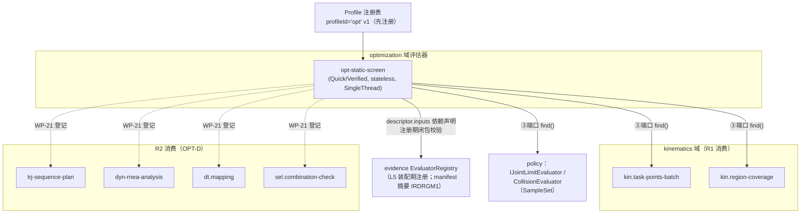

---

## 7. 目标指标、缺失值与 Pareto 非支配

### 7.1 八项比较指标全量定义（OPT-07：全部展示；可算性分阶段）

| # | 指标（MetricId） | 单位 | 方向 | 阶段可算 | 数据来源（唯一口径） | 缺失语义 | 精度/容差来源 |
| --- | --- | --- | --- | --- | --- | --- | --- |
| 1 | 尺寸包络 `opt.metric.envelope` | m（三向尺寸）或 m³（体积）——**口径待裁决 P-OPT-5** | 最小化 | B/D | 候选 RuntimeSnapshot 几何（连杆/基座/TCP 碰撞与视觉几何在基座系的包围度量），optimization 指标计算纯函数（O16） | 缺几何→`OPT-METRIC-NOT-COMPUTABLE`，显示"—" | 分析配置默认（config.opt 声明比较容差） |
| 2 | 结构质量 `opt.metric.structural-mass` | kg | 最小化 | B/D | 候选模型连杆 body.mass 合成（SourcedValue Provided 项；估算值带 ValueProvenance 标记，DYN-06 同型不包装为精确） | 任一参与连杆质量 NotProvided→"—"（不按 0 合成，NFR-COR-03） | 同上 |
| 3 | 最小关节裕量 `opt.metric.min-joint-margin` | rad（转动）/m（移动） | 最大化 | B/D | `kin.task-points-batch` 证据：Must 工位 IK 解集的关节限位裕量最小值（近限位阈值读 policy，KIN-\* 码） | Must 点全部数据不足→"—"；部分点数据不足→候选整体 DataInsufficient（§8.6） | policy 阈值（N7）；比较容差＝分析配置 |
| 4 | 节拍 `opt.metric.cycle-time` | s | 最小化 | **D** | trajectory payload `trj.sequence-plan.v1`：`TimeParameterization.totalDurationS`（含驻留；无时间参数化→NotProvided，不输出 0——trajectory §12.4/NFR-COR-03） | StageB 恒"—"（不估算）；D 无时间参数化→"—" | 附录 D 第 10 项（限制校验）＋分析配置（比较） |
| 5 | 器件成本 `opt.metric.device-cost` | 元（目录货币单位随字段字典） | 最小化 | **D** | SEL-06 输出事实（可行组合成本；成本字段承载于目录字段字典/成本目录数据——selection §4.1 未显式列 cost 字段，本文按 SEL-06 事实口径引用，不虚构字段名） | StageB 恒"—"；D 无可行组合/成本项缺失→"—" | 分析配置 |
| 6 | 器件质量 `opt.metric.device-mass` | kg | 最小化 | **D** | selection 目录条目 `MotorCatalogEntry.mass`/`GearboxCatalogEntry.mass` 合成（kg） | 同上 | 分析配置 |
| 7 | 关节侧正机械功 `opt.metric.joint-positive-work` | J | 最小化 | **D** | dynamics payload `dyn.rnea-analysis.v1`：`PowerEnergySummary.positiveEnergyJ`（E⁺＝∫max(P,0)dt，完整循环含驻留；dynamics §7.5） | StageB 恒"—"；D 无时间参数/摩擦缺失降级→按 DYN-06 标记并可判"—" | 分析配置（能量量纲运行容差默认缺——P-DYN-9 登记，不影响比较展示） |
| 8 | 最小驱动裕量 `opt.metric.min-drive-margin` | 无量纲（比值）或 %（随 selection 口径） | 最大化 | **D** | selection §17.3：工作点对能力的余量（含来源工况；selection §11.5 裕量事实） | StageB 恒"—"；D 惯量比阈值未裁决（P-POL-3/P-DT-2）时惯量比维度输出"未判定"（`inertia-ratio-policy-unsettled` 同型），不阻断其他维度 | selection/policy（阈值面）；比较容差＝分析配置 |

**口径未冻结项的处置（REQ RV-13/本卡 §16.3）**：尺寸包络的精确定义（外形包围盒 vs KIN-10 工作空间包络 Rmax）、器件成本货币口径、最小驱动裕量比值定义——三者上游未冻结数值口径，本文**不自行冻结**：保留 MetricId 接口与数据字段，显示为"—"或待裁决口径，登记 P-OPT-5 待需求侧裁决；裁决前 WP-20-T05 的可算指标以"结构质量/最小关节裕量＋暂定包络口径"实现并在任务留痕中标注。

### 7.2 指标计算与展示规则

- **全部展示**：候选表八列固定呈现；不可算列显示"—"（等价不可计算状态 token `not-computable`）——不显示零、不用估算冒充、不参与 Pareto（OPT-07；ERR-01/UX-03 不伪造数值）。
- **指标缺失不是零；不适用不是失败；数据不足不是完整可行；评估失败不是被支配**（§7.5 判定流）。
- 同一指标方向全运行稳定（方向在 MetricDefinition 词表冻结：包络/质量/节拍/成本/器件质量/正机械功＝min；关节裕量/驱动裕量＝max）。
- 指标值非有限（NaN/Inf）→ 该候选评估失败处理（EvaluationFailed），不静默转 0（NFR-COR-03）。
- 零值/近零值/正负值处理：最小化指标中零值合法（如成本为零组合？成本>0 现实约束不发明）；近零比较按 closeWithin（附录 D 通用公式，零参考退化为 ε_abs，不要求精确零）；关节裕量负值＝超限（该解已被限位硬过滤，不进入指标）。
- 重复候选按 CandidateId 与稳定排序去重（§7.4）。

### 7.3 目标激活规则（用户显式激活其他目标）

| 条件 | 检查点 | 失败处置 |
| --- | --- | --- |
| 当前阶段允许（StageB：仅 MetricId 1～3；StageD：全部八项） | 研究定义校验 | `OPT-STAGE-LOCKED` |
| 已注册合法评估器（指标来源评估键在 EvaluatorSetId 中且契约版本匹配） | Preflight #7 | `OPT-EVALUATOR-MISSING` |
| 具备完整证据（该指标 Profile 证据项可产出；如节拍需 `trj.path-and-time-record` 适用） | 评估期 | 该候选该指标"—"，候选若因缺失而不完整→DataInsufficient（§7.5） |
| 输入快照、工况、策略和版本一致（checkComparisonBaselinesConsistent） | Pareto 前置 | 拒绝比较＋定位不一致项（EV-COV-4） |

默认激活：StageB＝{包络, 结构质量, 最小关节裕量}；StageD＝{节拍, 结构质量, 器件成本}（OPT-07/§15.0）。用户显式激活按上表四条件；**不引入未经需求批准的目标**（八项之外无目标；"局部改进"等过程性能力不设独立目标词表）。

### 7.4 Pareto 非支配筛选

**支配定义**（激活目标集 O，每目标带方向 dᵢ∈{min,max} 与可选比较容差 tᵢ）：

- 严格序（默认）：候选 a 支配 b ⇔ ∀i∈O：aᵢ 不劣于 bᵢ（按方向）∧ ∃j∈O：aⱼ 严格优于 bⱼ（浮点全序比较，无容差——kinematics §6.3 稳定排序先例）。
- 容差支配（可配置）：aᵢ 不劣于 bᵢ 判定改用 `core::closeWithin(aᵢ, bᵢ, tᵢ)`（附录 D 通用公式 |a−b| ≤ ε_rel·|ref|＋ε_abs；零参考退化 ε_abs；逐元素）——tᵢ 默认为**零容差**，显式配置存入 config.opt（进 sliceId）。**不发明默认阈值**：AT-09"集合/排序满足容差支配"用例以显式配置容差执行（P-OPT-5 登记默认值待裁决；零容差为安全默认）。
- 缺失指标（"—"）候选**不参与支配比较**：不进入非支配集；状态保持 DataInsufficient/不完整——"—"不等于任何数值（§7.2）。
- 相同指标向量（逐元素全等，比较容差内）→ 互不支配；重复 CandidateId → 去重为单候选（保留首次评估，dedupCount 计数入审计）。
- **非支配 ≠ 工程通过**：Pareto 非支配仅表示多目标取舍；工程通过判定唯一归 evidence 正式通过五条件（EVI-01 §8.1；§11.2）。
- 可行集 vs 非支配集：可行集＝完整可行候选全集；非支配集＝可行集内经支配筛选的子集；两者区别在导出与 UI 均显式呈现（`feasible`/`pareto-nondominated` 双标记）。

**稳定排序（输出顺序确定性，NFR-COR-02）**：非支配集输出序＝(①非支配 rank 升序 → ②激活目标值依次按方向比较（目标次序＝config.opt.objectives 声明序）→ ③CandidateId 字典序终键)。全序、与线程数无关、重复运行一致；testkit `SetMatchTraits` 以此特化域断言（testkit §5.4）。

### 7.5 候选分类判定流（从评估输出到候选状态）

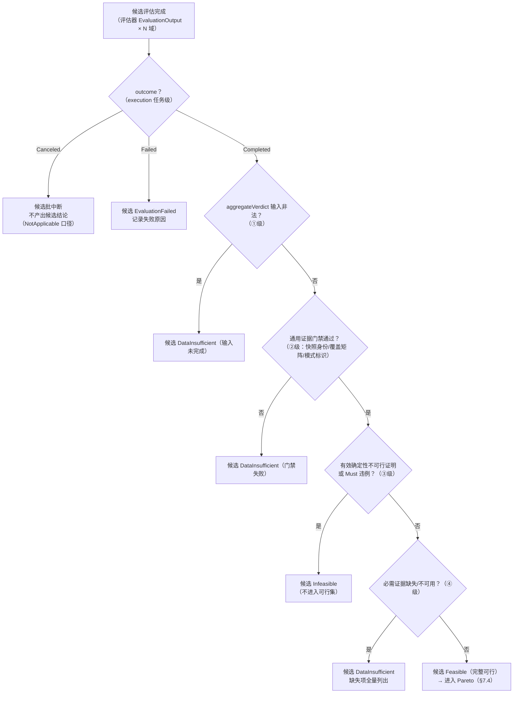

对应 evidence `aggregateVerdict` 五级汇总决策表（evidence §6.4；任务级证明③先于他域缺失④的跨域并存顺序＝P-EV-3 open，本卡引用其现状字面顺序并登记）。**正交关系表（候选状态 × 任务状态 × 证据状态 × 工程状态 × 当前性）**：

| 轴 | 词表 | 所有者 | 说明 |
| --- | --- | --- | --- |
| 候选状态 | Pending/ScreenedOut/Infeasible/DataInsufficient/EvaluationFailed/Feasible/ParetoNondominated | optimization（本卡 §4.3） | 优化域编排语义；ScreenedOut＝Quick 层保守淘汰 |
| 任务状态 | 九态（Queued…Interrupted） | execution | 承载评估的 execution 任务状态 |
| 任务结果（TaskOutcome） | Completed/Canceled/Failed/Interrupted | core/execution | Canceled/Failed/Interrupted × 非工程判定 |
| 证据状态 | 覆盖矩阵执行态（Executed/NotExecuted/Invalid/NotApplicable/Failed）＋Profile 项满足性 | evidence | EVI-02 分母 |
| 工程判定（EngineeringStatus） | Feasible/EngineeringInfeasible/DataInsufficient/NotApplicable | core（evidence 汇总） | aggregateVerdict 唯一产出 |
| 当前性 | Current/Superseded（＋NotEvaluable 计算形态） | evidence | 不改变历史结果（CON-02） |

**失败、取消、数据不足、搜索未果与确定性不可行的区分表**：

| 情形 | 判定 | 候选状态 | 进入可行集？ | 进入正式导出？ | 依据 |
| --- | --- | --- | --- | --- | --- |
| 评估器抛异常/超时/内部错误 | 环境错误 | EvaluationFailed | ❌ | ❌（附失败原因） | §6.3；KIN-SOLVER-INTERNAL 同型 |
| 用户取消（批中断） | 正常操作非错误 | 批内候选不产出结论 | ❌ | ❌ | UX-03；TASK-02 |
| worker 崩溃/进程中断 | 环境错误（任务 Interrupted） | 不产出完整结论 | ❌ | ❌ | NFR-REL-02/03 |
| 多初值未收敛/全部解被过滤（含碰撞过滤）/路径搜索未果 | 搜索未果 | DataInsufficient（附 SearchExhaustedRecord） | ❌（不作为完整可行） | 以 DataInsufficient 限定语导出 | C5/C8；KIN 五类结局 |
| 物性/摩擦缺失（DYN-06）| 可信降级 | DataInsufficient（缺失清单） | ❌ | 限定语导出 | DYN-06、EVI-01 |
| 有效证明（解析界限/约束矛盾/必经状态碰撞）或 Must 违例 | 工程不可行 | Infeasible | ❌ | 不可行结论可作正式评审记录（RPT-05） | §8.1 表 2③ |
| 证据齐备且无违例 | 完整可行 | Feasible → Pareto | ✅ | ✅（Verified＋覆盖完备前提） | §8.1 表 2⑤ |

---

## 8. 候选生成、评估器编排、Quick/Verified 与缓存

### 8.1 优化主流程（全阶段流程图）

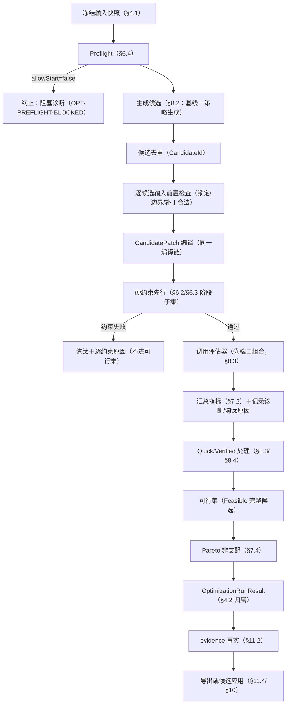

### 8.2 候选生成与两种初始化（OPT-01/10）

**初始化**：

- **新机型初始化**：基线＝模板创建的当前修订 RobotDesign；变量授权默认全开；策略＝全局空间填充（探索优先）；无历史结果。
- **既有机型改型初始化**：基线＝当前修订；**未授权参数默认锁定**（§5.4）；策略＝基线邻域扰动（利用既有设计先验）；变更对象定位供改型差异报告（MDL-08 消费，§10.4）。

**基线候选**：空补丁候选（CandidatePatchId＝空 canonical 身份）总是生成并参与评估（OPT-11 Evaluate Baseline 的执行形态）——基线评估与候选同管线、同需求/工况/策略/评估器基准（§12.2 §6.4 Evaluate Baseline 承接）；基线行在结果中标记 `isBaseline`，参与 Pareto（作为可行方案之一）。基线自身数据不足时不能伪造完整比较（基线候选按 §7.5 同判）；基线评估失败不能包装成候选淘汰（独立失败记录）。

**搜索策略接口（OPT-10 扩展点）**：`ICandidateGenerator`（§12）按策略生成候选批；首版可用策略（`strategyId` token）：

| strategyId | 说明 | 阶段 |
| --- | --- | --- |
| `opt.strategy.seeded-lhs` | 确定性种子拉丁超立方采样（连续/量化变量空间填充；枚举变量组合枚举上限保护；离散变量 R2 组合空间采样） | B/D |
| `opt.strategy.baseline-perturb` | 基线邻域扰动（改型：锁定集外小步扰动，步长/比例入 config） | B/D |

首版**不实现**进化/梯度等先进算法（OPT-10"首版不要求一次性引入"）；不预建无语义的空算法占位；扩展点＝注册新 `ICandidateGenerator` 实现（strategyId 登记＋config.opt 引用）——**不把历史"混合寻优（LHS→精英→局部）"名称当作当前需求**（old/ 对照项，需求附录 A.5 处置为 OPT-D/R2 分期承接"重写为三层联合"——三层联合＝§8.5 分层联合策略，与旧实现无继承关系）。

**候选数量与预算**：生成器受 `OptimizationBudget` 约束（maxCandidates/maxGenerations）；预估超限→Preflight 警告＋截断计数（§6.4 #19）；量化变量步长与枚举组合规模入 config（确定性）。

**变量编码**：连续变量＝SI 真值标量；量化变量＝步长网格对齐值（round-half-even，确定性声明）；枚举＝下标；离散器件＝规范引用（§5.6）。编码即补丁 canonical 内容（§5.5），无第二编码层。

### 8.3 评估器编排（逐候选评估流水）

1. **评估器注册与能力声明**：§6.7（装配期注册、Profile 先行、依赖闭包校验、manifest 摘要）。
2. **评估器依赖**：`opt-static-screen` 的 descriptor.inputs 即 §6.7 表；注册期由 evidence 校验依赖闭包（缺失依赖评估键→装配失败）。
3. **调用顺序**：§6.2（R1）/§6.3（R2）管线即调用顺序；优化域评估器内部按序 `find()` 依赖评估器并传递 `EvaluationRequest{task, mode, snapshot, slice, caseSubset}`。
4. **阶段能力检查**：评估器 supportedModes 与请求 mode 匹配（D-13 模式不隐式升降级）。
5. **失败/取消/超时/部分结果**：评估器抛错→候选 EvaluationFailed（附域诊断 cause 链）；取消→立即返回 cancelled 载荷（D-KIN-9 同型），编排器停止派发后续候选；超时→候选失败（evaluationTimeout，TaskCapability）；部分结果（caseSubset 分批）→覆盖矩阵跨批汇总，缺批候选不完整（DataInsufficient）。
6. **候选身份生成**：编译前由 CandidateId 公式确定（§4.2）；评估结果绑定候选身份与五元组。
7. **约束事实写入**：每约束执行记录 {constraintId, verdict(满足/违例/不适用/数据不足), 比较型数值（实际/要求/单位——比较型校验 ERR-01 必含）, 依据评估键}；写入候选评估证据（Profile 项 `opt.hard-constraint-record`）。
8. **指标事实写入**：每指标 {MetricId, 值(SI)或 not-computable, 来源评估键, ValueProvenance}（`opt.candidate-patch`/`opt.compile-identity` 配套）。
9. **淘汰原因**：{阶段, 约束/评估器 ID, 原因 token, 定位, 模式(Quick/Verified)}——逐候选逐约束逐评估器记录（O10；SEL-06 逐项淘汰原因同型）。
10. **稳定排序**：§7.4。
11. **结果合并**：多候选批结果按 CandidateId 合并去重；同批内去重；跨任务（Quick 批/Verified 批）以 CandidateId 关联。

### 8.4 Quick／Verified 两级与缓存（OPT-06 B 子集）

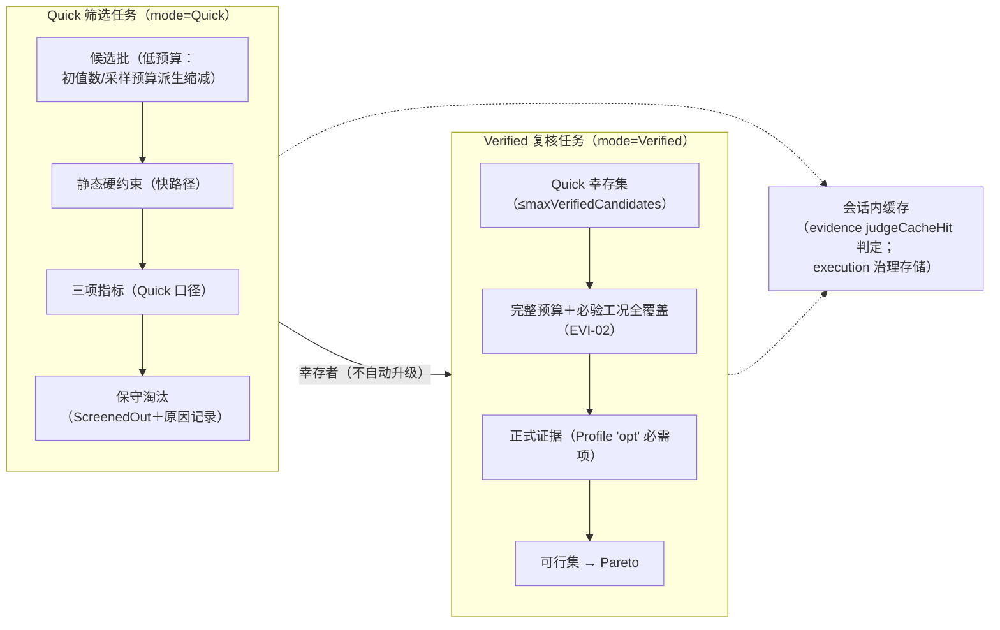

| 维度 | Quick | Verified |
| --- | --- | --- |
| 用途 | 快速候选筛选 | 最终候选比较 |
| 预算 | 低（初值数/采样预算按各域 Quick 语义派生；缩减规则入 config，确定性） | 阶段规定完整预算 |
| 淘汰权 | 可保守淘汰（ScreenedOut，含原因） | 不可行结论须证据/违例支撑 |
| 证据效力 | `screening-only`：不得产生等价于 Verified 的正式证据（EVI-01 表 1）；不进正式可行集 | 满足 Profile+覆盖矩阵 ⇒ 可进入正式候选比较（仍≠工程通过） |
| 失败语义 | Quick 失败**不自动转**确定性不可行（EvaluationFailed 独立） | 同左 |
| 缓存 | Quick 缓存命中不能自动升级为 Verified（mode-mismatch ⇒ Incompatible，evidence D-13/EV-CPA-1） | Verified 请求不命中 Quick 缓存（双向 Incompatible） |

**缓存键与命中判定（不复制第二套兼容逻辑）**：缓存键要素全部经既有身份承载——InputSlice 身份（含 config.opt/变量/约束/目标/种子/线程/预算/策略——§4.5）、CandidatePatch 身份（评估请求切片条目）、阶段（config.opt.stage）、EvaluationMode、评估器集合和版本（EvaluatorSetId/contractVersion）、算法版本、契约版本（Profile contentIdentity/导出契约）、策略身份（policyRef）。命中判定唯一归 evidence `judgeCacheHit`（FullHit/DiagnosticOnly/Incompatible 六值 miss 原因）；检查点兼容判定唯一归 `judgeCheckpointCompatibility`；缓存存储治理（查找/写入/淘汰/预算）归 execution `IExecutionCacheCoordinator`（写入双门槛：仅 outcome==Completed 且归档 finalize 成功——CON-04）。optimization 只做：编排查找请求、消费命中结果、统计命中计数（审计）。

**会话内缓存（R1 承诺）**：命中作用域＝应用会话内（execution 缓存治理机制承载；R1 验收只要求会话内命中——AT-09 组）；R2 扩展规模化缓存（更大预算＋检查点，同机制）。失败、取消、中断和部分结果不能作为完整缓存命中（DiagnosticOnly 可读诊断）；不兼容缓存必须拒绝。

**确定性承诺（NFR-COR-02 承接）**：相同输入、版本、配置、线程数和随机种子 ⇒ 等价候选集合和稳定排序；不要求浮点文件逐字节相同；并行归约遵守附录 D 第 8 项（相对 1×10⁻¹²，逐元素——WP-23-T07 基准）。

### 8.5 R2 分层联合策略（OPT-05；外层—内层结构图）

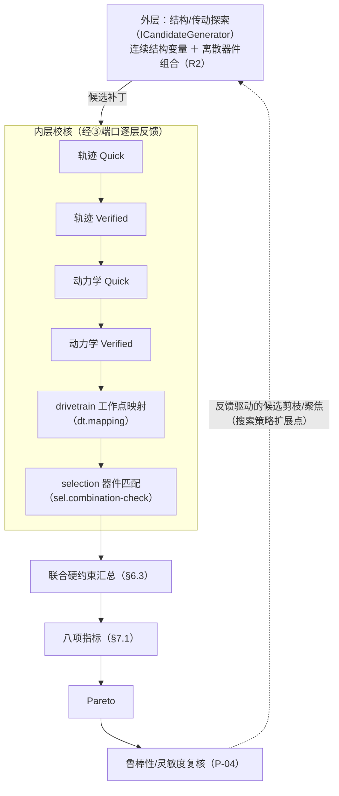

- 三层联合闭环**通过评估器组合实现，不通过业务单元互链**（§3.2 红线；drivetrain.md §16.3、selection.md §17.3、dynamics.md §13.3、trajectory.md §19.2 四卡交接行同口径：optimization 编排，各域不实现优化语义）。
- 内层每层 Quick→Verified 两级；联合硬约束汇总按 §6.3 语义；器件匹配失败（组合不可行）逐项淘汰原因来自 selection `RejectionReason`（thresholdSource 字段保留阈值来源——P-POL-3 待裁决时输出"未判定"维度，不整体阻断）。
- 鲁棒性反馈仅作用于**搜索聚焦**（生成器提示），不改变已产出候选的历史结果（PA-2）。

### 8.6 灵敏度/鲁棒性复核与误淘汰审计（OPT-D；接口就绪、协议待 P-04）

- **三模式接口**：`IRobustnessReviewer`（§12）承载有界公差验证、概率鲁棒性、敏感度抽查三模式的**调用面**；采样规则、判定阈值、适用边界全部待 P-04 冻结（WP-21-T01）——本文**不私设协议数值**（DTB WP-21-T01 禁止项；O-28）。
- 启用前置：P-04 冻结（需求附录 C 修订留痕）→ WP-21-T02 增量修订本卡引用冻结值；未冻结时 Preflight 阻塞＋`OPT-ROBUSTNESS-PROTOCOL-MISSING`。
- **误淘汰审计**（§15.0 OPT-D 行数字承接）：Quick 淘汰候选按 5% 抽样（且 ≥200 样本）以 Verified 复核，统计误淘汰率（≤1%）与 95% 置信上界（≤3%）；审计计数（Quick 淘汰数/Verified 复核数/缓存命中数/灵敏度样本数/鲁棒性样本数/误淘汰审计样本数/误淘汰率/95% 置信上界）入审计 CSV 与 Profile 证据（`opt.mode-audit-counts`）。置信上界计算方法（正态近似/Wilson 等）未由需求冻结——登记 P-OPT-7，安全设计＝正态近似并在数据集内声明；抽样确定性（种子派生）保证审计可重放。

---

## 9. execution 协作、并行、取消、暂停和检查点

### 9.1 任务提交与身份交接（R1 形态；阶段 B 承诺边界）

- **提交**：优化运行经 `ITaskScheduler::submit(TaskSubmission)` 提交——Quick 筛选与 Verified 复核各为一个任务（mode 分别为 Quick/Verified；evidence/key=`opt-static-screen`；resumeFrom 仅 R2）。`SubmitResult{accepted, task, diagnostics}`；提交验证 V1～V4（形式/内容/权限/预算）由 execution 执行——只读项目（store 非 Active∧writable）时 Quick/Verified 提交被拒（`EX-STORE-READ-ONLY`，PM-07）。
- **身份生成**：TaskId/RunId 由 execution 生成（§4.6）；OptimizationRunId 由本域生成并映射 `tasks[]`（§4.2）；AttemptId 由 execution 维护（恢复/暂停继续 +1）。
- **取消传递**：`ITaskController::requestCancel(TaskId)`——协作取消（2 s 进入 Canceling、普通批 10 s 收敛、超时强杀保留检查点）；评估器在候选批边界轮询 `cancellationRequested()`。**R1 取消和进度边界**：取消＋进度为 B 期承诺（OPT-06/AT-34）；暂停/继续不是。
- **进度**：`ProgressReport{percent, phaseToken, batchesDone/Total}`（≤10 Hz 节流）——phaseToken 词表：`preflight`/`generate`/`compile`/`hard-constraints`/`evaluate-quick`/`evaluate-verified`/`pareto`/`export`；UI 进度漏斗消费（WP-20-T10）。
- **阶段 B 明确不做**（§15.0）：并行、检查点、用户暂停/继续、大规模内存节流**不作为 B 期验收承诺**——机制存在（execution 已交付）但本卡不为 B 期声明其达标；UI 只显示进度和取消状态；**不在 UI 线程执行候选评估**（NFR-PERF-01；轻量会话计算 <1 s 内联除外）。

### 9.2 R2 执行扩展（并行/检查点/暂停/节流）

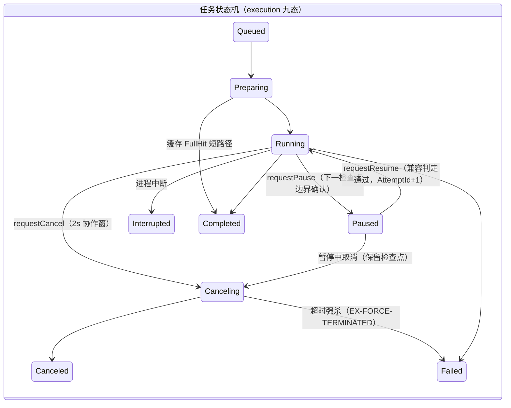

- **并行分片**：R2 由 execution 池化 worker 并行执行候选批（`maxWorkers`/资源预算归 execution）；worker 内并行线程数来自 config.opt（入身份）；execution 不改写业务线程配置，仅约束 worker 总数与全局并行；并行归约满足附录 D 第 8 项容差（NFR-PERF-05：8 线程 ≥4× 中位吞吐——WP-23-T07 基准）。
- **分批与流式**：候选批经 `ResultBatch` 分批回传（域载荷片段，execution 视为不透明字节）；优化域在主进程流式合并（NFR-PERF-03：10,000 候选摘要不整体装入界面——投影分页）。
- **检查点**：`CheckpointRecord`（execution §8.1 契约）——优化域中间状态（已完成候选批索引/待评估队列/当前代计数/审计计数器）编码为 `intermediateStateRef`（域自编 codec，magic `IRDOPTC1`）；`checkpointGranularity=Batch`；`completedUnits/totalUnits`＝候选批计数（**续跑统计基点——继续不重复统计**）；写出于批边界（暂停确认边界＝检查点写出并确认）。
- **暂停/继续/暂停中取消**（AT-35/V12-06 四条边界）：暂停确认边界明确（批边界检查点）；继续不重复统计已完成候选；**不改变输入快照**（恢复仍绑定原 snapshotId/sliceId/config）；能力不支持时诚实状态反馈（`EX-CAPABILITY-UNSUPPORTED`，不静默）。
- **恢复语义**：恢复后新 AttemptId（同 RunId）；不兼容检查点必须拒绝（`EX-CHECKPOINT-INCOMPATIBLE`＋reasons；旧版本检查点不迁移——P-EX-9 口径：宁可重算不可错续）；**检查点恢复不等于优化成功**——恢复后仍走完整接纳与汇总；取消、失败、中断不得发布完整 Pareto 集（RunPhase 不进入 Completed）。
- **worker 崩溃**：崩溃只导致当前任务 Failed（`EX-WORKER-CRASHED`；检查点保留）；主界面不退出、项目不损坏（NFR-REL-02）；不自动重试（D-09）——用户重跑＝新任务（可 resumeFrom）。
- **资源节流**：主进程＋全部 worker 峰值 ≤物理内存 70%，接近上限（65% 实现参数）先节流（暂停派发/降并行）再报 `EX-RESOURCE-INSUFFICIENT`（NFR-PERF-04；execution ResourceController 承接——optimization 消费其结果，不自有内存治理）。

### 9.3 结果合并与迟到/重复防护（承接 TASK-02/03、NFR-REL-03）

- **九步接纳**（execution RunRegistry）：候选批结果经五元组核对→attempt 陈旧性→绑定核对→类型白名单→已终止拒收（**terminationCause 已 Canceled/Failed/ForceTerminated ⇒ 拒绝 FinalEnvelope**——取消/失败后不得产生完整成功结果）→名称反解→aggregateVerdict→envelope→归档；optimization 不复制该链（I-OPT-5）。
- **迟到结果**：项目切换后旧任务结果绝不写入新项目（AT-10/PM-13）；归档位置取自登记记录（原修订 results/）。
- **候选完成状态与统计**：`completedUnits/totalUnits` 候选批计数从检查点累计（恢复不重复统计——AT-35）；重复投递幂等（同 (runId, attemptId) FinalOutput 摘要一致→不重写）。
- **任务资源预算/超时**：`setResourceBudget` 全局治理＋任务 `evaluationTimeout`（TaskCapability）；优化域声明 `forceTerminateCost=Moderate`（批边界可弃）。
- **失败责任**：评估器域内错误→域诊断（cause 链）；通道/进程错误→EX-\* 码；optimization 编排错误→OPT-\* 码——三层责任边界不互相吞错（ERR-01/NFR-REL-05）。

### 9.4 阶段能力声明表（TaskCapability/EvaluatorRuntimeCapabilities）

| 能力位 | R1（OPT-B） | R2（OPT-D） | 依据 |
| --- | --- | --- | --- |
| `supportsPause` | false | true | §15.0（B 期不承诺暂停/继续） |
| `checkpointGranularity` | None | Batch | 同上＋NFR-PERF-06 |
| `forceTerminateCost` | Cheap（无检查点弃置） | Moderate（批边界检查点保留） | §9.2 |
| `evaluationTimeout` | 注册时声明（config 可调） | 同左 | EX-T03 |
| 并行 | threadCount=1（入身份） | execution 池化派发 | NFR-PERF-05 |

---

## 10. 候选应用、方案分支、回填和历史结果

### 10.1 候选应用流程（OPT-08 采用守卫）

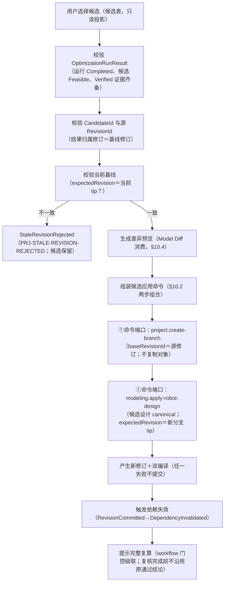

### 10.2 命令组合与原子性（project.md §10.7 承接）

- **命令序列**：step1 `project.create-branch`（project 内置元数据命令——baseRevisionId 记录、不复制对象、分支表随 ProjectMetadata 提交）；step2 域设计命令 `modeling.apply-robot-design`（payload＝候选 RobotDesign canonical 字节；`requiresDualCompile=true`；`expectedRevision`＝step1 新分支 tip）。
- **基线保护**：预览候选不得修改基线（评估全程只读快照）；应用发生在**新方案分支**上——主方案分支与基线修订内容字节不变（AT-12）；旧优化结果保留为历史结果（PA-2）。
- **原子性边界**：两命令非单事务——step2 失败时项目权威不受影响（step1 仅新建了指向 baseRevision 的方案分支，分支 tip＝baseRevision 内容，无设计变化）；optimization 在 step2 失败时给出定位诊断（`OPT-APPLY-PLAN-INVALID` 或透传 project/modeling 码），**方案分支残留处置**：保留（用户可重试应用或忽略；分支删除不在产品范围——PM"明确不做"）。多变量复合候选＝单条 apply 命令整体提交（候选 canonical 是完整设计字节）⇒ 整体成功或整体失败（MDL-06 原子性由命令边界保证）。
- **红线**：不直接修改 RobotDesign、不直接写项目文件、不绕过 ProjectCommandService、不自行实现撤销/重做（撤销＝project UndoRedoService 逆命令——apply 的 inverse 由 modeling handler 声明，快照式逆载荷）；只读项目（writable=false）时应用入口禁用＋诊断；锁冲突（`PRJ-LOCK-HELD`）、分支冲突、事务失败（StoreError 族）区分呈现（UX-03）。
- **P-PR-9 依赖登记**：optimization 不注册新命令 token（复用既有命令组合），因此不受 commandType 语法争议影响——登记为规避决策（§16.2 DOPT-6）。

### 10.3 候选应用前置校验清单（`IOptimizationCandidateApplier` 组装面）

1. 源 OptimizationRunResult 存在、RunPhase==Completed（取消/失败/中断结果不可应用——TASK-02）；
2. 目标候选 CandidateStatus==Feasible 且其 Verified 证据经 `FormalPassEligibility` 通过（RPT-05 五条件同源）；
3. CandidateId 与源 RevisionId 对应（结果归属修订＝运行输入修订）；
4. 当前分支 tip == 运行输入修订（否则 StaleRevisionRejected 前置提示——不阻塞组装但标记预期拒绝）；
5. 补丁→候选设计 canonical 物化可用（P-OPT-2/P-OPT-3 通道就绪）；
6. 项目 writable（PM-07）。

### 10.4 候选差异预览（Model Diff 消费，MDL-08/UX-13）

optimization **不重复实现差异呈现**：差异预览消费 modeling `IModelDiffService::diff(baseline, candidate)` → `ModelDiffReport{structure/parameters/properties 三组 + ModelDiffEntry{group, kind(Added/Removed/Modified), objectId, subjectPath, field, valueChanged/provenanceChanged, 两侧摘要}}`（modeling §9.4.9）。差异条目来源：

| 差异组 | 涵盖（MDL-08 分组） | 优化变量映射 |
| --- | --- | --- |
| 结构差异 | 权威/基座/关节与连杆集合成员/链序/几何引用/引用表 | basePlacement（结构组） |
| DH/轴线/限位差异（Parameters） | axis/origin/zeroOffset/bounds/workingRange/dhDerived | DH 长度·偏置/关节安装位置/关节范围/TCP（TCP 属引用表侧） |
| 物性差异（Properties） | body.mass/centerOfMass/inertia/material | 连杆截面（经重估算）/材料 |
| 传动比差异 | ratioPerJoint（随 robot-drivetrain 对象 diff——modeling 卡 diff 范围声明为根对象；**传动比差异当前依赖 modeling diff 范围扩展，登记 P-OPT-8**） | drivetrain.ratio |
| 离散器件差异 | catalogBackfill（R2） | 电机/减速器/组合 |

画面呈现归 UX-13 方案比较视图（按结构/参数/物性分组、点击定位对象——数据实体与语义归 MDL-08，V15-02）；optimization 提供 diff 请求与 CandidatePatch↔diff 条目关联。

### 10.5 选型回填与历史结果失效（AT-30 承接）

- selection 回填（SEL-10）经命令更新 `DriveTrainDesign` → 新修订 → 依赖失效（传动键声明切片失效）→ **实际依赖的优化结果 Superseded**（evidence 失效矩阵：目录能力曲线→优化 ◐〔OPT-D 器件联合启用后〕；电机成本→优化 ◐〔仅器件成本指标激活时〕）。
- 复核完成前不能沿用原通过结论：优化候选的"正式通过/可行"引用随输入 Superseded，UI 呈现"结果过期＋原因"（UX-10）；重新运行优化（新运行同基准）后恢复 Current 判定。
- 结构或传动变化（任何候选应用/建模/回填提交）必须使实际依赖的轨迹、动力学、传动、选型和优化结果失效（evidence §5.3 矩阵执行，optimization 消费判定不复制）。

### 10.6 历史优化结果与当前性（CON-02 承接）

- 历史运行（旧修订上的 OptimizationRunResult 与候选结果）永久保留为原快照历史证据；Current/Superseded 是 evidence 的投影（§11.2）；缓存命中不等于 Current（§4.5）。
- "已中断"呈现：恢复后未完成任务显示"已中断"，不伪装完整结果（NFR-REL-03）；中断运行的结果不进入正式可行集（RunPhase=Interrupted ⇒ allowFormalExport=false）。

---

## 11. evidence、ResultEnvelope、当前性与一站式导出

### 11.1 optimization 输出交给 evidence 的事实清单

优化域产生并交由 evidence/归档体系承载的事实（Profile "opt" v1 实例化——REQUIREMENTS §8.1 表 4 优化行逐行承接）：

| Profile 项（itemId） | 类 | 内容 | 需求表 4 行对应 |
| --- | --- | --- | --- |
| `opt.candidate-patch` | Required | 候选变量补丁（canonical 字节＋CandidatePatchId＋绑定差异定位） | "候选变量补丁" |
| `opt.compile-identity` | Required | 候选编译身份（基线闭包引用＋补丁覆盖视图身份＋编译链版本要素） | "候选变量补丁与编译身份" |
| `opt.hard-constraint-record` | Required | 阶段对应硬约束执行记录（§6.1 子集；逐约束 verdict＋比较型数值） | "硬约束执行记录（按 §15.0 阶段子集）" |
| `opt.mode-audit-counts` | Required | Quick/Verified 层级与审计计数（淘汰/缓存命中/复核/灵敏度/鲁棒性/误淘汰审计） | "Quick/Verified 层级与审计计数" |
| `opt.seed-thread-config` | Required | 随机种子与线程配置（确定性复现要素） | "随机种子与线程配置（NFR-COR-02）" |
| `opt.robustness-review` | Suggested（OPT-D 启用后**转必需**） | 灵敏度/鲁棒性复核记录（P-04 冻结协议） | 建议项行 |
| `opt.candidate-package` | Suggested | 候选模型包导出引用 | 建议项行 |

通用必需项（`common.snapshot-identity`/`common.case-coverage-matrix`/`common.mode-evidence-grade`）由 evidence 内建附加，域 Profile 不重复登记。随评估输出一并承载：AnalysisSnapshot/InputSlice 身份、约束执行记录、Quick/Verified 记录、缓存命中记录（计数＋键面）、随机种子、线程配置、评估器版本（EvaluatorSetId）、变量差异、指标、淘汰原因、审计计数、工况覆盖（覆盖矩阵）、失败/取消/数据不足记录。

### 11.2 ResultEnvelope 与三态正交（evidence 权威，optimization 消费）

- **optimization 只产生优化事实**；evidence 拥有 ResultEnvelope 构造校验（`make`＋`validateCombination`）、工程判定（aggregateVerdict 五级汇总）与当前性（computeCurrentness）——optimization 不自建第二套判定（N7/N9）。
- Pareto 非支配不等于工程通过（§7.4）；`DataInsufficient` 不得被显示成通过（RPT-05 限定语）；取消、失败和中断结果不得进入正式可行集（TASK-02）；结果历史不可修改（CON-02）；Current/Superseded 是 evidence 投影；缓存命中不等于 Current（§4.5）；必验工况漏验时不得输出正式完整结论（EVI-02）；迟到结果不得成为新项目的当前结果（TASK-03）。
- 输入修订、工况、策略、算法、评估器或契约变化如何使结果失效：见 §4.5 失效输入清单与 evidence 失效原因词表（ObjectContentChanged/ConfigurationChanged/PolicyChanged/SampleBaselineChanged/EvaluatorContractChanged/…）。

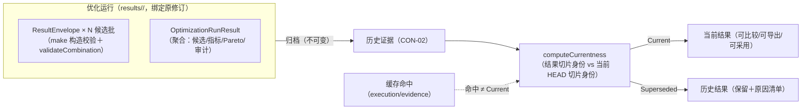

### 11.3 与 reporting 的章节/基座协作

- 报告章节 `optimization-candidates`（SectionId 词表第 6 项，B 级——静态优化候选：候选与三项静态指标，其余"—"）：optimization 在装配期实现 `IReportSectionProvider` 注册（reporting §9.2；"不预建无提供方的空章节"）；`SectionStatus` 词表（populated/no-formal-result/data-insufficient/not-applicable）映射 §7.5 候选状态。
- 共用导出规则（canonical/原子导出/限定语纪律）与 EvidenceBundle 组装复用 reporting 基座（RPT-02/03；RPT-CUR-2 过期不沿用）；报告数据源过期（契约过期）阻断正式导出——与 §11.4 同一阻断面。
- 优化专属导出清单与 Markdown 证据报告内容归 optimization（reporting §2.2 分工）。

### 11.4 OPT-12 一站式导出（六工件契约）

| # | 工件 | 格式 | 写出通道 | 内容要点 |
| --- | --- | --- | --- | --- |
| 1 | 研究结果 JSON | JSON（canonical：键序固定/数值 to_chars 最短往返/UTF-8 无 BOM） | io `IJsonWriter`＋`IAtomicFileWriter` | 研究定义、输入身份（snapshot/slice/baseline）、运行身份（OptimizationRunId＋tasks[] 五元组）、EvaluatorSetId、Profile 身份、配置（变量/约束/目标/种子/线程/预算/策略）、候选集（CandidateId/补丁/状态/八项指标/淘汰原因）、Pareto 集、审计计数 |
| 2 | 候选 CSV | CSV（`#rwcsv1` 方言、转义 roundtrip） | io `ICsvWriter` | 逐候选：CandidateId/补丁摘要/八项指标（"—"原样）/状态/淘汰原因/当前性 |
| 3 | 任务明细 CSV | CSV | io `ICsvWriter` | 逐 execution 任务：五元组/mode/批数/起止/取消与失败记录 |
| 4 | 审计 CSV | CSV | io `ICsvWriter` | Quick 淘汰数/Verified 复核数/缓存命中数/去重数/（R2）灵敏度样本数/鲁棒性样本数/误淘汰审计样本数/误淘汰率/95% 置信上界——**与运行重放统计一致**（AT-34） |
| 5 | Markdown 证据报告 | MD | io `IAtomicFileWriter`（内容组装归 optimization） | 限定语纪律（RPT-05：估算/数据不足/未完成复核保留限定语）；逐候选证据引用（Profile 项）；基线与候选比较基准声明 |
| 6 | 候选模型包 | 包（ZIP 传输封装语义） | io `IPackageExporter`（经 project 快照） | 候选设计工件＋来源标识（roundtrip 口径同 MDL-20） |

**导出绑定与阻断**：导出请求必须绑定输入快照、运行身份、候选身份和证据（Profile/评估器/导出契约版本三元组校验）；**契约过期时阻断正式导出**（`OPT-EXPORT-CONTRACT-STALE`）——版本三元组与结果记录不符即阻断（reporting RP-CUR-2 同源）。**不得冒充完整正式导出**：Preview、取消、失败、中断、数据不足研究结果导出时必须携带对应限定语状态，且 `allowFormalExport=false` 的研究不得产出"正式"标记工件（导出面 status 字段强制）。CSV/JSON 底层安全解析和文件写入归 io/reporting/project——optimization 只定义字段和导出契约（N10）。

---

## 12. 公共接口和跨单元协作

### 12.1 接口总表（十接口＋新增说明）

| 接口 | 层/落位 | 所有者状态 | 上游支持 |
| --- | --- | --- | --- |
| `IOptimizationVariableProvider` | 计算库公共头（Variable.hpp） | 本卡新增（O1 变量词表服务面） | OPT-02 直接要求；modeling/runtime 提供权威字段语义 |
| `IOptimizationConstraintProvider` | 同上（Constraint.hpp） | 本卡新增（O4 约束编排面） | OPT-03；计算消费③④端口既有评估器 |
| `IOptimizationObjectiveProvider` | 同上（Objective.hpp） | 本卡新增（O5/O16 指标配置与词表） | OPT-07 |
| `ICandidateGenerator` | 同上（Run.hpp 或独立 Generator.hpp） | 本卡新增（O6/OPT-10 搜索策略接口） | OPT-10 明确要求接口扩展 |
| `IEvaluationPipeline` | 同上（EvaluatorPorts.hpp） | 本卡新增（O7 编排管线） | ARCH §7.10 评估器组合 |
| `IParetoFrontBuilder` | 同上（Pareto.hpp） | 本卡新增（O9） | OPT-04 |
| `IOptimizationPreflightService` | 同上（Preflight.hpp） | 本卡新增（O3） | OPT-11 |
| `IOptimizationRunController` | 同上（Run.hpp） | 本卡新增（运行意图与结果适配；不拥有 worker 调度） | OPT-06；execution 承载任务 |
| `IOptimizationCandidateApplier` | 同上（Applier.hpp） | 本卡新增（O13 命令组装） | OPT-08；project §10.7 组合口径 |
| `IOptimizationExportProvider` | 同上（Export.hpp） | 本卡新增（O12 导出事实） | OPT-12；io/reporting 承载写出 |
| `IRobustnessReviewer`（新增，第 11 接口） | 同上 | 本卡新增（OPT-09 调用面；协议待 P-04） | OPT-09——新增原因：三模式复核需独立于运行控制的可注入面；尚未由上游具体化（P-04 未冻结），仅接口与未就绪诊断 |

**新增接口共性约束**：计算库零 Qt；不暴露 UI 类型；不直接暴露 project 内部存储类型；不复制 FK/IK/轨迹/动力学/drivetrain/selection/碰撞公式；不新增未经上游批准的状态、证据等级或工程阈值；`std::future`/Qt 类型不作跨单元稳定契约（异步经回调/轮询句柄）；取消与暂停与 execution 状态机对齐（`ICancellation*` 语义与 `IEvaluationContext::cancellationRequested` 同型）。

### 12.2 接口签名（C++17 设计基线，Draft）

```cpp
// —— Preflight.hpp ——
/// 优化预检服务：运行启动前的结构化检查（OPT-11）。只读、无副作用、可重复调用。
class IOptimizationPreflightService {
public:
    virtual ~IOptimizationPreflightService() = default;
    /// @brief 执行 Preflight，输出阻塞/警告清单与 allowances 五元组（§6.4）。
    /// @pre spec.revision 可读；评估器注册表已装配完成（L5 装配期后）。
    /// @post 不修改任何项目状态；不产生诊断目录条目以外副作用。
    /// @throws std::invalid_argument spec 字段非法（调用方契约违约，fail-fast）。
    /// @threadSafe 是（只读消费查询端口与注册表清单）。
    /// @cancellation 预检为轻量纯检查（<1 s），不提供取消。
    /// @determinism 同输入同结论（纯函数面）。
    virtual PreflightReport preflight(const OptimizationRunSpec& spec) const = 0;
};

// —— Variable.hpp ——
/// 变量词表与绑定校验服务（OPT-02）。
class IOptimizationVariableProvider {
public:
    virtual ~IOptimizationVariableProvider() = default;
    /// @brief 返回指定阶段的内置变量定义词表（§5.3；R2 追加离散器件类）。
    virtual std::vector<VariableDefinition> definitionsFor(OptimizationStage stage) const = 0;
    /// @brief 校验绑定集：互斥/权威字段存在性/边界合法性；锁定与授权状态核对（§5.4）。
    /// @return 逐绑定校验结果（合法/警告/拒绝＋诊断）；拒绝项阻断运行启动。
    virtual BindingValidationReport validateBindings(
        const std::vector<VariableBinding>& bindings,
        const evidence::AnalysisSnapshot& snapshot) const = 0;
    /// @brief 两个补丁的变量差异（§5.2 I-OPT-10；供差异预览与导出）。
    virtual std::vector<VariableDiffEntry> diffCandidatePatch(
        const CandidatePatch& a, const CandidatePatch& b) const = 0;
};

// —— Constraint.hpp ——
/// 约束编排描述（OPT-03）：阶段→约束集解析；执行归 IEvaluationPipeline。
class IOptimizationConstraintProvider {
public:
    virtual ~IOptimizationConstraintProvider() = default;
    /// @brief 返回阶段对应的约束执行清单（§6.1/§6.2/§6.3 顺序；阶段锁校验在此）。
    /// @throws OptimizationError 阶段不支持约束（OPT-STAGE-LOCKED）。
    virtual std::vector<ConstraintSpec> constraintsFor(OptimizationStage stage) const = 0;
};

// —— Objective.hpp ——
/// 目标指标配置与八项指标词表（OPT-07）。
class IOptimizationObjectiveProvider {
public:
    virtual ~IOptimizationObjectiveProvider() = default;
    virtual std::vector<MetricDefinition> metricDefinitions() const = 0;   // 八项＋方向＋来源键
    /// @brief 校验激活目标集（阶段/评估器/证据/输入四条件，§7.3）。
    virtual ObjectiveValidationReport validateObjectives(
        const ObjectiveSet& objectives, OptimizationStage stage,
        const evidence::EvaluatorRegistryView& registry) const = 0;
};

// —— Run.hpp ——
/// 候选生成策略（OPT-10 扩展点；实现注册 strategyId）。
class ICandidateGenerator {
public:
    virtual ~ICandidateGenerator() = default;
    virtual std::string strategyId() const = 0;
    /// @brief 生成下一候选批（确定性：种子/预算/编码入 config.opt canonical）。
    /// @pre bindings 已校验；budget.maxCandidates 未耗尽。
    /// @post 生成纯函数式推进（无隐藏状态依赖线程时序）。
    /// @cancellation 支持批间取消（返回空批＋cancelled 标记）。
    virtual GenerationBatch generateNextBatch(const GenerationContext& ctx) = 0;
};

/// 评估管线（O7）：候选补丁 → 编译 → 硬约束 → 评估器 → 指标/淘汰原因。
class IEvaluationPipeline {
public:
    virtual ~IEvaluationPipeline() = default;
    /// @brief 评估单候选（一个 EvaluationRequest 生命周期；worker 内执行体）。
    /// @pre snapshot/slice 已冻结；mode ∈ descriptor.supportedModes。
    /// @return 候选评估记录（约束事实/指标事实/淘汰原因/证据输出——§8.1 第 7～8 步）。
    /// @cancellation 周期性查询 ctx.cancellationRequested()（批边界粒度）。
    /// @determinism 同切片同环境 ⇒ 等价输出（NFR-COR-02）。
    virtual CandidateEvaluationRecord evaluateCandidate(
        const CandidateEvaluationRequest& request,
        evidence::IEvaluationContext& ctx) = 0;
};

/// Pareto 非支配集构建（OPT-04；O9）。
class IParetoFrontBuilder {
public:
    virtual ~IParetoFrontBuilder() = default;
    /// @brief 对完整可行候选构建非支配集与稳定排序（§7.4；去重按 CandidateId）。
    /// @pre 输入候选均 Feasible 且指标完整（"—"候选已在管线侧排除）。
    /// @determinism 同输入同输出（比较容差来自 config，随输入携带）。
    virtual ParetoFrontResult buildFront(const std::vector<FeasibleCandidate>& candidates,
                                         const ObjectiveSet& objectives) const = 0;
};

// —— Run.hpp ——
/// 运行控制器（运行意图与结果适配；不拥有 worker 调度——N8）。
class IOptimizationRunController {
public:
    virtual ~IOptimizationRunController() = default;
    /// @brief 启动运行：Preflight → 提交 Quick 任务 →（幸存集）提交 Verified 任务。
    /// @return 运行句柄（OptimizationRunId＋任务映射；失败时 RunPhase 与诊断）。
    /// @post 任务提交经 execution；本接口不等待完成（结果经事件/轮询）。
    virtual RunStartResult startRun(const OptimizationRunSpec& spec) = 0;
    /// @brief 取消运行（协作取消全链——§9.1）。
    virtual CancelRunResult requestCancel(OptimizationRunId run) = 0;
    /// @brief 聚合当前运行结果（部分/完整；RunPhase 反映状态）。
    virtual std::optional<OptimizationRunResult> resultOf(OptimizationRunId run) const = 0;
};

// —— Applier.hpp ——
/// 候选应用组装（OPT-08；只组装 project 命令，不直接修改模型——O13/N1）。
class IOptimizationCandidateApplier {
public:
    virtual ~IOptimizationCandidateApplier() = default;
    /// @brief 校验并组装两步命令（§10.2）与差异预览输入；不执行提交。
    /// @pre §10.3 六项前置全部满足（逐项校验）。
    /// @throws OptimizationError 组装非法（OPT-APPLY-PLAN-INVALID）。
    virtual CandidateApplyPlan buildApplyPlan(const ApplyCandidateRequest& request) const = 0;
};

// —— Export.hpp ——
/// 导出事实提供（OPT-12；文件写出归 io/reporting/project——N10）。
class IOptimizationExportProvider {
public:
    virtual ~IOptimizationExportProvider() = default;
    /// @brief 组装六工件的数据面（§11.4 字段契约）＋契约版本三元组校验。
    /// @pre 运行已归档（archivePhase==Archived）；allowFormalExport 才可出"正式"标记。
    /// @throws OptimizationError 契约过期（OPT-EXPORT-CONTRACT-STALE，阻断正式导出）。
    virtual ExportBundleData buildExportBundle(const ExportRequest& request) const = 0;
};

// —— Robustness.hpp（R2）——
/// 鲁棒性/灵敏度复核调用面（OPT-09；采样/阈值待 P-04 冻结——启用前一律拒绝）。
class IRobustnessReviewer {
public:
    virtual ~IRobustnessReviewer() = default;
    /// @brief 按冻结协议对候选执行三模式复核；P-04 未冻结 ⇒ nullopt＋诊断
    ///        （OPT-ROBUSTNESS-PROTOCOL-MISSING），不产结果。
    virtual std::optional<RobustnessReviewResult> review(
        const RobustnessReviewRequest& request,
        evidence::IEvaluationContext& ctx) = 0;
};
```

### 12.3 接口字段、版本、身份、引用、所有权、生命周期、错误和线程约束表

| 维度 | 约定（适用于 §12.2 全部接口） |
| --- | --- |
| 字段与单位 | 全部物理量 SI 真值（core Quantity/UnitToken）；注释按 AGENTS §2.5 带单位/坐标系/角度制式 |
| 版本 | descriptor contractVersion（evidence）；config.opt schemaVersion；导出契约三元组；码表 registryVersion |
| 身份 | OptimizationRunId/CandidateId/CandidatePatchId（§4.2）；TaskIdentity 五元组（core） |
| 引用有效期 | AnalysisSnapshot/InputSlice 构造后不可变；调用方持有引用期间保证生存（接口不接管所有权——unique_ptr 入参仅工厂面） |
| 所有权 | 计算库不拥有快照/评估器实例（注册表/execution 拥有）；返回值全部值语义或 const 引用 |
| 生命周期 | 服务实例由 L5 装配注入，运行期只读；评估器实例生命周期归 execution（runtime §10.5 同型） |
| 错误语义 | 调用方错误 fail-fast（OptimizationError/invalid_argument）；环境错误走稳定诊断码（§6.6）＋结构化返回；禁止吞错 |
| 线程约束 | preflight/validate/diff/buildFront/buildApplyPlan/buildExportBundle：const 只读、可并发；evaluateCandidate：SingleThread（每批单线程调用）；startRun/requestCancel：经 execution 串行化（Controller 通道线程安全） |
| 确定性 | 全部纯函数面同输入同输出；随机性仅来自显式种子（config.opt.seed） |
| 取消 | 批边界粒度（IEvaluationContext/ICancellation）；取消后已回传批保留、无完整 Pareto 发布 |
| 缓存行为 | 接口层不内嵌缓存；命中判定经 evidence judgeCacheHit（§8.4） |
| 跨线程/跨进程 | 评估执行可在 worker 进程（经 execution 派发）；接口对象本身不跨进程传递（通道载荷为 canonical 字节） |

### 12.4 调用示例（合法/非法调用各一）

```cpp
// 合法：装配完成后启动一个 OPT-B 运行（完整链）。
auto report = preflight->preflight(spec);
if (!report.allowances.allowQuick) { /* 呈现阻塞项（OPT-PREFLIGHT-BLOCKED 定位） */ return; }
auto start = runController->startRun(spec);        // Quick→Verified 两任务提交
// 事件到达后：resultOf(start.runId) 聚合候选/指标/Pareto；导出/应用经各自接口。

// 非法 1：StageB 激活节拍目标 —— validateObjectives 返回拒绝（OPT-STAGE-LOCKED），
//         不静默丢弃目标，也不降级为三项静态（阶段锁不静默降级）。
// 非法 2：对 Canceled 运行调用 buildExportBundle 且请求 formal=true —— 抛
//         OPT-EXPORT-CONTRACT-STALE 语义拒绝（取消结果不得冒充正式导出）。
// 非法 3：直接把 CandidatePatch 写入项目对象库 —— 无此 API（N1/N2 红线；应用仅经 §10.2 组合）。
```

---

## 13. 验证方案及故障注入矩阵

### 13.0 用例登记约定

- 每条用例统一字段：**依据**（需求/架构＋任务卡）、**前置**、**操作**、**预期结果与失败语义**、**观测点**、**可行集？**（结果是否允许进入可行集）、**正式导出？**、**测试类型**（模型测试＝直调计算库 / 契约测试＝跨单元联合 / 进程测试＝worker 真进程 / GUI 测试＝Qt 插件）。
- 测试留痕：gtest XML＋`ird-test-report.json`（TestRecord，含 requirementIds/atIds/dataset/repro）＋构建日志；**任何未执行测试不得标注通过**（AGENTS §4.2）。
- 黄金数据集：`testdata/golden/opt-*`（DatasetManifest schema `ird-golden-manifest/1`；`coveredRequirements` 逐项 lint；`SetMatchTraits` 域侧特化 Pareto 集断言——testkit §5.4；容差档案 `appendixD-fixed`/`analysis-config-default`）。
- 故障注入：进程内原语（testkit Fault，接缝＝生产代码窄接口；故障点 `optimization/<接口>/<动作>`）；worker/通道级故障经进程测试（EX-T09 同型）。

### 13.1 阶段 B／R1 用例矩阵（OPT-B）

| 用例 | 场景 | 依据 | 前置 | 操作 | 预期结果与失败语义 | 观测点 | 可行集 | 正式导出 | 类型 |
| --- | --- | --- | --- | --- | --- | --- | --- | --- | --- |
| OPT-VER-101 | 新机型初始化 | OPT-01；WP-20-T03 | 六轴模板项目 | 组装新机型研究定义 | 全部 R1 变量默认可绑定；config.opt canonical 稳定 | config digest；绑定集 | — | — | 模型 |
| OPT-VER-102 | 改型初始化 | OPT-01/02；WP-20-T03 | 既有修订项目 | 改型初始化 | 未授权参数默认 locked（authorized=false→locked=true） | 绑定锁定位 | — | — | 模型 |
| OPT-VER-103 | 未授权参数默认锁定 | OPT-02 | 改型研究 | 补丁触及未授权绑定 | 生成阶段拒绝＋`OPT-VAR-LOCKED`（比较型定位）；不静默忽略 | 淘汰原因；诊断 subject | ❌ | ❌ | 模型 |
| OPT-VER-104 | 连续变量边界 | OPT-02 | 任一研究 | 补丁值越上/下界/非有限 | `OPT-PATCH-ILLEGAL`；不截断（NFR-COR-03） | 补丁校验面 | ❌ | ❌ | 模型 |
| OPT-VER-105 | 量化变量边界与步长 | OPT-02 | 量化绑定 | 非网格值补丁 | 按确定性 round-half-even 对齐后入 canonical；步长≤0 拒绝 | patch canonical | — | — | 模型 |
| OPT-VER-106 | 材料枚举 | OPT-02 | 材料绑定 | 枚举外值/合法值切换 | 外值拒绝；合法值切换触发物性重估算路径（P-OPT-2 通道） | MaterialRef 变更 | — | — | 模型 |
| OPT-VER-107 | `drivetrain.ratio` 可编辑并编译进候选 | OPT-02（V12-02）；AT-09 回归 | StageB 研究激活传动比 | 生成→评估 | **不被阶段锁拒绝**；候选模型 ratioPerJoint＝补丁值（c 口径） | 候选编译身份；评估请求切片 | — | — | 模型＋契约 |
| OPT-VER-108 | 不支持变量被拒绝 | OPT-02/§15.0 | StageB | 激活电机型号绑定 | 研究定义校验拒绝＋`OPT-STAGE-LOCKED`；不降级 | Preflight #10 | — | — | 模型 |
| OPT-VER-109 | StageB 激活轨迹约束被拒 | OPT-03 | StageB 研究引用联合约束 | constraintsFor(StageB) | 抛 `OPT-STAGE-LOCKED`；管线无轨迹步 | 约束清单 | — | — | 模型 |
| OPT-VER-110 | StageB 激活动力学约束被拒 | OPT-03 | 同上（动力学） | 同上 | 同上 | 同上 | — | — | 模型 |
| OPT-VER-111 | StageB 激活器件约束被拒 | OPT-03 | 同上（器件） | 同上 | 同上 | 同上 | — | — | 模型 |
| OPT-VER-112 | 输入前置阻断 | OPT-11 | 缺 req-\* 工件/引用悬空 | preflight() | 阻塞项逐项定位＋allowStart=false | PreflightReport #4/#5/#13 | — | — | 模型 |
| OPT-VER-113 | 拓扑非法 | OPT-03/§2.1 | 基线含 prismatic（R1） | 启动运行 | `OPT-TOPOLOGY-REJECTED`/Preflight #15 阻塞 | 链型检查 | ❌ | ❌ | 模型 |
| OPT-VER-114 | 候选编译失败 | OPT-03 | 注入编译链故障（RT-WC-COMPILE-FAILED 透传） | 评估该候选 | 候选淘汰＋`OPT-CANDIDATE-COMPILE-FAILED`（cause 链）；其余候选继续 | 淘汰原因；诊断 cause | ❌ | ❌ | 模型（Fault） |
| OPT-VER-115 | Must 工位可达 | OPT-03；KIN-03 | Must 点超工作半径（解析界限素材） | 评估 | 该候选不可行（证明经 evidence 校验）或数据不足（搜索未果口径，见 118） | 约束记录；证据 | ❌ | ❌ | 契约 |
| OPT-VER-116 | Must 区域覆盖 | OPT-03；KIN-04 | 覆盖率低于区域目标（REQ-03 demands） | 评估 | 覆盖不足＝Must 违例 ⇒ Infeasible；零样本 ⇒ DataInsufficient（不输出 0%/100%） | 覆盖证据 | ❌ | ❌ | 契约 |
| OPT-VER-117 | 静态碰撞 | OPT-03；ARC-05/NFR-COR-05 | 策略启用碰撞＋构型碰撞样本 | 评估（经 kin 评估器证据） | 构型级过滤记录（该解过滤）；任务级不可行仅必经状态碰撞（C8） | 碰撞证据行 | 视情形 | ❌ | 契约（AT-19 三入口一致） |
| OPT-VER-118 | 关节限位 | OPT-03；MDL-06④ | qmin≥qmax 补丁 | 生成/评估 | 生成拒绝（区间无效）；行程上限策略校验不在此触发（命令边界） | 补丁校验 | ❌ | ❌ | 模型 |
| OPT-VER-119 | 必验工况漏验 | EVI-02；AT-09 反例 | Verified 批漏一个启用 Must 工况 | 复核 | **不得输出正式通过**；覆盖矩阵不完备 ⇒ 候选不完整 | 覆盖矩阵 | ❌ | ❌（限定语导出） | 契约 |
| OPT-VER-120 | 搜索未找到有效候选 | OPT-04/§8.6 | 全部候选被硬约束淘汰 | 完成 Quick 批 | `OPT-SEARCH-EMPTY`（warning）；RunPhase=Completed 但 Pareto 空；**非任务不可行** | 审计计数 | ❌ | ❌ | 模型 |
| OPT-VER-121 | 多初值未收敛不判确定性不可行 | §8.1 C5/C8；KIN 铁律 | 注入全发散 IK | 评估该候选 | DataInsufficient＋SearchExhaustedRecord（预算/初值数/过滤记录）；不输出不可行 | 搜索记录 | ❌ | ❌（限定语） | 契约 |
| OPT-VER-122 | 不可行候选不进入可行集 | OPT-04；AT-09 | 混合可行/不可行候选 | Pareto | Infeasible 不出现于可行集/非支配集 | Pareto 输入集 | ❌ | ❌ | 模型 |
| OPT-VER-123 | 评估失败与约束失败区分 | §8.6 | 注入评估器异常 vs Must 违例 | 两组候选 | 前者 EvaluationFailed（无工程判定），后者 Infeasible（判定成立）——状态词不同 | 候选状态 | ❌/❌ | ❌ | 模型 |
| OPT-VER-124 | 三项静态指标计算 | OPT-07 | 基线候选＋样本候选 | 评估 | 包络/质量/裕量值正确（黄金数据集对照，NFR-COR-01） | 指标值 vs dataset | — | — | 模型 |
| OPT-VER-125 | 其他五项显示"—" | OPT-07/§15.0 | StageB 完成 | 候选表 | 节拍/成本/器件质量/正机械功/驱动裕量＝not-computable；不参与 Pareto | 指标位图 | — | — | 模型 |
| OPT-VER-126 | 缺失指标不当作零 | NFR-COR-03 | 质量缺失连杆候选 | 指标合成 | 指标"—"（不按 0 合成）；候选 DataInsufficient | 指标来源 | ❌ | ❌ | 模型 |
| OPT-VER-127 | Quick 保守淘汰 | OPT-06 | Quick 预算下边缘候选 | Quick 批 | ScreenedOut＋原因；screening-only 标记；不进正式可行集 | 审计计数 | ❌ | ❌ | 模型 |
| OPT-VER-128 | Verified 复核 | OPT-06 | Quick 幸存集 | Verified 任务 | 完整预算复核；Profile 必需项齐备 | 覆盖矩阵/证据 | ✅ | ✅ | 契约 |
| OPT-VER-129 | Quick 不能冒充 Verified | EVI-01/D-13 | Quick 缓存结果请求 Verified | judgeCacheHit | Incompatible（mode-mismatch）；无隐式升降级 | 兼容判定 | ❌ | ❌ | 契约 |
| OPT-VER-130 | 同种子同线程配置确定性 | NFR-COR-02；AT-09~11 | 固定数据集双跑 | 重放（DeterministicEnv） | 等价候选集合＋稳定排序一致；不要求字节相同 | repro.json | — | — | 模型 |
| OPT-VER-131 | 稳定排序 | NFR-COR-02 | 乱序输入候选 | buildFront | 输出序＝(rank, 目标序, CandidateId)；与线程无关 | 排序键 | — | — | 模型 |
| OPT-VER-132 | Pareto 容差支配 | OPT-04；AT-09 | 显式配置容差 t | buildFront | 近似相等等元素按容差互不支配；零容差默认严格 | 支配判定 | — | — | 模型 |
| OPT-VER-133 | 重复候选去重 | §7.4 | 相同补丁双生成 | 去重 | 单候选＋dedupCount=1；CandidateId 相等 | 审计 | — | — | 模型 |
| OPT-VER-134 | 基线评估 | OPT-11 | 基线候选 | 评估 | isBaseline 行；同基准；数据不足不伪造完整比较；失败不包装为候选淘汰 | 基线行 | — | — | 模型 |
| OPT-VER-135 | Preflight 阻塞项 | OPT-11 | 人为缺评估器/策略 | preflight() | 阻塞计数＋逐项定位＋basis＋suggestion | PreflightReport | — | — | 模型 |
| OPT-VER-136 | Preflight 警告项 | OPT-11 | 超预算生成 | preflight() | 警告计数（截断提示）不阻塞 | 同上 | — | — | 模型 |
| OPT-VER-137 | 会话缓存命中 | OPT-06/CON-04 | 同键双请求（同会话） | 第二次评估 | FullHit 短路径（不派发 worker）；命中计数+1；命中≠Current 另判 | 缓存统计 | — | — | 契约 |
| OPT-VER-138 | 缓存版本不兼容 | CON-04 | 变更 config/契约后请求 | judgeCacheHit | Incompatible（slice/contract-mismatch）→重算 | miss reasons | — | — | 契约 |
| OPT-VER-139 | 取消和进度 | OPT-06/TASK-01；AT-34 | 运行中 requestCancel | 协作取消 | 2 s 进入 Canceling；批边界停止；正常取消无错误诊断；进度漏斗可见 | ProgressReport | ❌ | ❌ | 进程 |
| OPT-VER-140 | 取消后不得发布完整 Pareto | TASK-02 | 取消时部分候选完成 | 结果聚合 | RunPhase=Canceled；不发布非支配集；已归档批保留 | RunPhase | ❌ | ❌ | 进程 |
| OPT-VER-141 | 候选导出 | OPT-12 | Completed 运行 | buildExportBundle | 六工件齐备且字段符合契约 | 工件字段 | — | ✅ | 模型 |
| OPT-VER-142 | 契约过期阻断正式导出 | OPT-12 | Profile/契约版本漂移 | buildExportBundle(formal) | `OPT-EXPORT-CONTRACT-STALE` 阻断 | 导出校验 | — | ❌ | 模型 |
| OPT-VER-143 | 候选应用 | OPT-08；AT-12 | Completed＋Feasible 候选 | buildApplyPlan→提交 | 创建分支＋新修订＋完整复算提示；两步组合成功 | 修订/分支表 | — | — | 契约 |
| OPT-VER-144 | 基线内容字节不变 | OPT-08/AT-12 | 应用前后 | 对比基线修订对象字节 | 字节不变（修订只增） | 对象库 | — | — | 契约 |
| OPT-VER-145 | 创建方案分支和新修订 | OPT-08/PM-12 | 同上 | 检查 ProjectMetadata | 分支记录 baseRevisionId；不复制对象 | ProjectMetadata | — | — | 契约 |
| OPT-VER-146 | 过期基线 | OPT-08/PM-04 | HEAD 已前进后应用 | 提交 | `PRJ-STALE-REVISION-REJECTED`；候选保留 | 提交拒绝 | — | — | 契约 |
| OPT-VER-147 | 撤销/重做由 project 接管 | OPT-08/PM-18 | 应用后 undo/redo | UndoRedoService | 新修订；历史不改写；optimization 无自建栈 | 修订链 | — | — | 契约 |
| OPT-VER-148 | 历史优化结果当前性 | CON-02 | 应用后查旧运行 | computeCurrentness | 旧结果 Superseded（原因清单）；历史不修改 | 当前性 | — | — | 契约 |

### 13.2 阶段 D／R2 用例矩阵（OPT-D；P-04 冻结与 WP-21 落位为前置）

| 用例 | 场景 | 依据 | 前置 | 操作 | 预期结果与失败语义 | 观测点 | 可行集 | 正式导出 | 类型 |
| --- | --- | --- | --- | --- | --- | --- | --- | --- | --- |
| OPT-VER-201 | P-04 未冻结阻止联合优化 | OPT-09/O-28 | P-04 未冻结 | 启动 OPT-D 正式运行 | Preflight 阻塞＋`OPT-ROBUSTNESS-PROTOCOL-MISSING` | Preflight #11 | ❌ | ❌ | 模型 |
| OPT-VER-202 | 结构/传动外层候选生成 | OPT-05 | StageD 研究 | 外层生成 | 连续＋离散组合候选批（组合空间经 selection 契约） | 生成批 | — | — | 模型 |
| OPT-VER-203/204 | 轨迹 Quick/Verified | OPT-03/05 | trj 评估器注册 | 内层轨迹评估 | Quick screening-only；Verified 完整（TRJ-04 复检证据） | trj 证据 | ❌/✅ | ❌/✅ | 契约 |
| OPT-VER-205/206 | 动力学 Quick/Verified | OPT-03/05 | dyn 评估器注册 | 内层动力学评估 | Quick forwardCheck=Skip；Verified 峰值窗/RMS/包络 | dyn 证据 | 同上 | 同上 | 契约 |
| OPT-VER-207 | drivetrain 唯一映射 | OPT-05/DYN-04 | dt.mapping 注册 | 工作点映射 | 唯一实现；无第二映射；只出数值不判限位 | 映射输出 | — | — | 契约 |
| OPT-VER-208 | selection 器件匹配 | OPT-05 | sel 评估器注册 | 组合校核 | 逐项淘汰原因（实际/阈值/thresholdSource）；组合兼容记录 | sel 证据 | ❌ | ❌ | 契约 |
| OPT-VER-209 | 联合硬约束 | OPT-03（D） | 全链评估器 | 汇总 | 各域 Must 违例 ⇒ Infeasible；逐域逐约束记录；互不覆盖 | 联合记录 | ❌ | ❌ | 契约 |
| OPT-VER-210~214 | 八项指标全量（节拍/成本/器件质量/正机械功/驱动裕量） | OPT-07 | 阶段 C 各域交付 | StageD 评估 | 五项可算且口径符合 §7.1 来源表 | 指标值 | — | — | 模型＋契约 |
| OPT-VER-215 | 多工况覆盖 | EVI-02 | 多 Must 工况 | StageD 复核 | 全覆盖方可正式判定；漏验不出正式结论 | 覆盖矩阵 | ❌ | ❌ | 契约 |
| OPT-VER-216 | 直线传动未启用范围外诊断 | SEL-09/§2.2 | R1 链含移动关节 | 绑定/评估 | `OPT-COMBO-OUT-OF-SCOPE`；选型侧范围外（DataInsufficient） | 诊断 | ❌ | ❌ | 模型 |
| OPT-VER-217 | 4/5 轴 prismatic 反例仍被阻止 | §2.1/AT-36 | 4/5 轴 prismatic 链 | 启动 | 阻止（MDL-12-S1 仅放开六/七轴） | 链型门 | ❌ | ❌ | 模型 |
| OPT-VER-218 | 六/七轴 prismatic 链启用前置 | MDL-12-S1/SEL-09-S1 | R2 前置未完成 | 启用 | 阻断＋`OPT-COMBO-OUT-OF-SCOPE`；完成后按新契约启用 | 启用位 | ❌ | ❌ | 模型 |
| OPT-VER-219 | 耦合矩阵未启用时 R1 阻断诊断 | MDL-21 | R1 配置 coupling | 编译/评估 | `MDL-21-COUPLING-STAGE-LOCKED`（modeling 码）＋运行阻断 | 诊断 | ❌ | ❌ | 契约 |
| OPT-VER-220 | 并行分片 | OPT-06（D） | 多 worker 池 | StageD 运行 | 候选批跨 worker 分片；互斥登记（EX-RES-1） | 批分配 | — | — | 进程 |
| OPT-VER-221 | 并行结果稳定合并 | NFR-COR-02 | 并行双跑 | 合并 | 等价集合＋稳定排序（CandidateId 关联） | 合并输出 | — | — | 进程 |
| OPT-VER-222 | 并行归约满足附录 D 容差 | 附录 D 第 8 项 | 归约基准 | 归约 | 逐元素相对 1×10⁻¹² 内 | 比较记录 | — | — | 进程 |
| OPT-VER-223/224 | 检查点写入/损坏 | OPT-06（D）/CON-04 | StageD 长任务 | 批边界写检查点/注入损坏 | 正常可恢复；损坏 `EX-CHECKPOINT-CORRUPT`（只读废弃标记，可退更早点） | 检查点记录 | — | — | 进程 |
| OPT-VER-225 | 检查点版本不兼容 | CON-04 | 变更 codec 后恢复 | judgeCheckpointCompatibility | Incompatible＋reasons；不迁移（P-EX-9） | reasons | — | — | 契约 |
| OPT-VER-226 | 检查点恢复 | OPT-06（D）/NFR-PERF-06 | 同版本检查点 | requestResume | AttemptId+1；续跑统计自检查点累计 | completedUnits | — | — | 进程 |
| OPT-VER-227 | 恢复后不重复统计 | AT-35/V12-06 | 恢复完成 | 审计对账 | 已完成候选计数不重复 | 审计 CSV | — | — | 进程 |
| OPT-VER-228 | 恢复后不改变输入快照 | §9.2 | 恢复运行 | 对比身份 | snapshotId/sliceId/config 不变 | 身份 | — | — | 契约 |
| OPT-VER-229/230 | 暂停/继续 | OPT-06（D）/AT-35 | supportsPause=true | requestPause/Resume | 暂停确认边界＝检查点写出确认；回收 worker；继续新 Attempt | 任务状态 | — | — | 进程 |
| OPT-VER-231 | 暂停中取消 | AT-35 | Paused 态 | requestCancel | 直达 Canceling→Canceled；**保留检查点**（可续跑） | 检查点 | ❌ | ❌ | 进程 |
| OPT-VER-232 | 能力不支持暂停时诚实反馈 | §9.4 | R1 任务 | requestPause | `EX-CAPABILITY-UNSUPPORTED` 状态反馈（不静默） | StatusAck | — | — | 模型 |
| OPT-VER-233 | worker 崩溃 | NFR-REL-02 | 注入崩溃 | 运行中杀 worker | 任务 Failed（`EX-WORKER-CRASHED`）；检查点保留；不自动重试 | 退出码 | ❌ | ❌ | 进程 |
| OPT-VER-234/235 | 主进程保持运行/项目不损坏 | NFR-REL-02 | 同上 | 崩溃后检查 | 主界面存活；项目修订字节不变 | 进程/项目 | — | — | 进程 |
| OPT-VER-236 | 内存接近 70% 时节流 | NFR-PERF-04 | 内存注入 | 运行 | 65% 节流（停派发/降并行）→70% `EX-RESOURCE-INSUFFICIENT`；不失败在途任务 | ResourceController | — | — | 进程 |
| OPT-VER-237 | 资源不足诊断 | NFR-PERF-04 | 持续超限 | 运行 | 资源不足诊断＋新任务排队 | 诊断 | — | — | 进程 |
| OPT-VER-238 | R2 并行吞吐 | NFR-PERF-05 | 固定候选评估基准 | 8 线程 vs 单线程 | 中位吞吐 ≥4×（不含首次编译/导入） | 吞吐报告 | — | — | 进程（WP-23-T07） |
| OPT-VER-239 | 10,000 Quick＋100 Verified 基准 | NFR-PERF-06 | 基准环境 | 标准基准 | ≤8 h 完成；期间 NFR-PERF-01；同版本检查点恢复 | 基准报告 | — | — | 进程（WP-23-T08） |
| OPT-VER-240/241/242 | 有界公差/概率鲁棒性/灵敏度抽查 | OPT-09 | **P-04 冻结后** | 三模式复核 | 按冻结协议执行；样本/阈值/边界来自 P-04（本卡不私设） | 复核记录 | — | — | 模型 |
| OPT-VER-243 | P-04 协议边界 | OPT-09 | 协议外请求 | review() | nullopt＋`OPT-ROBUSTNESS-PROTOCOL-MISSING` | 诊断 | ❌ | ❌ | 模型 |
| OPT-VER-244 | ≥200 误淘汰审计样本 | §15.0 | Quick 大批量 | 抽样复核 | 样本数 ≥200（5% 抽率） | 审计 CSV | — | — | 模型 |
| OPT-VER-245/246 | 误淘汰率 ≤1%／95% 置信上界 ≤3% | §15.0/AT-35 | 审计完成 | 统计 | 达标；审计计数与重放一致 | 审计 | — | — | 模型 |
| OPT-VER-247 | 评估失败不判确定性不可行 | §8.6 | 注入评估器故障 | StageD 候选 | EvaluationFailed 独立语义 | 候选状态 | ❌ | ❌ | 模型 |
| OPT-VER-248 | 搜索未果不判确定性无解 | C5/C8 | 注入路径搜索未果 | StageD 候选 | DataInsufficient＋SearchExhaustedRecord | 搜索记录 | ❌ | ❌ | 契约 |
| OPT-VER-249 | 结果当前性 | CON-02 | 应用候选后查运行 | computeCurrentness | Superseded/Current 正确投影 | 当前性 | — | — | 契约 |
| OPT-VER-250 | 旧结果保留 | CON-02/PA-2 | 多代运行 | 归档检查 | 历史运行与候选结果不修改不删除 | results/ | — | — | 契约 |
| OPT-VER-251 | 一站式导出（D） | OPT-12 | StageD 完成 | buildExportBundle | 六工件＋R2 审计列齐备 | 工件 | — | ✅ | 模型 |
| OPT-VER-252 | 审计计数与重放一致 | OPT-12/AT-34 | 重放（同种子） | 对账 | 审计 CSV 与重放统计一致 | 对账记录 | — | — | 模型 |

### 13.3 需求验收观测点承接（AT 对齐）

| AT | 名称 | 本卡承接（观测点） | 主要用例 |
| --- | --- | --- | --- |
| AT-09 | 静态优化（OPT-B） | 硬约束先行→Pareto；不可行不入可行集；同种子确定性；三项可算其余"—"；必验工况漏验反例；`drivetrain.ratio` 不被阶段锁拒；范围排除声明（暂停/继续/并行/检查点归 AT-35） | OPT-VER-107/115~126/129/130/132/139~140 |
| AT-10 | 并发与迟到回调 | 五元组核对；迟到结果绝不写入新项目 | §9.3＋OPT-VER-148（execution 契约测试承载） |
| AT-11 | 崩溃恢复 | 中断任务"已中断"；修订字节不变 | OPT-VER-234/235＋PM/EX 契约测试 |
| AT-12 | 基线保护与差异呈现 | 设为当前方案三件套；基线字节不变；Model Diff 呈现（UX-13 面） | OPT-VER-143~148 |
| AT-30 | 选型回填对优化结果失效 | 回填→Superseded→复核前不沿用通过结论 | §10.5＋OPT-VER-249 |
| AT-34 | 优化运行控制与一站式导出 | 取消协作＋进度漏斗；六工件；审计与重放一致；契约过期阻断 | OPT-VER-139~142/251/252 |
| AT-35 | OPT-D 联合优化 | 联合约束/八项全量/并行检查点/暂停继续四边界/鲁棒性三模式/误淘汰审计达标 | OPT-VER-201~246 |
| NFR-COR-02/03/04 | 确定性/不静默转 0/追溯 | §8.4 确定性承诺；§7.2 缺失语义；§11.1 证据追溯 | OPT-VER-124/126/130/131 |
| NFR-PERF-04/05/06 | 节流/吞吐/基准 | §9.2 承接（WP-23-T06/T07/T08 达标） | OPT-VER-236~239 |
| NFR-REL-02/03 | worker 隔离/已中断 | §9.2/§10.6 | OPT-VER-233~235 |
| CON-01~06 | 快照/正交/固化/缓存/切片/策略 | §4/§11/§8.4/§6.4 | 各契约用例 |
| EVI-01/02 | 证据契约/必验覆盖 | §6.7/§7.5/§8.4 | OPT-VER-119/128/215 |
| TASK-01~03 | 状态机/合法组合/迟到 | §9 | OPT-VER-139/140/§9.3 |
| PM-12 | 方案分支 | §10.2 | OPT-VER-145 |
| OPT-01~12 | 全家族 | §2.1 承接总表 | §13.1/13.2 全矩阵 |

**Windows GUI 测试约束（本节只设计流程，不启动 GUI 程序）**：未来实际执行 Qt Widgets/RobWorkStudio GUI 测试时遵守仓库根 AGENTS.md——使用 Visual Studio x64 Developer Environment；`$env:QT_QPA_PLATFORM = 'windows'`；一次只启动一个 GUI 可执行文件；使用绝对路径；不使用 `QT_QPA_PLATFORM=offscreen`；不把多个 Widget/Meta GUI 测试合并到同一条启动命令；Qt 平台插件初始化失败时停止进程、检查继承的 `QT_*`/`QML_*` 环境变量后重启；QCoreApplication 模型测试不需要 GUI 平台插件；本文不宣称 GUI 测试已执行（optimization 插件 GUI 用例挂 WP-20-T10 交付时设计，验证通道按 DTB §5.1 插件 GUI 手动验证通道）。

---

## 14. 阶段 B/D 实现任务拆分和后续交接

### 14.1 阶段 B／R1：WP-20（DTB §2.21 逐卡承接；本卡 §映射）

| 任务卡 | 标题（DTB 原文） | 本卡设计章节 | 落位目标/产物 | 验收锚（DTB 原文要点） |
| --- | --- | --- | --- | --- |
| WP-20-T01 | 编写 optimization 单元任务卡（OPT-B 部分） | **本卡整体**（含 OPT-D 扩展预留节：§5.6/§8.5/§8.6/§9.2/§13.2） | `units/optimization.md ≥v0.1` | 卡含变量/补丁模型、静态硬约束编排（经③端口）、Pareto 与八项指标、Quick/Verified＋缓存＋种子、采用守卫、预检、一站式导出、任务拆分；禁止项：阶段 B 不以联合硬约束作退出条件 |
| WP-20-T02 | 构建落位：optimization 占位转真实库＋插件目标 | §3 | `optimization/CMakeLists.txt`（新）；计算库＋`_plugin`；OPT-\* 码注册（§6.6） | 双模式构建零错误；二分结构扫描通过（NFR-MNT-01/ARCH §3.3） |
| WP-20-T03 | 实现变量和候选补丁模型 | §5（P-OPT-2/P-OPT-4 裁决联动） | Variable.hpp/CandidatePatch.hpp＋实现 | 新机型/改型初始化用例；ratio 编译进候选（V12-02）用例通过；禁止项：未授权参数默认锁定 |
| WP-20-T04 | 实现静态硬约束执行 | §6（管线/阶段锁） | 约束编排＋`OPT-STAGE-LOCKED` | 硬约束先行；阶段 B 引用联合约束即拒；漏一个启用必验工况不得出正式通过（AT-09 反例） |
| WP-20-T05 | 实现 Pareto 非支配与八项指标分层 | §7 | Pareto.hpp/Objective.hpp＋实现 | 集合/排序满足容差支配；三项可算其余"—"；禁止加权总分 |
| WP-20-T06 | 实现 Quick/Verified 两层、缓存与种子 | §8.3/§8.4 | 管线＋缓存/种子 | 同种子同线程等价集合与稳定排序（AT-09~11）；禁止：并行与检查点不作 B 期承诺 |
| WP-20-T07 | 实现 OptimizationRunResult 与采用守卫 | §4.2/§10 | Run.hpp/Applier.hpp＋实现 | 基线对象字节不变；预览候选不改基线（AT-12） |
| WP-20-T08 | 实现预检 Preflight 与基线评估 | §6.4/§8.2 | Preflight.hpp＋实现 | 预检阻塞项可定位；基线评估作比较基准 |
| WP-20-T09 | 实现优化证据一站式导出 | §11.4 | Export.hpp＋实现（io/reporting 通道） | 全套工件导出且审计计数与重放一致；契约过期阻断正式导出 |
| WP-20-T10 | 实现 optimization 插件界面 | §3.2（plugin 面）；ui §11.1 白名单挂位 | 变量表/约束页/运行控制（取消/进度漏斗）/候选表与对比 | 取消协作生效与进度显示（AT-34）；禁止：暂停/继续归 R2（AT-35） |
| WP-20-T11 | 契约测试和优化黄金数据集 | §13.1 | `optimization/test/*`＋`testdata/golden/opt-*` | 同种子确定性/不可行不入可行集/采用守卫用例通过并留痕（AT-09/12/34） |

### 14.2 阶段 D／R2：WP-21（DTB §2.22 逐卡承接）

| 任务卡 | 标题 | 本卡设计章节 | 落位/前置 | 验收锚 |
| --- | --- | --- | --- | --- |
| WP-21-T01 | 冻结 P-04 扰动/鲁棒性协议（与需求所有者协同） | §8.6（引用面） | **硬前置**：输出 P-04 冻结产物并入 REQUIREMENTS 附录 C 修订 | 冻结留痕；未冻结不得启用联合优化；本文不私设协议数值 |
| WP-21-T02 | 扩展 optimization 任务卡（OPT-D 部分） | 本卡增量修订（v0.x：登记联合评估键/契约/P-04 冻结值） | 前置 WP-20-T01＋WP-21-T01；不新增架构机制（PA-7） | OPT-05/06/09/10 全量、AT-35 |
| WP-21-T03 | 实现分层联合策略 | §8.5 | 前置 WP-21-T02/WP-20-T04/WP-18 | 内层 Quick→Verified→器件匹配反馈闭环用例 |
| WP-21-T04 | 实现联合硬约束与并行/检查点规模化 | §6.3/§9.2 | 前置 WP-21-T03/WP-08-T07/T09/WP-16/WP-17 评估器 | 并行与检查点恢复统计不重复（AT-35）；八项指标全量可算 |
| WP-21-T05 | 实现灵敏度与鲁棒性复核 | §8.6 | 输入 P-04 冻结值 | 三模式按冻结协议执行（OPT-09 转必需证据） |
| WP-21-T06 | 实现搜索策略接口扩展 | §8.2（ICandidateGenerator 扩展点） | 前置 WP-21-T02 | 接口扩展评审通过；禁止预建空算法占位 |
| WP-21-T07 | 实现暂停/继续与暂停中取消 | §9.2（Paused 态消费） | 单元 optimization＋execution；前置 WP-21-T04/WP-08-T03/T04 | 暂停确认边界明确/继续不重复统计/不改变输入快照/能力不支持时状态反馈（V12-06） |
| WP-21-T08 | 契约测试（OPT-D） | §13.2 | 前置 WP-21-T03~T07 | 误淘汰审计达标（≥200 样本、≤1%、95% 置信 ≤3%）并留痕 |

### 14.3 横切任务交接（WP-23-T06～T09 的单元分工）

| 任务卡 | 目标 | optimization 负责 | 其他单元负责 |
| --- | --- | --- | --- |
| WP-23-T06 内存与节流规模化（NFR-PERF-04） | 峰值 ≤70%＋先节流后诊断 | 提供候选批粒度任务声明（可分批/流式/检查点的评估载荷）；配合测量 | **execution**：ResourceController/worker 池/节流执行（主责，DTB 分工"横切（execution）"） |
| WP-23-T07 并行吞吐（NFR-PERF-05） | 8 线程 ≥4× | 提供可并行评估基准候选集与 config（线程入身份） | **execution/各域**：派发与评估器线程面；归约容差（附录 D 第 8 项）双承担 |
| WP-23-T08 优化运行基准（NFR-PERF-06） | 10k Quick＋100 Verified ≤8 h＋检查点恢复 | **主责域**（DTB 分工"横切（optimization）"）：基准场景/数据集/运行编排 | execution：worker/检查点/缓存；testkit：performance-baseline 数据集 |
| WP-23-T09 确定性复现基准（NFR-COR-02） | 同输入等价集合＋稳定排序验证集 | 优化域抽样复现用例（候选集/排序） | **各域**：各自黄金数据集；testkit：ReproRecord/容差档案 |

输入：`performance-baseline.md`（WP-23-T01 产出）。**明确**：内存节流与 worker 生命周期达标归 execution；优化域不得为实现达标复制资源治理（N8）。

### 14.4 后续交接清单（对端卡片/任务的承诺面）

| 对端 | 本卡交付 | 期望对端承接 |
| --- | --- | --- |
| diagnostics.md | OPT-\* 码设计登记表（§6.6，15 码） | §4.6 收编＋DiagCodes 落位（随 WP-20-T02） |
| evidence.md | "opt" Profile 实例化清单（§11.1）；`opt-static-screen` 评估器 descriptor（§6.7） | §13 交接行执行：注册表/UpstreamResult/比较基准检查/缓存判定供给 |
| execution.md | OPT-B/OPT-D 任务声明（runKind/能力位/检查点 codec magic `IRDOPTC1`） | §13 交接行：取消/进度/缓存/种子承载（B）；Paused 态/并行/检查点/70% 治理（D） |
| project.md | 候选应用两步命令组合（§10.2；不新增 token——规避 P-PR-9） | `project.create-branch`＋`MetadataChange` 语义稳定；IResultArchivePort |
| modeling.md | P-OPT-2/P-OPT-3/P-OPT-4/P-OPT-8 四项接口增量需求（§16.3） | 候选物化通道/补丁物化命令面/diff 范围扩展的会签与落位 |
| reporting.md | `optimization-candidates` 章节提供方（§11.3） | 共用导出规则/EvidenceBundle 复用（RPT-T14 联调） |
| ui.md | 插件挂位（StageId::Optimization＋IPluginUiRegistrar 白名单第 7 token）；命令经 CommandRegistry | 面板挂位/只读投影纪律（IUiProjectionStore） |
| kinematics/trajectory/dynamics/drivetrain/selection | ③端口消费声明（§6.7/§8.5；R1 仅 kin+policy） | 各卡交接行兑现：评估器可组合、Quick/Verified 与缓存语义稳定 |
| testkit.md | 黄金数据集 `opt-*` 清单＋`SetMatchTraits` 特化（§13.0） | DatasetManifest/容差档案/故障注入设施 |
| workflow.md（待产出） | 阶段就绪投影消费预期（readinessSnapshot） | 七阶段门控含 optimization 阶段（UX-12） |

---

## 15. 需求—设计—验证追踪矩阵

### 15.1 OPT 家族矩阵

| 需求 | 设计章节 | 验证用例 | 关键 AT | 单元任务（主责） |
| --- | --- | --- | --- | --- |
| OPT-01 | §8.2 | 101/102 | AT-09 | WP-20-T03 |
| OPT-02 | §5（变量/锁定/阶段绑定） | 103~108 | AT-09 | WP-20-T03 |
| OPT-03 | §6.1~§6.3 | 109~119/201/209 | AT-09/AT-35 | WP-20-T04（D 全量 WP-21-T04） |
| OPT-04 | §7.4/§7.5 | 120/122/131/132 | AT-09 | WP-20-T05 |
| OPT-05 | §8.5 | 202~209 | AT-35 | WP-21-T03 |
| OPT-06 | §8.3/§8.4/§9 | 127~131/137~140/220~232 | AT-34/AT-35 | WP-20-T06（D：WP-21-T04/T07） |
| OPT-07 | §7.1~§7.3 | 124~126/210~214 | AT-09/AT-35 | WP-20-T05 |
| OPT-08 | §10 | 143~148 | AT-12 | WP-20-T07 |
| OPT-09 | §8.6 | 240~243 | AT-35 | WP-21-T05 |
| OPT-10 | §8.2 | 202（策略面）＋接口评审 | AT-35 | WP-21-T06 |
| OPT-11 | §6.4/§8.2 | 112/134~136 | AT-09/AT-34 | WP-20-T08 |
| OPT-12 | §11.4 | 141/142/251/252 | AT-34 | WP-20-T09 |

### 15.2 横切需求矩阵

| 需求 | 设计章节 | 验证用例 | 单元任务 |
| --- | --- | --- | --- |
| CON-01/05/06 | §4.1/§4.5 | 138/148（＋evidence 契约测试） | WP-20-T03~T06（消费面） |
| CON-02 | §10.6/§11.2 | 148/249/250 | WP-20-T07 |
| CON-03 | §6.4 #18 | 112 变体（外部资源未固化阻塞） | WP-20-T08 |
| CON-04 | §8.4 | 129/137/138/223~225 | WP-20-T06 |
| TASK-01/02/03 | §9.1/§9.3/§7.5 | 139/140/122 | WP-20-T06/T07 |
| EVI-01/02 | §6.3/§7.5/§8.4 | 119/128/215 | WP-20-T04/T06 |
| ERR-01 | §6.6 | 112/114（诊断字段齐备） | WP-20-T02/T04 |
| NFR-COR-02 | §4.4/§7.4/§8.4 | 130/131/221/222 | WP-20-T06＋WP-23-T09 |
| NFR-COR-03 | §7.2 | 104/126 | WP-20-T05 |
| NFR-COR-04 | §11.1 | 141（报告可追溯） | WP-20-T09 |
| NFR-PERF-02 | §9.1 | 139 | WP-20-T06（平台承载 WP-08） |
| NFR-PERF-04/05/06 | §9.2 | 236~239 | WP-21-T04＋WP-23-T06/T07/T08 |
| NFR-REL-02/03 | §9.2/§10.6 | 233~235 | WP-21-T04（平台承载 WP-08） |
| PM-12 | §10.2 | 145 | WP-20-T07（分支机制 WP-04） |
| P-04（前置） | §5.7/§8.6/§6.4 | 201/243 | WP-21-T01（冻结承载） |
| 附录 D 容差 | §7.4/§8.4 | 132/222 | WP-20-T05＋WP-23-T07 |

### 15.3 任务卡—设计章节—实现目标交接表（汇总）

| 设计章节 | 实现目标（库/头/插件/测试） | 任务卡 |
| --- | --- | --- |
| §3 | `sdurws_ird_optimization`(STATIC)＋`_plugin`＋CMake | WP-20-T02 |
| §5 | Variable.hpp/CandidatePatch.hpp＋src | WP-20-T03 |
| §6 | Constraint.hpp/Preflight.hpp＋src＋码表注册 | WP-20-T04/T08/T02 |
| §7 | Objective.hpp/Pareto.hpp＋src | WP-20-T05 |
| §8 | EvaluatorPorts.hpp＋src（管线/策略/缓存消费） | WP-20-T06；WP-21-T03/T04/T06 |
| §9 | Run.hpp（任务编排面）＋检查点 codec | WP-20-T06；WP-21-T04/T07 |
| §10 | Applier.hpp＋src | WP-20-T07 |
| §11 | Export.hpp＋src＋报告章节提供方 | WP-20-T09 |
| §12 | 全部公共头定稿 | 各卡随落位 |
| §13 | test/＋contract_test/＋golden/opt-* | WP-20-T11；WP-21-T08 |
| 插件界面 | plugin/（变量表/约束页/运行控制/候选表） | WP-20-T10 |

---

## 16. 设计决策、风险、待裁决项与变更记录

### 16.1 设计决策登记（DOPT-x）

| ID | 决策 | 理由与锚点 |
| --- | --- | --- |
| DOPT-1 | 不新造快照/缓存兼容/接纳判定——输入快照、缓存键、命中判定、检查点兼容、迟到接纳全部复用 evidence/execution/project 既有契约 | N8/N9 非所有权；evidence §13/execution §13 交接行；避免第二套兼容逻辑（NFR-MNT-04） |
| DOPT-2 | `OptimizationRunId` 为域内运行身份（`opt-run-<32hex>`），不进入 core TaskIdentity；运行下挂多个 execution 任务并登记映射 | execution 的 RunId 是 per-task 的（Quick/Verified 两段任务）；core Id128 tag 集不扩展（core 冻结面） |
| DOPT-3 | 候选身份＝内容寻址 `cnd-<64hex>`（基线＋补丁），跨运行稳定、天然去重；不含显示单位/UI 状态 | §4.2/§5.5；"相同补丁不得生成多个不同候选身份"（提示基线六） |
| DOPT-4 | 优化域评估器 R1 仅登记 `opt-static-screen`（OPT-B 静态子集聚合评估器）；OPT-D 联合评估键**不预登记**，随 WP-21-T02 增量修订登记 | 不预建空占位（DTB WP-21-T06 禁止项）；Profile 先行注册（evidence §13） |
| DOPT-5 | 支配比较默认零容差（浮点全序），容差支配经 config.opt 显式配置（进 sliceId） | 不发明阈值（N12）；kinematics §6.3 全序先例；AT-09 容差支配用例以显式配置执行（P-OPT-5 登记默认值待裁决） |
| DOPT-6 | optimization R1 不注册新命令 token：候选应用＝`project.create-branch`＋`modeling.apply-robot-design` 组合（project.md §10.7 口径） | 规避 P-PR-9 命令语法争议；optimization 不写 RobotDesign 对象（N1）；多变量复合候选单命令原子提交 |
| DOPT-7 | 阶段锁码落位为 `OPT-STAGE-LOCKED`（前缀归一），与需求文本 `IRD-OPT-STAGE-LOCKED` 的对应关系登记留痕 | diagnostics §4.5"首段＝单元短前缀"硬约定；对应关系不改需求语义（P-OPT-1） |
| DOPT-8 | Pareto 非支配集输出序＝(rank, 激活目标序, CandidateId 终键)——全序且与线程无关 | NFR-COR-02；testkit `SetMatchTraits` 域侧特化 |
| DOPT-9 | R1 会话内缓存经 execution 缓存治理承载（验收只要求会话内命中）；R2 规模化同机制扩预算 | OPT-06 B 子集口径；不自有缓存存储（N8） |
| DOPT-10 | 检查点域中间状态 codec magic `IRDOPTC1`，粒度 Batch，`completedUnits/totalUnits`＝候选批计数 | execution §8.1 契约域编码归评估域；续跑不重复统计（AT-35） |
| DOPT-11 | 变量绑定以稳定 token（bindingId）定序进补丁 canonical；DH 变量仅 StandardDH 权威基线、关节安装位置仅 Explicit 基线，同关节互斥 | I-MDL-8 权威互斥；确定性序列化（§5.5） |
| DOPT-12 | 传动比采用 c 口径（c＝Δq_joint/Δθ_motor，与 drivetrain/runtime 一致） | P-DT-10 本卡产出时表态；I-MDL-11 值域 |
| DOPT-13 | 指标缺失显示"—"（token `not-computable`），缺指标候选不参与支配比较 | OPT-07/NFR-COR-03/UX-03；"—"≠0 |
| DOPT-14 | worker 目标不建；优化评估执行体经 execution 既有 `sdurws_ird_execution_worker` 派发 | N13；DTB §5.1 产品交付路径唯一 |
| DOPT-15 | StageB 激活 `drivetrain.ratio` 放行、仅静态管线；其完整驱动性能评估归 OPT-D | V12-02"参数可编辑"与"性能可评估"两阶段口径 |

### 16.2 风险登记

| ID | 风险 | 影响 | 缓解 |
| --- | --- | --- | --- |
| R-OPT-1 | 候选物化通道（补丁覆盖视图→候选对象字节）依赖 modeling/runtime 侧接口增量（P-OPT-2/P-OPT-3）未裁决 | WP-20-T03 的"ratio 编译进候选"用例落位受阻 | 裁决前以导出/研究定义面先行；裁决路径明确（§16.3）；所有者会签清单已列 |
| R-OPT-2 | 上游评估器契约漂移（P-TRJ-11/P-DYN-11/P-DT-11 型基线漂移） | ③端口消费面签名变化 | evider §9 冻结基线优先；差异按 DTB §5.4 增量修订本卡 |
| R-OPT-3 | 尺寸包络/成本/裕量口径未冻结 | OPT-D 指标可算性 | §7.1"—"处置＋P-OPT-5 裁决；不伪造数值 |
| R-OPT-4 | R2 规模化（10k 候选）内存/吞吐不达标 | NFR-PERF-06 | 批粒度任务声明＋分批流式＋检查点；WP-23-T06~T08 基准先行 |
| R-OPT-5 | project/modeling 命令组合的应用失败分支残留 | 用户体验/范围洁癖 | §10.2 原子性边界声明＋诊断引导；分支删除已列产品"明确不做" |

### 16.3 待裁决项（P-OPT-x；来源/冲突/影响/安全设计/裁决者/裁决前允许范围/裁决后同步）

| ID | 事项 | 来源与当前冲突 | 对设计的影响 | 当前安全设计 | 建议裁决者 | 裁决前允许范围 | 裁决后需同步 |
| --- | --- | --- | --- | --- | --- | --- | --- |
| P-OPT-1 | 阶段锁码名 `IRD-OPT-STAGE-LOCKED`（需求/DTB 引用）与本卡落位码 `OPT-STAGE-LOCKED` 的对应 | REQUIREMENTS §15.0/DTB WP-20-T04 引用名不符合 diagnostics §4.5"首段＝单元短前缀"约定 | 码表登记与持久化产物形态 | 落位 `OPT-STAGE-LOCKED`＋本卡 §6.6 对应注记；不改需求语义 | diagnostics 详设所有者＋需求所有者 | 按 §6.6 登记落位 | diagnostics.md §4.6 收编；（可选）需求侧勘误 |
| P-OPT-2 | 候选物化通道：补丁覆盖视图（`ICandidateDesignOverlay`）在 runtime 编译链的消费落位 | 本卡新增接口需求；runtime/modeling 卡未定义补丁覆盖消费；ARCH §7.10 只定义"补丁→临时候选模型→同一编译链"语义 | WP-20-T03 编译用例；CandidatePatch→候选模型整链 | 接口与数据面就绪；物化实现待裁决（Preflight 对启用截面/DH 变量的研究提示依赖项） | runtime/modeling/optimization 三方所有者会签（P-MDL-6 同案） | 研究定义/导出/应用组装面可先行；评估链路联调随裁决 | 本卡 §5.1/§8.2 增量修订；runtime/modeling 卡增量 |
| P-OPT-3 | 候选应用物化：`modeling.apply-robot-design` 的候选字节构造需要 modeling 侧补丁物化支持（建议 `IRobotDesignPatchApplier` 公共接口增量） | 本卡组合命令需要候选 RobotDesign canonical 字节；modeling 未提供补丁→字节面 | WP-20-T07 采用守卫落位 | 组装面就绪；`allowApply` 通道化（未裁决时 Preflight 标记应用不可用，候选只导出） | modeling 详设所有者（＋project 所有者会签命令面） | 候选应用功能不启用（不违反 OPT-08 的 R1 验收前状态） | 本卡 §10 增量；modeling 卡接口增量 |
| P-OPT-4 | 连杆截面变量的权威落点：modeling §5.3 SegmentSpec 为估算段元输入而非持久化 schema 字段 | 截面变量需可编译进候选并触发物性重估算；modeling 卡无持久化截面字段 | R1 变量 #1 可用性 | 尺寸连续变量绑定 Primitive 几何＋估算链（同 P-OPT-2 通道）；截面类型枚举切换 R1 不启用 | modeling 详设所有者＋需求所有者（如需 schema 变更走 modeling 卡增量） | 尺寸变量按 P-OPT-2 通道；类型枚举锁定 | 本卡 §5.3 增量；modeling 卡 |
| P-OPT-5 | 尺寸包络口径（外形包围盒 vs KIN-10 工作空间包络）、器件成本货币口径、最小驱动裕量比值定义、Pareto 支配容差默认值 | 需求 §15.0 仅命名指标，未冻结数值口径/统计窗口；附录 D 未含支配容差默认 | §7.1 指标可算性；§7.4 容差支配默认 | 保留接口与字段；"—"或暂定口径展示并在留痕标注；支配默认零容差 | 需求所有者（数值口径）＋本卡所有者（暂定实现口径复核） | 不写入未经批准的阈值；不冻结口径 | REQUIREMENTS 需求变更（如属需求语义）；本卡 §7 增量 |
| P-OPT-6 | 优化研究配置（OptimizationRunSpec/config.opt）的持久化通道 | KIN-13 分析配置"独立持久化（PM-14）"同型需求未点名优化配置；ui/PM 侧通道未定义 | 研究定义跨会话恢复 | R1 会话态＋研究结果 JSON 副本承载研究定义（§11.4 工件 1）；不入 .rwdesign | ui 详设所有者＋PM 侧（PM-14 范围澄清） | 会话态＋导出副本 | 本卡 §4.3 增量；ui 卡 |
| P-OPT-7 | 误淘汰审计 95% 置信上界计算方法（正态近似/Wilson 等） | §15.0 冻结了目标值（≤1%/≤3%/≥200/5%）未冻结计算式 | 审计统计实现 | 正态近似＋数据集内声明；抽样种子派生可重放 | WP-21-T01（P-04 冻结批次一并裁决） | 正态近似＋声明 | 本卡 §8.6 增量；WP-21-T08 用例 |
| P-OPT-8 | Model Diff 传动比差异覆盖：modeling diff 范围声明为根对象，ratioPerJoint 随 `robot-drivetrain` 对象是否入 diff 表 | MDL-08 分组含"传动比差异"预期 vs modeling §9.4.9 范围决策（部件对象不入本表） | §10.4 差异预览完整性 | 按现状根对象 diff；传动比差异条目缺失时给警告（不虚构差异） | modeling 详设所有者 | 根对象 diff＋警告 | 本卡 §10.4 增量；modeling 卡 |
| P-OPT-9 | OPT-D 联合评估键/`upstream.*` 依赖链登记（评估键名、契约版本、payload kindToken） | WP-21-T02 前未冻结；本卡不预登记（DOPT-4） | R2 ③端口注册面 | 预留章节占位（§6.7），随 WP-21-T02 冻结 | 本卡所有者＋evidence 所有者 | R1 不涉及 | 本卡 v0.x 增量修订 |

### 16.4 上游待裁决项联动（引用，不在本卡裁决）

P-PR-9（命令 token 语法——本卡经 DOPT-6 规避）；P-POL-3/P-DT-2（惯量比阈值归属——selection/policy 消费面，本卡不承载阈值）；P-EV-3（跨域汇总顺序——引用现状）；P-EV-7（空必验工况保守处置——Preflight #6 同口径）；P-EX-9（检查点不迁移——§9.2 口径）；P-06（TRJ 复检数值——R2 内层 Verified 依赖）；P-03（七轴模板数值——变量边界不预填）；P-MDL-6（候选编译复用闭包 reader——并入 P-OPT-2 会签）。

### 16.5 变更记录

| 版本 | 日期 | 说明 |
| --- | --- | --- |
| v0.1 | 2026-10-06 | 首版草案（WP-20-T01 交付物）：20 单元第 19 卡——OPT-B/OPT-D 两阶段详设；输入台账（§1.1 实测）、身份体系、变量与补丁、约束与 Preflight、指标与 Pareto、编排与 Quick/Verified/缓存、execution 协作、候选应用、evidence 与导出、十接口、验证矩阵（R1 48 例＋R2 35 例）、任务拆分与追踪矩阵、15 码登记表、9 项待裁决。未实现产品源码；未执行构建/测试/GUI 测试 |

---

## 17. 交付前自审、未执行声明与交付报告

### 17.1 交付前自审（逐项核对结论）

| 自审项 | 结论 |
| --- | --- |
| 是否准确区分 OPT-B/R1 与 OPT-D/R2 | ✅ §2.2/§2.3 功能矩阵逐能力分列；R2 项全部显式标注且不作 R1 承诺 |
| 是否误把 OPT-B 扩大为完整联合优化 | ✅ 无——§6.2 管线无轨迹/动力/器件步；§13.1 用例 109~111 拒绝路径 |
| 是否重新引入已删除的 OPT-C | ✅ 无——文档头声明＋全卡无"阶段 C 优化"语义（阶段 C 仅作为"指标可算性来源"出现，无优化切片） |
| 是否允许 `drivetrain.ratio` 在 R1 编译进候选 | ✅ §5.3 #9/§5.7 放行行/用例 107（V12-02） |
| 是否把 R1"可编辑传动比"误写成完整器件性能评估 | ✅ 无——§5.7 放行仅编译进候选；性能评估归 OPT-D（DOPT-15） |
| 是否把轨迹/动力学/器件硬约束提前加入 R1 | ✅ 无 |
| 是否把 R2 的暂停、继续、并行和检查点提前作为 R1 验收承诺 | ✅ 无——§9.4 能力位表 R1 supportsPause=false/granularity=None；§2.3 矩阵 |
| 是否把 P-04 未冻结时的 R2 写成可启用 | ✅ 无——§5.7/§6.4 #11/§8.6/用例 201/243 全部阻塞 |
| 是否重复其他单元职责 | ✅ 无——§2.4 N1~N13 非所有权表；计算面全部经③④端口 |
| 是否让 optimization 直接链接其他业务计算库 | ✅ 无——§3.2 依赖白名单禁止 |
| 是否在计算库中引入 Qt | ✅ 无——§3.2 零 Qt（R-3） |
| 是否让不可行候选进入可行集 | ✅ 无——§7.5/用例 122 |
| 是否把评估失败/搜索未果/多初值未收敛/数据不足/取消判为确定性不可行 | ✅ 无——§7.5 区分表五情形独立（C5/C8 承接） |
| 是否把 Pareto 非支配写成工程通过 | ✅ 无——§7.4 明示"非支配≠工程通过" |
| 是否把缺失指标伪装成零 | ✅ 无——DOPT-13/用例 126 |
| 是否让"—"指标参与 Pareto | ✅ 无——§7.4 不参与支配比较 |
| 是否让 Quick 冒充 Verified | ✅ 无——§8.4 双向 Incompatible/用例 129 |
| 是否忽略输入切片、评估器版本、契约版本、策略身份、种子和线程配置 | ✅ 无——§4.5 失效清单/§8.4 缓存键面 |
| 是否错误把缓存命中当作当前结果 | ✅ 无——§4.5/§11.2"命中≠Current" |
| 是否在取消/失败/中断/worker 崩溃后发布完整 Pareto 集 | ✅ 无——用例 140/§9.2 RunPhase 约束 |
| 是否绕过 ProjectCommandService | ✅ 无——§10.2 全经①端口 |
| 是否在候选应用时修改当前基线 | ✅ 无——应用在新方案分支；用例 144 基线字节不变 |
| 是否遗漏方案分支、baseRevisionId 和新修订 | ✅ 无——§10.2/用例 145 |
| 是否遗漏必验工况覆盖 | ✅ 无——§6.2/§8.4/用例 119/215 |
| 是否遗漏 AT-09/10/11/12/30/34/35 | ✅ 无——§13.3 承接表七项全列 |
| 是否引入未经上游批准的新目标/状态/阈值/证据等级/工程判定 | ✅ 无——用户硬约束/软目标显式声明无需求承载（§6.1 #12/#13）；支配容差默认零（DOPT-5） |
| 是否把文档自审误写为实现测试通过 | ✅ 无——§17.2 声明 |
| 是否越权修改需求/架构/任务卡/其他单元机制 | ✅ 无——仅创建本卡；待裁决项全部登记不擅改 |

自审发现并已直接修复的问题：①初稿曾把 OPT-D 联合评估键提前登记——已改为不预登记（DOPT-4/P-OPT-9）；②曾出现"结果命名空间"表述——已改为 evidence 域隔离四条的事实口径（§6.3）；③OPT-STAGE-LOCKED 与需求引用名的对应关系补登记注记（P-OPT-1）。

### 17.2 未执行声明

- 本次只完成 optimization 详细设计文档（`units/optimization.md` v0.1）。
- **未实现产品源码**；未创建/修改 optimization 任何源码文件（磁盘仍仅 README 占位——§1.3）。
- **未执行构建**（集成模式/独立冒烟模式均未执行）；**未执行单元测试或契约测试**；**未执行 GUI 测试**（§13 GUI 约束仅为流程设计）。
- 文档自审不等于实现测试通过；文档自审不等于正式验收（正式验收按 acceptance-protocol.md 三段式）。
- 当前代码状态仍以磁盘实测和任务验收证据为准；`unit-status.json`/`DETAILED-DESIGN.md` 状态刷新归治理任务。

### 17.3 交付报告（最终报告）

- **产出文件**：`RobWork/doc/industrial-robot-design/units/optimization.md`（v0.1，Draft，2026-10-06，首版草案，WP-20-T01 交付物；17 章、8 图、20+ 表、48＋35 验证用例、15 码、9 待裁决项）。
- **读取的输入版本与状态**：REQUIREMENTS v1.16（Accepted）、ARCHITECTURE v0.13（Draft）、DTB v0.53（Draft）、acceptance-protocol v1.7、unit-status.json（optimization＝planned/not-written/not-verified）、18 张既有单元卡（版本见 §1.1；trajectory/dynamics/drivetrain/selection 四卡 v0.1 为工作区未跟踪文件，如实登记）；缺失文件：units/optimization.md（本次创建）、units/workflow.md（未产出，不影响）。
- **当前 optimization 代码实际状态**：仅公共头保留位 README＋CMake INTERFACE 占位目标；无源码/插件/测试/契约测试/worker；与 unit-status.json 一致。
- **R1/OPT-B 主要决策**：静态管线（拓扑→限位→可达→覆盖→碰撞→三指标）；变量 9 类（传动比 StageB 绑定放行）；候选身份内容寻址；域评估器 `opt-static-screen`（Quick/Verified，Profile "opt" 先行）；支配默认零容差＋显式容差配置；会话内缓存经 execution/evidence 既有判定；取消＋进度承诺、并行/检查点不承诺；两步命令组合采用守卫；六工件导出。
- **R2/OPT-D 主要决策**：分层联合策略（外层探索→trj/dyn/dt/sel 内层→联合硬约束→八项指标→Pareto→鲁棒性复核）全经③端口；检查点 Batch 粒度（codec `IRDOPTC1`）；暂停继续四边界承接 V12-06；误淘汰审计（5%/≥200/≤1%/95%≤3%，计算方法待裁决）；P-04 未冻结一律阻塞；离散器件变量带目录版本与内容身份。
- **评估器和 execution 交接决策**：评估面=域评估器经 evidence 注册表＋③端口消费 kin/trj/dyn/dt/sel（R1 仅 kin+policy+runtime 编译链）；任务面=Quick/Verified 两任务（execution 九态/五元组/RunRegistry 全复用）；缓存判定归 evidence、存储治理归 execution；检查点兼容判定归 evidence、调度归 execution；资源节流归 execution。
- **候选应用和 project 交接决策**：不注册新命令 token（规避 P-PR-9）；`project.create-branch`＋`modeling.apply-robot-design` 组合；step2 失败残留方案分支（保留＋诊断）；StaleRevisionRejected 复用；撤销/重做归 project。
- **evidence 和导出交接决策**：Profile "opt" v1 七项（4 必需域内＋通用 3 内建＋2 建议）；"opt" 先于评估器注册；导出六工件经 io canonical 写出＋reporting 共用规则＋章节提供方注册；契约三元组过期阻断正式导出。
- **待裁决事项**：P-OPT-1~9（§16.3，各含来源/冲突/影响/安全设计/裁决者/裁决前范围/裁决后同步）＋联动引用 P-PR-9/P-POL-3/P-DT-2/P-EV-3/P-EV-7/P-EX-9/P-06/P-03/P-MDL-6。
- **实际代码缺口**：全部产品代码（计算库/插件/测试/契约测试）、OPT-\* 码注册、golden/opt-\* 数据集、`optimization-candidates` 报告章节提供方、插件面板——全部待 WP-20-T02 起逐卡落位。
- **自审结果**：§17.1 全项通过；3 处初稿问题已在自审中修复（见 §17.1 末段）。

**本文档结束（optimization 单元详细设计 v0.1，状态 `Draft`；未实现源码、未构建、未测试、未 GUI 验证；自审≠实现测试≠正式验收）**
