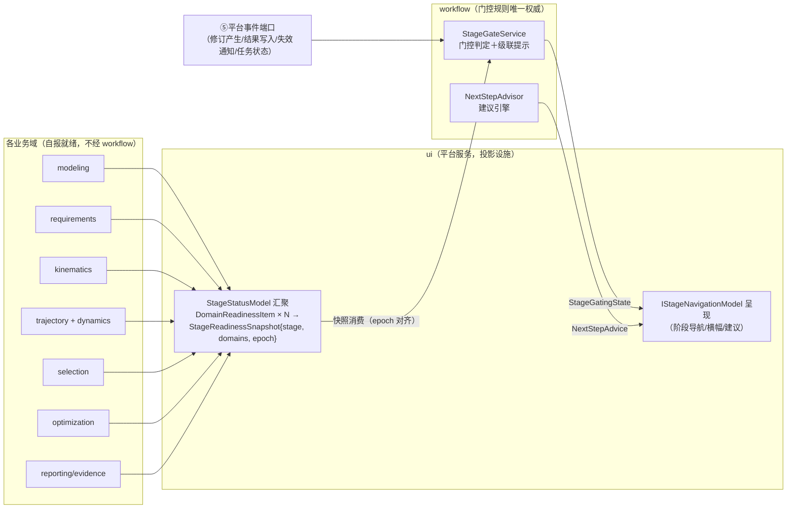
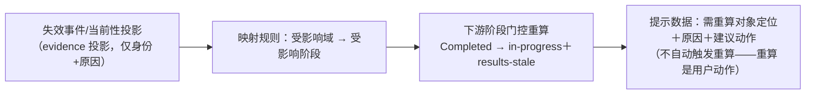
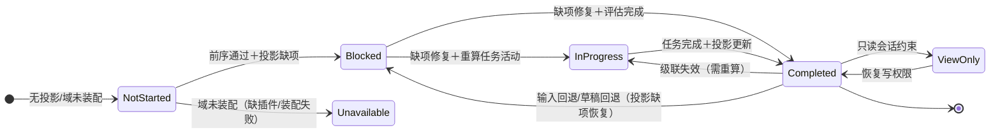
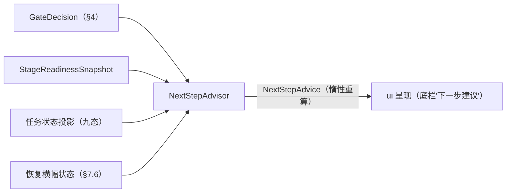
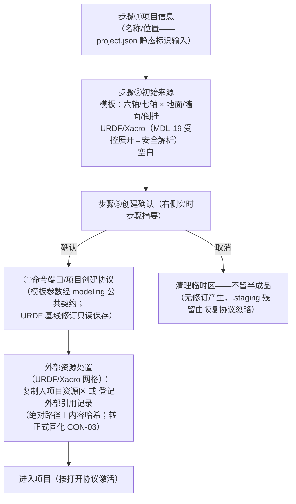
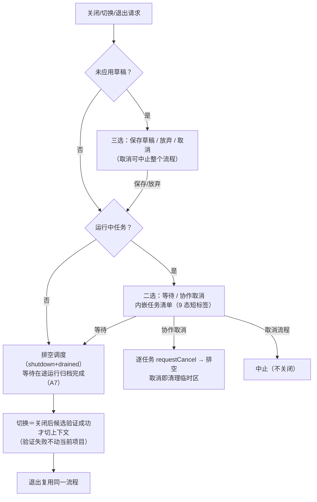
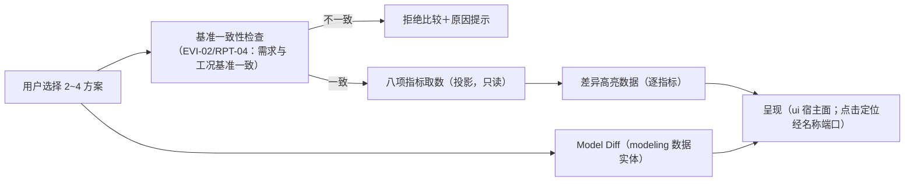

# workflow 单元详细设计（L4 业务域——编排：七阶段门控、下一步建议与生命周期入口整合）

| 字段 | 值 |
| --- | --- |
| 单元 | workflow（**L4 业务域单元·编排**——ARCHITECTURE §3.1/§3.4：消费平台事件与各域就绪状态投影，产出七阶段导航的门控状态与"下一步建议"；生命周期入口（新建/打开/另存/导入导出向导）整合于此；不直链任何业务域单元） |
| 文档版本 | v1.0（2026-10-09，WP-22-T09 实现登记——标题栏/状态栏与恢复横幅状态投影落位＋Projection.hpp 首落位〔IStatusProjectionProvider Draft 兑现＋两取数端口接缝＋纯函数组装核〕＋§10.2 v1.0 偏差登记）；v0.9（2026-10-09，WP-22-T08 实现登记——旧格式升级指引数据面/只读会话数据面/外部源重关联编排落位＋Lifecycle.hpp 三端口接缝与 OpenProjectFailure 增补字段＋§10.2 v0.9 偏差登记）；v0.8（2026-10-08，WP-22-T07 实现登记——另存为与包导出/导入编排落位＋Lifecycle.hpp 另存/包面与三执行端口接缝增补＋§10.2 v0.8 偏差登记）；v0.7（2026-10-08，WP-22-T06 实现登记——关闭/切换/退出统一确认与方案分支切换落位＋Lifecycle.hpp 关闭编排/三端口接缝增补＋§10.2 v0.7 偏差登记）；v0.6（2026-10-08，WP-22-T05 实现登记——打开向导与无项目首页落位＋Lifecycle.hpp 打开协议/最近项目/首页数据面增补＋§10.2 v0.6 偏差登记）；v0.5（2026-10-07，WP-22-T04 实现登记——新建项目三步向导落位＋Lifecycle.hpp 编排面与实现口径偏差增补）；v0.4（2026-10-07，WP-22-T03 实现登记——七阶段门控与下一步建议落位＋接口签名偏差增补）；v0.3（2026-10-06，WP-22-T02 返工第 1 轮登记增补）；v0.2（2026-10-06，落位登记）；v0.1（2026-10-06，首版草案，WP-22-T01 交付物） |
| 文档状态 | **`Draft`**（未冻结；本文只做详细设计，不自行宣布任何验收通过；本文自审不等于实现测试通过） |
| 主 WP | WP-I（WP-10、WP-22、WP-23、WP-24、WP-25——DTB §0.1 主 WP 映射；单元任务主责 **WP-22，跨阶段 A～E**：REQUIREMENTS §17 表注 RV-11） |
| 上游 | `REQUIREMENTS.md` v1.16（`Accepted`，唯一需求权威）、`ARCHITECTURE.md` v0.13（`Draft`）、`development-task-breakdown.md` v0.53（`Draft`） |
| 构建落位 | `RobWork/RobWorkStudio/src/rwslibs/industrialrobot/workflow/`（**WP-22-T02 起已落位构建骨架**：sdurws_ird_workflow STATIC＋_plugin（最小可注册实现）/_test/_contract_test 三目标；**WP-22-T03 起门控/建议业务面落位**（Types/Gate/Advice 三公共头＋三实现翻译单元＋模型/契约测试增列）；**T04~T09 Lifecycle/Projection 公共头与实现翻译单元增列**——设置/比较随 WP-22-T10~T11，见 §1.3/§3.1/§3.3） |
| 实现口径 | 从头构建（REQUIREMENTS v1.9 确立）：不继承、不恢复 `old/` 历史实现；旧 `WorkflowStageController`（四阶段锁/就绪重估）仅作功能范围对照（需求附录 A.1），扩展为七阶段等价承接，不继承其实现 |
| 任务编号 | 本卡决策 `D-WF-x`；待裁决项 `P-WF-x`；验证用例 `WF-VER-x`；诊断码前缀 `WF-`（diagnostics.md §4.5 业务域命名空间清单已登记 `WF`，码值注册归 diagnostics StableCodeRegistry；**R1 零新增码**——登记原则见 §6.5） |

> **文档地位**：本文是 workflow 单元的唯一详细设计。依据 ARCHITECTURE §3.4（编排单元定位）、§7.12（宿主融合双树边界下的阶段门控）、§7.2（六类端口）、§3.5（依赖表）与 REQUIREMENTS §18（UX-01/02/12/13）、§17（PM-01～03/05～07/10/11/14/15）、§16（RPT-01-B 报告入口协作面）与 DTB §2.23（WP-22-T01～T13），把七阶段门控规则与状态投影消费、级联失效提示、下一步建议引擎、生命周期入口流程（新建/打开/关闭切换退出/另存/包导出导入/重关联/标题栏与恢复横幅/用户设置/无项目首页）、方案比较视图与最小命令集、公共接口与验证方案写到可直接实现的深度。本文不修改 REQUIREMENTS/ARCHITECTURE/其他单元卡；发现上游冲突或待对齐项一律登记（§14），不擅自解决。
>
> **编排定位声明（先读）**：workflow 是**业务层之上的编排单元**（ARCH §3.4）——它消费事实、产出导航与建议，**不拥有任何工程判定、领域就绪计算、任务调度或磁盘写入**。各域就绪投影由各域自报、ui 的 StageStatusModel 汇聚；workflow 消费汇聚结果与平台事件计算门控；门控状态的**呈现**归 ui。凡涉及"多少算合格"的判定阈值、领域计算、修订写入，一律不在本单元（§2.4 非所有权表）。

## 目录

- §1 文档信息、输入版本与当前代码状态
- §2 需求承接、跨阶段分期与职责边界
- §3 单元组成、依赖、构建目标与实际代码状态
- §4 七阶段门控模型
- §5 状态投影消费与事件协作
- §6 下一步建议引擎
- §7 生命周期入口流程（新建/打开/关闭切换退出/另存/包/重关联/标题栏/恢复横幅/设置/无项目首页）
- §8 方案比较视图与最小命令集
- §9 execution、evidence、project、ui、io 协作
- §10 公共接口和跨单元协作
- §11 验证方案及故障注入矩阵
- §12 阶段 A～E 实现任务拆分（WP-22-T01～T13）和后续交接
- §13 需求—设计—验证追踪矩阵
- §14 设计决策、风险、待裁决项与变更记录
- §15 交付前自审、未执行声明与交付报告

---

## 1. 文档信息、输入版本与当前代码状态

### 1.1 输入文件实测台账（2026-10-06 磁盘实况）

| 输入 | 磁盘版本/状态 | 读取日期 | 与本单元的关系 |
| --- | --- | --- | --- |
| `REQUIREMENTS.md` | v1.16（2026-09-09 签署，`Accepted`） | 2026-10-06 | **唯一需求权威**：§18 UX-01（首次进入阶段指引）、UX-02（工程用语）、UX-03（失败提示字段）、UX-10（七种公共状态）、UX-12（七阶段门控）、UX-13（方案比较视图/命令面板/快捷键，M-13/V15-02）、§17 PM-01～03/05～07/10/11/14/15（生命周期主线）、PM-12（方案分支）、§16 RPT-01-B（报告章节入口协作）、§21 AT-20/21/29/12、附录 A.1（旧 WorkflowStageController 对照） |
| `ARCHITECTURE.md` | v0.13（2026-09-27，`Draft`） | 2026-10-06 | §3.1 单元总表（workflow 行）、**§3.4 workflow 单元定位（本单元架构锚）**、§3.5 依赖表、§4.3 任务状态机（9 态短标签呈现数据源）、§6.8 存储上下文与写锁（A7：关闭编排等待在途归档）、§7.1 命令与修订事件、§7.2 六类端口（①②⑤消费）、§7.11 命令面板与快捷键权威（SA-16，归 ui）、§7.12 宿主融合（SA-18：workflow 门控经宿主 Dock 形态呈现）、§10.1 阶段启用（A：生命周期原形；E：整合）、S1/S5/S7 走查 |
| `DETAILED-DESIGN.md` | 索引（workflow＝"待产出"，主 WP-I） | 2026-10-06 | 单元分类与"单元详设最低结构"要求；本卡产出后索引行刷新归治理任务，本卡不代改 |
| `development-task-breakdown.md` | v0.53（`Draft`） | 2026-10-06 | **§2.23 WP-22-T01～T13（全量任务卡）**、§3 矩阵 PM/UX 行、§4.2 O-26（碰撞检查命令三方契约待对齐）、O-32（PILOT/DEL 落点补登）、§1.2 阶段 A"WP-22 任务卡先行"、M4/M7 里程碑、§5 执行约定 |
| `traceability/unit-status.json` | workflow：`status=planned`、`designCompletion=not-written`、`implementationStatus=not-verified`、`masterWps=["WP-I"]` | 2026-10-06 | 落位状态记录（本卡产出后刷新归治理任务，本卡不代改） |
| `units/core.md` | v0.11（`Draft-Structured`） | 2026-10-06 | IDomainEventBus/IDomainEventSink/DomainEventKind 四类（§4.9/§5.8）、DiagnosticRecord、TaskState 九态词表、EngineeringStatus、EvaluationMode |
| `units/ui.md` | v1.76（2026-10-05，`Draft`） | 2026-10-06 | **StageId 七值枚举**（§10.2：Modeling→…→Reporting，UX-12 顺序冻结）、`StageViewStatus` 六值（§6.4：completed/in-progress/blocked/unavailable/not-started/view-only）、`IStageNavigationModel`（stageViews/currentStage/requestNavigate/subscribe/readinessSnapshot）、`DomainReadinessItem`/`StageReadinessSnapshot`（§6.5 落 `UiTypes.hpp`，单侧冻结）、`ICommandRegistry`/`IPluginUiRegistrar`（SA-16）、`IUiProjectionStore` 只读投影红线、**P-UI-6**（workflow 门控/关闭编排/碰撞检查命令三方契约——§6.5 数据形状为谈判起点）、UI-T18～T23 宿主融合落位 |
| `units/project.md` | v0.19（卡头；变更记录至 v0.20，`Draft`） | 2026-10-06 | §13.2 workflow 行（①命令提交协议/HandlerContext/draft 模块注册/inverse 义务）、PM 需求存储侧分工表（§2.2：PM-01 存储侧/向导 UI 归 workflow、PM-02 步骤②③⑤服务侧 API、PM-03 存储上下文排空、PM-06 升级指引数据、PM-09 重关联命令、PM-12 分支切换 UI）、StaleRevisionRejected、`ProjectMetadata`/分支切换会话语义（§4.5：切换不产生修订不写文件）、`OpenStoreResult.writable`、恢复诊断（PM-08）、DraftController 分工（N-10 草稿局部撤销归 ui＋各业务域） |
| `units/execution.md` | v0.12（`Draft`） | 2026-10-06 | **§13 交接行（逐字）**："workflow｜shutdown(DrainPolicy)/drained、恢复期 Interrupted 条目（重跑入口数据）｜关闭/切换编排、恢复横幅（PM-15）｜PM-03/08、AT-21"；`ITaskScheduler::shutdown(DrainPolicy{CancelQueuedAndWait, KeepQueuedTerminate})`/`drained()`、ITaskController（requestCancel/progress）、九态任务状态（PM-03 任务清单 9 态短标签数据源）、退出码/崩溃隔离 |
| `units/evidence.md` | v1.3（`Draft-Structured`） | 2026-10-06 | ResultCurrentness/Superseded 投影（级联失效提示的数据源：失效原因清单）、ResultArchived 事件、AnalysisSnapshot 事实（不直接消费——经各域投影） |
| `units/diagnostics.md` | v0.13（`Draft`） | 2026-10-06 | §4.5 前缀清单（`WF` 已登记）、DiagnosticEntry/DiagContext、两级日志；PM-15 恢复横幅经统一诊断目录集成（PM-15 行"诊断经统一诊断目录集成"） |
| `units/io.md` | 卡头 v0.9（变更链至 v1.0，`Draft`） | 2026-10-06 | 项目包导入校验（PM-05 导入向导的校验执行面）、IJsonWriter（用户设置持久化 PM-14）、SafePath/BudgetGuard（向导内导入通道） |
| `units/modeling.md` | v0.40（`Draft`） | 2026-10-06 | 模板创建参数化（new-from-template，UI-T63 批次——新建向导的模板来源面）、Model Diff（§9.4.9，WP-22-T11 消费）、`apply-robot-design` 命令 |
| `units/requirements.md`、`units/kinematics.md`、`units/trajectory.md`、`units/dynamics.md`、`units/drivetrain.md`、`units/selection.md`、`units/optimization.md` | 均已产出（v0.15～v1.0 不等；trajectory/dynamics/drivetrain/selection/optimization 五卡 v0.1 为**工作区未跟踪文件**，如实登记） | 2026-10-06 | 各域就绪投影的**生产者**（各域自报 readiness，经 ui StageStatusModel 汇聚）；workflow 不直链其中任何一个（ARCH §3.4/§3.2 R-1） |
| `units/reporting.md` | v0.16（`Draft`） | 2026-10-06 | 报告导出命令（UX-13 最小清单第 10 条"报告导出"的执行面）、报告预览宿主（P-UI-9 登记，详设未产出） |
| `old/` 历史资产 | 仓库根（523 文件，可读） | — | 仅功能范围对照（A.1 WorkflowStageController 行："工作流阶段向导（四阶段锁/就绪重估）→ 等价承接（扩展为七阶段）"）；不作为语义来源，不继承实现 |

**缺失文件**：`units/workflow.md`（本卡产出前不存在——本次创建）。**未发现与本单元语义直接冲突的上游内容**；发现一处上游表述张力（DTB 中 WP-10-T09 与 WP-22-T03 的前置依赖方向互指，见 §14.3 P-WF-1）与两处已登记待裁决联动（O-26、P-UI-6），均登记不擅裁。

### 1.2 上游基线核实结论

| 基线声明 | 复核结果 |
| --- | --- |
| unit-status.json：workflow＝`planned`/`not-written`/`not-verified`，masterWps＝WP-I | ✅ 与磁盘一致 |
| ARCHITECTURE §3.4 编排定位、§3.1"workflow｜业务域（编排）｜七阶段门控与状态投影、下一步建议、生命周期入口整合｜UX-12、PM-01~03/05~07/10/11、PM-17｜A~E〔WP-22 跨阶段〕" | ✅ 与磁盘一致；注意 PM-17 的**主责 WP-24**（REQUIREMENTS §17 表），workflow 不拥有（§2.4 N12） |
| workflow 代码目录仅公共头保留位 README | ✅ 与磁盘一致（§1.3） |
| DTB §2.23 WP-22-T01～T13 共 13 任务（统计行"WP-22:13"） | ✅ 与磁盘一致 |

### 1.3 workflow 代码目录磁盘实测（2026-10-06，WP-22-T02 落位后）

```text
RobWork/RobWorkStudio/src/rwslibs/industrialrobot/workflow/
├── CMakeLists.txt                              ← WP-22-T02：构建脚本（STATIC＋plugin＋两测试目标＋配置期守卫）
├── include/sdurws/ird/workflow/README.md       ← 公共头保留位（业务公共头随 T03+ 增列，不参与编译）
├── src/Workflow.cpp                            ← WP-22-T02：锚点翻译单元（空起步——NFR-MNT-04）
├── assembly/sdurws/ird/workflow/
│   └── WorkflowPluginAssembly.hpp              ← WP-22-T02：装配契约头（plugin 目标 PUBLIC 面——O-31 门面）
├── plugin/
│   ├── WorkflowUiModule.hpp/.cpp               ← WP-22-T02：ui.md §11.2 三方法最小实现（诚实空态）
│   └── WorkflowPluginAssembly.cpp              ← WP-22-T02：装配门面实现（descriptor 现产）
├── test/
│   ├── TestMainReport.cpp                      ← WP-22-T02：自有 main＋testkit 报告监听器
│   └── BuildRedLineTest.cpp                    ← WP-22-T02：产品面红线扫描四用例
└── contract_test/
    ├── ContractTestMain.cpp                    ← WP-22-T02：自有 main＋报告监听器
    ├── BuildGraphContractTest.cpp              ← WP-22-T02：构建图边界契约五用例（八边）
    └── PluginRegistrationContractTest.cpp      ← WP-22-T02：插件可注册契约三用例
```

CMake 侧：`industrialrobot/CMakeLists.txt` 的 `IRD_MODULES` 占位列表**已不含 `workflow`**（WP-22-T02 移出），以 `add_subdirectory(workflow)` 挂载真实目标：`sdurws_ird_workflow` **STATIC**（PUBLIC 链卡 §3.2 依赖白名单八边——core/ui/diagnostics/project/execution/io/evidence/reporting）、`sdurws_ird_workflow_plugin`（最小可注册实现——本单元契约 acceptance 1 明文随 T02 创建，与 kinematics"_plugin 随 T12"不同）、`sdurws_ird_workflow_test`/`sdurws_ird_workflow_contract_test`（ird_add_gtest 同款，LABELS "ird"）。业务公共头（Types/Gate/Advice/Lifecycle/Settings/Comparison/Projection——§3.1 布局表）与其实现**尚未落位**，随 WP-22-T03~T12 增列；门控/建议/生命周期业务实现**无**——单元验证状态仍以任务验收证据为准（unit-status.json 刷新归治理任务）。

---

## 2. 需求承接、跨阶段分期与职责边界

### 2.1 需求承接总表

| 需求 | P/发布 | 本卡承接章节 | 承接要点 |
| --- | --- | --- | --- |
| UX-01 首次进入阶段指引 | P0，B～E，R1 | §6.2 | 目标、必需输入、当前问题和下一步操作四要素，由下一步建议引擎产出、ui 呈现 |
| UX-02 工程用语 | P0，B～E，R1 | §6.2/§6.4/§8.3 | 建议与提示文案键全部走工程用语；不显示哈希/Schema/内部插件名（呈现侧同 ui 红线） |
| UX-03 失败提示字段 | P0，B～E，R1 | §7 各流程失败路径 | 对象/上下文、原因、建议动作；比较型含实际/要求/单位；取消非错误 |
| UX-10 七种公共状态 | P0，A，R1 | §4.4/§7.9 | 门控状态词与 ui StageViewStatus 词表对齐（不发明第八种状态） |
| UX-12 七阶段门控 | P0，B，R1 | §4 | 七阶段导航按就绪条件解锁/锁定；上游完成态或结果失效时级联提示下游需重算或失效（**门控规则唯一权威在本单元**；阶段状态投影属 ui） |
| UX-13 方案比较视图/命令面板/快捷键 | P1，C，R1 | §8 | 2～4 方案八项指标差异高亮＋Model Diff 呈现（数据实体归 MDL-08）；最小命令集注册（≥10 条＋工业高频）；快捷键经 ui 唯一注册点（SA-16） |
| PM-01 新建三步向导 | P0，B，R1 | §7.1 | 向导 UI＋实时摘要；取消/失败不留半成品；URDF 基线修订＋外部引用记录 |
| PM-02 打开五步协议 | P0，B，R1 | §7.2 | 五步协议 UI（命令行/拖放/对话框格式识别）；失败显示具体文件且不动当前项目 |
| PM-03 关闭/切换/退出统一确认 | P0，A，R1 | §7.3 | 草稿三选＋任务二选＋9 态任务清单；切换＝关闭后候选验证；等待选项覆盖在途归档（A7） |
| PM-05 另存为/包导出导入 | P0，B，R1 | §7.4 | 另存向导（勾选记忆默认）；包导出/导入后台进度可取消、取消清理临时区 |
| PM-06 旧格式稳定拒绝 | P0，B，R1 | §7.5 | 只读拒绝＋诊断码＋升级指引（不自动升级）；升级工具入口 UI 归本单元 |
| PM-07 只读打开 | P0，B，R1 | §7.5 | 锁被持提示 PID；writable=false 禁编辑与应用提交；第二写者不阻塞等待 |
| PM-09 外部源重关联 | P0，B，R1 | §7.5 | 重关联入口＋显式提交产生新修订 |
| PM-10 无项目首页 | P0，B，R1 | §7.8 | 新建/打开/最近三入口；最近项目 10 上限/去重/失效提示；无项目禁用七阶段/运行/应用/报告入口 |
| PM-11 标题栏/状态栏 | P0，B，R1 | §7.6 | `<显示名>[*][（只读）]`＋当前方案＋结果状态；PM-11-S1～S3 为 R2 子项 |
| PM-14 用户设置持久化 | P0，B，R1 | §7.7 | 最近项目/导出勾选/上次目录/快捷键绑定（用户级，不入 .rwdesign）；求解配置独立不混入 |
| PM-15 恢复横幅 | P0，B，R1 | §7.6 | 一句话汇总＋查看详情/恢复草稿/放弃；三场景；经统一诊断目录集成 |
| PM-12 方案分支 | P0，A，R1 | §7.3/§8 | 分支切换 UI（会话选择不产生修订）；PM-12-S1 修订历史浏览为 R2 子项（project 数据） |
| PM-17 启动与异常诊断 | P1，A，R1 | §2.4 N12 | **不归本单元**（主责 WP-24）；本单元仅消费恢复诊断呈现横幅（PM-15） |
| RPT-01-B 报告入口 | P0，B，R1 | §8.3 | "报告导出"命令的注册与编排（渲染归 reporting） |
| TASK-01/03（呈现面） | — | §5.4 | 任务清单 9 态短标签数据源（PM-03）；迟到结果绝不成为当前会话结果（消费 execution 交接行语义） |

### 2.2 跨阶段分期（A～E；RV-11 跨阶段表注）

| 阶段 | workflow 交付（DTB 口径） | 任务 |
| --- | --- | --- |
| A（平台） | **任务卡先行**（本卡）＋生命周期原形条款（ARCH §10.1"workflow 生命周期原形"） | WP-22-T01（本卡） |
| B（业务链一） | 生命周期入口落地：新建/打开/关闭切换退出/另存/包/重关联/标题栏/恢复横幅/设置/无项目首页；七阶段门控与建议（阶段 B 起可验） | WP-22-T02～T10、T12 |
| C（业务链二） | 方案比较视图（八项指标需阶段 C 各域指标可算）＋报告导出命令联调 | WP-22-T11 |
| E（整合交付） | 生命周期入口整合收口（最终入口整合 WP-22/宿主融合收口衔接）、契约测试主线 | WP-22-T13（＋WP-24-T08/T09 退役衔接） |

R2 子项边界（不新增架构机制，PA-7）：PM-11-S1～S3（项目属性/改名/体积——改名经命令产生新修订）、PM-12-S1（修订历史只读浏览——读 project 修订清单）、PM-04-S1/PM-08-S1（project/ui 侧）；域 R2 能力（MDL-18/21、KIN-09～11、SEL-09-S1/MDL-12-S1、TRJ-08-S1～S3、OPT-D）启用后门控条件随各域投影自然扩展，workflow 门控规则**不硬编码阶段内域能力清单**（§4.3 D-WF-5）。

### 2.3 workflow 拥有

| # | 所有权 | 依据 |
| --- | --- | --- |
| O1 | 七阶段门控规则（阶段解锁/锁定判定、门控状态计算） | ARCH §3.4；ui N-"投影只消费，不拥有门控规则（归 workflow）"（DTB WP-10-T09 禁止项） |
| O2 | 级联失效提示数据（上游失效→下游提示的映射规则） | UX-12 |
| O3 | 下一步建议引擎（建议规则与产出） | UX-01、ARCH §3.4 |
| O4 | 生命周期入口流程编排（新建/打开/关闭切换退出/另存/包导出导入/重关联的向导状态机与流程编排） | ARCH §3.4；project.md §2.2 分工表（向导 UI 归 workflow） |
| O5 | 无项目首页编排与最近项目管理（上限/去重/失效项处置规则） | PM-10 |
| O6 | 用户级设置持久化（最近项目/导出勾选/上次目录/快捷键绑定——PM-14；**快捷键绑定数据归 ui 权威设施的存储面**，见 §7.7） | PM-14 |
| O7 | 方案比较视图的编排（方案选择、八项指标取数编排、Model Diff 消费与呈现组装；不拥有 diff 数据实体） | UX-13/V15-02（M-5 分工：数据实体归 MDL-08） |
| O8 | 最小命令集与工业高频命令的注册编排（命令项定义与回调装配；命令注册表与快捷键权威归 ui） | UX-13（F5/M-13）、SA-16 |
| O9 | 恢复横幅与标题栏/状态栏的**状态数据编排**（一句话汇总、标题字段取值规则；呈现归 ui） | PM-11/15 |
| O10 | 关闭/切换/退出的流程决策（三选/二选/等待在途归档的编排；存储上下文语义归 project） | PM-03、ARCH §6.8 A7 |

### 2.4 workflow 不拥有（越权即 review 打回）

| # | 非所有权 | 真值所有者 |
| --- | --- | --- |
| N1 | 任何领域就绪的**计算**（各域是否就绪由各域自报投影） | 各业务域＋ui StageStatusModel 汇聚 |
| N2 | 命令注册表与全局快捷键权威、阶段状态机呈现、五区布局 | ui（SA-16、ARCH §7.11/§7.12） |
| N3 | 修订/分支/事务/磁盘写入/存储上下文与写锁 | project（SA-03/09/17） |
| N4 | 任务状态机、调度、worker、取消执行 | execution（workflow 仅编排用户决策并调用控制接口） |
| N5 | 模板内容、URDF/Xacro 解析、领域校验 | modeling/io/各域处理器 |
| N6 | 诊断设施（注册表/目录/两级日志）与 PM-17 启动异常诊断 | diagnostics / WP-24 |
| N7 | Model Diff 数据实体与语义 | modeling（MDL-08，M-5 分工） |
| N8 | CSV/JSON 底层解析、包格式校验 | io |
| N9 | 工程判定阈值、领域计算、结果当前性 | policy/各域/evidence |
| N10 | 未经批准的新状态词、命令入口设施、阶段枚举 | 一律不发明——StageId/StageViewStatus 词表归 ui，本卡零新增枚举词表（SA-12） |

---

## 3. 单元组成、依赖、构建目标与实际代码状态

### 3.1 目标形态（WP-22-T02 已落位构建骨架；业务公共头与其实现随 T03~T12 增列——§1.3 实测）

```text
workflow/
├── CMakeLists.txt                    ← WP-22-T02 落位：INTERFACE 占位升级为真实库（STATIC）；T03 增列 src 三翻译单元＋两测试目标用例源
├── include/sdurws/ird/workflow/      ← 公共头（R-2：跨单元只允许消费这些头）
│   ├── Types.hpp                     ← 门控/建议/流程词表（复用 ui StageId——零新增枚举）〔WP-22-T03 已落位〕
│   ├── Gate.hpp                      ← StageGatingState/级联提示数据（O1/O2）〔WP-22-T03 已落位〕
│   ├── Advice.hpp                    ← NextStepAdvice 与建议词表（O3）〔WP-22-T03 已落位〕
│   ├── Lifecycle.hpp                 ← 向导流程状态机与流程编排接口（O4/O5/O10）〔WP-22-T04 落位新建向导子集（步骤/来源/处置词表＋校验＋实时摘要＋IDomainInitSubmitter 端口＋NewProjectWizardFlow 编排）；WP-22-T05 落位打开协议＋最近项目＋无项目首页子集（OpenSource/OpenTargetKind 词表＋classifyOpenTarget 分流＋OpenProjectFailure/Outcome＋OpenProjectFlow::run 编排＋RecentProjectEntry/IRecentProjectsService/RecentProjectsService＋首页数据面 buildNoProjectHomeScreen）；WP-22-T06 落位关闭/切换/退出统一确认＋方案分支切换子集（CloseKind/三选/二选词表＋CloseDialogData＋9 态短标签＋ICloseDecisionPort/ICloseDraftPort/ICloseDrainPort 三端口＋CloseFlow::run 编排＋SchemeBranchSwitchFlow::run 零写入会话选择）；WP-22-T07 落位另存为/包导出/包导入子集（PackageSelectionFlags 勾选词表＋defaultSelectionOf 记忆默认＋IFlowCancelToken/FlowProgressStage 流程基面＋ISaveAsPort/IPackageExportPort/IPackageImportPort 三执行端口接缝＋SaveAsFlow/PackageExportFlow/PackageImportFlow 编排＋buildPackageImportReportView 校验报告行集）；WP-22-T08 落位 §7.5 三流程子集（UpgradeGuidance 升级指引数据＋parseUpgradeGuidance＋OpenProjectFailure.upgradeGuidance 增补字段＋ReadOnlySessionNotice 只读会话数据＋buildReadOnlySessionNotice＋ExternalSourceState/Status 与 RelinkRequest/Failure/Outcome 值面＋IRelinkDecisionPort/IExternalRelinkPort 双端口接缝＋RelinkFlow::run 编排——startRelinkFlow 可测编排核）；基线虚类 ILifecycleFlowController 仍不声明（v0.9 收口性登记——§10.2〕〕
│   ├── Settings.hpp                  ← 用户设置 schema 与存取（O6）〔WP-22-T10〕
│   ├── Comparison.hpp                ← 方案比较编排（O7）〔WP-22-T11〕
│   └── Projection.hpp               ← 横幅/标题栏状态数据（O9）〔WP-22-T09 已落位：IStatusProjectionProvider/TitleStatusData/RecoveryBannerData＋两取数端口接缝 ITitleFactPort/IRecoveryFactPort＋纯函数组装核 buildTitleText/resultsStatusLabelKey/buildTitleStatus/buildRecoveryBanner＋RecoveryScenario 会话态词表＋StatusProjectionProvider 端口组合实现——§10.2 v1.0 偏差登记段〕
├── src/                              ← 计算库实现（零 Qt；门控/建议为纯函数面）
│   ├── Workflow.cpp                  ← T02 锚点翻译单元（增列路线注释）
│   ├── Types.cpp                     ← T03：域↔阶段映射表＋文案键唯一构造点（§4.2/§6.2）
│   ├── Gate.cpp                      ← T03：门控判定（§4.4 重放）＋级联失效映射（§4.3）
│   ├── Advice.cpp                    ← T03：建议八规则（§6.3——UX-01 四要素）
│   └── Lifecycle.cpp                 ← T04：新建三步向导（§7.1——校验/摘要/领域初始化端口/创建编排）；T05：打开协议编排＋最近项目服务＋无项目首页数据面（§7.2/§7.8）；T06：关闭/切换/退出统一确认编排＋方案分支切换（§7.3——三端口接缝/A7 排空轮询/候选验证先行）；T07：另存为/包导出/包导入编排（§7.4——勾选记忆默认/复制与校验执行端口/取消清理观测位/校验报告行集）；T08：升级指引提取＋只读会话组装＋重关联编排（§7.5——detail 三键提取/只读会话数据面/RelinkFlow::run 检测→确认→提交编排）
│   ├── Projection.cpp                ← T09：标题栏/状态栏与恢复横幅状态投影（§7.6——场景键映射/标题冻结格式组装/结果状态选键 P-UI-2/三场景择一与动作可用位/O9 服务端口组合）
├── plugin/                           ← sdurws_ird_workflow_plugin〔T02＝最小可注册实现；Qt Widgets 界面：向导/首页/比较视图/确认对话框随 T04~T12〕
├── test/                             ← sdurws_ird_workflow_test〔T02＝红线扫描四用例；T03 增列 GateAdviceTest.cpp；T04 增列 LifecycleTest.cpp；T05 增列 OpenWizardHomeTest.cpp——PM-02 分流/PM-10 最近项目与首页数据面模型测试；T06 增列 CloseFlowTest.cpp——PM-03 统一确认全分支/9 态短标签/取消中止＋PM-12 编排面模型测试；T07 增列 SaveAsPackageTest.cpp——PM-05 记忆默认/取消清理观测位/失败呈现/校验报告行集模型测试；T08 增列 ReconnectReadOnlyTest.cpp——PM-06 指引三键提取/PM-07 只读会话数据面/PM-09 重关联编排核全分支模型测试；T09 增列 StatusProjectionTest.cpp——WF-VER-217 标题格式全组合/PM-11 来源透传/PM-15 三场景择一与动作可用位/接口消费路径钉扎模型测试〕
└── contract_test/                    ← sdurws_ird_workflow_contract_test〔T02＝构建图边界＋插件可注册契约；T03 增列 GateContractTest.cpp；T04 增列 NewProjectWizardContractTest.cpp；T05 增列 OpenWizardContractTest.cpp——WF-VER-205/206 真实落盘契约；T06 增列 CloseFlowContractTest.cpp——WF-VER-209~212 真实落盘契约；T07 增列 SaveAsPackageContractTest.cpp——WF-VER-213~215 真实落盘契约（与 project 真实存储＋io 真实包设施联合）；T08 增列 ReconnectReadOnlyContractTest.cpp——WF-VER-207/208/216 真实落盘契约（与 project 真实存储/lock 文件/命令端口联合——篡改 schemaVersion 稳定拒绝＋Win32 独占句柄降级＋真实命令端口显式提交）；T09 增列 StatusBannerContractTest.cpp——WF-VER-217/218 真实落盘契约（与 project 真实存储/execution 真实 T14 重建/diagnostics 真实目录四方联合——三场景盘面注入＋恢复扫描真实产出＋目录真链折叠＋只读降级标题后缀与放弃门联动）〕
（另：assembly/sdurws/ird/workflow/WorkflowPluginAssembly.hpp——T02 落位的装配契约头，plugin 目标 PUBLIC 面）
```

### 3.2 构建目标与依赖红线

| 目标 | 层/形态 | Qt | 说明 |
| --- | --- | --- | --- |
| `sdurws_ird_workflow` | L4 计算库（STATIC） | **零 Qt**（R-3） | WP-22-T02 升级落位；别名 `RWS::ird::workflow`；C++17 显式 `CXX_STANDARD 17` |
| `sdurws_ird_workflow_plugin` | L4 插件界面 | Qt Widgets | WP-22-T02~T12 落位；向导/首页/比较视图/确认对话框宿主面（宿主融合 SA-18 下经 IPluginUiRegistrar/宿主 Dock 形态装配） |
| `sdurws_ird_workflow_test` | 模型测试 | 无 | 门控/建议纯函数面直调（NFR-MNT-01） |
| `sdurws_ird_workflow_contract_test` | 契约测试 | 无 | 与 ui/project/execution/io 联合（AT-20/21/29 主线） |
| worker 目标 | **不建** | — | workflow 无进程外计算需求 |

**依赖白名单**：`sdurws_ird_workflow` 允许链接 core/ui/diagnostics/project/execution/io/evidence/reporting 的公共接口（L4→L2/L3）；**禁止链接任何业务域单元计算库**（modeling/requirements/kinematics/trajectory/dynamics/selection/optimization——ARCH §3.4"不直链任何业务域单元，只经端口与事件协作"；R-1 门禁）。就绪事实只经 ui StageStatusModel 投影与⑤事件端口进入本单元；模板/导入等领域能力只经①命令端口与各域公共数据契约触达。**ui 依赖方向说明**：workflow→ui 是 L4→L3 接口依赖（消费 `UiTypes.hpp`/`ICommandRegistry`/`IUiProjectionStore` 公共头），与 ui→workflow 的"门控规则归 workflow"语义不冲突——ui 拥有投影设施与呈现，workflow 拥有门控规则（P-UI-6 三方契约的落地形态，§5.1）。

### 3.3 与磁盘实况的差异清单（2026-10-09，WP-22-T09 落位后）

1. 已实现文件：构建骨架（T02）＋门控/建议业务面（T03）＋新建向导业务面（T04）＋打开协议/最近项目/无项目首页业务面（T05）＋关闭/切换/退出统一确认＋方案分支切换业务面（T06）＋另存为/包导出/包导入业务面（T07）＋旧格式升级指引数据面/只读会话数据面/外部源重关联编排业务面（T08）＋**标题栏/状态栏与恢复横幅状态投影业务面（T09）**：Types/Gate/Advice/Lifecycle/Projection 五公共头＋Types/Gate/Advice/Lifecycle/Projection 五实现翻译单元＋test/GateAdviceTest.cpp（16 用例）＋test/LifecycleTest.cpp（13 用例）＋test/OpenWizardHomeTest.cpp（15 用例）＋test/CloseFlowTest.cpp（21 用例）＋test/SaveAsPackageTest.cpp（24 用例）＋test/ReconnectReadOnlyTest.cpp（WfReconnect 14 用例）＋test/StatusProjectionTest.cpp（WfProjection 16 用例）＋contract_test/GateContractTest.cpp（4 用例）＋contract_test/NewProjectWizardContractTest.cpp（8 用例）＋contract_test/OpenWizardContractTest.cpp（3 用例）＋contract_test/CloseFlowContractTest.cpp（7 用例）＋contract_test/SaveAsPackageContractTest.cpp（6 用例）＋contract_test/ReconnectReadOnlyContractTest.cpp（ReconnectReadOnlyContract 7 用例）＋contract_test/StatusBannerContractTest.cpp（StatusBannerContract 3 用例）；设置/比较/命令集业务面仍随 T10~T12。2. 代码占位：无占位目标（INTERFACE 占位已升级 STATIC）。3. 公共头：README 保留位仍在；Types/Gate/Advice/Lifecycle/Projection 已落位，Settings/Comparison 随 T10~T11 增列。4. CMake 目标：四目标不变；`sdurws_ird_workflow` 源码集 src/Lifecycle.cpp＋src/Projection.cpp（T09 增列）、两测试目标各增列至七用例源。5. 测试/契约测试（计数以 wp-22-t09 批次 gtest 实测为准，F-543 同型漂移自查）：`sdurws_ird_workflow_test` 124 用例（红线扫描 4＋门控/建议 17＋新建向导模型 13＋打开分流/最近项目/首页模型 15＋关闭/切换/退出模型 21＋另存/包模型 24＋重关联/指引/只读模型 14＋标题栏/横幅投影模型 16）、`sdurws_ird_workflow_contract_test` 46 用例（构建图 5＋插件注册 3＋门控契约 4＋新建向导契约 8＋打开契约 3＋关闭契约 7＋另存/包契约 6＋重关联/指引/只读契约 7＋标题栏/横幅契约 3）＝**170 用例**；T09 批次增列 19（模型 16＋契约 3），其余为 T02~T08 既有存量（零回归——46 契约含存量 43）；执行留痕见 traceability/gtest-reports/wp-22-t03/（T03）、wp22-t04/（T04）、wp22-t05/（T05）、wp-22-t06/（T06）、wp-22-t07/（T07）、wp-22-t08/（T08）与 wp-22-t09/（T09——集成 124/124＋46/46、冒烟同计数；gtest XML×4＋ird-test-report×4）＋traceability/builds/wp-22-t09/（双模式构建/运行日志＋ird_gates 直跑日志）。6. 缺失目录：无。7. 与 unit-status.json 差异：实现状态已超前于 `not-verified` 记录（门控/建议/新建向导/打开协议/最近项目/首页数据面/关闭切换退出统一确认/方案分支切换/另存为与包导出导入/旧格式升级指引与只读会话数据面及外部源重关联编排/标题栏状态栏与恢复横幅状态投影已实现、模型/契约测试已执行——记录刷新归治理任务）。
   注（分套计数，gtest XML 实测）：模型 124＝WfBuildRedLine 4＋WfGate 10＋WfAdvice 6＋WfTypes 1＋WfLifecycle 13＋WfOpenWizard 6＋WfRecent 6＋WfHome 3＋WfClose 21＋WfSaveAsPackage 24＋WfReconnect 14＋WfProjection 16；契约 46＝WfBuildGraph 5＋WfPluginRegistration 3＋WfGateContract 4＋NewProjectWizardContract 8＋OpenWizardContract 3＋CloseFlowContract 7＋SaveAsPackageContract 6＋ReconnectReadOnlyContract 7＋StatusBannerContract 3。

### 3.4 单元详设最低结构对照（DETAILED-DESIGN.md 要求）

职责与非职责（§2.3/§2.4）✅；输入输出契约（§5/§7/§10）✅；公共接口（§10）✅；数据模型（§4/§6/§7）✅；状态机（§4.4/§7 流程状态机）✅；错误与诊断（§6.5/§7 失败路径）✅；依赖（§3.2）✅；单元测试（§11）✅；与主 WP 的任务映射（§12）✅；开放问题（§14）✅。

---

## 4. 七阶段门控模型

### 4.1 阶段定义与数据流（ARCH §3.4 锚定）



**数据流契约（D-WF-1）**：各域就绪**自报**（各域计算自身 readiness）→ ui `StageStatusModel` **汇聚**（不判定）→ workflow **判定门控**（消费快照＋事件，不重算领域就绪）→ ui **呈现**（`IStageNavigationModel`/横幅/建议）。四段职责互斥：任何一段代替另一段判定即违反 ARCH §3.4 与 ui 投影红线。

### 4.2 阶段—域映射与就绪数据源

| StageId（ui 词表） | 聚合域投影（DomainReadinessItem.domainKey） | 阶段就绪条件（门控规则输入，全部来自投影——workflow 不重算） |
| --- | --- | --- |
| `Modeling` | `modeling` | 建模域就绪投影 inputComplete 且无 blocking 缺项（模板/导入通道可用） |
| `Requirements` | `requirements` | 建模阶段门控通过（前序链）＋需求域投影就绪 |
| `Kinematics` | `kinematics` | 前序链通过＋运动学域投影就绪 |
| `TrajectoryDynamics` | `trajectory`、`dynamics` | 前序链通过＋两域投影就绪（聚合判定：两域均就绪才解锁；任一未就绪给缺项清单） |
| `Selection` | `selection` | 前序链通过＋选型域投影就绪（drivetrain 为 L2 共享服务，不单独投影——其可用性经 selection 域投影呈现） |
| `Optimization` | `optimization` | 前序链通过＋优化域投影就绪 |
| `Reporting` | `reporting` | 前序链通过＋报告域投影就绪 |

**门控规则要点（I-WF-1～4）**：

- **I-WF-1 前序链**：阶段 N 解锁要求阶段 1..N-1 全部处于非 Blocked 门控状态（顺序即 UX-12 冻结的七阶段顺序；阶段内能力不改变顺序）。
- **I-WF-2 不重算**：门控判定只消费 `DomainReadinessItem{domainKey, verdict(core::EngineeringStatus), inputComplete, missingItemKeys, hasActiveTask}` 与事件流——workflow 不调用任何领域服务、不读领域对象、不推导工程含义（N1）。
- **I-WF-3 判定零领域阈值**：门控不含"多少算合格"的数值判定；一切合格性已在各域投影与 policy 中判定（PA-1/NFR-MNT-07）。
- **I-WF-4 epoch 一致性**：门控判定绑定 `StageReadinessSnapshot.epoch`；事件触发的重判定必须基于不小于上次 epoch 的快照（防止旧投影覆盖新事件，§5.3）。

### 4.3 门控状态与级联失效提示

**门控状态词表（零新增）**：复用 ui `StageViewStatus` 六值——`NotStarted`（前序未过且本域无投影）/`Blocked`（前序已过但本域缺项未满足，附缺项清单＋"重新计算"入口数据）/`InProgress`（有活动任务 hasActiveTask）/`Completed`/`ViewOnly`（只读项目等会话约束投影）/`Unavailable`（域未装配）。workflow 产出 `GateDecision{stage, status, reasonKeys[], unlockHintKey, missingItemKeys[], staleHints[], epoch}`——status 枚举与 reasonKeys/unlockHintKey token 词表**归 ui 公共头**（P-UI-6 谈判起点；本卡不新增枚举）。

**级联失效提示（UX-12）**：失效事件（`DependencyInvalidated`，仅身份）与当前性投影（Superseded 计数＋原因清单）到达时——



- 映射规则（D-WF-2）：域→阶段多对一（§4.2 表）；上游域失效 ⇒ 本阶段门控降级为 `InProgress`（若重算任务活动）或 `Completed＋results-stale` 并存呈现（ui §6.4 口径：历史面板可打开）。
- 提示数据只含定位（domainKey/objectKey 经⑥名称端口呈现局部名）、原因（失效原因 token 来自 evidence 词表）、建议动作（actionKey）；**不自动派发重算任务**（计算是用户动作——与"重新计算"命令入口衔接，ARCH §6.4 ui 行）。
- 失效传播的**范围判定归 evidence**（按切片计算）——workflow 只做"域→阶段"的导航映射，不复制失效计算（N9）。

### 4.4 门控状态机（阶段门控视角）



状态转移由事件驱动（§5.3 时序）；全部转移可从"投影＋事件"重放推导（门控是纯函数面——同输入同输出，NFR-COR-02 同型确定性）。

---

## 5. 状态投影消费与事件协作

### 5.1 投影消费纪律（ui 投影红线承接）

- workflow 消费 ui `IUiProjectionStore`/`StageStatusModel` 的**只读投影**（`snapshot()` 单次一致快照值拷贝＋`epoch()`）；**不回写任何权威对象**、不由快照数据"计算"当前性/工程判定（ui §10.6 红线的消费侧重申）；局部名呈现一律经⑥名称端口/`IRuntimeNameResolver`（UX-02：不显示哈希/Schema/插件名）。
- 三方契约（P-UI-6）落位形态：以 ui §6.5 数据形状（`DomainReadinessItem`/`StageReadinessSnapshot`）为谈判起点冻结——workflow 是该数据形状的**消费方与门控规则所有者**；契约变更经 ui/workflow 两卡增量修订同步（§14.3 P-WF-2）。

### 5.2 事件消费面（⑤端口）

| 事件（core DomainEventKind 词表，仅身份） | workflow 处置 |
| --- | --- |
| `RevisionCommitted{project, branch, revision, parent}` | 门控重判定触发（修订前进可能改变各域就绪）；标题栏未保存标记刷新数据 |
| `DependencyInvalidated{…同修订}` | 级联失效映射（§4.3）；失效范围判定归 evidence，本单元只消费"受影响域"投影更新 |
| 结果写入/归档事件（`ResultArchived` 等） | 阶段 `InProgress→Completed` 判定输入；任务清单刷新 |
| 任务状态事件（九态转移） | PM-03 任务清单 9 态短标签数据、`hasActiveTask` 投影、退出确认二选清单 |

事件**不携带数据**（core D-09）——workflow 收到事件后经投影快照取数（epoch 对齐），绝不从事件载荷推断领域状态。

### 5.3 刷新时序（一致性规则）

1. 事件到达 → 入队（FIFO，同发布者序——core 事件契约）；
2. 取最新 `StageReadinessSnapshot`（epoch ≥ 上次判定 epoch，否则丢弃本次重判定——旧投影不覆盖新事实，I-WF-4）；
3. 重算受影响阶段的 `GateDecision`（其余阶段缓存沿用，epoch 不变）；
4. 经 ui 订阅接口通知呈现（`IStageViewObserver` 语义对端）；
5. 建议引擎惰性重算（仅当前阶段 advice，§6.3）。

**不阻塞规则**：门控重判定为轻量纯函数（<1 s 内联门槛，NFR-PERF-01）；事件风暴（批量修订/失效）合并去抖（同一 epoch 只判一次）。

### 5.4 与 execution 的关闭/切换协作（execution §13 交接行承接）

- 关闭/切换/退出编排调用 `ITaskScheduler::shutdown(DrainPolicy)` 与 `drained()`：**等待**选项＝`CancelQueuedAndWait`（在途运行归档完成后存储上下文释放——ARCH §6.8 A7）；**协作取消**选项＝逐任务 `requestCancel` 后再排空。
- 恢复期 `Interrupted` 任务条目（重跑入口数据）由 execution 提供 → 恢复横幅（PM-15"任务已中断"场景）与"已中断"呈现（NFR-REL-03：不伪装完整结果）。
- 迟到结果语义（TASK-03/PM-13）在呈现面承接：切换项目后旧任务结果**绝不进入当前会话**——workflow 的会话上下文切换以"候选验证成功"为切换点（PM-03），切换后旧投影 epoch 全部失效重建。

---

## 6. 下一步建议引擎

### 6.1 建议定位与边界

下一步建议（UX-01/ARCH §3.4"下一步建议"）是**导航性建议**，不是工程判定：它回答"当前阶段该做什么、缺什么、去哪修"，不回答"结果是否合格"。建议规则只消费门控状态、缺项清单、任务状态与投影事实——零领域阈值、零工程判定（I-WF-3）。

### 6.2 UX-01 四要素映射

| 要素 | 数据来源 | 产出 |
| --- | --- | --- |
| 目标 | 阶段目标文案键（stage→goalKey 静态词表，工程用语） | `goalKey` |
| 必需输入 | 投影 `missingItemKeys`（各域自报缺项） | `missingItemKeys[]`（透传＋分组） |
| 当前问题 | 门控 `reasonKeys`＋失效提示 `staleHints`＋诊断目录当前阶段条目 | `problemKeys[]` |
| 下一步操作 | 建议规则（§6.3） | `NextStepAdvice{actionKey, targetStage, targetObjectId?, titleKey, detailKeys[]}` |

### 6.3 建议规则词表（首版；actionKey token 归本卡词表，UI 文案键归 diagnostics 文案体系）

| 规则 | 触发条件（全部来自投影/门控） | 建议产出（actionKey） |
| --- | --- | --- |
| R1 补全输入 | 当前阶段 `Blocked` 且缺项非空 | `fix-inputs`（附缺项分组与对象定位） |
| R2 发起计算 | 当前阶段输入齐备、无活动任务、结果缺失 | `run-evaluation`（目标 stage） |
| R3 等待/查看任务 | `hasActiveTask==true` | `review-active-task`（任务清单入口数据） |
| R4 复算下游 | 级联失效（results-stale） | `recompute-downstream`（受影响阶段与对象定位） |
| R5 处理阻塞诊断 | 当前阶段存在阻塞级诊断（Preflight/就绪校验） | `resolve-findings`（诊断目录定位） |
| R6 前进下一阶段 | 当前阶段 `Completed` 且下一阶段 `NotStarted` | `advance-stage`（下一 StageId） |
| R7 处理恢复项 | 恢复横幅场景存在（未保存草稿/中断任务） | `recover-session`（横幅动作对齐） |
| R8 只读提示 | `ViewOnly` 会话 | `readonly-notice`（解锁条件提示 unlockHintKey） |

- 规则优先级：R7 > R5 > R1 > R4 > R3 > R2 > R8 > R6（恢复与阻塞优先于前进）；同优先级多条时按 stage 顺序与对象键字典序稳定输出（确定性）。
- 建议**可跳过**：advice 是提示不是门禁；用户可忽略并经命令面板/导航自由操作（可达性兜底——UX-13 面板模糊搜索同源原则）。
- 建议不自动执行任何动作（点击建议＝导航/打开对应入口，执行仍经命令与用户确认——UX-07/PM 流程不旁路）。

### 6.4 建议引擎数据流



### 6.5 诊断码登记原则（WF- 前缀；R1 零新增）

- 本单元 R1 **不新增稳定诊断码**：错误呈现全部复用对端码（project `PRJ-*`、io `IO-*`、execution `EX-*`、domain 码透传）＋ ui reasonKeys/unlockHintKey token 词表（会话级导航语义，非持久化诊断）——符合 diagnostics §4.5"不预建无消费者条目"原则（modeling 卡同型先例）。
- `WF` 前缀已在 diagnostics §4.5 业务域命名空间清单登记（所有权声明）；**若**后续流程编排出现需要持久化留痕的自有错误（如向导流程状态损坏），按 §4.5 协议（装配期、ownerUnit=`workflow`、§4.6 表尾追加）登记——登记前不得以异常文本临时生成码（工厂拒绝）。

---

## 7. 生命周期入口流程

> 本章各流程的**编排与向导 UI** 归 workflow；存储语义归 project、校验执行归 io/project、领域校验归各域处理器（project.md §2.2 分工表逐行承接）。全部流程的共同失败语义（UX-03）：失败提示含对象/上下文、原因、建议动作；取消不是错误（不产生错误诊断）；任何失败不损坏当前项目状态。

### 7.1 新建项目三步向导（PM-01）



- 三步结构与"右侧实时步骤摘要"为 UX 承载（PM-01）；模板数值边界来自 modeling 模板参数化（**七轴模板数值 P-03 未冻结——模板启用前完成**，向导不预填数值）。
- 取消/失败不留半成品（AT-20）：向导取消＝丢弃未提交草稿与临时区；创建命令失败＝project 保证无修订（七步事务），向导呈现错误并保留输入供重试。
- URDF 项目：以不可修改基线修订保存（PM-12/PM-01）；外部资源二选一处置在步骤②内完成；未固化外部引用在 Verified/正式报告前阻断（CON-03——呈现归本单元横幅/缺项提示，阻断判定归 evidence/project）。

> **v0.5 落位注记（WP-22-T04）**：本章流程的**可测编排核**已落位 `include/sdurws/ird/workflow/Lifecycle.hpp`＋`src/Lifecycle.cpp`（§3.1）——三步步骤词表（`NewProjectStep` 冻结序）、初始来源与处置词表（模板六轴/七轴×地面/墙面/倒挂 token、URDF/Xacro、空白；外部资源二选一 token）、输入校验（`validateStep`/`validateNewProjectInputs`——步骤放行判定，键集见头注）、右侧实时步骤摘要（`buildNewProjectSummary`——纯函数，行集随来源裁剪：空白 3 行/模板 5 行/URDF 5 行）、领域初始化提交端口（`IDomainInitSubmitter`——①命令端口的 workflow 侧视图，实现归 L5 装配层：消费 modeling 公共契约组装载荷经 `store.commands().submit()` 提交，**workflow 零 modeling 头零链接**——R-1）与创建编排器（`NewProjectWizardFlow::commit`——§7.1 流程 CMD→EXT→DONE 的执行点：createNew（PM-01 存储侧）→来源分派（空白止于 r0；模板/URDF 经端口提交基线修订，请求恒带 `baselineReadOnly` 登记位——URDF 恒 true）→领域初始化失败收尾（requestClose→remove_all 本次创建目录——不留半成品；createNew 失败由 project 侧"失败清理目标目录"兜底）。P-03 兑现：向导全部类型**零模板数值字段**（模型测试 `WfLifecycle.WizardHeaderHasNoNumericPrefill_P03` 以头文件代码面零 double/float 词形钉扎）；模板启用与否由对端（TemplateDescriptor.enabled）裁决，P-03 冻结（WP-13-T07）后本向导零改动。向导 GUI 面（Qt 控件/对话框宿主）**本批不落位**——按 D-WF-6/R-WF-4，workflow 只承诺状态数据与流程编排契约，宿主面归 ui，经 §10.2 基线 `ILifecycleFlowController::startNewProjectWizard` 的 L5 适配器接线（随 T05+ 消费方任务增列基线虚类，§14.5 v0.5 偏差登记）。执行留痕：traceability/gtest-reports/wp22-t04/＋traceability/builds/wp22-t04/。

### 7.2 打开协议（PM-02 五步）

| 步骤 | 执行者 | workflow 职责 |
| --- | --- | --- |
| ①路径预检 | io/project 服务侧 | 入口（命令行参数/拖放/对话框格式识别——识别 `.rwdesign` 目录与 `.rwpack` 包并分流） |
| ②目录形态与版本检查 | project | 呈现进度与失败文件定位 |
| ③加载与读校验 | project | 同上 |
| ④领域校验 | 各域处理器 | 汇总各域校验诊断呈现（不自行校验） |
| ⑤激活与恢复诊断 | project/ui | **恢复横幅**（§7.6）＋会话激活（门控 epoch 重建） |

- 失败显示**具体文件**且不动当前项目（AT-20/PM-02）——打开失败时当前会话保持原状。
- `.rwpack` 导入：预算/路径穿越防护与全量校验失败不留目标目录（PM-05/io 执行），向导呈现校验报告。

> **v0.6 落位注记（WP-22-T05）**：本节流程的**可测编排核**已落位 `Lifecycle.hpp`＋`src/Lifecycle.cpp`（§3.1）——三入口来源词表（`OpenSource`＝CommandLine|DragDrop|Dialog，会话态）、格式识别分流（`classifyOpenTarget`——目录实测→ProjectDirectory、`.rwpack` 扩展名词面〔大小写不敏感〕→PackageFile、其余→Unknown；目录形态细检归 open ②步 not-a-project，入口分流不复制对端规则——PA-1）、打开编排器（`OpenProjectFlow::run`——①分流→②③⑤经 `ProjectStoreFactory::open`（PRJ-T08 服务侧，白名单边）→失败转呈现/激活材料移交；"不动当前项目"为结构性保证〔编排器签名不接收当前 store——open 协议"激活前失败不影响当前项目"，§8.7〕）、失败呈现值（`OpenProjectFailure`——UX-03 三字段＋`file` 具体文件定位：对端 detail 原文透传〔零加工零归码——D-WF-7〕＋"path="/"file="定位键提取、缺键回退目标路径）与分流登记（PackageFile→opened=false＋failure 置空——零副作用，包导入向导编排随 WP-22-T07 闭环）。测试落位：`OpenWizardContract` 3 用例（契约——WF-VER-205 三入口真实落盘五步全过＋WF-VER-206 损坏注入失败呈现且当前项目存储上下文/目录树快照双重原状＋not-a-project 呈现）＋`WfOpenWizard` 6 用例（模型——分流三分支/Unknown 失败呈现/包分流零副作用/三来源登记/空路径 fail-fast）；WF-VER-207/208（旧格式/只读）随 WP-22-T08。执行留痕：traceability/gtest-reports/wp22-t05/。

### 7.3 关闭/切换/退出统一确认（PM-03；ARCH §6.8 A7）



- **等待语义（A7 承接）**：界面会话可以关闭，**存储上下文**（连同写锁）保持到本实例在途运行接纳归档完成、草稿落盘完成——"等待"选项即等待此完成；协作取消亦经归档检查点后结束（ARCH §6.8 逐字口径）。
- 任务清单短标签数据源＝execution 九态任务状态（词表归 core/execution，workflow 只取数呈现）。
- 分支/方案切换（PM-12）：会话选择语义——切换**不产生修订、不写任何文件（含 HEAD）**（project.md §4.5）；切换入口在 workflow，切换执行经 project 会话接口；URDF 基线修订只读，编辑只发生在方案分支。

> **v0.7 落位注记（WP-22-T06）**：本节流程的**可测编排核**已落位 `Lifecycle.hpp`＋`src/Lifecycle.cpp`（§3.1）——统一确认数据面（`CloseKind`＝Close|Switch|Exit 三入口〔退出复用同一流程——Close/Exit 同路径由测试钉扎〕＋`DraftDisposition` 三选＋`RunningTaskDecision` 二选＋取消流程出口＋`CloseDialogData` 呈现数据〔场景键 `closeScenarioKey` 唯一构造点＋九态短标签 `closeTaskStateTokens`——经 core::toToken 冻结表，零新增状态词 SA-12〕）＋三端口接缝（`ICloseDecisionPort` 用户决策收集〔ui 宿主面实现——D-WF-6〕／`ICloseDraftPort` 草稿处置〔L5 桥接 project DraftService＋编辑器会话草稿态〕／`ICloseDrainPort` 任务排空〔L5 组合 execution ITaskScheduler shutdown(DrainPolicy)＋drained＋批量协作取消——编排核零 execution 头依赖〕）＋关闭编排器（`CloseFlow::run`——§7.3 流程图逐步兑现：D1 草稿三选〔Cancel→Aborted 零排空零关闭——取消可中止 PM-03/AT-20/21〕→D2 任务二选〔9 态清单呈现；CooperativeCancel→协作取消含排空免重复；CancelFlow→Aborted〕→DRAIN 调度排空（waitDrain 幂等——D2"否"边直达）→SWITCH 候选验证**先于**存储上下文排空（`ProjectStoreFactory::open` 完整构造——失败不动当前项目：requestClose 未发生，当前 store Active 原状）→存储上下文排空（`requestClose`→轮询 `closed()`——A7"等待"实现锚点，project §9.7 明文口径；在途归档＋草稿落盘完成即排空完成）→Proceed＋Switch 时候选 store 移交〔S7 界面会话切至候选〕）。＋方案分支切换编排（`SchemeBranchSwitchFlow::run`——PM-12 零写入会话选择：草稿处置前置〔PM-04 规则三选复用，场景键 kSchemeSwitchScenarioKey 区分〕→切换批准 Proceed；**零写入结构性保证＝签名零存储上下文**〔同 T05"不动当前项目"手法〕——无修订无 HEAD 写的代码路径不存在，契约测试以真实落盘 HEAD 字节快照＋branchTips＋目录树逐文件三重复核钉扎〔WF-VER-212 观测点"修订/字节"〕；URDF 基线分支切换允许（会话选择查看），编辑禁令强制归 project/modeling 侧——PA-1 不越权）。P-UI-6 冻结前按本卡 §7.3 形态实现（契约 knownPitfalls 兑现）；关闭对话框 GUI 面（Qt 控件/模态宿主）不落位——D-WF-6/R-WF-4，WF-VER-209 为 GUI〔设计〕，其数据面与决策半区经 `WfClose` 21 模型用例＋`CloseFlowContract` 7 契约用例承载。执行留痕：traceability/gtest-reports/wp-22-t06/。

### 7.4 另存为与包导出/导入（PM-05）

- **另存为**：完整目录复制向导（results/reports/drafts 勾选项、记忆默认勾选——§7.7 设置）＋换新 projectId 后按 §7.2 打开协议进入；复制执行归 project。
- **包导出**：`.rwpack` ZIP 传输封装；导出后台进度可取消，取消即清理临时区；导出失败保证项目状态不变（恢复先前输出——MDL-20 同型口径）。
- **包导入**：解包逐字节还原目录与哈希；预算/路径穿越防护与全量校验（失败不留目标目录）并给出校验报告（io 执行、workflow 呈现）。
- 后台进度与取消：进度呈现经 execution/通道既有设施；取消即清理为流程承诺（AT-20）。

> **v0.8 落位注记（WP-22-T07）**：本节流程的**可测编排核**已落位 `Lifecycle.hpp`＋`src/Lifecycle.cpp`（§3.1）——共同基面（`PackageSelectionFlags` 三勾选词表〔results/reports/drafts——另存与包导出共用，缺省全选＝完整复制语义〕＋`defaultSelectionOf` 记忆默认解析〔有记忆用记忆、无记忆全选缺省——纯函数；勾选持久化归 PM-14/WP-22-T10 设置存储，本批编排面只承诺确认勾选随 `SaveAsOutcome.selection` 回传登记〕＋`IFlowCancelToken`/`FlowProgressStage` 流程取消/进度基面〔workflow 自有同形类型——L5 桥接 io 对端，P-IO-1 注入形态〕）＋三执行端口接缝（`ISaveAsPort` 复制执行〔WP-04-T18 契约未生成——经端口触达，契约 note 豁免 dependsOn 边〕／`IPackageExportPort` 包导出执行／`IPackageImportPort` 导入执行〔校验→发布→清理端口内折叠——发布⑧归 project，io 侧 rename 被明确禁止（io §7.7 N-7），编排核零发布语义的结构性保证＝签名无任何 rename 动作〕）＋三编排器（`SaveAsFlow::run`——复制→换新 projectId〔存储侧分配〕→**复用 `OpenProjectFlow::run` 按打开协议进入**（PM-05 原文）；`PackageExportFlow::run`——源元数据组装〔projectId/HEAD 词形，对源 store 只读消费〕→执行→取消/清理观测位分派；`PackageImportFlow::run`——执行→取消/校验失败/发布未完成三分派＋报告材料恒透传）＋校验报告呈现行集（`buildPackageImportReportView`——纯函数，终态/计数/诊断计数/清理观测固定序）。**取消与清理承诺**（PM-05/AT-20）的编排面：取消非错误（Canceled 态 failure 空＋诊断恒空——UX-03）；"取消即清理临时区""失败不留目标目录"经端口回传清理观测位复核，观测位为假如实转 Failed 呈现（不带病报成功）。预算规格不进编排面（I-WF-3 同精神——四维硬限是 io §4.5.2 执行面安全设施，编排核零数值零解析，N8 非所有权）。**P-IO-1 同案兑现**（acceptance 3）：本批公共头零 io include 零 io 类型——包/另存执行面全部经上述注入式端口触达，L5 装配桥接（与 reporting P-RPT-1 同案：裁决补边后签名零改动）。GUI 面（另存向导/包向导对话框控件）不落位——D-WF-6/R-WF-4 宿主面归 ui。执行留痕：traceability/gtest-reports/wp-22-t07/。

### 7.5 旧格式拒绝、只读打开与重关联（PM-06/07/09）

- **旧格式/未来版本**：稳定只读拒绝＋诊断码（`PRJ-FORMAT-LEGACY`/`PRJ-SCHEMA-FUTURE`）＋升级指引数据（显示当前版本、项目版本、升级工具入口；**不自动升级**）——升级工具入口 UI 归本单元（project.md §2.2 分工行）。
- **只读打开**：锁被持（提示持有进程 PID，来自锁文件内容——仅诊断）或介质只读 → `writable=false`：可查看、**禁编辑与应用提交**（写入口拒绝由 project 收口，本单元禁用入口并呈现）；双实例第二写者**不阻塞等待**（PM-07）；标题栏追加"（只读）"后缀（§7.6）。
- **重关联**（PM-09）：提供重新关联入口；重关联经**显式提交**产生新修订（命令载荷经 project；缺失/变化检测数据由 io 提供——NFR-REL-04）；流程失败不动当前项目。

> **v0.9 落位注记（WP-22-T08）**：本节三流程的**可测编排核与数据面**已落位 `Lifecycle.hpp`＋`src/Lifecycle.cpp`（§3.1）——旧格式/未来版本升级指引数据面（`UpgradeGuidance` 三字段值类型〔document＝项目版本/supported＝当前支持版本/upgrade＝升级工具入口，空串＝detail 未携带——尽力呈现不伪造〕＋`parseUpgradeGuidance` 纯函数〔自对端 StoreError detail 机器可读键值串提取三键——零加工透传，`document-format-id=` 键形不误读〕＋`OpenProjectFailure.upgradeGuidance` 可选字段〔仅 FormatLegacy/SchemaFuture 失败时填充——`OpenProjectFlow::run` 第 4 段接线〕；"不自动升级"＝结构性保证——打开编排器零写入口；拒绝判定与 PRJ-FORMAT-LEGACY/PRJ-SCHEMA-FUTURE 稳定码归 project 打开②步——本单元零对端规则复制，PA-1）＋只读会话呈现数据面（`ReadOnlySessionNotice`＋`buildReadOnlySessionNotice` 纯函数〔自 project `LockInfo` 组装：持有者 PID/host/心跳透传〔PID 0＝未知——呈现层按未知而非显示 0〕＋`lockHeldByOther` 位区分"锁被持"与"显式只读/介质只读"两提示键〔`readonly.notice.lock-held`/`readonly.notice.explicit`〕＋`editingDisabled`/`applyCommitDisabled` 恒 true＝PM-07"禁编辑与应用提交"的入口禁用数据——呈现与入口裁剪归 ui 宿主面（D-WF-6），写入口权威拒绝归 project S1 门卫收口（PA-1 不越权）；降级裁决面归 project（Writable 请求被 OS 锁竞争拒绝降级 ReadOnly 不阻塞等待——PM-07），`OpenProjectOutcome.readonly` 已于 v0.6 如实登记该事实〕）＋外部源重关联编排（`RelinkFlow::run`——§10.2 Draft 签名 `startRelinkFlow(core::ObjectId resource)` 的可测编排核：检测〔`IExternalRelinkPort::probe`——io 缺失/变化数据透传，NFR-REL-04；本单元零 io 知识〕→无事实早退〔state=Ok→NotNeeded 零确认零提交——无重关联事实不产生无意义修订〕→用户显式确认〔`IRelinkDecisionPort::confirmRelink`——"显式"所在，无确认不提交；Cancel→Canceled 零提交零诊断 UX-03〕→显式提交〔`IExternalRelinkPort::relink`——L5 桥接 project ①命令端口 submit；重关联命令 token/载荷归 project 存储侧 WP-04-T17（契约未生成——经端口触达，ISaveAsPort 同案豁免 dependsOn 边），**P-PR-9 未裁决不私自预置任何命令词形**——编排核零命令 token 知识〕→新修订回传〔`RelinkOutcome.revisionId`——AT-21 观测点；端口报成功但修订身份无效＝编排承诺破坏，如实转 Failed 不带病报成功〕；"流程失败不动当前项目"＝结构性保证——编排核签名不接收任何存储上下文/写面〔同 T05 打开编排手法〕，失败只产 failure 值）。测试落位：`WfReconnect` 14 模型用例（指引三键提取四分支/只读会话三形态/编排核七分支含前置 fail-fast）＋`ReconnectReadOnlyContract` 7 契约用例（真实落盘——WF-VER-207 旧 schemaVersion 稳定拒绝＋升级指引＋PRJ-FORMAT-LEGACY＋目录树字节面逐文件一致〔原文件不动〕＋未来 schemaVersion 三键＋PRJ-SCHEMA-FUTURE＋`.rwproj` 词面分流零副作用；WF-VER-208 Win32 独占句柄模拟外部持锁〔内核裁决 ERROR_SHARING_VIOLATION→HeldByOther，同 project 单元降级用例口径〕降级只读＋他方 PID 提示＋PRJ-LOCK-HELD＋只读会话数据面＋命令提交/草稿写轨双轨端到端拒绝＋锁释放恢复可写对照腿；WF-VER-216 真实 store.commands().submit 七步事务显式提交产生新修订〔tip 前进＋修订可读〕＋失败/NotNeeded 零写盘面复核）＋端口桩为 L5 装配桥接测试等价物（测试处理器 `wf-contract-relink-seed`——无点 token，P-PR-9 规避）。执行留痕：traceability/gtest-reports/wp-22-t08/。

### 7.6 标题栏/状态栏与恢复横幅（PM-11/PM-15）

- **标题栏**：`<显示名>[*][（只读）]`——`*`＝"有未应用修改"（DraftController 未保存标记，数据归 ui/project）；状态栏：项目名、当前方案、结果状态（是否过期——当前性投影）、未保存标记与只读后缀。PM-11-S1～S3（属性面板/改名/体积）为 R2 子项。
- **恢复横幅（PM-15 三场景）**：①未完成保存已忽略（.staging 残留）②任务已中断（execution Interrupted 条目）③检测到未保存草稿（孤儿草稿）——一句话汇总＋查看详情/恢复草稿/放弃三动作；诊断经统一诊断目录集成（diagnostics 设施）；横幅是**呈现编排**（状态数据编排归本单元 O9，横幅控件归 ui）。

> **v1.0 落位注记（WP-22-T09）**：本节的可测数据面已落位 `Projection.hpp`＋`src/Projection.cpp`——`IStatusProjectionProvider`（§10.2 Draft 逐字兑现：`titleStatus()`/`recoveryBanner()`）＋端口组合实现 `StatusProjectionProvider`（两取数端口接缝——`ITitleFactPort` 标题栏五路来源〔显示名＝project `ProjectMetadataRecord.projectDisplayName` 权威、writable＝store `writable()`〔INV-SES-1 唯一判定源〕、方案＝活动分支 label、anyDirty＝ui `DraftingSummary.anyDirty` 汇总位、当前性投影＝ui C-7 `CurrentnessProjection` 值搬运零重算；`IRecoveryFactPort` 恢复三场景事实＝统一诊断目录折叠——**经统一诊断目录集成**的结构兑现：场景有无判定来自 `DiagCatalog::snapshot` 条目〔`PRJ-RECOVERY-IGNORED-UNCOMMITTED`→①/`EX-TASK-INTERRUPTED`→②/`PRJ-RECOVERY-ORPHAN-DRAFT`→③，与诊断表/日志同源〕，计数来自对端清单事实〔`RecoveryReport` 清单长度/中断条目数——目录去重折叠口径≠涉事条目口径，两口径不混用〕）＋纯函数组装核（`buildTitleText`——PM-11 冻结格式唯一组装点、`resultsStatusLabelKey`——Current→当前/Superseded→过期/**不可判定归入过期**〔P-UI-2：绝不把判不了的当"当前"呈现〕、`buildTitleStatus`、`buildRecoveryBanner`——三场景择一序＝行动紧迫度〔①忽略保存＞②中断任务＞③未保存草稿——与 ui `assembleRecoveryBanner` 同构对齐，同一句 PM-15 两面对齐〕＋其余事实降级详情行不堆叠＋三动作位形稳定〔动作不隐藏只禁用〕＋`discardAvailable`＝场景③命中∧可写〔放弃＝显式 discard＝写操作——只读会话禁用，ui §8.3-4〕／`restoreAvailable`＝场景③命中〔载入查看非写操作，只读不禁〕）＋文案键半区（恢复横幅六键复用 ui UiText 冻结键串〔`ui.recovery.banner.*`——SA-12 值权威归 ui，两卡同步义务〕；标题只读后缀/结果状态两态/方案标签为本头新增键半区）。横幅 GUI 控件与标题栏宿主面归 ui（D-WF-6/R-WF-4——经 `IStatusProjectionProvider&` 接口接线）。**P-DIAG-7 留痕**（acceptance 3）：本单元对诊断目录零容量配置调用（`configureCapacity` 不触——默认护栏值即 DIAG-T09 登记的 P-DIAG-7 工程默认〔maxEntries=10,000/已消费最旧 Info 分级淘汰〕；校准归 WP-23 性能验收；workflow 编排面零容量数值——I-WF-3 同精神）；契约测试以默认目录真链消费并留痕。测试落位：`WfProjection` 16 用例（模型——WF-VER-217 标题格式四组合黄金串＋五路来源透传＋P-UI-2 选键三态＋PM-15 三场景逐场景/择一序/空集不渲染/只读禁放弃/确定性/fail-fast×2/**经 `IStatusProjectionProvider&` 接口消费路径钉扎×2**〔WP-20-T03 教训〕）＋`StatusBannerContract` 3 用例（契约——WF-VER-218 三场景真实落盘：.staging 残留＋.new 孤儿真实注入→真实 open ⑤步扫描产出 `RecoveryReport`＋`PRJ-RECOVERY-*` 诊断→真实 diagnostics 目录真链〔码注册/subject 边界/§8.10 execution 五元组校验〕→接口横幅数据逐字段断言；WF-VER-217 来源真实链〔显示名/分支 label 经真实 store 查询面〕；PM-11 只读后缀＋PM-15 放弃门真实降级链〔Win32 独占句柄→writable=false→标题串"（只读）"＋[放弃]禁用/[恢复草稿]可用——同源于 writable 的真实联动〕）。执行留痕：traceability/gtest-reports/wp-22-t09/（gtest XML×4＋ird-test-report.json×4——集成＝冒烟同计数）＋traceability/builds/wp-22-t09/（双模式构建/运行日志＋ird_gates 直跑日志）。

### 7.7 用户设置持久化（PM-14）

- 持有内容：最近项目（上限 10、规范路径去重、失效项保留）、包导出默认勾选、上次打开目录、命令面板快捷键绑定（**绑定数据经 ui HotkeyBindingTable 权威设施写入**——注册权威与冲突拒绝归 ui，本单元只提供存储面）。持久化为**用户级设置**（用户目录，不入 `.rwdesign`；JSON canonical 经 io `IJsonWriter`）。
- **不混入**：求解配置等分析设置独立持久化（KIN-13/PM-14 明文）——本单元设置存储不含任何分析配置字段（I-WF-5）。

### 7.8 无项目首页（PM-10）

- 三入口：新建 / 打开 / 最近项目（上限 10、按规范路径去重、失效项保留并提示"项目位置不可用"＋重新选择＋移除）。
- 无项目时**禁用**七阶段导航、运行、应用、报告入口（仅留项目菜单）——门控产出 `Unavailable` 全阶段＋入口禁用数据（呈现归 ui）。

> **v0.6 落位注记（WP-22-T05）**：本节的可测数据面已落位 `Lifecycle.hpp`＋`src/Lifecycle.cpp`——最近项目管理（`IRecentProjectsService`/`RecentProjectsService`——上限 `kRecentProjectsCapacity`=10〔PM-10 冻结值〕、去重键＝`lexically_normal` 词法收敛〔`recentProjectKey` 唯一规范化点，不触盘——失效路径也有稳定键；大小写收敛由上游规范路径来源（store.canonicalPath()）保证〕、record 去重后置顶＋溢出淘汰最老（LRU）、list 逐项实测 `locationAvailable`（位置事实＝"当前不是可进入目录"——项目有效性归打开②步，PA-1）、失效项保留不剔除＋remove 幂等）、无项目首页数据面（`buildNoProjectHomeScreen`——纯函数：statusKey `home.status.no-project`＋固定序八入口〔三入口＋project-menu enabled；stage-navigation/run/apply/report disabled——PM-10 禁用集逐项承载〕＋最近项目透传＋失效项三动作键半区〔`home.recent.location-unavailable`/`home.recent.reselect`/`home.recent.remove`〕）。首页 GUI 呈现归 ui 宿主面（D-WF-6/R-WF-4——WF-VER-220 为 GUI〔设计〕，其数据面承载为 `WfHome` 3 模型用例：三入口/禁用集/透传确定性）。**P-WF-5 留痕**（acceptance 3）：上限 10 实现冻结（需求冻结值）；路径脱敏配置面未冻结期间按安全默认＝零脱敏（原样记录——NFR-SEC-07"按配置脱敏"的配置归属未定，不发明数值；裁决后归 diagnostics/ui 呈现侧配置面＋本卡 §7.7 增量同步）。持久化归用户设置存储（PM-14——WP-22-T10 落位 Settings.hpp 后接线；本批为会话内内存服务）。测试落位：`WfRecent` 6 用例（模型——经 `IRecentProjectsService&` 接口消费：去重置顶/词法收敛/上限 10/失效保留＋标记/幂等移除/P-WF-5 默认与 fail-fast）。执行留痕：traceability/gtest-reports/wp22-t05/。

### 7.9 七种公共状态呈现（UX-10 消费面）

门控状态、任务状态与当前性投影统一映射到 UX-10 七种公共状态（空项目/未完成/可计算/计算中/结果过期/数据不足/失败）的呈现数据：未完成附缺项列表、计算中附进度阶段与取消、过期附原因、失败附对象定位与修复建议——**状态词与图例归 ui**（UX-06/§6.4 词表），workflow 只产出映射后的状态数据（零新增状态词，SA-12）。

---

## 8. 方案比较视图与最小命令集

### 8.1 方案比较视图（UX-13；WP-22-T11）

- **方案选择**：2～4 个方案（方案分支——PM-12；分支清单与 baseRevisionId 来自 project `ProjectMetadata` 查询）。
- **八项比较指标差异高亮**：指标取数编排归本单元（O7）——从各域已归档结果投影读取（只读；evidence 当前性投影标注过期项）；八项指标词表与口径归各域/optimization（**本单元不定义指标口径**，仅按 RPT-04"引用一致的需求与工况基准"约束取数——基准不一致的比较拒绝并提示，EVI-02）。
- **Model Diff 呈现**：消费 modeling `IModelDiffService::diff` 产出的 `ModelDiffReport`（结构/参数/物性三组＋`ModelDiffEntry{objectId, subjectPath, field,…}`），按结构/参数（DH、轴线、限位）与物性分组呈现、**点击定位对象**（V15-02；定位经 ObjectId→⑥名称端口局部名）。**数据实体与语义归 MDL-08（M-5 分工）**——本单元不重复实现 diff 计算（N7）。
- 阶段约束：八项指标的可算性随阶段 C 各域交付（OPT-07 同源）——不可算项显示"—"（不伪造数值）。

### 8.2 比较视图数据流



### 8.3 最小命令集注册与工业高频命令（UX-13；WP-22-T12）

- **注册编排**：本单元在装配期经 ui `ICommandRegistry` 注册端口登记命令项 {命令 id、显示名、搜索关键字集、类别、可绑定快捷键、执行回调句柄}；**命令注册表与全局快捷键唯一注册点归 ui**（SA-16）——本单元是命令的**贡献者**，不是注册设施（O8/N2）。
- **最小命令集（F5 口径，≥10 条）**：新建项目、打开项目、保存草稿、应用修改、撤销、重做、切换方案、另存为、包导出、报告导出；**工业高频（M-13）**：运行碰撞检查、切换显示模式（渲染分组/线框/透明）、复位关节至 Home/Zero（会话语义——KIN-06：不产生修订）。
- 执行回调分流：产生修订的命令（应用修改/撤销/重做等）经①命令端口；会话态命令（复位关节/显示模式）不产生修订（KIN-06/ARCH §7.11）；"报告导出"编排 reporting 导出服务（RPT-02）；"运行碰撞检查"执行编排见 §8.4。
- 命令面板模糊搜索与快捷键冲突拒绝为 ui 设施行为（M-13）；本单元保证贡献的命令 id 全局唯一、关键字集齐备（可达性兜底）。

### 8.4 "运行碰撞检查"命令编排（O-26 三方契约落位面）

DTB §4.2 O-26：该高频命令的执行编排需 workflow/ui/execution 三方契约对齐（**登记待裁决**）。本卡安全设计（裁决前允许范围）：

```text
命令回调（经 ui CommandRegistry 执行句柄）
 → workflow 编排：提交碰撞检查任务（③④端口评估面/execution 任务，mode=Preview 或 Quick——
   结果仅会话呈现，不产生正式证据与 envelope 正式归档承诺）
 → 进度/取消经 ITaskController；结果经只读投影呈现（碰撞对象定位经名称端口）
 → 不写项目、不产生修订、不进入报告正式章节
```

三方契约冻结前，该命令保持**最小语义**（会话级检查呈现）；不得扩大为正式评估入口（无需求承载）。

---

## 9. execution、evidence、project、ui、io 协作

| 对端 | 本单元消费 | 本单元提供 | 契约锚 |
| --- | --- | --- | --- |
| project | ①命令提交协议/HandlerContext、打开协议服务侧（五步②③⑤）、存储上下文排空语义、`ProjectMetadata`/分支会话切换、恢复诊断数据、`OpenStoreResult.writable` | 生命周期向导编排、PM 流程用户决策（三选/二选）回传 | project §13.2 workflow 行、§2.2 分工表 |
| execution | `shutdown(DrainPolicy)/drained()`、任务清单九态数据、Interrupted 条目（重跑入口）、进度/取消控制接口 | 关闭/切换编排的用户决策、恢复横幅数据 | execution §13 workflow 行（逐字见 §1.1） |
| ui | `StageId`/`StageViewStatus` 词表、`StageReadinessSnapshot`/`DomainReadinessItem`、`ICommandRegistry` 注册端口、`IUiProjectionStore`、`HotkeyBindingTable` 存储面、横幅/标题栏宿主 | `GateDecision`、`NextStepAdvice`、级联提示数据、命令贡献、恢复横幅状态数据 | ui §6.4/§6.5/§10.2/§10.3；P-UI-6 |
| evidence | 当前性投影（Superseded 原因清单）、失效范围判定结果（经投影） | "域→阶段"导航映射、results-stale 呈现数据 | evidence §8.1（消费侧不复制失效计算） |
| io | 包导入校验执行、JSON canonical 写出（用户设置）、SafePath/BudgetGuard | 向导内导入通道的用户流程、设置文件 | io §13.2（PM-05 支撑面） |
| modeling | （不直链）模板参数化与 Model Diff 均经公共数据契约/命令端口 | 比较视图的 diff 消费与呈现组装 | modeling §12.1/§9.4.9；ARCH §3.4 |
| diagnostics | 统一诊断目录条目（横幅/建议的问题数据源）、两级日志 | 无自有码（§6.5）；诊断呈现编排 | diagnostics §4.5/PM-15 |
| reporting | 报告导出服务（命令执行面）、预览宿主（P-UI-9 待产出） | "报告导出"命令贡献 | reporting §9.5/UX-13 |

**协作红线**：本单元不出现在任何业务域依赖边上（R-1 门禁）；一切领域事实经投影/事件/端口三通道进入；任何"顺手实现"的领域语义（就绪计算、失效计算、指标口径、diff 计算）均属越权（§2.4）。

---

## 10. 公共接口和跨单元协作

### 10.1 接口总表

| 接口 | 落位 | 所有者状态 | 上游支持 |
| --- | --- | --- | --- |
| `IStageGateService` | Gate.hpp | 本卡新增（O1/O2 门控与级联） | ARCH §3.4；ui P-UI-6 数据形状 |
| `INextStepAdvisor` | Advice.hpp | 本卡新增（O3） | UX-01/ARCH §3.4 |
| `ILifecycleFlowController` | Lifecycle.hpp | 本卡新增（O4/O10）〔v0.5：Lifecycle.hpp 已落位**新建向导子集**（词表/校验/摘要/IDomainInitSubmitter/NewProjectWizardFlow——§10.2 v0.5 偏差登记）；基线虚类随 T05+ 增列〕 | PM-01~03/05~09；project §13.2 |
| `IRecentProjectsService` | Lifecycle.hpp | 本卡新增（O5/O6 部分） | PM-10/PM-14 |
| `IUserSettingsStore` | Settings.hpp | 本卡新增（O6） | PM-14；io JSON |
| `ISchemeComparisonController` | Comparison.hpp | 本卡新增（O7） | UX-13/V15-02/MDL-08 |
| `IWorkflowCommandContributor` | Types.hpp | 本卡新增（O8） | UX-13（M-13）/SA-16（设施归 ui） |
| `IStatusProjectionProvider` | Projection.hpp | 本卡新增（O9） | PM-11/PM-15 |

新增接口共性：计算库零 Qt；不暴露 Qt/UI 控件类型；词表（StageId/StageViewStatus/reasonKeys）复用 ui 公共头，本卡零新增枚举；错误语义＝调用方错误 fail-fast（WorkflowError）、环境错误走对端稳定码透传；全部接口主进程会话内使用（非线程共享对象；门控/建议纯函数面可并发只读）；无 `std::future`/Qt 类型跨单元契约。

### 10.2 接口签名（C++17 设计基线，Draft）

> **v0.4 实现口径偏差登记（WP-22-T03，DTB §5.4）**：T03 落位 Gate.hpp/Advice.hpp 时对下方 Draft 签名做了四处增补——①`evaluate` 入参由单 `StageReadinessSnapshot` 改为 `GateInputs`（七阶段快照板＋会话事件窗口＋epoch 水位）：ui 汇聚出口按阶段取数（§6.5"每阶段一份"），而门控序贯判定依赖前序链（I-WF-1），单快照无法表达"汇聚投影"的完整形态；acceptance 2"只消费 StageReadinessSnapshot＋事件"由 GateInputs 的唯二成员面承载（契约测试 static_assert 钉住）。②`mapInvalidation` 增补 `signal`（evidence 失效范围判定结果——受影响域＋原因清单，事件仅身份 D-09）与 `gates`（下游级联的 Completed 判定输入）两参。③`adviseFor` 增补第四参 `AdviceInputs`（恢复横幅场景/阻塞诊断/归档结果事实/只读会话——§6.4 数据流图"任务状态投影/恢复横幅状态"两路输入的实现承载；缺省值＝基线三参语义）。④`GateDecision` 增补 `unlocked` 便利位（NotStarted 双义：前序未过的锁定 vs "可进入但评估未开始"的解锁——bool 位区分，供 L5 适配器直读组装 IUiStageGate::allowed，避免适配器从 reasonKeys 反推门控语义）。以上均为**增补而非语义变更**；词表零新增不受影响（P-WF-2 谈判起点形状照旧——status 复用 ui::StageViewStatus、快照形状照旧消费 ui::StageReadinessSnapshot）。

> **v0.5 实现口径偏差登记（WP-22-T04，DTB §5.4）**：T04 落位 Lifecycle.hpp 时对上方 Lifecycle.hpp 基线块（§10.2 ILifecycleFlowController Draft 签名）做两处分歧登记——①**基线虚类 `ILifecycleFlowController` 本批不声明**：其六方法（startNewProjectWizard/openProject/requestClose/startSaveAsWizard/startPackageWizard/startRelinkFlow）的宿主接线形态依赖 ui 宿主面对话框收集输入（D-WF-6——workflow 只承诺状态数据与流程编排契约，宿主面归 ui），而 T02~T03 既有先例为"接口随消费方任务落位"（NFR-MNT-04 不预建无消费者接口——§5.1 端口访问器 PRJ-T09~T14 增量挂载同款纪律）；本批消费面是 Lifecycle.hpp 内的可测编排核（词表/校验/摘要/提交端口/`NewProjectWizardFlow::commit` 静态编排器），基线虚类与其 L5 适配器随 T05（打开向导与无项目首页——首个流程编排消费方）任务增列，届时按本块 Draft 签名兑现。②**新增 `IDomainInitSubmitter` 端口**（Draft 块未预见的接缝面）：acceptance 3"模板/导入经 modeling 公共契约与①端口，不直链"要求 workflow 零 modeling 头零链接（§3.2 白名单八边不含 modeling——R-1），而模板工作集/URDF 映射的 canonical 载荷组装恰是 modeling 公共契约消费面——故以纯接口端口（project ICommandInteraction/IModelCompilePort 同款形态）承载该接缝：workflow 侧组装 `DomainInitRequest`（来源参数＋外部资源处置＋`baselineReadOnly` 编排登记位——URDF 恒 true），端口实现（L5 装配层）消费 modeling 公共契约组装载荷并经 `store.commands().submit()` 提交、把 `CommandResult` 折叠为 `DomainInitResult`（对端诊断原样透传——D-WF-7 零加工零归码）。两处分歧均为**实现边界澄清而非语义变更**——PM-01 三步结构与"不留半成品"语义与 §7.1 原文一致。

> **v0.6 实现口径偏差登记（WP-22-T05，DTB §5.4）**：T05 落位打开协议/最近项目/无项目首页（本头 Lifecycle.hpp 增补）时对上方 v0.5 登记段①做**延续性修订**——基线虚类 `ILifecycleFlowController` **仍不声明**（v0.5 曾预记"随 T05 增列"）：T05 落位后六方法中仍只有新建（T04 `NewProjectWizardFlow::commit`）与打开（本批 `OpenProjectFlow::run`）两段有可测编排核支撑，requestClose/startSaveAsWizard/startPackageWizard/startRelinkFlow 四段编排核随 T06~T08 落位；此刻声明全量纯虚类会迫使任何实现方对其余四方法做 stub（预建无实现接口，违 NFR-MNT-04 与"禁止空实现"纪律）。虚类与其 L5 适配器随 T06~T08 编排核齐备后的首个宿主接线消费方任务一并增列，届时按本块 Draft 签名兑现（openProject(source, path) 签名已由 `OpenProjectFlow::run` 的编排核承载——词表 OpenSource/OpenTargetKind/失败呈现与"不动当前项目"语义即 Draft @post 的实现面）。本批新增面（均为 Draft 块已列接口的兑现或纯值承载，零语义变更）：`IRecentProjectsService`/`RecentProjectsService`（Draft 签名 list/record/remove 逐字兑现＋`RecentProjectEntry.locationAvailable` 事实位与 `recentProjectKey` 键收敛实现面）、`OpenProjectOutcome`/`OpenProjectFailure`/`buildNoProjectHomeScreen`/`HomeScreenData`（§7.2/§7.8 数据面的载体——Draft 未逐字点名，系 PM-02/PM-10 编排产物的实现承载）。

> **v0.7 实现口径偏差登记（WP-22-T06，DTB §5.4）**：T06 落位关闭/切换/退出统一确认（本头 Lifecycle.hpp 增补）时对上方 v0.6 登记段做**延续性修订**——基线虚类 `ILifecycleFlowController` **仍不声明**：T06 落位后六方法中已有新建（T04）/打开（T05）/关闭切换退出（本批 `CloseFlow::run`——Draft 签名 `requestClose(CloseKind)` 的可测编排核，CloseFlowOutcome 即其 Draft @return"Proceed/Aborted（用户取消）/Failed（附对端诊断）"的值承载）三段有编排核支撑，startSaveAsWizard/startPackageWizard/startRelinkFlow 三段随 T07~T08；虚类增列口径不变（随首个宿主接线消费方任务）。**本批新增接缝面三端口**（Draft 块未预见的编排依赖倒置面——同 v0.5 IDomainInitSubmitter 先例的纯接口形态，实现归 L5 装配层）：①`ICloseDecisionPort`（用户决策收集——PM-03 三选/二选对话框的 ui 宿主面接缝，D-WF-6：对话框控件归 ui、决策词表与呈现数据归本单元）；②`ICloseDraftPort`（草稿处置——"有无未应用草稿"与"保存/放弃"动作的合一取数端口，L5 桥接 project DraftService 投影面＋编辑器会话草稿态权威，编排核零草稿内容知识）；③`ICloseDrainPort`（任务排空——execution §7.5 等待/协作取消两分支的 workflow 侧视图：L5 组合 ITaskScheduler::shutdown(DrainPolicy)/drained() 与批量协作取消面折叠为四方法，编排核**零 execution 头依赖**——端口即接缝，R-1/R-2 纪律下编排面与执行面的解耦点）。**零新增持久化枚举边界维持**：CloseKind/DraftDisposition/RunningTaskDecision/AbortStage 均会话态（编排生命周期内）；任务清单短标签复用 core::TaskState 冻结表（`closeTaskStateTokens`——SA-12/D-WF-4 词表零新增）；场景文案键（`closeScenarioKey`/kSchemeSwitchScenarioKey）为 ui::TextKey 键半区。`SchemeBranchSwitchFlow`（PM-12）为 Draft 块未逐字点名的编排核（§7.3 注三"切换入口在 workflow"的实现承载——签名零 store 的零写入结构性保证）。以上均为**实现边界澄清而非语义变更**——PM-03 三选/二选/9 态短标签/取消中止/等待在途归档（A7）/候选验证切换（S7）语义与 §7.3 原文一致。

> **v0.8 实现口径偏差登记（WP-22-T07，DTB §5.4）**：T07 落位另存为与包导出/导入（本头 Lifecycle.hpp 增补）时对上方 v0.7 登记段做**延续性修订**——基线虚类 `ILifecycleFlowController` **仍不声明**：T07 落位后六方法中已有新建（T04）/打开（T05）/关闭切换退出（T06）/另存为（本批 `SaveAsFlow::run`——Draft 签名 `startSaveAsWizard()` 的可测编排核）与包导出/导入（本批 `PackageExportFlow::run`／`PackageImportFlow::run`——Draft 签名 `startPackageWizard(PackageFlowKind)` 的可测编排核）五段有编排核支撑，startRelinkFlow 一段随 T08；虚类增列口径不变（随首个宿主接线消费方任务——此刻声明全量纯虚类仍会迫使实现方 stub 重关联方法，NFR-MNT-04）。**本批新增接缝面三端口＋流程基面**（Draft 块未预见的编排依赖倒置面——v0.5 IDomainInitSubmitter/v0.7 ICloseDrainPort 先例的纯接口形态，实现归 L5 装配层）：①`ISaveAsPort`（另存复制执行——"复制执行归 project"（§7.4 行一）的 workflow 侧视图；WP-04-T18 另存存储侧契约未生成，契约 note 明文"经 PRJ 命令面触达、不设 dependsOn 边"——本端口即该触达面的稳定形状，L5 桥接 project 存储侧/命令面）；②`IPackageExportPort`（包导出执行——L5 桥接 io 导出器与 project 快照视图〔io §7.2〕）；③`IPackageImportPort`（导入执行——校验③~⑦/发布⑧/清理⑨在端口内折叠为"校验全过才算成功、失败/取消目标零写入"的整体承诺；发布归 project 的语义在端口内由 L5 组合，编排核签名无任何 rename/发布动作——结构性保证）。**流程基面两值类型一接口**：`PackageSelectionFlags`（勾选词表——Draft 块未逐字点名的向导输入值承载）＋`defaultSelectionOf`（记忆默认解析——PM-05"记忆默认"的编排半区，持久化归 WP-22-T10）＋`IFlowCancelToken`/`FlowProgressStage`（取消/进度——workflow 自有同形类型，**公共头零 io 类型**〔P-IO-1 注入形态的必然要求——与 reporting P-RPT-1 同案，契约 acceptance 3；L5 装配负责与 io 对端桥接，裁决补边后签名零改动〕）。**Draft 块 `startPackageWizard(PackageFlowKind kind)` 的 kind 参数**：本批以两编排器分立（Export/Import 各自静态编排核）承载，未新增 PackageFlowKind 枚举词表（会话态枚举留待 L5 宿主接线任务按需引入——零新增持久化枚举边界内）。以上均为**实现边界澄清而非语义变更**——PM-05 另存复制/勾选记忆默认/换新 projectId 按打开协议进入/后台进度可取消/取消即清理临时区/失败不留目标目录/校验报告呈现语义与 §7.4 原文一致。

> **v0.9 实现口径偏差登记（WP-22-T08，DTB §5.4）**：T08 落位 §7.5 三流程（本头 Lifecycle.hpp 增补）时对上方 v0.8 登记段做**收口性修订**——基线虚类 `ILifecycleFlowController` **仍不声明**：T08 落位 `RelinkFlow::run`（Draft 签名 `startRelinkFlow(core::ObjectId resource)` 的可测编排核）后**六方法编排核已全部齐备**（新建 T04/打开 T05/关闭切换退出 T06/另存为 T07/包导出导入 T07/重关联本批）；但虚类的**消费者＝L5 宿主接线适配器（ui 宿主面任务）仍未存在**——此刻声明纯虚类属"预建无消费者接口"（NFR-MNT-04 原口径：接口随消费方任务落位，project §5.1 端口增量挂载同款纪律），虚类与其 L5 适配器随首个宿主接线消费方任务一并增列，届时按上方 Draft 签名逐字兑现。**本批新增/增补面**（均为增补或 Draft 已列接口的兑现，零语义变更）：①`OpenProjectFailure` 增补可选字段 `upgradeGuidance`（PM-06 升级指引数据面——仅 FormatLegacy/SchemaFuture 失败时由 `parseUpgradeGuidance` 自对端 detail 填充，其余码恒 nullopt；增补非语义变更——v0.4 `GateDecision.unlocked` 便利位同款先例，v0.5~v0.8 既有构造点零改动）；②`UpgradeGuidance` 三字段值类型＋`parseUpgradeGuidance` 纯函数（detail 键值提取——" document=" 探针词形不误读 " document-format-id="，尽力呈现不伪造）；③`ReadOnlySessionNotice`＋`buildReadOnlySessionNotice` 纯函数（PM-07 只读会话呈现数据面——`kReadOnlyLockHeldKey`/`kReadOnlyExplicitKey` 两文案键为 ui::TextKey 键半区〔UX-02 键/值分工〕）；④重关联接缝面两端口＋值类型（Draft 块未预见的编排依赖倒置面——ISaveAsPort 同款纯接口形态，实现归 L5 装配层）：`IRelinkDecisionPort`（用户显式确认收集——ui 宿主面 D-WF-6）＋`IExternalRelinkPort`（检测/提交双对端折叠——probe 半区 L5 桥接 io 缺失/变化检测〔NFR-REL-04，本单元零 io 知识〕，relink 半区 L5 桥接 project ①命令端口 submit〔重关联命令 token/载荷归 project 存储侧 WP-04-T17——契约未生成，经端口触达，契约 note 同 ISaveAsPort 豁免 dependsOn 边；**P-PR-9 命令 token 语法矛盾未裁决，本端口与编排核零命令 token 知识、不私自预置任何命令词形**〕）＋`ExternalSourceState` 三值会话态词表（Ok/Missing/Changed——§10.3"零新增持久化枚举"边界内）＋`ExternalSourceStatus`/`RelinkRequest`/`RelinkFailure`/`RelinkOutcome`（值承载）。以上均为**实现边界澄清而非语义变更**——PM-06 稳定拒绝＋升级指引＋不自动升级＋原文件不动、PM-07 锁被持 PID 提示＋禁编辑与应用提交＋第二写者不阻塞等待、PM-09 重新关联入口＋显式提交产生新修订＋失败不动当前项目语义与 §7.5 原文一致。

> **v1.0 实现口径偏差登记（WP-22-T09，DTB §5.4）**：T09 落位 §7.6 标题栏/状态栏与恢复横幅（本批 Projection.hpp＋src/Projection.cpp 首落位）时对上方 `IStatusProjectionProvider` Draft 块做如下兑现与增补登记——①**Draft 接口逐字兑现**：`titleStatus(): TitleStatusData`＋`recoveryBanner(): std::optional<RecoveryBannerData>` 签名与上方代码块逐字一致（`TitleStatusData`/`RecoveryBannerData` 为 Draft 未逐字点名的值承载——PM-11/PM-15 编排产物的实现承载，v0.5 OpenProjectOutcome 同款登记口径）；②**两取数端口接缝**（Draft 块未预见的编排依赖倒置面——IExternalRelinkPort/ICloseDrainPort 先例的纯接口形态，实现归 L5 装配层）：`ITitleFactPort`（标题栏五路来源收集——显示名/writable 归 project、活动分支归会话层、anyDirty 归 ui DraftController〔PM-11 明文"数据归 ui/project"〕、当前性投影经 ui C-7 值搬运零重算）＋`IRecoveryFactPort`（恢复三场景事实＝统一诊断目录折叠——**PM-15"经统一诊断目录集成"的结构兑现点**：横幅事实只经目录进入本单元，不直连 project RecoveryReport/execution 记录）；`StatusProjectionProvider` 为 Draft 接口的端口组合实现（装配点）；③**三值会话态词表** `RecoveryScenario`（①未完成保存已忽略/②任务已中断/③检测到未保存草稿——PM-15 三场景的编排面语义身份；§10.3"零新增持久化枚举"边界内，不写入任何持久化 schema）；④**择一序冻结**：三场景并存时一句话主文案按行动紧迫度择一（①＞②＞③——与 ui 恢复横幅装配面 `assembleRecoveryBanner` 同构对齐，其余事实降级 detailKeys 详情行不堆叠）；⑤**文案键复用 ui 词表**：恢复横幅六键（summary.ignored-saves/interrupted/orphan-drafts＋action.details/restore/discard）与 ui UiText 冻结键串同串同值（SA-12 单一权威归 ui——本头常量为 workflow 侧登记位，两卡增量同步义务）；标题只读后缀（`title.status.readonly-suffix`）/结果状态两态（`status.bar.results-current|stale`）/方案标签（`status.bar.scheme-label`）为本头新增键半区（值归 ui 文案表——PM-11 字段的键化承载）；⑥**错误语义**：`buildRecoveryBanner` 对零计数/重复场景事实 fail-fast（`WorkflowError`——调用方折叠拼装违约），环境失败由端口实现方折叠为空清单（横幅缺省＝不渲染，呈现面不允许单次取数失败炸宿主——ITitleFactPort 同款纪律）。以上均为**实现边界澄清而非语义变更**——PM-11 格式串与状态来源、PM-15 三场景＋一句话汇总＋三动作＋统一诊断目录集成语义与 §7.6 原文一致。

```cpp
// —— Gate.hpp ——
/// 七阶段门控服务（门控规则唯一权威；ARCH §3.4）。
class IStageGateService {
public:
    virtual ~IStageGateService() = default;
    /// @brief 按汇聚投影计算全阶段门控状态（纯函数面）。
    /// @pre snapshot 与事件流同会话；epoch 单调。
    /// @return 七阶段 GateDecision（status/reasonKeys/unlockHintKey/missingItemKeys/staleHints）。
    /// @threadSafe const 只读，可并发。
    /// @determinism 同（快照, 事件序）同输出（NFR-COR-02 同型）。
    virtual StageGatingState evaluate(const ui::StageReadinessSnapshot& snapshot) const = 0;
    /// @brief 级联失效提示：失效事件（仅身份）＋当前性投影 → 受影响阶段提示数据。
    /// @note 失效范围判定归 evidence——本接口只做域→阶段映射（D-WF-2）。
    virtual std::vector<StaleHint> mapInvalidation(
        const core::DomainEvent& ev, const ui::StageReadinessSnapshot& snapshot) const = 0;
};

// —— Advice.hpp ——
/// 下一步建议引擎（UX-01 四要素；导航性建议，非工程判定）。
class INextStepAdvisor {
public:
    virtual ~INextStepAdvisor() = default;
    /// @brief 计算当前阶段建议（规则词表 §6.3；惰性调用，事件不自动触发执行）。
    virtual NextStepAdvice adviseFor(ui::StageId stage,
                                     const StageGatingState& gates,
                                     const ui::StageReadinessSnapshot& snapshot) const = 0;
};

// —— Lifecycle.hpp ——
/// 生命周期流程编排（新建/打开/关闭切换退出/另存/包/重关联）。
/// 提交一律经 project ①端口；对话框呈现经 ui 宿主面；本接口持流程状态机与用户决策回传。
class ILifecycleFlowController {
public:
    virtual ~ILifecycleFlowController() = default;
    /// @brief 启动新建向导（PM-01 三步；取消/失败不留半成品）。
    virtual void startNewProjectWizard() = 0;
    /// @brief 打开项目（PM-02 五步协议编排；source=CommandLine|DragDrop|Dialog）。
    /// @post 失败显示具体文件且不动当前项目。
    virtual void openProject(OpenSource source, std::string path) = 0;
    /// @brief 关闭/切换/退出统一确认（PM-03；drain 等待在途归档——A7）。
    /// @return 流程结果：Proceed / Aborted（用户取消）/ Failed（附对端诊断）。
    virtual CloseFlowResult requestClose(CloseKind kind) = 0;
    /// @brief 另存为向导（PM-05；勾选记忆默认经 IUserSettingsStore）。
    virtual void startSaveAsWizard() = 0;
    /// @brief 包导出/导入向导（后台进度可取消、取消清理临时区）。
    virtual void startPackageWizard(PackageFlowKind kind) = 0;
    /// @brief 外部源重关联入口（PM-09；显式提交产生新修订）。
    virtual void startRelinkFlow(core::ObjectId resource) = 0;
};

/// 最近项目管理（PM-10：上限 10/规范路径去重/失效项保留）。
class IRecentProjectsService {
public:
    virtual ~IRecentProjectsService() = default;
    virtual std::vector<RecentProjectEntry> list() const = 0;      // 失效项带 unavailable 标记
    virtual void record(const std::string& canonicalPath) = 0;     // 去重后置顶
    virtual void remove(const std::string& canonicalPath) = 0;
};

// —— Settings.hpp ——
/// 用户级设置存储（PM-14；不入 .rwdesign；JSON canonical 经 io）。
/// 不含任何分析配置字段（I-WF-5）；快捷键绑定数据经 ui 权威设施写入本存储面。
class IUserSettingsStore {
public:
    virtual ~IUserSettingsStore() = default;
    virtual UserSettings load() const = 0;                          // 缺省默认值；损坏给诊断不崩溃
    virtual void store(const UserSettings& settings) = 0;           // 原子写出（io IAtomicFileWriter）
};

// —— Comparison.hpp ——
/// 方案比较视图编排（UX-13；指标口径归各域，基准一致性检查前置）。
class ISchemeComparisonController {
public:
    virtual ~ISchemeComparisonController() = default;
    /// @brief 组装 2~4 方案比较数据（八项指标投影取数＋Model Diff 消费）。
    /// @pre 方案分支存在且可读；基准不一致 → 拒绝并给原因（EVI-02）。
    virtual ComparisonViewData buildComparison(
        const std::vector<core::BranchId>& schemes) const = 0;
};

// —— Types.hpp ——
/// 命令贡献（装配期经 ui ICommandRegistry 注册端口登记；设施与快捷键权威归 ui——SA-16）。
class IWorkflowCommandContributor {
public:
    virtual ~IWorkflowCommandContributor() = default;
    /// @brief 返回本单元贡献的命令项清单（最小集＋工业高频，§8.3）。
    virtual std::vector<ui::CommandDescriptor> contributedCommands() const = 0;
};

// —— Projection.hpp ——
/// 标题栏/恢复横幅状态数据（PM-11/15；呈现归 ui 宿主面）。
class IStatusProjectionProvider {
public:
    virtual ~IStatusProjectionProvider() = default;
    virtual TitleStatusData titleStatus() const = 0;               // <显示名>[*][（只读）]＋方案＋结果状态
    virtual std::optional<RecoveryBannerData> recoveryBanner() const = 0;  // 三场景一句话汇总＋动作
};
```

### 10.3 接口属性表（字段/版本/身份/引用/所有权/生命周期/错误/线程约束）

| 维度 | 约定（适用 §10.2 全部接口） |
| --- | --- |
| 字段与词表 | 全部词表复用 ui/core 冻结枚举（StageId/StageViewStatus/TaskState/DomainEventKind）；本卡零新增持久化枚举；文案键走 diagnostics 文案体系（`diag.*`/ui 文案键），不硬编码中文串于接口 |
| 版本 | UserSettings schema `user-settings/1`；GateDecision/Advice 为会话态（不持久化，无 schema 版本）；比较数据会话态 |
| 身份 | 项目/分支/对象身份全部 core 强类型；阶段用 ui::StageId；**本单元不生成任何新 ID 类型** |
| 引用有效期 | 快照值拷贝（投影纪律）；回调句柄生命周期由 ui 注册设施管理 |
| 所有权 | 不拥有快照/评估器/任务/项目对象；服务实例 L5 装配注入、运行期只读或会话内单线程 |
| 生命周期 | evaluate/adviseFor/buildComparison/titleStatus：const 并发安全；流程编排接口：主线程会话内（UI 流程） |
| 错误语义 | 调用方错误 fail-fast（WorkflowError）；环境/对端错误透传对端稳定码＋诊断目录呈现（UX-03 字段齐备）；取消非错误 |
| 确定性 | 门控/建议/映射为纯函数面（同输入同输出）；流程编排含用户交互（无确定性承诺，但决策记录随命令摘要留痕——project 侧） |
| 取消 | 全部向导可取消；取消即清理、不留半成品（PM-01/05） |
| 跨进程 | 无 worker；全部主进程会话内 |

---

## 11. 验证方案及故障注入矩阵

### 11.0 用例登记约定

字段：依据（需求/架构＋任务卡）、前置、操作、预期结果与失败语义、观测点、测试类型（模型测试＝直调计算库纯函数面 / 契约测试＝跨单元联合 / GUI 测试＝Qt 向导与对话框——按 GUI 约束仅设计不执行）。留痕：gtest XML＋`ird-test-report.json`＋构建日志；未执行测试不得标注通过。黄金数据集需求：门控/建议用固定投影夹具（`contract-fixture` 类——golden `wf-*`，随 WP-22-T13 登记）。

### 11.1 七阶段门控与建议（模型测试为主）

> **v0.4 落位注记（WP-22-T03）**：WF-VER-101~107/111 已落位为 `sdurws_ird_workflow_test` 的 `WfGate`/`WfAdvice`/`WfTypes` 用例组（test/GateAdviceTest.cpp——含级联负例/重算恢复/R2/R3/R6/R8 单规则补充钉，共 16 用例），WF-VER-112 落位为 `sdurws_ird_workflow_contract_test` 的 `WfGateContract` 四用例（GateContractTest.cpp——R-1/I-WF-2 判定面运行断言＋P-WF-2 形状/词表/投影所有权契约）；WF-VER-110 为 GUI（设计）不执行。执行留痕：traceability/gtest-reports/wp-22-t03/（gtest XML＋ird-test-report.json）。

| 用例 | 场景 | 依据 | 前置 | 操作 | 预期结果与失败语义 | 观测点 | 类型 |
| --- | --- | --- | --- | --- | --- | --- | --- |
| WF-VER-101 | 七阶段顺序与解锁 | UX-12 | 固定投影夹具（前序就绪） | evaluate() | 阶段 N 解锁当且仅当前序全过；顺序与 StageId 冻结序一致 | GateDecision 逐阶段 | 模型 |
| WF-VER-102 | 缺项锁定与清单 | UX-10/12 | 投影缺项夹具 | evaluate() | Blocked＋missingItemKeys 逐项透传（不重算不增删） | 缺项清单 | 模型 |
| WF-VER-103 | 域未装配 | §4.2 | 投影缺域夹具 | evaluate() | Unavailable（区别于 Blocked） | 状态词 | 模型 |
| WF-VER-104 | 聚合阶段（轨迹＋动力学） | §4.2 | 一域就绪一域缺项 | evaluate() | TrajectoryDynamics=Blocked，缺项只含未就绪域 | 聚合判定 | 模型 |
| WF-VER-105 | 级联失效映射 | UX-12 | 失效事件＋Superseded 投影 | mapInvalidation() | 受影响阶段 results-stale 提示（定位/原因/建议动作）；不自动触发重算 | StaleHint | 模型 |
| WF-VER-106 | epoch 一致性 | I-WF-4 | 旧 epoch 快照 | evaluate() | 旧投影不覆盖新事件（丢弃或拒绝） | epoch 对齐 | 模型 |
| WF-VER-107 | 确定性重放 | NFR-COR-02 同型 | 同夹具双跑 | 重放 | 门控/建议输出一致 | 输出对比 | 模型 |
| WF-VER-108 | 建议规则优先级 | §6.3 | 恢复＋阻塞并存夹具 | adviseFor() | R7>R5>R1>…顺序；同优先级稳定序 | actionKey 序列 | 模型 |
| WF-VER-109 | UX-01 四要素齐备 | UX-01 | Blocked 阶段 | adviseFor() | goal/missing/problems/nextStep 四要素齐备且为工程用语键 | advice 字段 | 模型 |
| WF-VER-110 | 建议可跳过 | §6.3 | 任意 | 忽略建议直接导航 | 不阻断（建议非门禁） | 导航行为 | GUI（设计） |
| WF-VER-111 | 工程用语红线 | UX-02 | 全部产出键 | 文案键检查 | 零哈希/Schema/插件名（键表扫描） | 文案键表 | 模型 |
| WF-VER-112 | 门控零领域调用 | I-WF-2 | 接缝检查 | 静态/运行断言 | evaluate/mapInvalidation 无领域服务调用（R-1 运行断言） | 依赖断言 | 契约 |

### 11.2 生命周期主线（契约＋GUI 设计；AT-20/21/29）

> **v0.5 落位注记（WP-22-T04）**：WF-VER-201~204 已落位为 `sdurws_ird_workflow_contract_test` 的 `NewProjectWizardContract` 用例组（contract_test/NewProjectWizardContractTest.cpp——真实落盘契约：createNew＋①端口提交＋失败收尾清理；领域命令处理器为测试桩 `wf-contract-baseline-seed`，模拟 L5 装配层注册的建模处理器——R-1 不链 modeling）；其纯函数承载半区（词表/校验/摘要/P-03 零数值钉扎/commit 前置 fail-fast 契约）落位为 `sdurws_ird_workflow_test` 的 `WfLifecycle` 用例组（test/LifecycleTest.cpp，13 用例）。执行留痕：traceability/gtest-reports/wp22-t04/（gtest XML＋ird-test-report 分目标留档）；实测计数（两模式一致）：`sdurws_ird_workflow_test` 34/34、`sdurws_ird_workflow_contract_test` 20/20 全绿（含 T02/T03 既有用例零回归）。205~227 未落位（随 WP-22-T05~T13）。
>
> **v0.6 落位注记（WP-22-T05）**：WF-VER-205/206 已落位为 `sdurws_ird_workflow_contract_test` 的 `OpenWizardContract` 用例组（contract_test/OpenWizardContractTest.cpp——205 三入口真实落盘五步全过〔createNew 黄金项目→三来源依次 run：opened＋可写＋身份一致＋恢复闭包完整＋来源回读〕、206 损坏注入〔HEAD 垃圾字节〕失败呈现具体定位且当前项目原状〔存储上下文可用性＋目录树快照逐文件一致双重复核；目标原文件零写入〕、206 附 not-a-project 呈现）；其编排核不触盘半区（格式识别三分支/Unknown 失败呈现/包分流零副作用/三来源登记）落位为 `sdurws_ird_workflow_test` 的 `WfOpenWizard` 6 用例，WF-VER-219 落位为 `WfRecent` 6 用例（模型——经 IRecentProjectsService& 接口消费），WF-VER-220（GUI〔设计〕不执行）的**数据面承载**落位为 `WfHome` 3 用例（三入口/禁用集/透传确定性——呈现归 ui）。执行留痕：traceability/gtest-reports/wp22-t05/；实测计数（集成＝冒烟）：模型 49/49、契约 23/23 全绿（含 T02~T04 存量零回归）。207~208/210~218/221~227 未落位（随 WP-22-T06~T13）。
>
> **v0.7 落位注记（WP-22-T06）**：WF-VER-209~212 已落位——209（GUI〔设计〕不执行）的**数据面与决策半区**落位为 `WfClose` 21 用例（test/CloseFlowTest.cpp——三选/二选/取消中止〔Aborted 零排空零关闭〕/9 态短标签逐字〔core::toToken 冻结表〕/Exit 复用同流程/前置 fail-fast）＋`CloseFlowContract` 之 209 用例（contract_test/CloseFlowContractTest.cpp——真实落盘草稿投影驱动的对话框数据面＋取消后草稿原状在盘＋存储上下文未关闭）；210 落位为契约用例（等待分支排空先行＋存储上下文 requestClose→closed 排空完成＝A7 释放时点＋草稿处置完成＋Switch 时候选移交〔S7〕——端到端在途任务归 WP-22-T13 主线）；211 落位为契约用例（协作取消恰好一次＋免重复排空＋取消路径同样走完存储上下文排空——经归档检查点后结束 A7；任务终态状态机观测归 EX 单元测试域）；212 落位为两契约用例（取消路径全目录树零变化＋批准路径 HEAD 字节级一致＋branchTips/tip 不变＋目录树零写入——签名零 store 结构性保证的盘面复核）。模型面另含：词表/场景键/9 态短标签、主干无草稿无任务直连排空关闭、三选与二选全分支、失败不带病关闭、Switch 候选失败不动当前项目（编排面）。执行留痕：traceability/gtest-reports/wp-22-t06/；实测计数（集成＝冒烟）：模型 70/70、契约 30/30 全绿（含 T02~T05 存量零回归）。213~218/221~227 未落位（随 WP-22-T07~T13）。
>
> **v0.8 落位注记（WP-22-T07）**：WF-VER-213~215 已落位——213 落位为契约＋模型双层（契约 `SaveAsPackageContract.SaveAs_EntersNewProject_ViaOpenProtocol_P05_AT20`：真实黄金项目经另存端口桩真实目录复制〔勾选裁剪 drafts 的盘面复核〕→`OpenProjectFlow` 复用按打开协议**真实进入**新项目〔open 协议②③⑤全过＋目标镜像必备在位〕＋确认勾选随 Outcome 回传登记；`SaveAs_Cancelled_TargetLeftClean_AT20`：预置取消→真实复制首个检查点命中→目标目录**真实零残留**〔取消即清理盘面复核〕；模型半区 `WfSaveAsPackage` 24 用例——记忆默认解析/校验键序/取消非错误/清理观测位破坏转 Failed/UX-03 透传/令牌进度贯通/前置 fail-fast）；214 落位为契约两条（`Export_RealZipArtifact_SourceUntouched_P05`：真实 io 导出器产出 .rwpack〔ZIP 传输封装落盘＋entryCount>0〕＋源项目目录树逐文件快照零变化；`Export_Cancelled_TargetUntouched_P05`：预置取消经 io 检查点真实命中→目标不产出〔原子替换未发生〕）＋模型半区导出编排六用例（元数据组装/取消清理观测位/失败呈现/前置 fail-fast）；215 落位为契约两条（`Import_PathTraversalRejected_NoTarget_P05`：手工构造越界路径包〔payload/../evil.txt〕→io SafePath 防护真实拒绝＋结构化诊断透传＋目标目录**真实不存在**〔失败不留目标目录盘面复核〕＋报告行集 final-state=failed；`Import_ExportedPackRoundTrip_VerifiedPublished_P05`：真实导出的包经真实校验〔逐条目哈希复算全绿〕＋发布⑧桩模拟〔同卷 rename——WP-04-T18 落位后由真实发布替换，桩显式声明〕→目标就位且**真实 open 成功**〔复制产物合法性〕）＋模型半区导入编排八用例（报告材料透传/取消不落诊断 UX-03/校验失败呈现/发布未完成呈现/报告行集确定性/前置 fail-fast）。端口桩均为 L5 装配桥接的测试等价物（io 真实导出器/导入器联合——契约测试＝跨单元联合口径；另存复制桩真实 fs::copy）。执行留痕：traceability/gtest-reports/wp-22-t07/；实测计数（集成＝冒烟）：模型 94/94、契约 36/36 全绿（含 T02~T06 存量零回归）。216~218/221~227 未落位（随 WP-22-T08~T13）。
>
> **v0.9 落位注记（WP-22-T08）**：WF-VER-207/208/216 已落位——207 落位为契约三条（`LegacySchemaVersion_Rejected_GuidanceDiag_FileUntouched_P06_AT20`：真实黄金项目篡改 project.json schemaVersion 为旧主版本→`OpenProjectFlow::run` 稳定拒绝＋`upgradeGuidance` 升级指引数据〔document/supported 提取〕＋PRJ-FORMAT-LEGACY 经 IDiagnosticsSink 上报＋目录树字节面逐文件一致〔**原文件不动**盘面复核——AT-20〕；`FutureSchemaVersion_Rejected_ThreeKeysGuidance_P06`：未来 schemaVersion→SchemaFuture＋升级指引**三键齐备**〔document/supported/upgrade〕＋PRJ-SCHEMA-FUTURE＋原文件不动；`LegacyRwprojFile_RoutedUnknown_ZeroSideEffect_P06`：.rwproj 词面→`classifyOpenTarget`=Unknown 分流＋失败呈现具体文件＋原文件字节不动＋无升级指引字段〔非版本类失败〕）＋模型半区 `WfReconnect` 指引四用例（schema-future 三键黄金值/legacy 版本两键/formatId 键形不误读/无键全空——尽力呈现不伪造）；208 落位为契约两条（`SecondWriterDegradesReadOnly_PidNotice_SubmitRejected_P07`：Win32 独占句柄模拟外部持锁〔内核裁决 ERROR_SHARING_VIOLATION→HeldByOther——同 project 单元降级用例口径，不经工厂注册表〕→Writable 打开**降级只读不阻塞等待**〔open 正常返回〕＋writable=false＋lockInfo 携带他方 PID＋PRJ-LOCK-HELD＋`buildReadOnlySessionNotice` 只读会话数据面〔PID 提示＋双禁用〕＋命令提交 S1 NotWritable 端到端拒绝〔禁应用提交〕＋草稿写轨拒绝〔禁编辑〕；`LockRelease_RestoresWritable_P07`：锁释放后恢复可写对照腿——只读是锁的函数不是项目的属性）＋模型半区只读会话三用例（lock-held 三值透传＋双禁用＋键／零 PID 未知口径／自持不报他方）；216 落位为契约两条（`Relink_ExplicitCommit_ProducesNewRevision_P09_AT21`：真实黄金项目＋测试处理器 `wf-contract-relink-seed`〔无点 token——P-PR-9 规避〕→检测 Changed→用户显式确认→**真实 store.commands().submit 七步事务显式提交产生新修订**〔编排结果 revisionId＝提交产物＝分支新 tip＋`tryRevision` 可读〕＋检测材料透传到确认端口；`RelinkFailedOrNotNeeded_NoProjectMutation_P09`：提交失败注入→Failed＋branchTips/目录树零变化＋NotNeeded 零提交腿——**流程失败不动当前项目**盘面复核）＋模型半区编排核七用例（前置 fail-fast/Ok 早退零提交/Missing+Proceed 主线/Cancel 零提交零诊断/提交被拒 UX-03 折叠/成功无修订转 Failed 不带病报成功/端口异常折叠）。端口桩为 L5 装配桥接测试等价物（重关联提交经真实 project 命令端口——契约测试＝跨单元联合口径）。执行留痕：traceability/gtest-reports/wp-22-t08/；实测计数（集成＝冒烟）：模型 108/108、契约 43/43 全绿（含 T02~T07 存量零回归）。217~218/221~227 未落位（随 WP-22-T09~T13）。
>
> **v1.0 落位注记（WP-22-T09）**：WF-VER-217/218 已落位——217 落位为模型＋契约双层：模型 `WfProjection` 16 用例（test/StatusProjectionTest.cpp——标题格式四组合黄金串〔`<显示名>[*][（只读）]` 逐位——PM-11 原文格式串〕＋空显示名无项目不渲染＋五路来源透传〔当前性投影含逐条失效原因搬运〕＋P-UI-2 结果状态选键三态〔不可判定归入过期〕＋场景键词表黄金值＋三场景逐场景/三场景并存择一序与详情行降级/空集 nullopt/只读禁放弃＋恢复可用/确定性重放/fail-fast×2/**接口消费路径钉扎×2**〔`IStatusProjectionProvider&` 虚派发——WP-20-T03 教训的接口盲区防堵〕）；契约 `TitleSources_FromRealStore_QueryFace_P11`（来源真实链：createNew 真实落盘→store 查询面真实取数〔`currentMetadata().record.projectDisplayName`/`branchTips().label`/`writable()`〕→投影逐字段透传→标题串逐字＋无恢复事实横幅不渲染）。218 落位为契约两条（`ThreeScenarios_RealRecovery_CatalogFolded_BannerData_P15_AT21`：.staging 残留＋.new 孤儿残留真实注入盘面→**真实 open ⑤步恢复扫描**产出 `RecoveryReport` 清单＋`PRJ-RECOVERY-IGNORED-UNCOMMITTED`/`PRJ-RECOVERY-ORPHAN-DRAFT` 诊断〔真实上报链〕＋**真实 execution T14 重建**〔`forRecoveryInterrupted` 工厂→Interrupted 终态＋`EX-TASK-INTERRUPTED` 标注——场景②真实词形〕→**真实 diagnostics 目录真链**〔StableCodeRegistry 注册＋seal→DiagnosticsFactory create 校验〔码已注册/用户级 subject 边界〔项目元数据对象绑定〕/§8.10 execution 域码必填五元组〕→DiagCatalog 三条目在册〕→L5 折叠桥（场景有无来自目录 snapshot、计数来自对端清单——两口径不混用）→经 `IStatusProjectionProvider&` 接口断言横幅逐字段〔择一序①主文案/详情行②③固定序/三动作黄金键/可用位/计数透传〕——**经统一诊断目录集成**的结构性证明＋AT-21 观测点；`ReadOnlyDegraded_TitleSuffix_DiscardGate_P11_P15`：Win32 独占句柄外部持锁→真实降级 writable=false→标题串"（只读）"后缀逐字〔PM-11 后缀位＝store 事实不是呈现偏好〕＋同会话孤儿草稿横幅[放弃]禁用〔写操作×只读——ui §8.3-4〕/[恢复草稿]可用〔载入查看非写〕——PM-11 后缀与 PM-15 动作门同源于 writable 的真实联动）。端口桩为 L5 装配桥接测试等价物（真实 project 存储＋真实 execution 状态机＋真实 diagnostics 目录四方联合——契约测试口径）。**P-DIAG-7 留痕**（acceptance 3）：诊断目录按默认护栏真链消费（零 `configureCapacity` 调用——默认值即 DIAG-T09 登记的 P-DIAG-7 工程默认；校准归 WP-23；workflow 编排面零容量数值），随测试源文件注释与本文 §7.6 v1.0 注记双留痕。执行留痕：traceability/gtest-reports/wp-22-t09/（集成＋冒烟各模型/契约 gtest XML＋ird-test-report.json）＋traceability/builds/wp-22-t09/；实测计数（集成＝冒烟）：模型 124/124、契约 46/46 全绿（含 T02~T08 存量零回归）。221~227 未落位（随 WP-22-T10~T13）。

| 用例 | 场景 | 依据 | 前置 | 操作 | 预期结果与失败语义 | 观测点 | 类型 |
| --- | --- | --- | --- | --- | --- | --- | --- |
| WF-VER-201 | 新建主线 | PM-01/AT-20 | 无项目 | 三步向导→确认 | 项目创建、模板基线修订、进入建模阶段；右侧实时摘要 | 修订/元数据 | 契约 |
| WF-VER-202 | 新建取消不留半成品 | PM-01/AT-20 | 向导中途 | 取消 | 无修订、临时区清理、无项目首页保留 | .staging/目录 | 契约 |
| WF-VER-203 | 新建失败留输入 | PM-01 | 注入创建失败（io Fault） | 确认 | 错误呈现（原因/建议）；输入保留可重试；无修订 | 诊断字段 | 契约（Fault） |
| WF-VER-204 | URDF 来源与外部引用 | PM-01/CON-03 | URDF＋网格 | 向导创建 | 基线修订只读保存；复制入区或登记外部引用记录二选一 | 引用记录 | 契约 |
| WF-VER-205 | 打开五步协议 | PM-02/AT-20 | 黄金项目 | 打开 | 五步全过→激活＋恢复诊断（横幅）；命令行/拖放/对话框三入口识别 | 步骤诊断 | 契约 |
| WF-VER-206 | 打开失败不动当前项目 | PM-02 | 注入损坏项目 | 打开失败 | 显示具体文件；当前会话原状 | 错误定位 | 契约（Fault） |
| WF-VER-207 | 旧格式稳定拒绝 | PM-06 | 旧格式文件 | 打开 | 只读拒绝＋诊断码＋升级指引（不自动升级、原文件不动） | PRJ-FORMAT-LEGACY | 契约 |
| WF-VER-208 | 只读打开 | PM-07 | 锁被持（双实例） | 第二实例打开 | writable=false＋PID 提示；禁编辑与应用提交；不阻塞等待 | 只读状态 | 契约 |
| WF-VER-209 | 关闭三选/任务二选 | PM-03/AT-21 | 草稿＋运行任务 | 关闭 | 三选/二选对话框＋9 态清单；取消可中止 | 对话框流程 | GUI（设计） |
| WF-VER-210 | 等待在途归档（A7） | PM-03/ARCH §6.8 | 在途运行 | 关闭-等待 | 存储上下文保持至归档完成；迟到结果归档原修订 | 归档完成事件 | 契约 |
| WF-VER-211 | 暂停中取消经关闭编排 | PM-03/§9（execution 排空语义） | 运行任务 | 关闭-协作取消 | 逐任务取消→排空→关闭；取消即清理临时区 | 任务终态 | 契约 |
| WF-VER-212 | 分支切换零写入 | PM-12 | 多方案分支 | 切换方案 | 不产生修订、不写文件（含 HEAD）；URDF 基线只读 | 修订/字节 | 契约 |
| WF-VER-213 | 另存为换新 projectId | PM-05/AT-20 | 黄金项目 | 另存 | 完整复制＋新 projectId＋按打开协议进入；勾选记忆 | 目录/设置 | 契约 |
| WF-VER-214 | 包导出取消清理 | PM-05 | 导出中 | 取消 | 临时区清理；目标不变；进度可取消 | 临时目录 | 契约 |
| WF-VER-215 | 包导入校验失败不留目录 | PM-05/NFR-SEC-01/02 | 注入越界路径包 | 导入 | 防护拒绝＋校验报告；失败不留目标目录 | 校验报告 | 契约（Fault） |
| WF-VER-216 | 重关联显式提交 | PM-09/AT-21 | 外部引用变化 | 重关联入口 | 显式提交产生新修订；失败不动项目 | 修订 | 契约 |
| WF-VER-217 | 标题栏格式 | PM-11 | 各状态组合 | 投影 | `<显示名>[*][（只读）]`＋方案＋结果状态逐项正确 | TitleStatusData | 模型 |
| WF-VER-218 | 恢复横幅三场景 | PM-15/AT-21 | 注入三场景 | 打开 | 一句话汇总＋详情/恢复/放弃；经诊断目录集成 | 横幅数据 | 契约 |
| WF-VER-219 | 最近项目管理 | PM-10 | >10 项目/失效路径 | 记录/打开 | 上限 10、去重、失效项保留＋"位置不可用"＋移除 | 列表 | 模型 |
| WF-VER-220 | 无项目入口禁用 | PM-10 | 无项目 | 检查入口 | 七阶段/运行/应用/报告禁用，仅项目菜单 | 门控 Unavailable | GUI（设计） |
| WF-VER-221 | 设置分离持久化 | PM-14/I-WF-5 | 设置读写 | 存取 | 用户设置入用户目录；无分析配置字段；损坏给诊断不崩溃 | 设置文件 | 模型 |
| WF-VER-222 | 命令集注册与可达 | UX-13/M-13 | 装配期 | 注册 | ≥10 条＋工业高频登记；面板模糊搜索可达；重复绑定注册边界拒绝（ui 设施） | CommandRegistry | 契约 |
| WF-VER-223 | 复位关节零修订 | KIN-06/UX-13 | 会话中执行 | Home/Zero | 不产生修订、不改权威模型 | 修订计数 | 契约 |
| WF-VER-224 | 方案比较与差异定位 | UX-13/AT-12 | 2~4 方案 | buildComparison | 八项指标差异高亮＋diff 分组呈现＋点击定位（经名称端口） | 比较数据 | 契约 |
| WF-VER-225 | 比较基准不一致拒绝 | EVI-02/RPT-04 | 混基准方案 | buildComparison | 拒绝＋原因提示（不产出混基准比较） | 拒绝原因 | 模型 |
| WF-VER-226 | 撤销/重做主线 | PM-18/AT-29 | 应用后 | undo/redo | 新修订、历史不改写、空历史稳定提示（机制归 project，本单元命令编排） | 修订链 | 契约 |
| WF-VER-227 | 生命周期全主线回归 | AT-20/29 | 黄金项目 | 新建→编辑→应用→撤销/重做→包导出导入→另存 | 全链通过并留痕 | 全部观测点 | 契约 |

### 11.3 AT 观测点承接

| AT | 承接 | 用例 |
| --- | --- | --- |
| AT-20 项目生命周期与向导 | 新建/编辑/应用/包/另存主线；旧格式拒绝；向导三来源 | 201~207/213~215/227 |
| AT-21 草稿与恢复 | 残留草稿恢复、中断任务提示、重关联显式提交 | 209~211/216/218 |
| AT-29 项目撤销/重做 | 命令编排（机制归 project） | 226/227 |
| AT-12 方案比较呈现侧 | 差异高亮与点击定位（数据侧归 WP-13-T14） | 224/225 |
| UX-12 门控 | 级联失效提示与解锁/锁定 | 101~107/112 |
| UX-13 命令面板 | 最小命令集注册与模糊搜索可达（面板设施归 ui） | 222/223 |

**Windows GUI 测试约束（本节只设计流程，不启动 GUI 程序）**：未来实际执行向导/对话框/首页 GUI 测试时遵守仓库根 AGENTS.md——Visual Studio x64 Developer Environment；`$env:QT_QPA_PLATFORM = 'windows'`；一次只启动一个 GUI 可执行文件；绝对路径；不使用 `offscreen`；不合并多个 Widget/Meta GUI 测试到同一条启动命令；Qt 平台插件初始化失败即停进程并检查继承的 `QT_*`/`QML_*` 环境变量后重启；QCoreApplication 模型测试不需要 GUI 平台插件；本文不宣称 GUI 测试已执行。

---

## 12. 阶段 A～E 实现任务拆分（WP-22-T01～T13）和后续交接

### 12.1 任务卡逐条承接（DTB §2.23）

| 任务卡 | 标题（DTB 原文要点） | 本卡设计章节 | 落位/前置 | 验收锚 |
| --- | --- | --- | --- | --- |
| WP-22-T01 | 编写 workflow 单元任务卡（含阶段 A 生命周期原形条款） | **本卡整体** | 前置 WP-10/WP-04/WP-08/WP-09 各卡；ARCH §3.4；REQUIREMENTS §17 表注/§18；project.md §13.2 | 卡含：七阶段门控规则与状态投影消费、生命周期入口流程（新建/打开/另存/包/重关联）、失败路径用户呈现、任务拆分；禁止项：workflow 不直链任何业务域单元（ARCH §3.4） |
| WP-22-T02 | 构建落位：workflow 占位转真实库＋插件目标 | §3 | 前置 WP-22-T01、WP-03-T01 | 双模式构建零错误；R-1 扫描（无业务域直链边）通过。**落位登记（v0.2，2026-10-06）**：sdurws_ird_workflow STATIC（src 锚点空起步——NFR-MNT-04）＋八边 PUBLIC 链接（§3.2 白名单全登记，含 ui——D-WF-6）＋_plugin 最小可注册实现（IPluginUiModule 三方法诚实空态＋§10.9 装配门面 assembly/；三能力 false、panels/commands 空——界面面随 T04+）＋_test/_contract_test（红线扫描四用例＋构建图边界五用例＋插件可注册三用例；ird_add_gtest 同款、LABELS "ird"）；R1 零新增域码（§6.5——不建 DiagCodes 面）；白名单 "workflow->…" 八行随任务登记＋dependency-graph.json 同步刷新（双面留痕） |
| WP-22-T03 | 实现七阶段门控与下一步建议 | §4/§5/§6 | 前置 WP-22-T02、WP-10-T09（StageStatusModel） | 上游完成态/结果失效时级联提示下游需重算用例通过；禁止项：阶段状态投影归 ui（不双权威） |
| WP-22-T04 | 实现新建项目三步向导 | §7.1 | 前置 WP-22-T02、WP-13（模板/导入）、WP-11-T06、WP-04 | 取消/失败不留半成品；URDF 基线修订保存＋外部引用记录用例通过。**落位登记（v0.5，2026-10-07）**：Lifecycle.hpp/Lifecycle.cpp（三步词表＋校验＋实时摘要＋IDomainInitSubmitter 端口＋NewProjectWizardFlow::commit 编排——P-03 零数值预填、模板启用由对端裁决、R-1 零 modeling 触达）；测试增列 WfLifecycle 13 用例（模型）＋NewProjectWizardContract 8 用例（契约——WF-VER-201~204 真实落盘）；基线虚类 ILifecycleFlowController 未声明随 T05+ 增列（§10.2 v0.5 偏差登记）；GUI 面不落位（D-WF-6 宿主面归 ui）。双模式构建零错误＋ird_gates 零命中；集成 34/34＋契约 20/20 全绿（含存量零回归），留痕 traceability/{gtest-reports,builds}/…wp22-t04…/ |
| WP-22-T05 | 实现打开向导与无项目首页 | §7.2/§7.8 | 前置 WP-22-T02、WP-04-T08 | 失败显示具体文件且不动当前项目；最近项目 10 上限/去重/失效提示；无项目禁用七阶段入口。**落位登记（v0.6，2026-10-08）**：打开协议＋无项目首页落位——`Lifecycle.hpp`/`src/Lifecycle.cpp` 增补（§7.2/§7.8 v0.6 落位注记）：三入口词表＋格式识别分流（`classifyOpenTarget`）＋打开编排器 `OpenProjectFlow::run`（PM-02 五步 workflow 面——②③⑤经 `ProjectStoreFactory::open` 服务侧白名单边，失败呈现 UX-03 三字段＋`file` 具体文件定位透传提取，"不动当前项目"结构性保证＋测试双重复核；`.rwpack` 分流登记零副作用——导入向导随 T07）＋最近项目管理（`IRecentProjectsService`/`RecentProjectsService`——上限 10 冻结/lexically_normal 去重/失效项保留＋位置不可用标记/幂等移除）＋无项目首页数据面（`buildNoProjectHomeScreen`——三入口＋状态摘要键＋PM-10 禁用集八入口固定序）。测试增列：`WfOpenWizard` 6＋`WfRecent` 6＋`WfHome` 3（模型）＋`OpenWizardContract` 3 用例（契约——WF-VER-205/206 真实落盘）。P-WF-5 兑现：上限 10 实现冻结＋脱敏零行为留痕（安全默认——kRecentProjectsCapacity 注）。基线虚类 ILifecycleFlowController 仍不声明（§10.2 v0.6 偏差登记——六方法仅两段有编排核，随 T06~T08 后首个宿主接线任务增列）。GUI 面不落位（D-WF-6/R-WF-4——首页/向导宿主面归 ui）。双模式构建零错误＋ird_gates 零命中；集成模型 49/49＋契约 23/23、冒烟 49/49＋23/23 全绿（含 T02~T04 存量零回归；计数以 gtest XML＋ird-test-report 实测为准），留痕 traceability/gtest-reports/wp22-t05/。R1 零新增 WF- 稳定码持续兑现（打开失败呈现走 UX-03 三字段＋对端 detail 透传，零自有码） |
| WP-22-T06 | 实现关闭/切换/退出统一确认 | §7.3 | 前置 WP-22-T02、WP-08-T06、WP-04-T12；ARCH §6.8 | 取消可中止；等待选项覆盖在途归档（A7）；退出复用同一流程。**落位登记（v0.7，2026-10-08）**：关闭/切换/退出统一确认＋方案分支切换落位——`Lifecycle.hpp`/`src/Lifecycle.cpp` 增补（§7.3 v0.7 落位注记）：统一确认数据面（CloseKind 三入口〔退出复用同一流程〕＋三选/二选词表＋CloseDialogData＋场景键与 9 态短标签构造点——core::toToken 冻结表零新增词）＋三端口接缝（ICloseDecisionPort 决策收集〔ui 宿主面——D-WF-6〕／ICloseDraftPort 草稿处置〔L5 桥接 DraftService〕／ICloseDrainPort 任务排空〔零 execution 头依赖——端口即接缝〕）＋关闭编排器 CloseFlow::run（三选取消中止→二选取消中止→调度排空→候选验证先于存储排空〔失败不动当前项目〕→requestClose→轮询 closed〔A7 等待锚点〕→候选移交）＋方案分支切换编排 SchemeBranchSwitchFlow::run（PM-12 零写入——签名零 store 结构性保证＋草稿处置前置 PM-04 规则）。测试增列：`WfClose` 21 用例（模型——PM-03 全分支/9 态短标签/Exit 复用/fail-fast/PM-12 编排面）＋`CloseFlowContract` 7 用例（契约——WF-VER-209 数据面＋210 A7 等待＋211 协作取消＋212 零写入双路径〔HEAD 字节级复核〕＋切换成功移交＋候选损坏不动当前项目，真实落盘）。基线虚类 ILifecycleFlowController 仍不声明（§10.2 v0.7 偏差登记——三段编排核已齐，另存/包/重关联随 T07~T08）。GUI 面不落位（D-WF-6/R-WF-4——确认对话框宿主面归 ui；WF-VER-209 为 GUI〔设计〕，数据面经 WfClose＋CloseFlowContract 承载）。双模式构建零错误＋ird_gates 零命中；集成模型 70/70＋契约 30/30、冒烟 70/70＋30/30 全绿（含 T02~T05 存量零回归；计数以 gtest XML＋ird-test-report 实测为准），留痕 traceability/gtest-reports/wp-22-t06/。R1 零新增 WF- 稳定码持续兑现（失败呈现 UX-03 三字段＋对端 detail 透传，零自有码） |
| WP-22-T07 | 实现另存为与包导出/导入向导 | §7.4 | 前置 WP-22-T02、WP-04-T18 | 进度可取消即清理；失败不留目标目录。**落位登记（v0.8，2026-10-08）**：另存为/包导出/包导入编排落位——`Lifecycle.hpp`/`src/Lifecycle.cpp` 增补（§7.4 v0.8 落位注记）：共同基面（PackageSelectionFlags 勾选词表＋defaultSelectionOf 记忆默认＋IFlowCancelToken/FlowProgressStage 取消/进度自有同形类型）＋三执行端口接缝（ISaveAsPort〔WP-04-T18 未生成——经端口触达，契约 note 豁免 dependsOn〕／IPackageExportPort／IPackageImportPort〔校验→发布→清理端口内折叠——发布⑧归 project，编排核零发布语义〕）＋三编排器（SaveAsFlow::run——复制→换新 projectId→复用 OpenProjectFlow 按打开协议进入；PackageExportFlow::run——源元数据组装＋取消/清理观测位分派；PackageImportFlow::run——三分派＋报告材料恒透传）＋buildPackageImportReportView 校验报告行集。测试增列：`WfSaveAsPackage` 24 用例（模型）＋`SaveAsPackageContract` 6 用例（契约——WF-VER-213~215 真实落盘：勾选裁剪＋打开协议真实进入＋取消零残留；真实 io 导出 ZIP 产物＋源零写＋取消不产出；越界路径真实拒绝＋失败不留目标目录＋导出导入回路发布桩模拟后真实 open 成功）。基线虚类 ILifecycleFlowController 仍不声明（§10.2 v0.8 偏差登记——五段编排核已齐，重关联随 T08）。GUI 面不落位（D-WF-6/R-WF-4——向导宿主面归 ui）。P-IO-1 同案兑现：公共头零 io include 零 io 类型（注入式端口——P-RPT-1 同案）。双模式构建零错误＋ird_gates 零命中；集成模型 94/94＋契约 36/36、冒烟 94/94＋36/36 全绿（含 T02~T06 存量零回归；计数以 gtest XML＋ird-test-report 实测为准），留痕 traceability/gtest-reports/wp-22-t07/。R1 零新增 WF- 稳定码持续兑现（失败呈现 UX-03 三字段＋对端码透传，零自有码） |
| WP-22-T08 | 实现旧格式拒绝/只读/重关联流程 | §7.5 | 前置 WP-22-T02、WP-04-T03/T17 | 原文件不动；只读禁编辑与应用提交；重关联经显式提交产生新修订。**落位登记（v0.9，2026-10-09）**：§7.5 三流程落位——`Lifecycle.hpp`/`src/Lifecycle.cpp` 增补（§7.5 v0.9 落位注记）：旧格式/未来版本升级指引数据面（`UpgradeGuidance`＋`parseUpgradeGuidance`＋`OpenProjectFailure.upgradeGuidance` 增补字段——拒绝判定与 PRJ-FORMAT-LEGACY/PRJ-SCHEMA-FUTURE 稳定码归 project 打开②步，workflow 承接升级指引数据面〔零加工透传＋不自动升级结构性保证〕）＋只读会话呈现数据面（`ReadOnlySessionNotice`＋`buildReadOnlySessionNotice`——锁被持 PID 提示＋禁编辑与应用提交入口禁用数据；降级裁决归 project）＋外部源重关联编排（`RelinkFlow::run`——startRelinkFlow 可测编排核＋`IRelinkDecisionPort`/`IExternalRelinkPort` 双端口接缝＋检测 io 透传/显式确认/提交经 project 命令面〔token 归 WP-04-T17，P-PR-9 未裁决零命令词形〕/新修订回传/失败零写结构性保证）。测试增列：`WfReconnect` 14 用例（模型）＋`ReconnectReadOnlyContract` 7 用例（契约——WF-VER-207/208/216 真实落盘：篡改 schemaVersion 稳定拒绝＋升级指引＋PRJ-* 码＋目录树字节面原文件不动；Win32 独占句柄外部持锁降级只读＋PID 提示＋提交/草稿双轨拒绝＋锁释放恢复；真实命令端口显式提交产生新修订＋失败/NotNeeded 零写盘面）。基线虚类 ILifecycleFlowController 仍不声明（§10.2 v0.9 收口性登记——六方法编排核已齐但 L5 宿主接线消费方未存在，NFR-MNT-04 延续；随首个宿主接线消费方任务增列）。GUI 面不落位（D-WF-6/R-WF-4——升级指引对话框/只读横幅/重关联确认对话框宿主面归 ui）。实现期发现与处置：Lifecycle.hpp 头注释新增段使**单个连续块注释超长**，触发 ird_gates R-4 注释剥离正则的指数回溯（引擎级栈溢出——主仓库既有文件集不触发，为引擎既有悬崖的非必然路径），处置＝将本头文件头注释拆为两个相邻块注释（内容零删改——呈现连续性保持）；引擎悬崖本身登记建议归治理任务（ird_gates.cmake 不在本任务 allowedFiles）。双模式构建零错误＋ird_gates 直跑零命中（R-1/R-2/R-3/R-4/R-5/T-1/T-2/SUB/GRAPH/LIB/SA02——含引擎自测通过）；集成模型 108/108＋契约 43/43、冒烟模型 108/108＋契约 43/43 全绿（含 T02~T07 存量零回归；计数以 gtest XML＋ird-test-report 实测为准——F-543 同型漂移自查），留痕 traceability/gtest-reports/wp-22-t08/。R1 零新增 WF- 稳定码持续兑现（升级指引/只读提示/重关联失败呈现全部对端码透传＋文案键，零自有码） |
| WP-22-T09 | 实现标题栏/状态栏与恢复横幅 | §7.6 | 前置 WP-22-T02、WP-10-T04、WP-09 | 格式与状态来源用例；横幅三场景用例通过。**落位登记（v1.0，2026-10-09）**：标题栏/状态栏与恢复横幅数据面落位——`Projection.hpp`/`src/Projection.cpp` 首落位（§7.6/§11.2 v1.0 落位注记；§10.2 v1.0 偏差登记段）：`IStatusProjectionProvider` Draft 逐字兑现（titleStatus/recoveryBanner）＋`StatusProjectionProvider` 端口组合实现＋两取数端口接缝（`ITitleFactPort` 五路来源〔显示名/writable/活动分支/anyDirty/当前性投影——对端权威透传零重算〕＋`IRecoveryFactPort` 统一诊断目录折叠〔场景有无来自 `DiagCatalog::snapshot` 条目、计数来自对端清单事实——两口径不混用〕）＋纯函数组装核（`buildTitleText` 冻结格式唯一组装点/`resultsStatusLabelKey` P-UI-2 三态选键/`buildTitleStatus`/`buildRecoveryBanner` 择一序＝行动紧迫度①＞②＞③＋详情行降级＋三动作位形稳定＋`discardAvailable`＝场景③命中∧可写）＋`RecoveryScenario` 三值会话态词表（零新增持久化枚举边界内）＋文案键半区（恢复横幅六键复用 ui UiText 冻结串——SA-12；标题后缀/结果状态/方案标签为本头新增键半区）。测试增列 19：`WfProjection` 16（模型——WF-VER-217 全组合＋接口消费路径钉扎×2）＋`StatusBannerContract` 3（契约——WF-VER-218 三场景真实落盘：真实 open ⑤步扫描＋真实 execution T14 重建＋真实 diagnostics 目录真链四方联合；只读降级后缀＋放弃门真实联动）。GUI 面不落位（D-WF-6/R-WF-4——标题栏/横幅控件宿主面归 ui；经 `IStatusProjectionProvider&` 接口接线）。P-DIAG-7 兑现：零容量配置调用（默认护栏即 P-DIAG-7 工程默认——校准归 WP-23），测试源注释＋§7.6 v1.0 注记双留痕。双模式构建零错误＋ird_gates 直跑零命中；集成模型 124/124＋契约 46/46、冒烟同计数全绿（含 T02~T08 存量零回归；计数以 gtest XML＋ird-test-report 实测为准——F-543 同型漂移自查），留痕 traceability/gtest-reports/wp-22-t09/＋traceability/builds/wp-22-t09/。R1 零新增 WF- 稳定码持续兑现（横幅/标题全部对端码透传＋文案键，零自有码） |
| WP-22-T10 | 实现用户设置持久化 | §7.7 | 前置 WP-22-T02、WP-10 | 用户设置与分析设置分离持久化用例通过 |
| WP-22-T11 | 实现方案比较视图 | §8.1/§8.2 | 前置 WP-22-T02、WP-13-T14（Model Diff）、WP-10 | 差异高亮与点击定位对象用例通过；禁止项：数据实体归 MDL-08（不重复实现） |
| WP-22-T12 | 实现命令集注册与工业高频命令 | §8.3/§8.4 | 前置 WP-22-T02~T09、WP-10-T06 | ≥10 条常用命令注册并可经面板模糊搜索到达；复位关节不产生修订；禁止项：全局快捷键经 ui 唯一注册点 |
| WP-22-T13 | 契约测试套件 | §11 | 前置 WP-22-T03~T12、WP-02 | 新建→编辑→应用→撤销/重做→包导出导入→另存为主线用例通过并留痕（AT-20/21/29） |

**跨阶段落位口径**：T01（本卡）阶段 A 先行（DTB §1.2"WP-22 任务卡先行"）；T02～T12 随阶段 B/C 落位（PM 需求首用阶段）；整合收口随阶段 E（M7 里程碑；与 WP-24-T08/T09 宿主退役衔接——harness/过渡通道退役不涉本单元实现）。

### 12.2 后续交接清单

| 对端 | 本卡交付 | 期望对端承接 |
| --- | --- | --- |
| ui.md | GateDecision/级联提示数据消费契约（P-UI-6 谈判对面）；命令贡献清单；横幅/标题栏状态数据 | §6.5 数据形状冻结确认；IStageNavigationModel 呈现接线；P-UI-6 三方（含 O-26）裁决 |
| project.md | 生命周期流程的①端口命令编排清单；PM 存储侧分工确认 | 打开协议服务侧 API/创建协议/存储上下文排空语义稳定 |
| execution.md | shutdown/drained 消费面；Interrupted 条目消费 | §13 workflow 行兑现（PM-03/08、AT-21） |
| modeling.md | Model Diff 消费面（WP-22-T11）；模板参数化命令面 | diff 数据实体稳定；模板启用前 P-03 冻结 |
| diagnostics.md | WF- 前缀所有权确认＋R1 零新增码原则（§6.5） | 如后续需登记按 §4.5 协议收编 |
| io.md | 设置 JSON/包导入向导通道消费 | canonical 写出与校验服务稳定 |
| 治理（DETAILED-DESIGN/unit-status） | 本卡落盘 | 索引行与状态刷新（本卡不代改） |

---

## 13. 需求—设计—验证追踪矩阵

| 需求 | 设计章节 | 验证用例 | AT | 单元任务（主责） |
| --- | --- | --- | --- | --- |
| UX-01 | §6.2 | 108/109 | — | WP-22-T03（＋WP-10-T09 投影侧） |
| UX-02 | §6.2/§6.4/§8.3 | 111 | — | WP-22-T03/T12（呈现侧 WP-10-T09） |
| UX-03 | §7 各失败路径 | 203/206/215 | — | WP-22-T04~T08 |
| UX-10 | §4.3/§7.9 | 102/103/220 | — | WP-22-T03（词表归 ui） |
| UX-12 | §4/§5 | 101~107/112 | — | WP-22-T03（投影侧 WP-10-T09） |
| UX-13 | §8 | 222~225 | AT-12 | WP-22-T11/T12 |
| PM-01 | §7.1 | 201~204 | AT-20 | WP-22-T04 |
| PM-02 | §7.2 | 205/206 | AT-20 | WP-22-T05（服务侧 WP-04-T08） |
| PM-03 | §7.3 | 209~211 | AT-20/21 | WP-22-T06（存储侧 WP-04-T12） |
| PM-05 | §7.4 | 213~215 | AT-20 | WP-22-T07（存储侧 WP-04-T18） |
| PM-06 | §7.5 | 207 | AT-20 | WP-22-T08 |
| PM-07 | §7.5 | 208 | AT-20 | WP-22-T08（写锁 WP-04-T03） |
| PM-09 | §7.5 | 216 | AT-21 | WP-22-T08（检测 WP-11/命令 WP-04-T17） |
| PM-10 | §7.8 | 219/220 | AT-20 | WP-22-T05 |
| PM-11 | §7.6 | 217 | AT-21 | WP-22-T09（＋UI-T23） |
| PM-14 | §7.7 | 221 | — | WP-22-T10 |
| PM-15 | §7.6 | 218 | AT-21 | WP-22-T09 |
| PM-12 | §7.3/§8.1 | 212 | — | WP-22-T06（分支机制 WP-04-T06） |
| PM-18 | §8.3 | 226 | AT-29 | WP-22-T12（机制 WP-04-T13） |
| MDL-08（呈现侧） | §8.1 | 224 | AT-12 | WP-22-T11（数据侧 WP-13-T14） |
| RPT-02（导出命令） | §8.3 | 222 | AT-22 | WP-22-T12（渲染 WP-12） |
| TASK-03（呈现面） | §5.4 | 210 | AT-10 | WP-22-T06（机制 WP-08-T05） |
| ARCH §3.4（编排定位） | 全卡 | 112 | — | WP-22-T02/T03 |

---

## 14. 设计决策、风险、待裁决项与变更记录

### 14.1 设计决策登记（D-WF-x）

| ID | 决策 | 理由与锚点 |
| --- | --- | --- |
| D-WF-1 | 四段职责链：各域自报就绪 → ui StageStatusModel 汇聚 → workflow 判定门控 → ui 呈现；workflow 不重算领域就绪、不拥有投影设施 | ARCH §3.4 逐字；ui 投影红线（"只汇聚不判定"）与本卡门控权威互为对端 |
| D-WF-2 | 级联失效提示只做"域→阶段"导航映射；失效范围判定归 evidence（切片） | 避免复制失效计算（NFR-MNT-04/N9）；UX-12 只要求"级联提示" |
| D-WF-3 | 门控/建议/映射为纯函数面（同输入同输出），事件仅作触发 | 可测试性与确定性（NFR-COR-02 同型）；会话态无持久化 |
| D-WF-4 | 门控状态词表零新增——复用 ui StageViewStatus 六值与 reasonKeys/unlockHintKey token 词表 | SA-12 单一权威；P-UI-6 谈判起点；不发明第八种状态 |
| D-WF-5 | 门控规则不硬编码阶段内域能力清单——就绪条件全部来自投影（R2 域能力启用后门控自然扩展） | PA-7（R2 不新增机制）；避免阶段能力清单与各域演进脱节 |
| D-WF-6 | workflow→ui 为 L4→L3 接口依赖（消费公共头），与"门控规则归 workflow"并存 | ARCH §3.5 依赖表允许 L4→L3；ui 拥有投影设施/呈现，workflow 拥有规则——两权分立非循环 |
| D-WF-7 | R1 零新增 WF- 稳定码；错误全部透传对端码＋ui reasonKeys | diagnostics §4.5"不预建无消费者条目"；本单元无自有持久化错误面 |
| D-WF-8 | 建议可跳过、不自动执行——advice 是导航提示不是门禁，动作执行仍经命令与用户确认 | UX-01 定位；避免建议引擎旁路命令/确认流（UX-07/SA-15） |
| D-WF-9 | 关闭/切换/退出的"等待"选项＝等待存储上下文排空（在途归档＋草稿落盘），界面会话与存储上下文分离 | ARCH §6.8 A7 逐字；PM-03 |
| D-WF-10 | 方案比较的指标取数只读投影＋基准一致性前置（EVI-02）；diff 计算消费 modeling 数据实体 | M-5 分工/RPT-04；本单元零指标口径、零 diff 计算 |
| D-WF-11 | "运行碰撞检查"保持会话级最小语义（Preview/Quick 呈现，无正式证据承诺）直至 O-26 三方契约冻结 | O-26 已登记待裁决；不扩大为正式评估入口 |
| D-WF-12 | 用户设置存储面归本单元、绑定权威归 ui 设施（HotkeyBindingTable）；设置文件损坏给诊断不崩溃 | PM-14/SA-16 分工；NFR-REL 同型容错 |

### 14.2 风险登记

| ID | 风险 | 影响 | 缓解 |
| --- | --- | --- | --- |
| R-WF-1 | P-UI-6 三方契约（门控数据形状/关闭编排/碰撞检查命令）未冻结 | WP-22-T03/T06/T12 落位顺序受限 | 以 ui §6.5 数据形状为谈判起点先行（本卡 §4/§5 已按该形状设计）；裁决后增量同步 |
| R-WF-2 | 各域就绪投影节奏不一（七域分批交付） | 门控在阶段 A/B 只有部分域投影 | Unavailable 状态语义（域未装配）＋门控对缺失域保守锁定；域接入即自动扩展（D-WF-5） |
| R-WF-3 | 上游基线漂移（ui v1.76 高频修订、project v0.20） | 词表/接口签名 diff | 冻结基线引用（ui §6.5/§10.2 单侧冻结行）＋DTB §5.4 增量同步义务（§14.4） |
| R-WF-4 | 宿主融合（SA-18）下面板形态演进 | 向导/横幅宿主面变化 | workflow 只承诺状态数据与流程编排契约，宿主面归 ui（D-WF-6）；不绑定具体控件形态 |

### 14.3 待裁决项（P-WF-x）

| ID | 事项 | 来源与当前冲突 | 对设计的影响 | 当前安全设计 | 建议裁决者 | 裁决前允许范围 | 裁决后需同步 |
| --- | --- | --- | --- | --- | --- | --- | --- |
| P-WF-1 | DTB 中 WP-10-T09 与 WP-22-T03 的前置方向互指（§2.10 WP-10-T09 前置列含"WP-22-T03（门控数据源）"，§2.23 WP-22-T03 前置列含"WP-10-T09（StageStatusModel）"） | DTB L312/L552 字面双向依赖 | 两任务落位顺序 | 按 ARCH §3.4 数据流设计（ui 汇聚→workflow 门控→ui 呈现）；落位顺序按 WP-22-T03 依赖 WP-10-T09 执行；DTB 前置列勘误建议随本卡登记提出 | DTB 所有者 | 本卡按 §4 数据流实现；不改 DTB 正文 | DTB §2.10/§2.23 前置列勘误（治理任务） |
| P-WF-2 | 门控数据形状（GateDecision 字段/status 枚举归属/reasonKeys 词表载体）三方冻结 | ui P-UI-6 open（"本文 §6.5 数据形状为谈判起点"）；status 枚举放 ui 公共头（本卡立场）还是 workflow 公共头未定 | §4.3/§10 公共头布局 | 词表归 ui 公共头（消费方少改）；GateDecision 结构归 workflow 公共头；契约变更两卡增量同步 | ui 详设所有者＋workflow 详设所有者会签 | 按 §4.3 现状实现 | ui.md/workflow.md 增量修订 |
| P-WF-3 | "运行碰撞检查"执行编排三方契约（O-26） | DTB §4.2 O-26 登记（workflow/ui/execution） | §8.4 命令语义 | 会话级最小语义（Preview/Quick 呈现、零正式证据承诺） | workflow/ui/execution 三方＋DTB 所有者消账 | 最小语义运行 | 本卡 §8.4 增量；ui/execution 卡同步 |
| P-WF-4 | 报告预览宿主（P-UI-9）未产出——"报告导出"命令后的预览呈现通道未定 | ui §14.1 登记（reporting 预览接口详设未产出） | §8.3 命令完整闭环 | 命令注册与导出编排先行；预览呈现待 reporting/ui 侧产出后接线 | ui/reporting 所有者 | 导出可用、预览缺位如实呈现 | 本卡 §8.3 增量 |
| P-WF-5 | 最近项目/用户设置的具体容量与脱敏参数（上限 10 为需求冻结；其余如路径脱敏配置） | PM-10/PM-14 冻结上限，NFR-SEC-07 脱敏"按配置"未定配置面 | §7.7 设置 schema | 上限 10 实现冻结；脱敏配置项预留默认关闭，不发明数值 | 需求所有者＋WP-23 校准（P-DIAG-7 同案） | 默认实现 | 本卡 §7.7 增量 |

### 14.4 上游待裁决项联动（引用，不在本卡裁决）

P-UI-6（三方契约——本卡谈判对面）；P-UI-9（报告预览宿主）；O-26（碰撞检查命令——DTB 登记）；O-32（PILOT/DEL 落点补登——WP-22/WP-24 细化前由架构侧补登，本卡不代登）；P-03（七轴模板数值——新建向导不预填）；P-PR-9（命令 token 语法——本单元不注册领域命令 token，仅经 ui CommandRegistry 贡献会话命令，规避争议）；P-DIAG-7（日志/目录容量工程默认）。

### 14.5 变更记录

| 版本 | 日期 | 说明 |
| --- | --- | --- |
| v1.0 | 2026-10-09 | WP-22-T09 实现登记：§7.6 标题栏/状态栏与恢复横幅落位——`Projection.hpp`＋`src/Projection.cpp` 首落位（§7.6/§11.2 v1.0 落位注记＋§10.2 v1.0 偏差登记段）：`IStatusProjectionProvider` Draft 逐字兑现（`titleStatus(): TitleStatusData`/`recoveryBanner(): std::optional<RecoveryBannerData>`）＋端口组合实现 `StatusProjectionProvider`＋两取数端口接缝（`ITitleFactPort` 标题栏五路来源——显示名＝project `ProjectMetadataRecord.projectDisplayName` 权威、writable＝store `writable()`〔INV-SES-1 唯一判定源〕、方案＝活动分支 label、anyDirty＝ui `DraftingSummary.anyDirty`〔PM-11 明文"数据归 ui/project"〕、当前性投影＝ui C-7 `CurrentnessProjection` 值搬运零重算；`IRecoveryFactPort` 恢复三场景＝**统一诊断目录折叠**——场景有无判定来自 `DiagCatalog::snapshot` 条目〔PRJ-RECOVERY-IGNORED-UNCOMMITTED→①/EX-TASK-INTERRUPTED→②/PRJ-RECOVERY-ORPHAN-DRAFT→③，与诊断表/日志同源——PM-15"经统一诊断目录集成"的结构兑现点：横幅事实只经目录进入本单元〕、计数来自对端清单事实〔RecoveryReport 清单长度/中断条目数——目录去重折叠口径≠涉事条目口径，两口径不混用〕）＋纯函数组装核（`buildTitleText`——PM-11 冻结格式 `<显示名>[*][（只读）]` 唯一组装点；`resultsStatusLabelKey`——Current→当前/Superseded→过期/**不可判定归入过期**〔P-UI-2：绝不把判不了的当"当前"〕；`buildRecoveryBanner`——三场景择一序＝行动紧迫度〔①忽略保存＞②中断任务＞③未保存草稿，与 ui `assembleRecoveryBanner` 同构对齐〕＋其余事实降级详情行不堆叠＋三动作位形稳定〔不隐藏只禁用〕＋`discardAvailable`＝场景③命中∧可写〔放弃＝写操作——只读禁用 ui §8.3-4〕/`restoreAvailable`＝场景③命中〔载入查看非写〕＋零计数/重复场景 fail-fast）＋`RecoveryScenario` 三值会话态词表（零新增持久化枚举边界内）＋文案键半区（恢复横幅六键复用 ui UiText 冻结串——SA-12 值权威归 ui 两卡同步；标题后缀/结果状态两态/方案标签为本头新增键半区）。测试增列 19：`WfProjection` 16（模型——标题格式四组合黄金串/P-UI-2 三态/三场景择一序/空集不渲染/只读禁放弃/确定性/fail-fast×2/接口消费路径钉扎×2〔WP-20-T03 教训〕）＋`StatusBannerContract` 3（契约——WF-VER-218 三场景真实落盘：.staging 残留＋.new 孤儿真实注入→真实 open ⑤步扫描 `RecoveryReport`＋`PRJ-RECOVERY-*` 诊断→真实 execution T14 重建〔forRecoveryInterrupted→EX-TASK-INTERRUPTED〕→真实 diagnostics 目录真链〔码注册/subject 边界〔项目元数据对象〕/§8.10 五元组校验〕→接口横幅逐字段断言；WF-VER-217 来源真实链〔store 查询面〕；只读降级标题后缀＋放弃门真实联动〔Win32 句柄→writable=false〕）。GUI 面不落位（标题栏/横幅控件宿主面归 ui——D-WF-6/R-WF-4，经 `IStatusProjectionProvider&` 接口接线）。**P-DIAG-7 兑现**（acceptance 3）：诊断目录零容量配置调用（默认护栏即 DIAG-T09 登记的 P-DIAG-7 工程默认——校准归 WP-23；workflow 编排面零容量数值），测试源注释＋§7.6 v1.0 注记双留痕。R1 零新增 WF- 稳定码持续兑现（横幅/标题全部对端码透传＋文案键，零自有码）。验证：双模式构建零错误；ird_gates 直跑 R-1/R-2/R-3/R-4/R-5/T-1/T-2/SUB/GRAPH/LIB/SA02 零命中（含引擎自测通过）；集成模型 124/124＋契约 46/46、冒烟模型 124/124＋契约 46/46 全绿（含 T02~T08 存量零回归；计数以 gtest XML＋ird-test-report 实测为准——F-543 同型漂移自查）；留痕 traceability/gtest-reports/wp-22-t09/（gtest XML×4＋ird-test-report×4）＋traceability/builds/wp-22-t09/ |
| v0.9 | 2026-10-09 | WP-22-T08 实现登记：§7.5 三流程落位——`Lifecycle.hpp`＋`src/Lifecycle.cpp` 增补（§7.5 v0.9 落位注记）：旧格式/未来版本升级指引数据面（`UpgradeGuidance` 三字段〔document/supported/upgrade——空串＝未携带尽力呈现不伪造〕＋`parseUpgradeGuidance` 纯函数〔" document=" 探针词形不误读 " document-format-id="〕＋`OpenProjectFailure.upgradeGuidance` 增补字段〔仅 FormatLegacy/SchemaFuture 时填充——v0.4 unlocked 便利位同款增补先例〕；"不自动升级"＝打开编排器零写入口的结构性保证；拒绝判定与 PRJ-FORMAT-LEGACY/PRJ-SCHEMA-FUTURE 稳定码归 project 打开②步——PA-1 零对端规则复制）＋只读会话呈现数据面（`ReadOnlySessionNotice`＋`buildReadOnlySessionNotice`——持有者 PID/host/心跳透传〔PID 0＝未知〕＋lockHeldByOther 位区分 lock-held/explicit 两提示键＋editingDisabled/applyCommitDisabled 恒 true＝PM-07 入口禁用数据；降级裁决与写入口权威拒绝归 project——PA-1）＋外部源重关联编排（`RelinkFlow::run`——startRelinkFlow 可测编排核：检测〔`IExternalRelinkPort::probe` io 透传 NFR-REL-04〕→Ok 无事实早退 NotNeeded 零提交→用户显式确认〔`IRelinkDecisionPort`——"显式"所在，Cancel 零提交零诊断 UX-03〕→显式提交〔relink——L5 桥接 project ①命令端口；**P-PR-9 未裁决零命令 token 知识**〕→新修订回传〔RelinkOutcome.revisionId——AT-21；端口报成功无修订＝转 Failed 不带病报成功〕；"流程失败不动当前项目"＝编排核签名零存储上下文的结构性保证）。测试增列 21：`WfReconnect` 14（模型——指引四分支/只读三形态/编排核七分支含 fail-fast）＋`ReconnectReadOnlyContract` 7（契约——WF-VER-207/208/216 真实落盘：篡改 schemaVersion→稳定拒绝＋升级指引＋PRJ-* 码＋目录树字节面**原文件不动**＋.rwproj 词面零副作用；Win32 独占句柄模拟外部持锁→降级只读不阻塞＋他方 PID＋PRJ-LOCK-HELD＋只读会话数据面＋命令提交/草稿写轨**双轨端到端拒绝**＋锁释放恢复可写；真实 store.commands().submit 七步事务**显式提交产生新修订**〔tip 前进＋tryRevision 可读〕＋失败/NotNeeded 零写盘面）。**实现口径偏差一处**（§10.2 v0.9 收口性登记段）：基线虚类 ILifecycleFlowController 仍不声明——六方法编排核已全部齐备但 L5 宿主接线消费方未存在（NFR-MNT-04 延续，随首个宿主接线消费方任务增列）＋重关联双端口接缝与值面登记。**实现期发现与处置**：Lifecycle.hpp 头注释新增段使单个连续块注释超长（约 300 星行），触发 ird_gates R-4 注释剥离正则（`/\*([^*]|\*[^/])*\*/`——嵌套量词二义性）的指数回溯栈溢出〔主仓库既有文件集不触发——为引擎既有悬崖的非必然路径，与本批次语义无关〕；处置＝头注释拆为两个相邻块注释（内容零删改）；引擎悬崖登记建议归治理任务（ird_gates.cmake 不在本任务 allowedFiles）。GUI 面不落位（升级指引对话框/只读横幅/重关联确认对话框宿主面归 ui——D-WF-6/R-WF-4）。R1 零新增 WF- 稳定码持续兑现（升级指引/只读提示/重关联失败呈现全部对端码透传＋文案键，零自有码）。验证：双模式构建零错误；ird_gates 直跑 R-1/R-2/R-3/R-4/R-5/T-1/T-2/SUB/GRAPH/LIB/SA02 零命中（含引擎自测通过）；集成模型 108/108＋契约 43/43、冒烟模型 108/108＋契约 43/43 全绿（含 T02~T07 存量零回归；计数以 gtest XML＋ird-test-report 实测为准——F-543 同型漂移自查）；留痕 traceability/gtest-reports/wp-22-t08/ |
| v0.8 | 2026-10-08 | WP-22-T07 实现登记：另存为与包导出/导入编排落位——`Lifecycle.hpp`＋`src/Lifecycle.cpp` 增补（§7.4 v0.8 落位注记）：共同基面（`PackageSelectionFlags` 三勾选词表〔缺省全选＝完整复制语义〕＋`defaultSelectionOf` 记忆默认解析〔有记忆用记忆、无记忆全选〕＋`IFlowCancelToken`/`FlowProgressStage` 流程取消/进度自有同形类型——公共头零 io 类型）＋三执行端口接缝（`ISaveAsPort` 复制执行〔WP-04-T18 契约未生成——经端口触达，契约 note 豁免 dependsOn 边〕＋`IPackageExportPort` 导出执行＋`IPackageImportPort` 导入执行〔校验③~⑦/发布⑧/清理⑨端口内折叠——发布归 project（io §7.7 N-7），编排核签名无任何 rename/发布动作的结构性保证〕）＋三编排器（`SaveAsFlow::run`——复制→换新 projectId〔存储侧分配〕→复用 `OpenProjectFlow::run` 按打开协议进入；`PackageExportFlow::run`——源元数据组装〔projectId/HEAD 词形、对源只读消费〕→执行→取消/清理观测位分派〔观测位为假如实转 Failed——不带病报成功〕；`PackageImportFlow::run`——取消/校验失败/发布未完成三分派＋校验报告材料恒透传）＋`buildPackageImportReportView` 报告行集（终态/计数/诊断计数条件行/清理观测——确定性）。预算规格不进编排面（I-WF-3 同精神——四维硬限归 io §4.5.2 执行面，N8）。测试增列 30：`WfSaveAsPackage` 24（模型——记忆默认/校验键序/取消非错误/清理观测位破坏转 Failed/UX-03 透传/令牌进度贯通/前置 fail-fast/报告行集确定性）＋`SaveAsPackageContract` 6（契约——WF-VER-213~215 真实落盘：真实复制勾选裁剪＋打开协议真实进入＋取消零残留；真实 io 导出器 ZIP 产物＋源目录树快照零变化＋取消不产出；越界路径包 io 防护真实拒绝＋失败不留目标目录〔fs::exists 复核〕＋导出导入回路〔发布⑧桩模拟显式声明——WP-04-T18 落位后替换〕后真实 open 成功）。**实现口径偏差一处**（§10.2 v0.8 登记段）：基线虚类 ILifecycleFlowController 仍不声明（五段编排核已齐，重关联随 T08——NFR-MNT-04 延续）＋三端口接缝/流程基面登记（Draft 未预见的编排依赖倒置面——IDomainInitSubmitter/ICloseDrainPort 先例延续）。**P-IO-1 同案兑现**（acceptance 3）：注入式端口、公共头零 io include 零 io 类型——与 reporting P-RPT-1 同案（裁决补边后签名零改动）。R1 零新增 WF- 稳定码持续兑现（失败呈现 UX-03 三字段＋对端码透传，零自有码）。验证：双模式构建零错误；ird_gates 直跑 R-1/R-2/R-3/R-4/R-5/T-1/T-2/SUB/GRAPH/LIB/SA02 零命中；集成模型 94/94＋契约 36/36、冒烟模型 94/94＋契约 36/36 全绿（含 T02~T06 存量零回归；计数以 gtest XML＋ird-test-report 实测为准——F-543 同型漂移自查）；留痕 traceability/gtest-reports/wp-22-t07/。GUI 面不落位（另存/包向导对话框宿主面归 ui——D-WF-6/R-WF-4） |
| v0.7 | 2026-10-08 | WP-22-T06 实现登记：关闭/切换/退出统一确认＋方案分支切换落位——`Lifecycle.hpp`＋`src/Lifecycle.cpp` 增补（§7.3 v0.7 落位注记）：统一确认数据面（`CloseKind`＝Close|Switch|Exit＋`DraftDisposition` 三选＋`RunningTaskDecision` 二选＋取消流程出口＋`CloseDialogData`＋`closeScenarioKey` 场景键与 `closeTaskStateTokens` 9 态短标签〔core::toToken 冻结表——零新增状态词 SA-12〕）＋三端口接缝（`ICloseDecisionPort` 决策收集〔ui 宿主面——D-WF-6〕＋`ICloseDraftPort` 草稿处置〔L5 桥接 DraftService＋编辑器草稿态——合一取数防两拍漂移〕＋`ICloseDrainPort` 任务排空〔L5 组合 execution shutdown(DrainPolicy)/drained＋批量协作取消——编排核零 execution 头依赖，端口即接缝〕）＋关闭编排器 `CloseFlow::run`（§7.3 流程图逐步兑现：草稿三选取消→Aborted 零排空零关闭〔取消可中止 PM-03/AT-20/21〕→任务二选→调度排空〔D2"否"边幂等直达〕→**候选验证先于存储排空**〔Switch——open 完整构造，失败不动当前项目〕→`requestClose`→轮询 `closed()`〔A7"等待"实现锚点——project §9.7 明文〕→Proceed＋候选移交〔S7〕）＋方案分支切换 `SchemeBranchSwitchFlow::run`（PM-12 零写入会话选择——**签名零 store 结构性保证**＋草稿处置前置 PM-04 规则〔场景键 kSchemeSwitchScenarioKey 区分〕；URDF 基线分支允许查看，编辑禁令归对端——PA-1）。测试增列 28：`WfClose` 21（模型——三选/二选/取消中止/9 态短标签逐字/Exit 复用同流程/失败不带病关闭/前置 fail-fast/PM-12 编排面）＋`CloseFlowContract` 7（契约——WF-VER-209 数据面＋取消后草稿原状在盘、210 A7 等待排空＋候选移交、211 协作取消免重复排空＋走完存储排空、212 零写入双路径〔HEAD 字节级＋branchTips＋目录树三重复核〕、切换成功移交、候选损坏不动当前项目——真实落盘）。**实现口径偏差一处**（§10.2 v0.7 登记段）：基线虚类 ILifecycleFlowController 仍不声明（新建/打开/关闭三段编排核已齐，另存/包/重关联随 T07~T08——NFR-MNT-04 延续）＋三端口接缝面登记（Draft 未预见的编排依赖倒置面——IDomainInitSubmitter 同款先例）。P-UI-6 兑现：关闭编排三方契约冻结前按本卡 §7.3 形态实现。R1 零新增 WF- 稳定码持续兑现（失败呈现 UX-03 三字段＋对端 detail 透传，零自有码）。验证：双模式构建零错误；ird_gates 直跑 R-1/R-2/R-3/R-4/R-5/T-1/T-2/SUB/GRAPH/LIB/SA02 零命中；集成模型 70/70＋契约 30/30、冒烟模型 70/70＋契约 30/30 全绿（含 T02~T05 存量零回归；计数以 gtest XML＋ird-test-report 实测为准——F-543 同型漂移自查）；留痕 traceability/gtest-reports/wp-22-t06/。GUI 面不落位（确认对话框宿主面归 ui——D-WF-6/R-WF-4；WF-VER-209 为 GUI〔设计〕，数据面与决策半区经 WfClose＋CloseFlowContract 承载） |
| v0.6 | 2026-10-08 | WP-22-T05 实现登记：打开向导与无项目首页落位——`Lifecycle.hpp`＋`src/Lifecycle.cpp` 增补（§7.2/§7.8 v0.6 落位注记）：三入口来源词表（OpenSource）＋格式识别分流（classifyOpenTarget——目录→打开通道/.rwpack 词面→包导入通道〔导入编排随 T07，本批分流零副作用〕/其余→Unknown 失败呈现）＋打开编排器 `OpenProjectFlow::run`（PM-02 五步 workflow 面——①分流→②③⑤经 ProjectStoreFactory::open 服务侧〔白名单边〕→失败转呈现/激活材料移交；"不动当前项目"＝结构性保证〔签名不接收当前 store＋open 激活前失败语义 §8.7〕＋契约测试双重复核〔存储上下文可用性＋目录树快照逐文件一致〕；失败呈现 UX-03 三字段＋file 具体文件定位——对端 detail 原文透传＋"path="/"file="定位键提取、缺键回退目标路径；recommendedAction 按对端稳定码分派建议词表）＋最近项目管理（IRecentProjectsService/RecentProjectsService——上限 kRecentProjectsCapacity=10〔PM-10 冻结〕、record 去重后置顶＋LRU 溢出淘汰、去重键＝recentProjectKey lexically_normal 词法收敛〔不触盘——失效路径也有稳定键〕、list 逐项实测 locationAvailable＋失效项保留、remove 幂等）＋无项目首页数据面（buildNoProjectHomeScreen——statusKey＋固定序八入口〔三入口＋project-menu enabled；stage-navigation/run/apply/report disabled——PM-10 禁用集〕＋最近项目透传＋失效项三动作键半区）。测试增列 18：WfOpenWizard 6＋WfRecent 6＋WfHome 3（模型——WF-VER-205~206 编排核半区/WF-VER-219/WF-VER-220 数据面承载）＋OpenWizardContract 3（契约——WF-VER-205 三入口真实落盘五步全过＋WF-VER-206 损坏注入失败呈现且当前项目原状＋not-a-project 呈现）。**实现口径偏差一处**（§10.2 v0.6 登记段）：基线虚类 ILifecycleFlowController 仍不声明（v0.5 曾预记随 T05 增列——六方法中仅新建/打开两段有编排核，requestClose/saveAs/package/relink 随 T06~T08；此刻声明全量纯虚类迫使 stub 违 NFR-MNT-04；随首个宿主接线消费方任务增列）。P-WF-5 兑现：上限 10 实现冻结；脱敏零行为留痕（安全默认——NFR-SEC-07 配置面未定，不发明数值；裁决后归 diagnostics/ui 呈现侧配置面＋§7.7 增量同步）。最近项目持久化归 WP-22-T10（本批会话内内存服务——§7.8 v0.6 注）。R1 零新增 WF- 稳定码兑现（D-WF-7——打开失败呈现 UX-03 三字段＋对端 detail 透传，零自有码）。验证：双模式构建零错误；ird_gates 直跑 R-1/R-2/R-3/R-4/R-5/T-1/T-2/SUB/GRAPH/LIB/SA02 零命中；集成模型 49/49＋契约 23/23、冒烟模型 49/49＋契约 23/23 全绿（含 T02~T04 存量零回归；计数以 gtest XML＋ird-test-report 实测为准——F-543 同型漂移自查）；留痕 traceability/gtest-reports/wp22-t05/。GUI 面不落位（首页/向导宿主面归 ui——D-WF-6/R-WF-4；WF-VER-220 为 GUI〔设计〕，数据面经 WfHome 3 用例承载） |
| v0.5 | 2026-10-07 | WP-22-T04 实现登记：新建项目三步向导落位——`Lifecycle.hpp`＋`src/Lifecycle.cpp`（§7.1 v0.5 落位注记）：三步步骤词表＋初始来源/处置词表（模板六轴/七轴×安装 token／URDF-Xacro／空白；外部资源二选一 token）＋输入校验（`validateStep`/`validateNewProjectInputs`——步骤放行判定与 UX-02 错误文案键）＋右侧实时步骤摘要（`buildNewProjectSummary`——纯函数行集，空白 3/模板 5/URDF 5 行）＋领域初始化提交端口 `IDomainInitSubmitter`（①命令端口的 workflow 侧视图——实现归 L5 装配层：消费 modeling 公共契约组装载荷经 store.commands().submit() 提交，workflow 零 modeling 头零链接，R-1 结构性兑现）＋创建编排器 `NewProjectWizardFlow::commit`（createNew→来源分派→领域初始化失败收尾 requestClose+remove_all——不留半成品的编排责任段；createNew 失败由 project"失败清理目标目录"兜底；UX-03 三字段失败呈现——D-WF-7 零新增码，对端诊断透传）。测试增列：`WfLifecycle` 13 用例（模型——词表/校验/摘要精确值/确定性/P-03 零数值头扫描钉扎/commit 前置 fail-fast 契约）＋`NewProjectWizardContract` 8 用例（契约——WF-VER-201~204 真实落盘：模板基线修订主分支 2 修订＋URDF baselineReadOnly=true 登记＋取消零残留＋领域初始化失败清理且输入零改写可重试＋createNew 失败呈现＋二选一处置原样传递＋R-1 源码面自证）。**实现口径偏差两处**（§10.2 v0.5 登记段）：①基线虚类 ILifecycleFlowController 本批不声明（接口随消费方任务落位——NFR-MNT-04，project §5.1 端口增量挂载同款纪律；随 T05 增列）；②新增 IDomainInitSubmitter 端口（Draft 未预见的 R-1 接缝面——纯接口形态，project ICommandInteraction 同款）。P-03 兑现：向导全部类型零模板数值字段（头文件代码面零 double/float 词形由 `WfLifecycle.WizardHeaderHasNoNumericPrefill_P03` 钉住），模板启用由对端 TemplateDescriptor.enabled 裁决——WP-13-T07 冻结后本向导零改动。GUI 面不落位（D-WF-6/R-WF-4——宿主面归 ui，经 §10.2 基线 startNewProjectWizard 的 L5 适配器接线）。验证：双模式构建零错误；ird_gates 直跑 R-1/R-2/R-3/R-4/R-5/T-1/T-2/SUB/GRAPH/LIB/SA02 零命中；集成 34/34＋契约 20/20、冒烟 34/34＋契约 20/20 全绿（含 T02/T03 存量零回归；计数以 gtest XML＋ird-test-report 双通道实测为准）；留痕 traceability/gtest-reports/wp22-t04/＋traceability/builds/wp22-t04/。R1 零新增 WF- 稳定码持续兑现（向导失败呈现走 UX-03 三字段文本＋对端码透传，零自有码） |
| v0.4 | 2026-10-07 | WP-22-T03 实现登记：七阶段门控与下一步建议落位——Types/Gate/Advice 三公共头＋Types/Gate/Advice 三实现翻译单元（域↔阶段映射 §4.2、门控序贯判定＋事件重放 §4.4/§5.2、级联失效映射 §4.3 D-WF-2、建议八规则＋UX-01 四要素 §6.2/§6.3）；两测试目标增列 GateAdviceTest（16 用例）/GateContractTest（4 用例）——WF-VER-101~109/111 模型测试＋WF-VER-112 运行断言＋P-WF-2 形状（status 复用 ui::StageViewStatus）/词表零新增（零 enum class）/投影不双权威契约全数执行留痕。**接口签名偏差四处**（§10.2 v0.4 登记段：GateInputs 板式输入/mapInvalidation 四参/adviseFor 第四参 AdviceInputs/GateDecision.unlocked 便利位——均增补非语义变更）。**实现期语义澄清**（随代码注释登记）：①NotStarted 双义（前序未过锁定 vs 可进入但评估未开始）由 unlocked 位区分；②缺项（Blocked）与结果过期（staleHints）并存——§4.4 Completed→Blocked"输入回退"转移下缺项与过期是独立事实，Blocked 判定同时携带 staleHints（UX-12 级联提示不因缺项豁免）；③I-WF-1 前序链按字面"非 Blocked"放行（Unavailable/NotStarted 前序不阻断下游——就绪权威在域自报投影 N1/I-WF-2，门控不替域判断上游产物是否够用）；④失效后新归档结果清除 stale（事件窗口发布序重放——重算完成的门控可见效果）。呈现端口（IUiStageGate::presentStage）对门控 InProgress 的映射仍归 P-WF-2 裁决后的 L5 适配器（GateDecision 类型注释登记张力），本单元不预判呈现折叠。R1 零新增 WF- 稳定码兑现（§6.5——零诊断码，文案键唯一构造点在 Types.hpp） |
| v0.1 | 2026-10-06 | 首版草案（WP-22-T01 交付物）：20 单元第 20 卡（收官）——编排定位、四段职责链、七阶段门控与级联提示、下一步建议八规则、生命周期入口九流程、方案比较与命令集、八接口、27 验证用例、5 项待裁决。未实现产品源码；未执行构建/测试/GUI 测试 |
| v0.2 | 2026-10-06 | WP-22-T02 落位登记增补：构建骨架落位（§1.3/§3.1/§3.3 实测同步）——sdurws_ird_workflow STATIC＋八边 PUBLIC 链接（§3.2 白名单全登记）＋_plugin 最小可注册实现（assembly/ 装配门面；三能力 false、panels/commands 空）＋_test/_contract_test（12 用例；ird_add_gtest 同款）；R1 零新增域码兑现（§6.5）；白名单八行＋dependency-graph.json 随任务登记。文档状态仍 `Draft`（未冻结） |
| v0.3 | 2026-10-06 | WP-22-T02 返工第 1 轮（验收裁决：ird_gates 目标须退出 0——第 1 轮交付按"存量不清零"口径留痕交验收，验收侧不认）：**机器面滞后既有状态的同步回填**（全部在 cmake/ird_gates.cmake＋cmake/ird_gates_whitelist.cmake 两 allowedFiles 内，每条出处随条目注释，无一条私裁新增语义）——①产品边回填：modeling/requirements/kinematics→ui 三边（各卡 §3.2 插件目标行明文，dependency-graph.json 同步刷新）＋studio→ui/project/modeling/kinematics/requirements 五边（DTB §4.5 WP-24-T08 行生效＋装配面增量）；②R-3 例外回填：IRD_R3_EXCEPTION_TARGETS＝sdurws_ird_ui＋sdurws_ird_studio（DTB §4.5 首行 WP-10-T02 生效＋WP-24-T08 行 R-3×3 生效）；③R-4 文件例外：project/src/ProjectStoreImpl.cpp（kCreatedWithToolVersion 创建工具版本标记常量——非名称拼接/剥离行为，F-011 同精神）；④判定面修复：引擎 test 形态纳入 _gui_test＋testkit 允许形态实装（testkit.md §2.4 T-1 允许形态与 DTB §4.5 R-5 行——此前 22 处测试目标 testkit SUB 为引擎漏实现）＋同单元装配自边豁免（plugin/app face——各卡 §3.2 明文＋DTB §4.5 O-31 行 ui->ui 既有登记形态）＋IRD_TEST_TARGET_EDGES（ui.md §3.1 v0.4"测试目标链接面按本表承载，不属 ARCH §3.5 产品边管辖"——10 边逐条出处）＋IRD_TOOL_TARGET_EDGES/IRD_T1_EXEMPT_TARGETS（TK-T03 lint 工具＋owner 演示工具 demo6r）＋IRD_TARGET_LEVEL_EDGES（装配层特权边目标级登记——DTB §4.5 O-31/O-38 行＋WP-24-T03/UI-T23 批次；ui 产品库零 project 链接红线不放宽）＋IRD_THIRDPARTY_ALLOWED_TARGETS（io.md §3.4 F-191 明文＋O-40 已登记：libzip/expat/pugixml/Eigen3）。**结果：ird_gates 引擎直跑＋构建目标双双退出 0（R-1/R-2/R-3/R-4/R-5/T-1/T-2/SUB/GRAPH/LIB/SA02 零命中），引擎自测 9/9 保持检出能力**；比对附件 traceability/builds/wp22-t02/ird-gates-base-head-compare.md 第 2 轮。workflow 本单元零语义变化 |

---

## 15. 交付前自审、未执行声明与交付报告

### 15.1 交付前自审（逐项核对结论）

| 自审项 | 结论 |
| --- | --- |
| 是否符合 ARCH §3.4 编排定位（不直链业务域） | ✅ §3.2 依赖白名单禁止业务域边；用例 112 运行断言 |
| 是否让 workflow 拥有领域就绪计算/工程判定/失效计算 | ✅ 无——I-WF-2/D-WF-2；四段职责链互斥 |
| 是否发明新状态词/新阶段枚举/新命令入口设施 | ✅ 无——D-WF-4 零新增枚举；命令设施归 ui（SA-16） |
| 是否重复 ui/project/execution/io 的职责 | ✅ 无——§2.4 N1~N10；§9 协作表逐项对端锚定 |
| 是否遗漏七阶段门控/级联失效提示/下一步建议 | ✅ 无——§4/§5.2/§6 |
| 是否遗漏生命周期入口（新建/打开/关闭切换退出/另存/包/重关联/标题栏/横幅/设置/首页） | ✅ 无——§7.1~§7.9 十流程 |
| 是否把向导取消/失败写成留半成品 | ✅ 无——§7.1/§11 用例 202/203（不留半成品＋失败保留输入） |
| 是否绕过①命令端口或自建撤销/重做 | ✅ 无——全部提交经 project；撤销/重做编排归 project 机制（§8.3/§11 用例 226） |
| 是否把暂停/等待语义写错（A7） | ✅ 无——D-WF-9/ARCH §6.8 逐字承接（界面会话≠存储上下文） |
| 是否让建议引擎自动执行动作或旁路确认流 | ✅ 无——D-WF-8 |
| 是否把方案比较写成拥有指标口径或 diff 计算 | ✅ 无——D-WF-10（MDL-08 数据实体/EVI-02 基准前置） |
| 是否遗漏 O-26/P-UI-6 等已登记待裁决的联动 | ✅ 无——§14.3 P-WF-3/§14.4 逐项登记 |
| 是否遗漏 AT-20/21/29/12 | ✅ 无——§11.3 承接表 |
| 是否引入未经上游批准的状态/阈值/证据等级 | ✅ 无——R1 零新增码（D-WF-7）；零阈值判定（I-WF-3） |
| 是否把文档自审误写为实现测试通过 | ✅ 无——§15.2 声明 |
| 是否越权修改需求/架构/任务卡/其他单元卡 | ✅ 无——仅创建本卡；上游张力（P-WF-1）登记不代改 |

自审发现并已直接修复的问题：①初稿曾把"门控数据形状"写成 workflow 自有词表——已改为复用 ui 词表（D-WF-4）；②曾把 PM-17 写入拥有表——已更正为非所有权（N12，主责 WP-24）；③级联失效曾表述为"触发下游重算"——已更正为"提示数据、不自动触发"（D-WF-2/UX-12 口径）。

### 15.2 未执行声明（v0.2 时点更新——仅描述本卡 v0.1 期状态的部分随落位翻转，业务面声明保持）

- ~~本次只完成 workflow 详细设计文档（`units/workflow.md` v0.1）。~~ → v0.2（WP-22-T02）：构建骨架已落位（目标/测试/插件最小实现），文档增补落位登记。
- ~~**未实现产品源码**；未创建/修改 workflow 任何源码文件。~~ → v0.2：src 锚点翻译单元＋plugin 最小可注册实现＋两测试目标源码已落位；→ v0.4（WP-22-T03）：**门控/建议业务面已实现**（Types/Gate/Advice 三公共头＋三实现翻译单元）；→ v0.5（WP-22-T04）：**新建向导业务面已实现**（Lifecycle 公共头＋实现翻译单元——三步词表/校验/实时摘要/领域初始化端口/创建编排）；→ v0.6（WP-22-T05）：**打开协议＋最近项目＋无项目首页业务面已实现**（Lifecycle 同头增补——三入口词表/格式识别分流/打开编排器/失败呈现＋最近项目管理服务/首页入口禁用数据面）；→ v0.7（WP-22-T06）：**关闭/切换/退出统一确认＋方案分支切换业务面已实现**（Lifecycle 同头增补——CloseKind/三选/二选词表＋三端口接缝＋CloseFlow 编排＋SchemeBranchSwitchFlow 零写入编排）；→ v0.8（WP-22-T07）：**另存为与包导出/导入编排业务面已实现**（Lifecycle 同头增补——PackageSelectionFlags 勾选词表＋defaultSelectionOf 记忆默认＋IFlowCancelToken/FlowProgressStage 流程基面＋三执行端口接缝〔ISaveAsPort/IPackageExportPort/IPackageImportPort〕＋三编排器〔SaveAsFlow/PackageExportFlow/PackageImportFlow〕＋buildPackageImportReportView 报告行集）；→ v0.9（WP-22-T08）：**旧格式升级指引数据面＋只读会话数据面＋外部源重关联编排业务面已实现**（Lifecycle 同头增补——UpgradeGuidance＋parseUpgradeGuidance＋OpenProjectFailure.upgradeGuidance 增补字段＋ReadOnlySessionNotice＋buildReadOnlySessionNotice＋RelinkFlow::run 编排＋IRelinkDecisionPort/IExternalRelinkPort 双端口接缝）；→ v1.0（WP-22-T09）：**标题栏/状态栏与恢复横幅状态投影业务面已实现**（Projection.hpp＋src/Projection.cpp 首落位——IStatusProjectionProvider Draft 兑现＋StatusProjectionProvider 端口组合＋ITitleFactPort/IRecoveryFactPort 两取数端口接缝＋纯函数组装核〔标题冻结格式/结果状态选键/三场景择一与动作可用位〕＋RecoveryScenario 会话态词表）；设置/比较/命令集业务面仍未实现（随 WP-22-T10~T12）；向导/首页/确认对话框/升级指引对话框/只读横幅/重关联确认对话框/**标题栏与恢复横幅控件** GUI 面（Qt 宿主控件）未实现（D-WF-6——归 ui 宿主面，L5 接线随宿主消费方任务；标题栏/横幅的状态数据已经 `IStatusProjectionProvider&` 接口可消费）。
- ~~**未执行构建**（双模式均未执行）；**未执行单元测试或契约测试**；~~ → v0.2：双模式构建与 12 用例执行随 WP-22-T02 任务验证留痕（traceability/builds/wp22-t02/）；→ v0.4：集成模式（增量配置＋workflow 四目标构建）与独立冒烟模式构建通过、模型测试 21/21＋契约测试 12/12 全绿、ird_gates 零命中退出 0，留痕见 traceability/gtest-reports/wp-22-t03/（gtest XML＋ird-test-report.json 分目标留档）；→ v0.5：双模式构建零错误、ird_gates 零命中退出 0、集成模型 34/34＋契约 20/20 与冒烟模型 34/34＋契约 20/20 全绿（计数以 gtest XML＋ird-test-report 双通道实测为准——F-543 同型漂移自查），留痕见 traceability/gtest-reports/wp22-t04/＋traceability/builds/wp22-t04/——本文不自行宣布验收通过。**未执行 GUI 测试**（§11.3 GUI 约束仅为流程设计——不变）；→ v0.6：双模式构建零错误、ird_gates 零命中退出 0、集成模型 49/49＋契约 23/23 与冒烟模型 49/49＋契约 23/23 全绿（计数以 gtest XML＋ird-test-report 实测为准），留痕见 traceability/gtest-reports/wp22-t05/。**未执行 GUI 测试**（WF-VER-209/220 为 GUI〔设计〕——其数据面已以模型用例承载〔WfHome 3〕，呈现面归 ui 宿主——不变）；→ v0.7：双模式构建零错误、ird_gates 零命中退出 0、集成模型 70/70＋契约 30/30 与冒烟模型 70/70＋契约 30/30 全绿（计数以 gtest XML＋ird-test-report 实测为准），留痕见 traceability/gtest-reports/wp-22-t06/。**未执行 GUI 测试**（WF-VER-209 为 GUI〔设计〕——其数据面与决策半区已以模型＋契约用例承载〔WfClose 21＋CloseFlowContract 7〕，呈现面归 ui 宿主——不变）；→ v0.8：双模式构建零错误、ird_gates 零命中退出 0、集成模型 94/94＋契约 36/36 与冒烟模型 94/94＋契约 36/36 全绿（计数以 gtest XML＋ird-test-report 实测为准），留痕见 traceability/gtest-reports/wp-22-t07/。**未执行 GUI 测试**（另存向导/包导出导入向导对话框为 GUI 宿主面〔D-WF-6 归 ui〕——其数据面与编排半区已以模型＋契约用例承载〔WfSaveAsPackage 24＋SaveAsPackageContract 6〕——不变）；→ v0.9：双模式构建零错误、ird_gates 直跑零命中退出 0（含引擎自测通过）、集成模型 108/108＋契约 43/43 与冒烟模型 108/108＋契约 43/43 全绿（计数以 gtest XML＋ird-test-report 实测为准），留痕见 traceability/gtest-reports/wp-22-t08/。**未执行 GUI 测试**（升级指引对话框/只读横幅/重关联确认对话框为 GUI 宿主面〔D-WF-6 归 ui〕——其数据面与编排半区已以模型＋契约用例承载〔WfReconnect 14＋ReconnectReadOnlyContract 7〕——不变）；→ v1.0：双模式构建零错误、ird_gates 直跑零命中退出 0（含引擎自测通过）、集成模型 124/124＋契约 46/46 与冒烟模型 124/124＋契约 46/46 全绿（计数以 gtest XML＋ird-test-report 实测为准——F-543 同型漂移自查），留痕见 traceability/gtest-reports/wp-22-t09/（gtest XML×4＋ird-test-report×4）＋traceability/builds/wp-22-t09/（双模式构建/运行日志＋ird_gates 直跑日志）。**未执行 GUI 测试**（标题栏/状态栏与恢复横幅的宿主控件为 GUI 宿主面〔D-WF-6 归 ui〕——其状态数据面已以模型＋契约用例承载〔WfProjection 16＋StatusBannerContract 3，含经 `IStatusProjectionProvider&` 接口消费路径钉扎〕——不变）。
- 文档自审不等于实现测试通过；文档自审不等于正式验收（正式验收按 acceptance-protocol.md 三段式）——不变。
- 当前代码状态仍以磁盘实测和任务验收证据为准；`unit-status.json`/`DETAILED-DESIGN.md` 状态刷新归治理任务——不变。

### 15.3 交付报告（最终报告）

- **产出文件**：`RobWork/doc/industrial-robot-design/units/workflow.md`（v0.1，Draft，2026-10-06，首版草案，WP-22-T01 交付物；15 章、5 图、15+ 表、12＋15 验证用例、12 项设计决策、5 项待裁决）。
- **读取的输入版本与状态**：REQUIREMENTS v1.16（Accepted）、ARCHITECTURE v0.13（Draft）、DTB v0.53（Draft）、unit-status.json（workflow＝planned/not-written/not-verified，masterWps=WP-I）、19 张既有单元卡（版本见 §1.1）；缺失文件：units/workflow.md（本次创建，此前为 20 单元中唯一缺口）。
- **当前 workflow 代码实际状态**：v0.1 期＝仅公共头保留位 README＋CMake INTERFACE 占位目标；v0.2（WP-22-T02）起＝构建骨架已落位（STATIC＋_plugin 最小可注册＋两测试目标——§1.3 实测树）；业务实现仍无。
- **主要决策**：四段职责链（域自报→ui 汇聚→workflow 门控→ui 呈现）；门控/建议纯函数面＋零新增词表；级联提示不自动重算；建议八规则可跳过；生命周期十流程编排（存储语义归 project、校验归 io、调度归 execution）；方案比较只读投影＋基准前置；命令贡献不拥有注册设施；R1 零新增 WF- 码。
- **交接决策**：ui（P-UI-6 谈判对面＋命令贡献＋横幅数据）、project（PM 存储侧分工逐行承接）、execution（shutdown/drained＋Interrupted 条目——§13 行兑现）、io（包校验/设置 JSON）、diagnostics（诊断目录集成）。
- **待裁决事项**：P-WF-1~5（含 DTB 前置方向互指的勘误建议）＋联动 P-UI-6/P-UI-9/O-26/O-32/P-03/P-PR-9/P-DIAG-7。
- **实际代码缺口**：全部产品代码（计算库/插件/测试/契约测试）、golden `wf-*` 夹具、向导/首页/比较视图/横幅 UI——待 WP-22-T02 起逐卡落位。
- **20 单元详设收官状态**：本卡落盘后 `units/` 目录 20/20 齐备（全部 Draft/`Draft-Structured` 草稿态）；索引与状态刷新归治理任务。

**本文档结束（workflow 单元详细设计 v0.9，状态 `Draft`；v0.1 未实现源码、未构建、未测试；v0.2 构建骨架落位并以任务验证留痕为准；v0.3 返工回填机器面滞后命中、ird_gates 双口径退出 0；v0.4 门控/建议业务面落位；v0.5 新建三步向导业务面落位；v0.6 打开协议＋最近项目＋无项目首页业务面落位；v0.7 关闭/切换/退出统一确认＋方案分支切换业务面落位；v0.8 另存为与包导出/导入编排业务面落位；v0.9 旧格式升级指引数据面/只读会话数据面/外部源重关联编排业务面落位——双模式构建零错误、ird_gates 零命中、151 用例双模式全绿留痕在案；标题栏/横幅/设置/比较/命令集业务面与全部 GUI 面未落位、未 GUI 验证；自审≠实现测试≠正式验收）**
