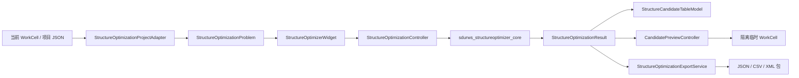

# Structure Optimizer Completion Implementation Plan

> **For agentic workers:** REQUIRED SUB-SKILL: Use `superpowers:subagent-driven-development` (recommended) or `superpowers:executing-plans` to implement this plan task-by-task. Steps use checkbox (`- [ ]`) syntax for tracking.

**Goal:** 将 `RobWorkStudio/src/rwslibs/structureoptimizer` 从“核心算法与首版界面已具备”补全为可从 RobWorkStudio 工作单元创建项目、编辑完整问题、运行优化、比较/预览候选方案并导出可复现报告的生产可用插件。

**Architecture:** 保留现有 `sdurws_structureoptimizer_core` 的纯计算边界：它接收不可变的 `StructureOptimizationProblem` 快照，生成 `StructureOptimizationResult`，不依赖 QWidget 或全局 RobWorkStudio 状态。插件层负责把当前 WorkCell 和项目文件转换为 `RobotDesignContext`，用五页签编辑问题，控制后台任务，并把选中的候选以隔离临时 WorkCell 预览；所有落盘均由显式导出操作触发。

**Tech Stack:** C++14、Qt Core/Widgets/Concurrent、RobWork/RobWorkStudio、CMake、CTest、已有 `robotmodelbuilder`、`robotanalysiscore`、`kinematicanalysis`。

---

## 1. 当前基线与范围

基线提交为 `011ab27`。在该提交中，下列能力已经存在，应作为稳定 API 使用，不重复实现：

- 完整问题、候选、评分、进度和灵敏度的数据结构：`StructureOptimizationTypes.hpp`。
- 变量突变、隔离候选 WorkCell、IK/碰撞/工作空间评估、评分、缓存、Random/Grid/Hybrid 搜索和灵敏度分析。
- 项目 JSON、结果 JSON、CSV 和候选 XML 包的底层导出器。
- 三个表模型、变量建议、`QtConcurrent` 后台控制器，以及五页签骨架。
- 纯核心和控制器的 CTest 覆盖；无图形平台的默认测试不执行 QWidget 子套件。

本阶段只补齐“可用工作流”和相应可靠性测试。首版仍不包含拓扑/自由度改变、电机选型、动力学、NSGA-II/CMA-ES 或多 worker 并行。

## 2. 目标架构



### 2.1 分层职责

| 层 | 责任 | 禁止事项 |
| --- | --- | --- |
| `*_core` | 校验、候选生成、模型突变、评估、排序、灵敏度、序列化内容生成 | 访问 QWidget、当前 Studio WorkCell、弹出对话框、写用户文件 |
| Project adapter | 从项目 JSON 或已构建的 `RobotModelSpec` 装配 `RobotDesignContext` | 反向推断不完整 WorkCell 为完整模型规格 |
| Widget/models | 编辑问题快照、显示进度/结果、发送命令 | 在 UI 线程运行运动学计算 |
| Controller | 单次任务生命周期、暂停/取消、线程间结果投递 | 修改运行中的问题快照 |
| Preview/export service | 选中候选的隔离预览、原子写入报告/包 | 改写源 WorkCell、默认覆盖已有文件 |

### 2.2 不可变性约定

- `start()` 前由 widget 调用 `collectProblem()`，得到值语义快照；运行期间 UI 不可编辑。
- `StructureOptimizationResult` 写入候选表后视为只读。预览/导出只能读取它并创建新的 `RobotModelSpec` 或临时 WorkCell。
- 基线候选始终为 `baselineCandidateIndex` 指向的候选；表格排序不得改变该字段语义。
- 每份结果导出必须包含完整问题 JSON、随机种子、插件版本、时间戳、候选索引及变量顺序，保证可复现。

## 3. 文件结构

### 新建文件

- `StructureOptimizationProjectAdapter.hpp/.cpp`：从项目 JSON 和完整 `RobotDesignContext` 创建/保存问题；拒绝仅有 WorkCell 而没有完整 `RobotModelSpec` 的情况。
- `CandidatePreviewController.hpp/.cpp`：根据候选建立临时模型，切换预览，恢复用户原始 WorkCell 和状态。
- `StructureOptimizationExportService.hpp/.cpp`：一次性协调问题 JSON、结果 JSON、两份 CSV 和候选 XML 包的原子导出。
- `StructureOptimizationReportWriter.hpp/.cpp`：生成可读 Markdown 报告；仅接受不可变 `problem/result`。
- `StructureOptimizationProjectAdapterTest.cpp`：项目载入/保存和错误路径测试。
- `StructureOptimizationExportServiceTest.cpp`：临时目录中的成功、取消、冲突和清理测试。

### 修改文件

- `StructureOptimizerPlugin.hpp/.cpp`：保存 `StructureOptimizationProjectAdapter` 和 `CandidatePreviewController`；在 `open/close` 中绑定/释放当前 WorkCell，禁止空实现。
- `StructureOptimizerWidget.hpp/.cpp`：持有完整的设置控件、约束模型/编辑器、候选选择和导出命令；把所有可编辑字段双向绑定到 `StructureOptimizationProblem`。
- `StructureVariableTableModel.hpp/.cpp`、`OptimizationTaskTableModel.hpp/.cpp`：增加新增、删除、移动和结构性变更信号支持。
- `StructureCandidateTableModel.hpp/.cpp`：提供按候选索引查找、基线比较数据和可显示的约束摘要；不暴露可写引用。
- `StructureOptimizationController.hpp/.cpp`：增加 `resultReady` 前的运行编号，忽略过期的 queued progress/result；将异常转换为带 code 的失败结果。
- `StructureOptimizationTest.cpp`：保留现有纯核心子套件，新增 adapter/export/controller 及 headless widget 行为测试。
- `CMakeLists.txt`、`README.md`：编译新文件、注册测试、说明项目文件与导出目录布局。

## 4. 数据与接口契约

### 4.1 项目文件

扩展 `StructureOptimizationJson` 的顶层封装，不改变既有 `problemToJson/resultToJson` 的兼容语义：

```json
{
  "schemaVersion": 1,
  "type": "StructureOptimizationProject",
  "problem": { "type": "StructureOptimizationProblem" },
  "ui": {
    "selectedCandidateIndex": 0,
    "lastExportDirectory": ""
  }
}
```

- 项目载入调用 `StructureOptimizationJson::problemFromJson()`，随后调用 `StructureOptimizationValidation::validateProblem()`。
- `RobotDesignContext.modelSpec` 缺失时返回 `StructureOptimization.Context.Invalid`，界面显示原因但不得启动优化。
- 未知字段忽略；`schemaVersion` 高于支持版本时拒绝；不把绝对临时目录、预览文件或运行中状态写入项目。

### 4.2 UI 到领域对象的绑定

`StructureOptimizerWidget::collectProblem()` 必须完整写回：

```cpp
problem.run.strategy = static_cast<StructureStrategyKind>(strategyCombo->currentData().toInt());
problem.run.candidateCount = candidateCountSpin->value();
problem.run.eliteCount = eliteCountSpin->value();
problem.run.localEliteCount = localEliteCountSpin->value();
problem.run.finalVerificationCount = verificationCountSpin->value();
problem.run.maxLocalSweeps = localSweepSpin->value();
problem.run.gridSteps = gridStepsSpin->value();
problem.run.randomSeed = static_cast<unsigned int>(seedSpin->value());
problem.weights = readWeights();
problem.constraints = constraintModel->constraints();
```

每个权重控件采用 `QDoubleSpinBox(0.0, 1.0, 0.01)`；总和不等于 1 时由验证层拒绝并显示 `StructureOptimization.Weights.Invalid`，不在 UI 层静默归一化。

### 4.3 预览接口

```cpp
class CandidatePreviewController : public QObject {
    Q_OBJECT
public:
    bool preview(const StructureOptimizationProblem& problem,
                 const StructureCandidateResult& candidate,
                 QString* error = nullptr);
    void clearPreview();
    int previewedCandidateIndex() const;
Q_SIGNALS:
    void previewChanged(int candidateIndex);
    void previewFailed(const QString& message);
};
```

实现用 `StructureDesignMutator::apply()` 和 `CandidateModelFactory` 创建隔离模型。只有构建成功后才调用 Studio 的切换 API；失败时保留原 WorkCell。`clearPreview()` 恢复打开插件前保存的源 WorkCell 路径，且析构/`close()` 必须调用它。

### 4.4 导出接口与目录布局

```cpp
struct StructureOptimizationExportRequest {
    QString directory;
    int selectedCandidateIndex = -1;
    bool includeAllCandidates = true;
    bool exportCandidateModel = true;
};

struct StructureOptimizationExportResult {
    QStringList writtenFiles;
    QStringList errors;
    bool ok = false;
};
```

导出目录为：

```text
<target>/
  project.structure-optimization.json
  result.structure-optimization.json
  candidates.csv
  task-details.csv
  report.md
  candidate-<index>/  # 仅当选择可行候选并启用 XML 包导出
```

所有文本文件先写 `QSaveFile`，`commit()` 全部成功后才报告成功。目标目录已有同名文件时由 `QFileDialog` 明确询问覆盖；service 接收到冲突且没有覆盖许可时返回 `StructureOptimization.Export.FileExists`。

## 5. 界面行为

| 页签 | 必须功能 | 运行时状态 |
| --- | --- | --- |
| 设计变量 | 表格编辑、添加/删除、变量建议、关联几何同步开关 | 运行中只读 |
| 任务与约束 | 任务表、硬/软约束表、添加/删除、工作空间覆盖框与采样配置 | 运行中只读 |
| 优化设置 | 策略、全部 `RunConfig`、六个权重、碰撞与 Quick/Verified 采样配置 | 运行中只读 |
| 候选方案 | 稳定排序表、基线差值、约束失败详情、选中项预览/清除预览 | 运行中可浏览已有结果，不可改问题 |
| 报告导出 | 项目载入/保存、导出选项、目标目录、导出结果和错误列表 | 只有有完成结果时可导出结果 |

开始按钮启用条件：完整 context、至少一个启用变量、至少一个启用任务、所有启用约束和运行配置合法。取消后保留已评估候选，状态显示“已取消（N/M）”；失败时保留错误 code 和详细消息，不能把失败误报为完成。

## 6. 分阶段实施任务

### Task 1: 建立补全阶段回归基线

**Files:** 只读 `CMakeLists.txt`、`StructureOptimizationTest.cpp`。

- [ ] 运行 `git status --short` 并记录已有未跟踪文件；不得清理或暂存它们。
- [ ] 运行：

```powershell
cmake --build build\Desktop_Qt_6_11_1_MSVC2022_64bit-Debug --config Debug --target sdurws_structureoptimizer_test sdurws_structureoptimizer
ctest --test-dir build\Desktop_Qt_6_11_1_MSVC2022_64bit-Debug -C Debug -R "^sdurws_structureoptimizer_test$" --output-on-failure
```

预期：构建成功、CTest 通过。失败时先修复基线，不进入后续任务。

### Task 2: 完整绑定项目、设置和约束

**Files:** 修改 `StructureOptimizerWidget.hpp/.cpp`、两个既有表模型；新建 `StructureConstraintTableModel.hpp/.cpp`；测试 `StructureOptimizationTest.cpp`。

- [ ] 先新增失败测试：设置 `Grid`、非默认六个权重、`gridSteps` 和一条 `MinimumWorkspaceCoverage` 约束，调用 `collectProblem()`，逐字段断言恢复。
- [ ] 添加 `StructureConstraintTableModel`，列为 `id/label/kind/target/threshold/secondaryThreshold/enabled/hard`，支持 `setConstraints()`、`constraints()`、编辑及插入/删除。
- [ ] 将策略 `QComboBox`、权重 spin boxes 和所有 RunConfig spin boxes 设为成员；每个策略使用 `addItem("Hybrid", int(StructureStrategyKind::Hybrid))`，禁止按显示文本解析。
- [ ] 在 `setProblem()` 写入全部控件，在 `collectProblem()` 写回全部字段；把 model reset、rowsInserted、rowsRemoved、dataChanged 都连接到 `updateRunState()`。
- [ ] 运行单元测试及 `ctest -R "^sdurws_structureoptimizer_test$"`，预期通过。
- [ ] 提交：`git commit -m "feat: 完善结构优化问题编辑与配置绑定"`。

### Task 3: 项目适配、载入和保存

**Files:** 新建 `StructureOptimizationProjectAdapter.hpp/.cpp`、`StructureOptimizationProjectAdapterTest.cpp`；修改 widget、plugin、CMake。

- [ ] 先写失败测试：有效项目往返后 `context.modelSpec`、变量、约束、设置保持；无 `modelSpec`、未知高版本、无效 JSON 分别返回确定错误 code。
- [ ] 提供：

```cpp
bool loadProject(const QString& path, StructureOptimizationProblem& out, QString* error);
bool saveProject(const QString& path, const StructureOptimizationProblem& problem,
                 int selectedCandidateIndex, QString* error);
```

- [ ] `open(WorkCell*)` 仅更新工作单元关联状态。只有 adapter 获得完整 `RobotDesignContext` 后才调用 widget 的 `setProblem()`；不能用裸 WorkCell 猜测 `RobotModelSpec`。
- [ ] 增加“打开项目/保存项目”命令和文件过滤器 `*.structure-optimization.json`；保存到新路径而不是自动覆盖源文件。
- [ ] 运行 adapter 测试、现有结构优化 CTest；预期通过。
- [ ] 提交：`git commit -m "feat: 支持结构优化项目载入与保存"`。

### Task 4: 候选比较与稳定选择

**Files:** 修改 `StructureCandidateTableModel.hpp/.cpp`、`StructureOptimizerWidget.hpp/.cpp`、测试文件。

- [ ] 先写失败测试：给定基线和两个候选，按 `StructureObjectiveScorer::sortForDecision()` 显示；表格“提升”列固定为 `candidate.totalScore - baseline.totalScore`，基线索引在排序后仍能正确定位。
- [ ] 增加 `setResult(const StructureOptimizationResult&)` 和 `candidateByIndex(int)`，内部复制结果；不得返回可修改的 `std::vector`。
- [ ] 选中行显示每项分量得分、原始指标、违反约束和任务失败原因；不可行候选不启用“导出模型”。
- [ ] 双击或预览按钮只传递 `candidate.index`，再由模型按索引查找，禁止依赖排序后的行号。
- [ ] 运行新增单测和 CTest；预期通过。
- [ ] 提交：`git commit -m "feat: 增加结构优化候选比较与选择"`。

### Task 5: 隔离候选预览和恢复

**Files:** 新建 `CandidatePreviewController.hpp/.cpp`；修改 plugin/widget、CMake；测试文件。

- [ ] 先用 fake Studio facade 写失败测试：预览候选成功后仅切换到临时路径；`clearPreview()` 和 `close()` 恢复源路径；构建失败不调用 switch。
- [ ] 为便于测试，抽取最小接口：

```cpp
class IWorkCellPreviewHost {
public:
    virtual ~IWorkCellPreviewHost() = default;
    virtual QString currentWorkCellPath() const = 0;
    virtual bool openWorkCell(const QString& path, QString* error) = 0;
};
```

- [ ] 真实插件 host 只包装 `RobWorkStudio::setWorkcell()`；临时目录由 controller 持有到 `clearPreview()` 后再释放。
- [ ] 将“预览”和“清除预览”接到候选页，预览中用明显状态文本标识候选编号，不改写项目或结果。
- [ ] 在桌面可用环境运行 `sdurws_structureoptimizer_test.exe widget`；无图形平台只运行 fake-host 测试并记录 GUI 限制。
- [ ] 提交：`git commit -m "feat: 支持结构优化候选隔离预览"`。

### Task 6: 报告与模型导出工作流

**Files:** 新建 `StructureOptimizationExportService.hpp/.cpp`、`StructureOptimizationReportWriter.hpp/.cpp`、对应测试；修改 widget/CMake/README。

- [ ] 先写失败测试：临时目录导出后必须包含五个文本文件；选择可行候选时必须出现 `candidate-<index>`；不可行候选和目录冲突必须失败且不得留下半写入的主报告文件。
- [ ] Report writer 固定输出：问题摘要、种子与策略、约束、基线、前十候选、最佳方案任务明细、灵敏度等级、诊断和警告。
- [ ] Export service 先创建工作目录，全部 `QSaveFile::commit()` 成功后再导出 XML 包；XML 包失败要返回失败并在报告中说明，不把导出标记为完全成功。
- [ ] 导出页仅在有结果时启用，目录选择、是否导出全部候选和是否导出 XML 包都可配置；成功后列出绝对输出路径。
- [ ] 运行 export 单测和 CTest；预期通过。
- [ ] 提交：`git commit -m "feat: 完成结构优化报告与候选模型导出"`。

### Task 7: 后台任务的代次隔离与状态一致性

**Files:** 修改 `StructureOptimizationController.hpp/.cpp`、widget、测试文件。

- [ ] 先写失败测试：启动 A、取消 A、立即启动 B；A 的延迟 progress/completed 不得更新 B 的 UI 或清空 B 的结果。
- [ ] 在 `start()` 递增 `quint64 _runId`，每个 lambda 捕获 run id；queued 回调及 `finishCurrentRun()` 在 id 不一致时直接丢弃。
- [ ] 控制器在取消时只请求停止，仍等待 worker 收束；`runningChanged(false)` 必须只对当前 run 发出一次。
- [ ] Widget 在完成、取消和失败后恢复编辑状态；暂停按钮文本与 `pausedChanged` 保持一致。
- [ ] 运行 controller 异步测试和 CTest；预期通过。
- [ ] 提交：`git commit -m "fix: 隔离结构优化过期后台结果"`。

### Task 8: 确定性、性能和最终验收

**Files:** 修改 `HybridStructureOptimizer.cpp`、测试、README。

- [ ] 先写失败测试：同一问题以 `Hybrid` 和固定非零种子连续运行两次，候选变量、可行性、排序和总分逐项一致。
- [ ] 用局部 `std::mt19937` 取代 `std::srand/std::rand`，将随机引擎显式传给局部扰动生成；种子为 0 时在结果中记录实际生成的种子。
- [ ] 为候选数 50、任务点 5、Quick 网格 10x10x10 建立性能基线，记录总耗时、cache hits、评估数；不设置脆弱的毫秒级 CI 断言。
- [ ] 更新 README：项目文件格式、五页签流程、预览隔离、导出布局、已知 GUI 测试限制和性能测量命令。
- [ ] 运行：

```powershell
cmake --build build\Desktop_Qt_6_11_1_MSVC2022_64bit-Debug --config Debug --target sdurws_structureoptimizer_test sdurws_structureoptimizer
ctest --test-dir build\Desktop_Qt_6_11_1_MSVC2022_64bit-Debug -C Debug -R "^sdurws_structureoptimizer_test$" --output-on-failure
git diff --check
```

预期：全部通过，且无空白错误。提交：`git commit -m "test: 加固结构优化器可复现性与回归覆盖"`。

## 7. 验收标准

- 用户可打开完整项目、编辑变量/任务/约束/全部运行设置，重启后保持一致。
- 无完整 `RobotModelSpec`、无可用变量、无任务、非法权重或非法采样网格时，开始按钮不可用并显示确定错误 code。
- Random、Grid、Hybrid 可实际从 UI 写入运行配置；固定种子在同构建环境下结果可复现。
- 取消、暂停/继续、连续运行不会让旧 run 覆盖新 run 的进度或结果。
- 候选比较始终以候选 index 关联，不因表格排序误选；预览不改写源 WorkCell，关闭插件恢复源模型。
- 导出包含可加载项目、可审计结果、两份 CSV、Markdown 报告和可选 XML 包；任何失败不会把半成品报告标记为成功。
- 默认 CTest 覆盖所有无 GUI 逻辑；桌面环境额外执行 widget 子套件和一次手工预览/导出冒烟测试。

## 8. 风险与决策

| 风险 | 决策 |
| --- | --- |
| WorkCell 本身不足以还原 `RobotModelSpec` | 只接受项目 JSON 或 RobotModelBuilder 产出的完整 context；不做不可靠反向工程。 |
| 预览切换污染用户场景 | 临时 WorkCell、明确恢复动作、`close()` 兜底恢复。 |
| GUI 测试在 CI 无平台插件 | 核心和 presenter 用 fake host/headless 测试；widget 子套件标记为桌面环境冒烟测试。 |
| 导出中途失败留下混合文件 | 文本使用 `QSaveFile`，XML 包在独立候选目录生成，失败返回完整错误列表。 |
| 算法结果漂移 | 固定随机引擎、固定归一化阈值、结果中记录实际种子和版本。 |

## 9. 执行顺序

严格按 Task 1 至 Task 8 执行。Task 2 和 Task 3 完成后，Task 4/5 可并行；Task 6 依赖 Task 4；Task 7 可与 Task 5/6 并行；Task 8 最后执行。每项任务都先提交测试失败证据，再写最小实现、运行指定验证并独立提交。
