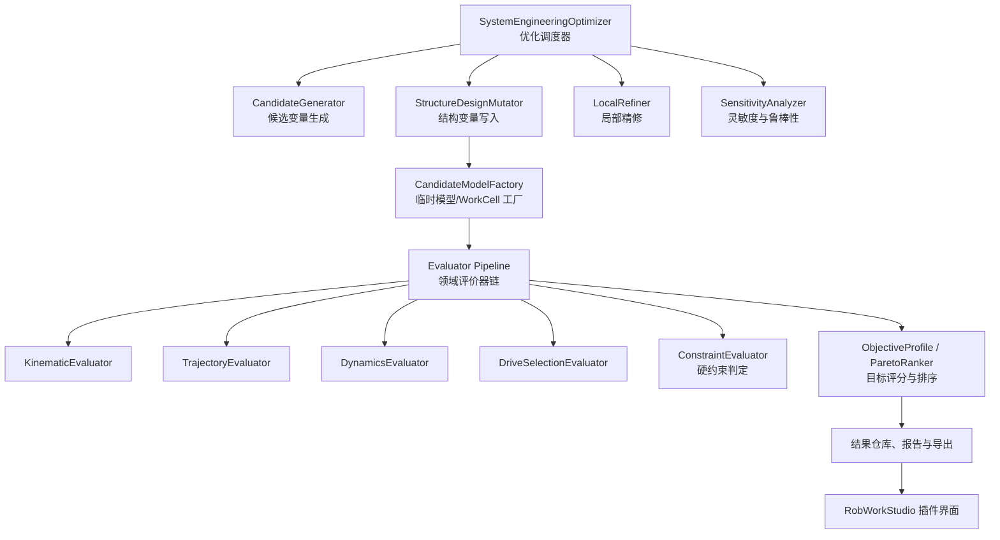

# 机械臂结构尺寸优化插件最终实施方案

## 1. 产品定位

本插件是 RobWorkStudio 的第三个设计插件，面向研发工程师开展机械臂结构参数的优化设计。首版解决“在给定任务、安装空间、关节限制与碰撞约束下，快速获得最优运动学结构尺寸”的问题；后续逐步接入轨迹规划、动力学分析和电机减速器选型，升级为“机器人系统工程最优”平台。

优化目标不是脱离工况寻找某组绝对最优尺寸，而是在明确的任务集、工艺节拍、环境约束、制造规则和成本边界下，得到：

- 可行：任务点可达、无碰撞、满足关节限制与几何规则。
- 高性能：姿态品质、关节裕度、工作空间、周期时间、能耗和驱动裕度等指标优良。
- 可解释：每个候选方案的得分、约束失败原因、工程指标和适用条件均可追溯。
- 可复现：相同输入、算法版本、随机种子和评价配置必须得到相同结果。
- 可扩展：未来新增动力学、轨迹、选型、刚度、热、疲劳等能力时，不改写优化器主框架。

插件定位为面向机器人研发的系统级设计优化能力，不试图复制 AMESim 的通用多学科参数优化器。AMESim 更偏重已有多物理模型上的通用参数寻优；本插件更关注机器人模型、结构变量、任务语义、IK 解集、碰撞、轨迹和驱动选型之间的专业工程闭环，并直接输出可继续编辑和导出的机器人模型。

---

## 2. 总体架构

建议将核心能力拆分为无界面的共享工程层、结构优化核心层和 RobWorkStudio UI 层。UI 不承载物理计算和优化逻辑。



### 2.1 核心职责边界

| 组件 | 职责 | 不应承担的职责 |
|---|---|---|
| 优化调度器 | 决定下一组候选变量，管理采样、精英筛选、局部搜索、缓存、取消和进度 | 不直接实现运动学、动力学或选型公式 |
| 结构变异器 | 将变量向量应用到基准 `RobotModelSpec`，生成候选模型规格 | 不创建 UI 状态，不评分 |
| 候选模型工厂 | 创建临时 XML、WorkCell、Device、TCP、碰撞检测对象 | 不保留全部候选 WorkCell，避免内存膨胀 |
| 领域评价器 | 计算某一专业域的指标、约束、警告和工件 | 不决定全局搜索策略 |
| 约束与目标层 | 判定硬约束、指标归一化、加权评分、Pareto 排序和排序规则 | 不重新计算领域物理量 |
| 结果仓库 | 保存变量、结果快照、哈希、日志、缓存和导出数据 | 不保存每个候选的完整场景模型 |
| UI 层 | 编辑问题、启动任务、查看结果、比较候选、预览和导出 | 不直接执行长时间优化或物理计算 |

---

## 3. 统一工程评价契约

所有当前和未来的领域模块都必须通过统一契约接入优化器。该契约建议放入 `robotanalysiscore`，或新建无 UI 的共享工程核心库。

```cpp
class IEngineeringEvaluator
{
public:
    virtual std::string id() const = 0;
    virtual EvaluatorCapability capability() const = 0;

    virtual EngineeringEvaluationResult evaluate(
        const CandidateEvaluationContext& candidate,
        const EvaluationRequest& request,
        const EvaluationCallbacks& callbacks) = 0;
};
```

### 3.1 统一输入

`CandidateEvaluationContext` 至少包含：

- 基准模型版本和候选 `RobotModelSpec`。
- 变量向量、变量定义、变量单位和量化精度。
- 任务点、任务姿态、权重、必达/可选语义。
- 工件、障碍物、TCP、载荷、安装空间和碰撞规则。
- 轨迹配置、动力学配置、驱动选型配置。
- 当前随机种子、评价配置版本、输入快照哈希。
- 取消令牌、进度回调和日志回调。

### 3.2 统一输出

`EngineeringEvaluationResult` 至少包含：

- `metrics`：指标 ID、名称、单位、数值、状态和计算来源。
- `constraints`：指标 ID、阈值、观测值、比较关系、是否满足、失败原因。
- `warnings`：非致命风险，例如接近奇异位形、余量过小或近碰撞。
- `artifacts`：可供下游使用的工件，例如 IK 解集、轨迹、关节力矩时序、选型报告。
- `providerId`、评价器版本、模型哈希、配置哈希和耗时。
- `evaluationStatus`：成功、不可行、数据不足、取消、计算失败。

领域评价器不得只返回一个总分。总分由统一的目标与约束层在所有评价结果完整汇总后计算。

### 3.3 指标字典

首版建议至少注册以下稳定指标 ID：

```text
kinematics.reachability.weighted
kinematics.manipulability.p10
kinematics.joint_margin.minimum
kinematics.workspace.coverage
geometry.compactness
collision.minimum_clearance

trajectory.feasible
trajectory.cycle_time
trajectory.path_clearance.minimum

dynamics.torque_peak_ratio
dynamics.velocity_peak_ratio
dynamics.energy_per_cycle

drive.selection.feasible
drive.motor_thermal_margin
drive.reducer_torque_margin
drive.bom_cost
```

指标 ID 一旦发布不得随意改名。显示名称、单位、分组和说明应由指标注册表维护，以保证历史结果和导出报告兼容。

---

## 4. 优化问题模型

### 4.1 设计变量

设计变量应支持三类域：

| 类型 | 首版用途 | 后续用途 |
|---|---|---|
| 连续变量 | 连杆长度、DH `a/d`、关节偏移、基座高度、TCP 偏移、截面尺寸 | 质心位置、壁厚、刚度参数等 |
| 整数变量 | 预留 | 齿数、减速级数、轨迹离散步数等 |
| 离散枚举变量 | 预留 | 电机型号、减速器型号、材料、轴承型号等 |

首版只开放连续变量，但数据模型必须保留整数和枚举类型。离散变量真正启用前，必须补充混合连续-离散候选生成、重复方案去重和相应的局部搜索策略，不能直接套用连续坐标搜索。

每个变量必须定义：

- 稳定 ID、显示名称、单位、变量类型和所属模型字段。
- 下限、上限、默认值、步长或制造量化精度。
- 是否允许优化、是否受其他变量约束。
- 变异后模型合法性的校验规则。
- 与几何、碰撞体、质量或驱动参数的联动关系。

### 4.2 目标与约束

目标和约束必须数据驱动，不能写死在优化算法中。

```cpp
struct ObjectiveTerm {
    std::string metricId;
    OptimizationDirection direction;
    NormalizationRule normalization;
    double weight;
};

struct ConstraintRule {
    std::string metricId;
    ComparisonOperator comparison;
    double threshold;
    bool hard;
};
```

硬约束失败的候选方案永远排在任何可行方案之后，综合得分不能抵消硬约束失败。典型硬约束包括：

- 必达任务点不可达。
- 必经轨迹不可规划或发生碰撞。
- 关节越限、几何非法、模型生成失败。
- 最小安全间隙不足。
- 峰值力矩、速度、热或减速器额定能力超限。
- 未找到满足需求的电机减速器组合。

软目标用于在可行解之间排序，例如操纵度、关节裕度、紧凑性、周期时间、能耗、成本和热余量。

归一化必须使用问题定义的固定“好/坏”阈值，不得以本次候选集的最大值、最小值作为归一化基准，否则同一方案在不同批次运行中会发生分数漂移。

---

## 5. 分阶段评价流程

完整系统级评价链必须遵循依赖顺序：

```text
模型合法性与几何
  -> 运动学与碰撞
  -> 轨迹规划与路径碰撞
  -> 动力学
  -> 电机/减速器选型
  -> 约束判定、评分与排序
```

### 5.1 阶段一：结构与运动学快速筛选

输入为候选模型和任务点集，输出可达性、IK 解集、操纵度、关节裕度、工作空间覆盖、几何合法性和静态碰撞结果。

首版必须实现的评价内容：

- 必达任务点加权可达率为 100%。
- 可选任务点加权覆盖率。
- 每个任务点可用 IK 解集与最佳解选择依据。
- 操纵度使用可用 IK 解集合的 P10，而非单点最大值。
- 关节裕度输出最小值和 P10。
- 自碰撞、环境碰撞、最小间隙。
- 连杆长度、细长比、安装包络和紧凑性。
- 用户定义工作空间的可达覆盖率。

该阶段是低成本筛选，但不能把它误称为最终优化结论。

### 5.2 阶段二：轨迹评价

轨迹评价器在接入后，接收阶段一输出的可用 IK 信息，并针对每条工艺路径进行关节空间连续解选择、路径规划和碰撞校验。

主要输出：

- 路径是否可行。
- 周期时间、路径长度、平滑性和关节连续性。
- 路径最小安全间隙。
- 关节速度、加速度和加加速度需求。
- 轨迹工件，供动力学和结果预览复用。

轨迹不可行属于系统级硬约束，即使离散任务点都可达，也不得判定方案可用。

### 5.3 阶段三：动力学评价

动力学评价器基于已确认可行的轨迹、负载和候选结构参数计算：

- 关节力矩、速度、加速度和功率时序。
- 峰值、RMS 和周期能耗。
- 重力载荷、惯性载荷和外部工艺载荷。
- 质量、转动惯量和质心变化对性能的影响。
- 结构参数与驱动需求之间的敏感关系。

没有经过轨迹评价的候选不得进入精确动力学评价。首版可预留接口与占位状态，避免伪造动力学指标。

### 5.4 阶段四：驱动选型评价

驱动选型评价器基于动力学时序和电机/减速器产品库，给出可行组合及工程余量：

- 连续、峰值和热负载校验。
- 电机转速、转矩、惯量匹配与热余量。
- 减速器转矩、速度、寿命和背隙约束。
- 候选组合、BOM 成本、质量和供货状态。
- 无可行组合时的明确失败原因。

驱动选型不是独立附属报告，而是系统优化中的评价器。结构尺寸变化会改变惯量、力矩和驱动成本，必须通过统一指标返回给优化器。

---

## 6. 优化算法层的准确定位

“优化算法层负责宏观调度与迭代循环”的说法总体正确，但需要作如下精确定义：

- 优化算法层不是“考生”，候选变量向量才是被评价的方案。
- 优化算法层是实验设计者和搜索调度器：提出下一次尝试的变量向量，收集成绩单，再决定后续尝试方向。
- 运动学、轨迹、动力学、选型模块是评价器，负责工程物理正确性。
- “结构变异”不是独立于优化算法之前的一个优化阶段，而是每个变量向量生成后都要执行的模型构建步骤。

### 6.1 首版默认策略：Hybrid

推荐首版提供 `Random`、`Grid` 和 `Hybrid` 三种策略，默认使用 `Hybrid`：

1. 预校验：校验问题定义、变量边界、任务点、模型和评价器配置。
2. 全局探索：采用拉丁超立方采样（LHS）在连续设计空间生成候选变量向量。
3. 结构生成：对每个向量调用结构变异器和候选模型工厂。
4. 快速评价：执行模型合法性、运动学、碰撞和低成本结构指标。
5. 精英筛选：从可行候选中选出代表性精英进入高成本评价。
6. 深度评价：按已启用的链路执行轨迹、动力学和驱动选型。
7. 局部精修：围绕高质量精英进行坐标搜索或步长递减搜索。
8. 全链复核：局部精修中的每次候选必须经过当前已启用的完整评价链。
9. 排序与鲁棒性：形成最终排序，执行灵敏度分析，导出结果。

### 6.2 精英筛选规则

不能只按“运动学总分 Top N”保留候选，否则可能过早淘汰动态性能、成本或驱动可行性更好的结构。精英池应同时考虑：

- 硬约束可行性。
- 综合代理分数。
- 任务覆盖特征。
- 结构尺寸分布的多样性。
- 接近约束边界的代表性方案。
- 未来高成本评价的预算。

建议采用“分层可行性 + 分数排序 + 最小变量距离去重”的精英选择方式。首版可采用固定数量，例如 10 至 20 个；后续根据评价成本和并行能力动态调整。

### 6.3 局部搜索

局部搜索从多个精英种子出发，逐变量施加正负扰动，接受提升结果并逐步缩小步长。其规则包括：

- 变量必须遵守上下限、制造步长和联动约束。
- 对完整评价链启用时，局部搜索的接受判定必须基于完整目标函数和硬约束，不能仅根据运动学代理得分。
- 发生不可行、模型构建失败或评价超时时，记录失败原因并切换方向或缩小步长。
- 提供最大评价次数、最大时间、最小步长和收敛阈值。
- 为保证可复现性，随机过程必须记录种子。

### 6.4 灵敏度与鲁棒性

灵敏度分析位于优化完成后，是“优化后的工程验证”，不应与全局搜索混淆。对最终候选的每个变量执行正负一步长扰动，输出：

- 目标分数变化。
- 关键指标变化。
- 是否触发硬约束。
- 可制造性风险和尺寸容差建议。
- 对结构尺寸误差最敏感的变量排序。

后续版本可将鲁棒性从结果报告升级为正式目标，例如优化“最坏容差情况下仍可行”的结构方案。

---

## 7. 数据、缓存与可追溯性

### 7.1 设计上下文

`RobotDesignContext` 必须完整保存 `RobotModelSpec`，而非只保存局部模型信息。建议新增 `RobotModelSpecJson`，实现完整、版本化、可往返的 JSON 序列化。

优化任务快照至少包含：

- 基准模型与模型哈希。
- 任务点、障碍物、负载、安装空间和碰撞设置。
- 变量定义、目标、约束、算法参数和随机种子。
- 启用的评价器及其版本和配置哈希。
- 软件版本、插件版本和指标字典版本。

### 7.2 缓存

缓存键应由以下内容组合生成：

```text
候选变量量化值
+ 基准模型哈希
+ 任务与环境哈希
+ 评价器 ID/版本
+ 评价配置哈希
```

缓存粒度应支持单评价器级别。这样，在只修改驱动选型规则时，可以复用已经计算的运动学、轨迹和动力学工件。

### 7.3 失败处理

每个候选都必须有明确状态：

- `Feasible`
- `Infeasible`
- `ModelBuildFailed`
- `EvaluatorUnavailable`
- `EvaluationFailed`
- `TimedOut`
- `Cancelled`

评价失败不能被静默转化为低分，也不能错误标记为“物理不可行”。报告中必须区分模型问题、输入缺失、评价器缺失和真实工程约束失败。

---

## 8. 用户界面与交付物

插件界面建议采用五个页签：

1. **设计问题**：基准机器人、任务点、载荷、环境、安装包络和碰撞规则。
2. **变量与约束**：变量范围、制造步长、目标、硬约束和权重配置。
3. **优化运行**：算法选择、预算、进度、暂停、继续、取消和日志。
4. **候选比较**：可行性、得分、关键指标、约束失败原因、Pareto 视图和灵敏度。
5. **预览与导出**：加载候选模型、查看任务姿态与碰撞状态、导出报告和模型。

应支持以下导出：

- 优化任务 JSON。
- 候选结果 CSV/JSON。
- 候选模型 XML 包。
- PDF 或 HTML 工程报告。
- 最终推荐方案、备选方案和淘汰原因摘要。

每个最终候选应包含“为什么推荐”的解释，例如：满足全部硬约束、可达率、最小关节裕度、最小安全间隙、周期时间、峰值力矩比、可选驱动组合和成本。

---

## 9. 技术落地与模块演进

### 9.1 首版工程拆分

建议创建：

- `sdurws_structureoptimizer_core`：问题模型、变量、结构变异、候选模型工厂、候选生成、缓存、优化策略、评分、灵敏度和导出。
- `sdurws_structureoptimizer`：RobWorkStudio 插件、控制器、表格模型、后台任务和预览。
- `sdurws_kinematicanalysis_core`：从现有运动学插件抽取无 UI 的 `KinematicAnalyzer`，避免插件之间直接依赖 UI 目标。
- `robotanalysiscore` 或新共享核心：统一评价器契约、指标字典、结果数据结构、约束和目标模型。

首版的 `StructureCandidateEvaluator` 应定位为第一个 `KinematicEngineeringEvaluator`，而不是长期固化为唯一评价器。

### 9.2 分期里程碑

| 阶段 | 范围 | 交付标准 |
|---|---|---|
| M0：基础契约 | 完整模型序列化、设计上下文、评价器接口、指标字典 | 可保存并无损恢复完整优化任务 |
| M1：运动学结构优化 | 连续变量、LHS、碰撞、IK、评分、局部搜索、灵敏度、UI 和导出 | 可得到可解释、可复现的运动学最优结构 |
| M2：轨迹系统优化 | 路径任务、连续 IK、路径碰撞、周期时间和轨迹工件 | 可排除“点可达但轨迹不可执行”的方案 |
| M3：动力学系统优化 | 载荷、质量惯量、关节时序、能耗和力矩裕度 | 可判断结构是否满足运动负载 |
| M4：驱动选型联合优化 | 产品库、热校核、减速器校核、成本和离散变量 | 可输出满足性能与成本目标的结构和驱动组合 |
| M5：高级优化 | Pareto 前沿、混合变量、代理模型、并行/分布式计算、鲁棒优化 | 支持复杂多目标系统工程设计 |

---

## 10. 验收标准

首版验收应至少满足以下要求：

- 相同输入、版本和随机种子下，候选生成顺序、可行性和最终排序一致。
- 必达任务点不可达、碰撞、关节越限和几何非法的方案绝不排在可行方案之前。
- 结果中可定位每个候选的变量、指标、约束失败原因、模型版本和评价器版本。
- LHS 样本在各连续变量范围内均匀覆盖，固定随机种子可复现。
- 局部搜索只接受满足硬约束且改进完整目标函数的候选。
- 取消、暂停和恢复不损坏已有结果；恢复后继续使用相同任务快照和缓存。
- 优化过程中不长期保留所有 WorkCell，内存占用随候选数增长受控。
- 候选模型能够在 RobWorkStudio 中正确预览并导出为可加载 XML。
- 所有核心算法、序列化、约束判定、缓存键和关键评价流程具备自动化测试。
- 评价器缺失、输入不完整或计算失败时，界面给出明确原因，不输出误导性的“最优方案”。

---

## 11. 对现有实施计划的修订要求

现有实施计划应按本方案调整：

- 在原有任务前新增“共享评价契约、指标字典、目标/约束数据模型”任务。
- 将 `StructureCandidateEvaluator` 重构为首个 `KinematicEngineeringEvaluator`。
- 将优化器从 `HybridStructureOptimizer` 演进为可承载多评价器的 `SystemEngineeringOptimizer`，首版仅注册运动学评价器。
- 保留首版只优化连续结构变量的范围，但在数据模型中实现整数和枚举变量定义。
- 精英筛选加入多样性规则，避免只依据运动学总分筛掉系统级潜力方案。
- 局部搜索必须经由当前已启用的完整评价器链，不得固定依赖运动学单项分数。
- 优化任务 JSON、缓存键、结果报告中必须记录模型快照、评价器版本和配置哈希。
- 轨迹、动力学、驱动选型应作为后续独立评价器逐步接入，不应通过修改首版运动学模块来耦合实现。

该架构使首版能够尽快交付实际可用的“运动学结构最优”能力，同时确保后续升级为“机器人系统工程最优”时，已有问题模型、优化结果、评价框架和 UI 资产可以继续复用。