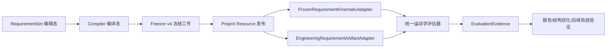

# 需求插件优化实施方案 Implementation Plan

> **For agentic workers:** REQUIRED SUB-SKILL: Use superpowers:subagent-driven-development (recommended) or superpowers:executing-plans to implement this plan task-by-task. Steps use checkbox (`- [ ]`) syntax for tracking.

**Goal:** 将需求插件收敛为“需求编辑、规则解析、校验、冻结、发布”的单一事实来源，并通过稳定的冻结执行契约把任务点和工作区域交给运动学、结构优化及后续验证插件，避免各插件重复解释需求。

**Architecture:** 保留现有 `RequirementSet -> CompiledRequirementSet -> FrozenRequirementArtifact` 三层生命周期，在 `robotanalysiscore` 增加中性的 `RequirementExecutionSet` 契约。编辑态只保存用户语义；编译态把坐标系、姿态规则和诊断解析出来；冻结态生成带模型/场景/需求指纹的 v4 工件。需求插件不执行 IK、工作空间采样或覆盖率计算，消费方按 `Quick` 或 `Verified` 选择计算精度并回传证据。

**Tech Stack:** C++17、Qt 6 Widgets、Qt JSON、RobWork `WorkCell/Device/State/Frame`、`sdurws_robotanalysiscore`、Catch2 风格测试、CMake/CTest。

---

## 1. 目标边界与最终职责

### 1.1 需求插件负责的事情

1. 编辑任务点、工作区域、工艺类型、需求等级、坐标系引用、TCP、姿态规则、容差和验证策略。
2. 在编辑时完成字段级校验；在编译时完成坐标系引用、几何特征、姿态规则和单位的解析。
3. 保存 `compileState`、`excludedReason`、诊断代码和来源证据，不静默丢弃任何用户输入。
4. 在模型、场景和需求指纹一致时冻结并发布可复现的执行工件。
5. 向下游发布同一份任务/区域契约，并明确每一条输入的 `Must/Should/Info` 语义。

### 1.2 需求插件明确不负责的事情

- 不调用 IK 求解器。
- 不生成关节空间工作空间点云。
- 不计算任务覆盖率、方向覆盖率或结构优化分数。
- 不把 `Pass/Warning/Fail` 结果写回需求源数据；结果由消费插件按各自验证阶段生成。
- 不把 Should 项静默转换为 Must，也不把无法解析的 Must 项降级为可选项。

### 1.3 三类概念的边界

| 概念 | 需求插件输出 | 运动学插件消费 | 是否进入正式验收 |
|---|---|---|---|
| Current pose | 不作为需求输入；仅可记录采集来源 | 当前状态 FK/Jacobian/关节裕量诊断 | 否，只有证据 |
| Task point | 单个目标位姿、姿态规则解析结果、容差、等级 | 单目标 IK 和批量任务可达性 | 是，Must 任务必须满足 |
| Workspace region | 区域几何、采样策略、姿态策略、覆盖率阈值、等级 | Quick 估计或 Verified 区域逐点 IK | Verified 的 Must 区域是正式依据 |
| Pose reachability | 需求只提供方向/滚转规则与阈值 | 方向覆盖率、姿态覆盖率 | 仅在区域策略要求时进入验收 |

### 1.4 状态模型

需求输入有效性和算法结果必须分开：

```text
Feasibility = Feasible | Infeasible | DataInsufficient | NotEvaluated
Quality      = Good | Degraded | Critical | Unknown
```

`Pass/Warning/Fail` 只作为旧 UI 的显示映射，不再作为跨插件机器接口。建议映射如下：

| Feasibility | Quality | 旧显示 |
|---|---|---|
| Feasible | Good | Pass |
| Feasible | Degraded | Warning |
| Infeasible | Critical | Fail |
| DataInsufficient | Unknown | Warning（数据不足） |
| NotEvaluated | Unknown | 未评估 |

---

## 2. 现状文件与改造后文件边界

### 2.1 保留并修改的需求插件文件

- `RobWorkStudio/src/rwslibs/engineeringrequirements/EngineeringRequirementTypes.hpp`：编辑态、编译态、工作区域和诊断类型。
- `RobWorkStudio/src/rwslibs/engineeringrequirements/RequirementCompiler.hpp`、`RequirementCompiler.cpp`：编译、规则解析和诊断。
- `RobWorkStudio/src/rwslibs/engineeringrequirements/RequirementFreezer.hpp`、`RequirementFreezer.cpp`：冻结 v4、指纹、迁移和完整性校验。
- `RobWorkStudio/src/rwslibs/engineeringrequirements/RequirementSetJson.cpp`：编辑态 JSON 读写和 v1 迁移。
- `RobWorkStudio/src/rwslibs/engineeringrequirements/EngineeringRequirementsWidget.hpp`、`EngineeringRequirementsWidget.cpp`：编辑 UI、校验面板、冻结/发布动作。
- `RobWorkStudio/src/rwslibs/engineeringrequirements/EngineeringRequirementsPlugin.cpp`：项目资源生命周期和发布事件。
- `RobWorkStudio/src/rwslibs/engineeringrequirements/EngineeringRequirementsTest.cpp`：单元、序列化、迁移和契约测试。
- `RobWorkStudio/src/rwslibs/engineeringrequirements/CMakeLists.txt`：加入新增源文件和测试依赖。

### 2.2 新增公共契约文件

- `RobWorkStudio/src/rwslibs/robotanalysiscore/RequirementExecutionTypes.hpp`：下游中立执行契约、诊断、区域策略和 provenance。
- `RobWorkStudio/src/rwslibs/robotanalysiscore/RequirementExecutionJson.hpp`、`RequirementExecutionJson.cpp`：契约 JSON 序列化，供运动学和结构优化共用。
- `RobWorkStudio/src/rwslibs/robotanalysiscore/RobotAnalysisCoreTest.cpp`：契约序列化和枚举兼容测试（若现有测试拆分为多个文件，则加入 `RequirementExecutionTypesTest.cpp`）。
- `RobWorkStudio/src/rwslibs/robotanalysiscore/CMakeLists.txt`：导出头文件和 JSON 源文件。

### 2.3 下游适配文件

- `RobWorkStudio/src/rwslibs/kinematicanalysis/FrozenRequirementKinematicAdapter.hpp`、`FrozenRequirementKinematicAdapter.cpp`：完整转换任务和区域，拒绝不完整工件。
- `RobWorkStudio/src/rwslibs/structureoptimizer/EngineeringRequirementArtifactAdapter.hpp`、`EngineeringRequirementArtifactAdapter.cpp`：消费统一契约；保留旧格式读取兼容。
- `RobWorkStudio/src/rwslibs/kinematicanalysis/KinematicAnalysisTest.cpp`、`RobWorkStudio/src/rwslibs/structureoptimizer/StructureOptimizationTest.cpp`：跨插件契约回归。

---

## 3. 目标数据流与发布协议



冻结工件必须包含以下 provenance：

```cpp
struct RequirementProvenance {
    std::string requirementFingerprint;
    std::string robotModelFingerprint;
    std::string workcellFingerprint;
    std::string environmentFingerprint;
    std::string compilerVersion;
    std::string frozenAt;
    std::string sourcePath;
};
```

消费方在开始计算前必须验证：

1. `schemaVersion == 4`，或由读取器成功迁移到 v4。
2. `compiled.frozen == true`。
3. 需求、机器人模型、WorkCell 场景和环境指纹非空且与当前上下文一致。
4. 每个 `Must` 项的 `compileState == Included`。
5. 每个 Verified 区域的策略字段完整；无法确定姿态策略时返回 `DataInsufficient`，不能默认通过。

---

## 4. 目标契约定义

### 4.1 `RequirementExecutionSet`

在 `robotanalysiscore/RequirementExecutionTypes.hpp` 中增加以下类型；字段名称在所有插件中保持一致：

```cpp
enum class RequirementCompileState {
    Included,
    Excluded,
    Invalid
};

enum class RequirementDiagnosticSeverity {
    Info,
    Warning,
    Error
};

struct RequirementDiagnostic {
    std::string code;
    RequirementDiagnosticSeverity severity = RequirementDiagnosticSeverity::Info;
    std::string requirementId;
    std::string field;
    std::string message;
    std::string source;
};

struct RequirementItemProvenance {
    std::string sourceId;
    std::string sourceKind;
    RequirementCompileState compileState = RequirementCompileState::Included;
    std::string excludedReason;
    std::vector<RequirementDiagnostic> diagnostics;
};

struct WorkspaceVerificationPolicy {
    enum class Stage { Quick, Verified };
    Stage minimumStage = Stage::Verified;
    bool collisionFreeRequired = true;
    double positionToleranceMeters = 0.001;
    double orientationToleranceDeg = 1.0;
    double minimumCoverage = 1.0;
    double minimumOrientationCoverage = 0.0;
    double minimumJointMargin = 0.0;
    double minimumManipulability = 0.0;
};

struct RequirementExecutionSet {
    int schemaVersion = 1;
    RequirementProvenance provenance;
    std::vector<TaskRequirement> tasks;
    std::vector<WorkspaceRequirement> workspaceRegions;
    std::vector<RequirementDiagnostic> diagnostics;
};
```

`TaskRequirement` 必须包含 `id/name/level/refFrame/tcpFrame/position/rpyDeg/tolerance/orientationRule/validationPolicy/provenance`；`WorkspaceRequirement` 必须包含 `id/name/level/refFrame/tcpFrame/center/size/samplesPerAxis/orientationMode/fixedRpyDeg/directionSamples/rollSamples/verificationPolicy/provenance`。

### 4.2 工作区域字段扩展

在 `EngineeringRequirementTypes.hpp` 的 `WorkspaceDemandRegion` 增加并序列化以下字段：

```cpp
std::string tcpFrame = "";
OrientationMode orientationMode = OrientationMode::Fixed;
std::array<double, 3> fixedRpyDeg = {{0.0, 0.0, 0.0}};
int directionSamples = 1;
int rollSamples = 1;
double minimumOrientationCoverage = 0.0;
bool collisionFreeRequired = true;
double positionToleranceMeters = 0.001;
double orientationToleranceDeg = 1.0;
double minimumJointMargin = 0.0;
double minimumManipulability = 0.0;
WorkspaceVerificationPolicy::Stage minimumVerificationStage =
    WorkspaceVerificationPolicy::Stage::Verified;
RequirementCompileState compileState = RequirementCompileState::Included;
std::string excludedReason;
std::vector<RequirementDiagnostic> diagnostics;
```

约束：`size` 每个分量必须大于 0；`samplesPerAxis >= 2` 才能生成 Verified 网格；`directionSamples >= 1`、`rollSamples >= 1`；覆盖率区间为 `[0, 1]`；容差和最小指标不能为负数。

### 4.3 v3 到 v4 迁移

- 读取器继续接受 v1、v2、v3。
- v3 的 `WorkspaceDemandRegion` 默认映射为 `orientationMode = Fixed`、`directionSamples = 1`、`rollSamples = 1`、`minimumVerificationStage = Quick`，并添加诊断 `REQ_MIGRATED_V3_WORKSPACE_QUICK_ONLY`。
- v3 工件可用于历史只读和 Quick 分析；当用户点击 Verified 验收或发布给结构优化时，必须提示重新冻结 v4。
- 写出一律使用 v4，不修改原始 v3 文件；迁移结果写入新文件或项目资源。
- 未知字段保留在 `extensions` JSON 对象，读取器不得因新增字段丢失整个工件。

---

## 5. 分阶段实施任务

### Task 1: 建立现状行为基线和失败测试

**Files:**
- Modify: `RobWorkStudio/src/rwslibs/engineeringrequirements/EngineeringRequirementsTest.cpp`
- Test: `RobWorkStudio/src/rwslibs/engineeringrequirements/EngineeringRequirementsTest.cpp`

- [ ] **Step 1: 添加 v3 快照基线测试**

构造当前已有的 v3 工件，断言旧任务点仍能读出 `id/refFrame/tcpFrame/position/rpyDeg/level`，并记录当前 `schemaVersion == 3` 的行为。

- [ ] **Step 2: 添加 Should 项丢失行为的失败测试**

创建一个包含有效 Must、缺少 Frame 的 Should 任务，断言新测试期望 `compileState == Excluded` 且 `excludedReason` 非空，而当前实现会把它当成普通有效任务；先运行测试确认失败。

- [ ] **Step 3: 添加工作区域策略缺失的失败测试**

创建一个区域并设置 `minimumVerificationStage = Verified`、`samplesPerAxis = 1`，断言期望诊断代码为 `REQ_WORKSPACE_GRID_TOO_COARSE`；运行测试确认失败。

- [ ] **Step 4: 运行当前专项测试**

运行：

```powershell
ctest --test-dir build\Desktop_Qt_6_11_1_MSVC2022_64bit-Debug -R sdurws_engineeringrequirements_test --output-on-failure -C Debug
```

预期：新增测试失败，旧测试保持通过；这一步只建立基线，不修改业务逻辑。

### Task 2: 增加 robotanalysiscore 中立执行契约

**Files:**
- Create: `RobWorkStudio/src/rwslibs/robotanalysiscore/RequirementExecutionTypes.hpp`
- Create: `RobWorkStudio/src/rwslibs/robotanalysiscore/RequirementExecutionJson.hpp`
- Create: `RobWorkStudio/src/rwslibs/robotanalysiscore/RequirementExecutionJson.cpp`
- Modify: `RobWorkStudio/src/rwslibs/robotanalysiscore/CMakeLists.txt`
- Test: `RobWorkStudio/src/rwslibs/robotanalysiscore/RobotAnalysisCoreTest.cpp`

- [ ] **Step 1: 写契约枚举和结构体序列化失败测试**

测试以下往返不变量：`RequirementExecutionSet -> QJsonObject -> RequirementExecutionSet` 后，`schemaVersion/provenance/tasks/workspaceRegions/diagnostics` 完全一致；枚举字符串未知时返回错误而不是静默使用默认值。

- [ ] **Step 2: 运行契约测试确认失败**

运行：

```powershell
ctest --test-dir build\Desktop_Qt_6_11_1_MSVC2022_64bit-Debug -R sdurws_robotanalysiscore_test --output-on-failure -C Debug
```

预期：编译失败或新测试失败，因为公共头文件尚不存在。

- [ ] **Step 3: 实现最小契约和 JSON API**

提供以下函数并统一错误输出：

```cpp
QJsonObject toJson(const RequirementExecutionSet& value);
bool fromJson(const QJsonObject& object,
              RequirementExecutionSet& value,
              std::string* error);
```

JSON 顶层键固定为 `schemaVersion/provenance/tasks/workspaceRegions/diagnostics`；数组项必须带 `id` 和 `compileState`。

- [ ] **Step 4: 编译并运行契约测试**

运行：

```powershell
cmake --build build\Desktop_Qt_6_11_1_MSVC2022_64bit-Debug --target sdurws_robotanalysiscore_test --config Debug
ctest --test-dir build\Desktop_Qt_6_11_1_MSVC2022_64bit-Debug -R sdurws_robotanalysiscore_test --output-on-failure -C Debug
```

预期：契约往返、未知枚举拒绝和空数组行为全部 PASS。

### Task 3: 扩展编辑态类型和工作区域策略

**Files:**
- Modify: `RobWorkStudio/src/rwslibs/engineeringrequirements/EngineeringRequirementTypes.hpp`
- Modify: `RobWorkStudio/src/rwslibs/engineeringrequirements/RequirementSetJson.cpp`
- Modify: `RobWorkStudio/src/rwslibs/engineeringrequirements/EngineeringRequirementsTest.cpp`

- [ ] **Step 1: 为新字段添加默认值测试**

解析不含新字段的旧 JSON，断言 `tcpFrame` 为空、姿态为 Fixed、方向/滚转采样均为 1、碰撞要求为 true、位置容差为 1 mm、姿态容差为 1 度。

- [ ] **Step 2: 实现字段和 JSON 键**

新增键名严格使用：`tcpFrame`、`orientationMode`、`fixedRpyDeg`、`directionSamples`、`rollSamples`、`minimumOrientationCoverage`、`collisionFreeRequired`、`positionToleranceMeters`、`orientationToleranceDeg`、`minimumJointMargin`、`minimumManipulability`、`minimumVerificationStage`、`compileState`、`excludedReason`、`diagnostics`。

- [ ] **Step 3: 添加边界反序列化测试**

分别测试负容差、零采样、覆盖率大于 1、未知姿态枚举；期望返回字段诊断，不能在 JSON 读取阶段崩溃。

- [ ] **Step 4: 运行工程需求测试**

```powershell
cmake --build build\Desktop_Qt_6_11_1_MSVC2022_64bit-Debug --target sdurws_engineeringrequirements_test --config Debug
ctest --test-dir build\Desktop_Qt_6_11_1_MSVC2022_64bit-Debug -R sdurws_engineeringrequirements_test --output-on-failure -C Debug
```

预期：旧 JSON 兼容测试和新增字段测试全部 PASS。

### Task 4: 重构 RequirementCompiler 的诊断和编译状态

**Files:**
- Modify: `RobWorkStudio/src/rwslibs/engineeringrequirements/RequirementCompiler.hpp`
- Modify: `RobWorkStudio/src/rwslibs/engineeringrequirements/RequirementCompiler.cpp`
- Modify: `RobWorkStudio/src/rwslibs/engineeringrequirements/EngineeringRequirementsTest.cpp`

- [ ] **Step 1: 写 Must/Should/Info 编译分类测试**

覆盖以下矩阵：

| 等级 | Frame 可解析 | 姿态规则有效 | 期望 |
|---|---:|---:|---|
| Must | 否 | 是 | `Invalid`，阻止冻结 |
| Should | 否 | 是 | `Excluded`，保留原因，不阻止冻结 |
| Info | 否 | 是 | `Excluded` 或审计保留，不进入算法输入 |
| Must | 是 | 否 | `Invalid`，阻止冻结 |

- [ ] **Step 2: 实现诊断收集器**

为每个任务和区域创建 `RequirementItemProvenance`；Must 错误设置编译集不可冻结，Should 错误设置 `Excluded` 并追加 `REQ_OPTIONAL_ITEM_EXCLUDED`，Info 只写审计诊断。

- [ ] **Step 3: 实现姿态规则解析**

`Fixed` 必须得到规范化 RPY；`AlignFrame` 检查 `targetFrame`；`AlignGeometryNormal` 检查几何引用和 `invertNormal`；`PointAtTarget` 检查目标点格式和非零方向。解析结果写入 `resolutionEvidence`，消费方不重新猜测规则。

- [ ] **Step 4: 运行失败矩阵测试**

```powershell
ctest --test-dir build\Desktop_Qt_6_11_1_MSVC2022_64bit-Debug -R sdurws_engineeringrequirements_test --output-on-failure -C Debug
```

预期：Must 错误阻断，Should/Info 保留诊断且不被静默删除。

### Task 5: 升级冻结工件到 schema v4

**Files:**
- Modify: `RobWorkStudio/src/rwslibs/engineeringrequirements/RequirementFreezer.hpp`
- Modify: `RobWorkStudio/src/rwslibs/engineeringrequirements/RequirementFreezer.cpp`
- Modify: `RobWorkStudio/src/rwslibs/engineeringrequirements/EngineeringRequirementsTest.cpp`

- [ ] **Step 1: 写 v4 冻结失败测试**

测试：Must 诊断错误、缺模型指纹、缺环境快照、区域 Verified 采样不足、旧 schema 直接用于 Verified。每个用例都应返回明确错误码或错误文本。

- [ ] **Step 2: 实现 v4 工件字段**

将 `FrozenRequirementArtifact::schemaVersion` 默认改为 4；增加 `RequirementExecutionSet execution`，并保留旧 `compiled.poseTasks/workspaceRegions` 只读兼容字段，保证旧 API 编译期不立即破坏。

- [ ] **Step 3: 实现 v3 读取和迁移**

读取 v3 后调用 `migrateV3ToV4`：区域设置为 Fixed/Quick，写入迁移诊断；若消费方请求 Verified，则返回 `REQ_V3_REQUIRES_REFREEZE`。

- [ ] **Step 4: 实现冻结完整性检查**

`validateFrozenArtifact` 必须检查：schema、指纹、冻结标记、设备/TCP、场景快照、Must 项 included、区域策略完整性；检查失败时不返回可消费的执行契约。

- [ ] **Step 5: 运行序列化和冻结测试**

```powershell
cmake --build build\Desktop_Qt_6_11_1_MSVC2022_64bit-Debug --target sdurws_engineeringrequirements_test --config Debug
ctest --test-dir build\Desktop_Qt_6_11_1_MSVC2022_64bit-Debug -R sdurws_engineeringrequirements_test --output-on-failure -C Debug
```

预期：v3 可读、v4 可写、损坏工件被拒绝、迁移诊断可审计。

### Task 6: 生成完整 RequirementExecutionSet

**Files:**
- Modify: `RobWorkStudio/src/rwslibs/engineeringrequirements/RequirementFreezer.cpp`
- Modify: `RobWorkStudio/src/rwslibs/kinematicanalysis/FrozenRequirementKinematicAdapter.hpp`
- Modify: `RobWorkStudio/src/rwslibs/kinematicanalysis/FrozenRequirementKinematicAdapter.cpp`
- Modify: `RobWorkStudio/src/rwslibs/kinematicanalysis/KinematicAnalysisTest.cpp`

- [ ] **Step 1: 写适配器失败测试**

冻结工件同时含两个任务和两个区域，断言适配后四项均存在、区域姿态和阈值不丢失；Should Excluded 项不进入 `tasks/workspaceRegions`，但在 diagnostics 中可查。

- [ ] **Step 2: 定义适配器 API**

提供：

```cpp
bool FrozenRequirementKinematicAdapter::toExecutionSet(
    const FrozenRequirementArtifact& artifact,
    RequirementExecutionSet& output,
    std::string* error) const;
```

方法只做 schema、指纹和类型转换，不创建 Device、不调用 IK。

- [ ] **Step 3: 实现任务和区域完整映射**

任务映射 `id/name/level/refFrame/tcpFrame/position/rpyDeg/tolerance/orientationRule/validationPolicy`；区域映射 `center/size/samplesPerAxis/orientationMode/fixedRpyDeg/directionSamples/rollSamples/verificationPolicy`。

- [ ] **Step 4: 运行跨插件适配测试**

```powershell
cmake --build build\Desktop_Qt_6_11_1_MSVC2022_64bit-Debug --target sdurws_kinematicanalysis_test --config Debug
ctest --test-dir build\Desktop_Qt_6_11_1_MSVC2022_64bit-Debug -R sdurws_kinematicanalysis_test --output-on-failure -C Debug
```

预期：完整契约映射、旧 v3 拒绝 Verified、缺指纹拒绝消费均 PASS。

### Task 7: 更新结构优化适配器

**Files:**
- Modify: `RobWorkStudio/src/rwslibs/structureoptimizer/EngineeringRequirementArtifactAdapter.hpp`
- Modify: `RobWorkStudio/src/rwslibs/structureoptimizer/EngineeringRequirementArtifactAdapter.cpp`
- Modify: `RobWorkStudio/src/rwslibs/structureoptimizer/StructureOptimizationTest.cpp`

- [ ] **Step 1: 写结构优化契约测试**

测试一个 Must 任务、一个 Should 任务、一个 Verified Must 区域；断言结构优化只创建 Must 任务和 Must 区域硬约束，Should 被保留为可选证据而不是直接报错。

- [ ] **Step 2: 实现 v4 优先适配**

优先读取 `artifact.execution`；没有该字段时按 v3 兼容路径读取，并明确标记旧区域为 Quick。删除当前“任何 Should 区域直接失败”的行为，改为 `Excluded/Optional` 诊断。

- [ ] **Step 3: 映射区域策略**

结构优化 Quick 阶段只消费几何区域和最低覆盖率；Verified 阶段将 `minimumVerificationStage`、碰撞要求、关节裕量、可操作度阈值传给公共运动学评估器，不在适配器中复制 IK 逻辑。

- [ ] **Step 4: 运行结构优化回归**

```powershell
cmake --build build\Desktop_Qt_6_11_1_MSVC2022_64bit-Debug --target sdurws_structureoptimizer_test --config Debug
ctest --test-dir build\Desktop_Qt_6_11_1_MSVC2022_64bit-Debug -R sdurws_structureoptimizer_test --output-on-failure -C Debug
```

预期：v4/v3 兼容、Must 硬约束、Should 可选证据和区域策略传递全部 PASS。

### Task 8: 完成需求插件 UI 工作流

**Files:**
- Modify: `RobWorkStudio/src/rwslibs/engineeringrequirements/EngineeringRequirementsWidget.hpp`
- Modify: `RobWorkStudio/src/rwslibs/engineeringrequirements/EngineeringRequirementsWidget.cpp`
- Modify: `RobWorkStudio/src/rwslibs/engineeringrequirements/EngineeringRequirementsPlugin.cpp`
- Modify: `RobWorkStudio/src/rwslibs/engineeringrequirements/EngineeringRequirementsTest.cpp`

- [ ] **Step 1: 添加 UI 行为测试**

验证：输入无效 Must 后“冻结/发布”按钮不可用；输入无效 Should 后按钮可用但显示排除原因；切换区域到 Verified 且采样不足时显示具体字段错误；修改已冻结数据后状态变为 Dirty。

- [ ] **Step 2: 实现编辑校验面板**

按 `Error/Warning/Info` 分组显示 `code/requirementId/field/message`；每条诊断可定位到任务或区域行；不在 UI 中显示算法结果作为需求校验结果。

- [ ] **Step 3: 实现冻结预览**

冻结前显示：需求指纹、机器人指纹、场景指纹、Included/Excluded 数量、Quick/Verified 区域数量和最终写出 schema v4。用户确认后才调用 `RequirementFreezer`。

- [ ] **Step 4: 实现发布事件**

发布成功后发出包含 `resourceId/path/requirementFingerprint/schemaVersion` 的信号；运动学和结构优化只响应该事件或项目资源解析，不从 UI 控件读取数据。

- [ ] **Step 5: 运行 UI/编译测试**

```powershell
cmake --build build\Desktop_Qt_6_11_1_MSVC2022_64bit-Debug --target sdurws_engineeringrequirements --config Debug
ctest --test-dir build\Desktop_Qt_6_11_1_MSVC2022_64bit-Debug -R sdurws_engineeringrequirements_test --output-on-failure -C Debug
```

预期：编译成功，校验、冻结按钮和发布事件测试通过。

### Task 9: 项目资源生命周期和脏状态联动

**Files:**
- Modify: `RobWorkStudio/src/rwslibs/engineeringrequirements/EngineeringRequirementsPlugin.cpp`
- Modify: `RobWorkStudio/src/rwslibs/engineeringrequirements/EngineeringRequirementsWidget.cpp`
- Modify: `RobWorkStudio/src/rwslibs/engineeringrequirements/EngineeringRequirementsTest.cpp`

- [ ] **Step 1: 写资源生命周期失败测试**

打开项目并加载主 WorkCell 后编辑需求，断言自动确保 `engineering-requirements.main`，路径为 `requirements/main.requirements.json`，所有者为 generated，并依赖主 WorkCell 与 RobotModel。

- [ ] **Step 2: 实现 manifest-first 资源解析**

插件启动时优先解析项目资源；无项目时保持独立文件模式。保存副本只调用 `writeRequirementDocument`，不得改变项目文档 clean 状态。

- [ ] **Step 3: 实现指纹变更失效**

WorkCell、RobotModel、场景或编辑内容变化后，发布资源标记 dirty；下游收到旧指纹时拒绝验证并提示重新冻结，不自动使用当前状态覆盖冻结证据。

- [ ] **Step 4: 运行项目系统回归**

```powershell
ctest --test-dir build\Desktop_Qt_6_11_1_MSVC2022_64bit-Debug -R 'sdurws_(engineeringrequirements|sdurws-gtest)' --output-on-failure -C Debug
```

预期：生成资源、依赖顺序、事务保存和 dirty/clean 状态均通过。

### Task 10: 迁移工具、错误码和文档

**Files:**
- Create: `RobWorkStudio/src/rwslibs/engineeringrequirements/RequirementMigration.hpp`
- Create: `RobWorkStudio/src/rwslibs/engineeringrequirements/RequirementMigration.cpp`
- Create: `RobWorkStudio/src/rwslibs/engineeringrequirements/README.md`
- Modify: `RobWorkStudio/src/rwslibs/engineeringrequirements/CMakeLists.txt`
- Modify: `RobWorkStudio/src/rwslibs/engineeringrequirements/EngineeringRequirementsTest.cpp`

- [ ] **Step 1: 定义稳定错误码**

至少实现：`REQ_SCHEMA_UNSUPPORTED`、`REQ_MUST_INVALID`、`REQ_OPTIONAL_ITEM_EXCLUDED`、`REQ_FRAME_NOT_FOUND`、`REQ_ORIENTATION_RULE_INVALID`、`REQ_WORKSPACE_GRID_TOO_COARSE`、`REQ_V3_REQUIRES_REFREEZE`、`REQ_FINGERPRINT_MISMATCH`、`REQ_SCENE_SNAPSHOT_MISSING`。

- [ ] **Step 2: 实现 v3 到 v4 迁移 API**

```cpp
bool migrateRequirementArtifact(const QJsonObject& input,
                                QJsonObject& output,
                                std::vector<RequirementDiagnostic>& diagnostics,
                                std::string* error);
```

输入 v3 时输出 v4，不覆盖输入文件；迁移诊断写入工件并可在 UI/报告中显示。

- [ ] **Step 3: 编写 README**

文档必须包含：职责边界、字段单位、Must/Should/Info 语义、v3/v4 兼容策略、Quick/Verified 区别、下游调用顺序、错误码表、禁止需求插件实现 IK 的原因。

- [ ] **Step 4: 运行全量相关测试**

```powershell
cmake --build build\Desktop_Qt_6_11_1_MSVC2022_64bit-Debug --target sdurws_engineeringrequirements sdurws_kinematicanalysis sdurws_structureoptimizer --config Debug
ctest --test-dir build\Desktop_Qt_6_11_1_MSVC2022_64bit-Debug -R 'sdurws_(engineeringrequirements|kinematicanalysis|structureoptimizer|robotanalysiscore)' --output-on-failure -C Debug
git diff --check
```

预期：所有目标构建成功，相关测试通过，差异无空白错误。

### Task 11: 端到端验收场景

**Files:**
- Test: `RobWorkStudio/src/rwslibs/engineeringrequirements/EngineeringRequirementsTest.cpp`
- Test: `RobWorkStudio/src/rwslibs/kinematicanalysis/KinematicAnalysisTest.cpp`
- Test: `RobWorkStudio/src/rwslibs/structureoptimizer/StructureOptimizationTest.cpp`

- [ ] **Step 1: 创建可达 Must 任务和 Verified 区域**

使用当前 TCP FK 位姿生成一个任务点；以该点周围小立方体生成 `samplesPerAxis = 3`、固定姿态、`minimumCoverage = 1.0` 的 Verified 区域。

- [ ] **Step 2: 冻结并发布 v4 工件**

断言工件包含完整指纹、`execution.tasks.size() == 1`、`execution.workspaceRegions.size() == 1`、schema 为 4。

- [ ] **Step 3: 由运动学插件验证**

断言任务和区域均被评估，区域报告明确标记 `Verified`；没有把 Current pose 结果混入需求总状态。

- [ ] **Step 4: 由结构优化插件消费**

断言结构优化收到同一 `requirementFingerprint`，创建一个任务约束和一个区域约束，没有重新解析原始 UI JSON。

- [ ] **Step 5: 验收旧 v3 工件**

断言 v3 可打开和 Quick 读取，但触发 Verified 时得到 `REQ_V3_REQUIRES_REFREEZE`，并且不执行正式验收。

---

## 6. 验收标准

- 编辑态、编译态、冻结态职责可在代码和 JSON 中区分。
- 任何 Must 编译错误阻止冻结；Should/Info 不被静默丢弃。
- v3 可读，v4 可写；v3 不得未经重新冻结进入 Verified。
- 下游只依赖 `RequirementExecutionSet`，不依赖需求插件 Widget。
- 工作区域包含明确的姿态策略、采样密度、碰撞、裕量、可操作度和覆盖率阈值。
- Quick 结果只用于估计/结构优化粗筛；Verified 结果由区域网格逐点 IK 产生并进入正式验收。
- `DataInsufficient` 不得被映射成 Feasible。
- 同一冻结指纹在运动学、结构优化和后续模块中保持一致。
- 端到端测试通过，`git diff --check` 无错误。

## 7. 实施自审清单

- [ ] 扫描方案中的未完成标记、占位英文词和模糊转述等占位表达，结果为空。
- [ ] 检查所有字段名在 `RequirementExecutionTypes.hpp`、Freezer、两个 Adapter 和测试中一致。
- [ ] 检查所有测试命令使用当前构建目录和 `Debug` 配置。
- [ ] 检查方案没有要求需求插件创建 Device、调用 IK 或计算覆盖率。
- [ ] 检查 v3/v4、Quick/Verified、Feasibility/Quality 和 Must/Should/Info 的语义没有互相矛盾。
- [ ] 仅新增本计划文件及实现阶段明确列出的文件，不删除工作树中用户已有文件。
