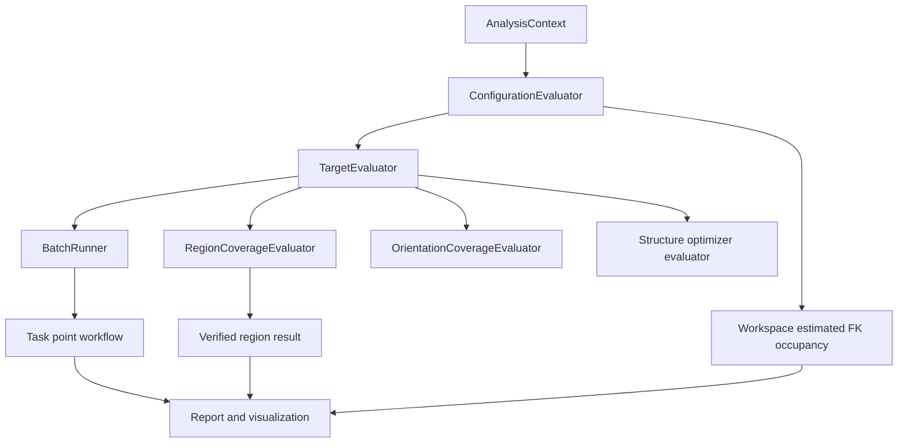

# 运动学插件优化实施方案 Implementation Plan

> **For agentic workers:** REQUIRED SUB-SKILL: Use superpowers:subagent-driven-development (recommended) or superpowers:executing-plans to implement this plan task-by-task. Steps use checkbox (`- [ ]`) syntax for tracking.

**Goal:** 将运动学插件优化为一个可复用、可验证、可被需求插件和结构优化插件共同调用的运动学评估服务，统一 Current pose、单目标 IK、Task points、Workspace estimated、Verified region coverage 和 Orientation coverage 的指标、状态和证据。

**Architecture:** 保留 `KinematicAnalyzer` 作为兼容入口，内部拆分 `AnalysisContext`、`ConfigurationEvaluator`、`TargetEvaluator`、`RegionCoverageEvaluator`、`OrientationCoverageEvaluator` 和 `BatchRunner`。`AnalysisContext` 持有计算期间有效的只读 `WorkCell`、`Device`、TCP、`State` 副本和可选碰撞检测器，使 Frame/TCP/区域坐标解析在运动学核心内闭合。所有目标位姿最终只经过一个 `TargetEvaluator`；Task points 负责批量编排和需求聚合；Workspace estimated 只做关节空间 FK 粗估；Verified region coverage 从需求区域网格生成目标并逐点 IK，是正式工作区域验收依据。UI 只编排工作流和展示结果，结构优化消费同一组 evaluator，不再复制 IK/覆盖率逻辑。

**Tech Stack:** C++17、Qt 6 Widgets/QtConcurrent、RobWork `Device/State/Frame/Transform3D/Jacobian`、`sdurws_robotanalysiscore`、RobWork IK/Proximity、Eigen SVD、Catch2 风格测试、CMake/CTest。

---

## 1. 最终职责与术语

### 1.1 工作流职责

| 工作流 | 输入 | 核心计算 | 结果用途 |
|---|---|---|---|
| Diagnose | 当前 `Device/State/TCP` | FK、Jacobian、奇异值、条件数、可操作度、关节裕量、碰撞 | 当前状态诊断；不改变需求结论 |
| Validate Requirements | 冻结需求执行契约 | Task point IK + Verified region coverage + orientation coverage | Must/Should 正式验收 |
| Explore Capability | 手动采样配置或区域 | Workspace estimated + pose/orientation coverage | 能力探索、结构优化 Quick 筛选 |
| Visualization/Report | 任一工作流结果 | 过滤、着色、导出、审计 | 跨工作流证据视图 |

### 1.2 现有功能的最终定义

- `Current pose`：对当前关节状态做一次配置评估；不等于“当前需求已满足”。
- `IK`：对一个目标位姿生成候选解，逐个评估残差、碰撞、关节裕量、奇异性和可操作度。
- `Task points`：批量调用同一 IK evaluator，并按需求等级聚合；不重新实现求解器。
- `Workspace estimated`：在关节限位内采样并做 FK 占格；结果类型必须带 `Estimated` 标记，不作为需求区域正式验收。
- `Workspace Verified`：从 `WorkspaceRequirement` 的区域坐标系生成位置网格，按姿态策略生成目标，逐点调用 IK；输出位置覆盖率、姿态覆盖率和失败证据。
- `Pose reachability`：只表达位置点上的方向/滚转可达性。实现上拆成 `directionCoverage` 和 `orientationCoverage`，避免把“方向可达”误称为完整姿态可达。

### 1.3 不能混用的总状态

```text
Feasibility = Feasible | Infeasible | DataInsufficient | NotEvaluated
Quality      = Good | Degraded | Critical | Unknown
```

需求验证总状态只由启用的 Must task 和 Must Verified region 决定；Current pose、Workspace estimated、Explore Capability 只能提供证据和诊断。碰撞检查被需求声明为必需但检测器不可用时，返回 `DataInsufficient`，不能按“未检测到碰撞”算通过。

---

## 2. 现状文件和目标文件布局

### 2.1 现有入口与兼容文件

- `RobWorkStudio/src/rwslibs/kinematicanalysis/KinematicAnalyzer.hpp`、`KinematicAnalyzer.cpp`：保留公共旧入口，内部委托新 evaluator。
- `RobWorkStudio/src/rwslibs/kinematicanalysis/KinematicAnalysisTypes.hpp`、`.cpp`：扩展状态、证据、配置和结果类型。
- `RobWorkStudio/src/rwslibs/kinematicanalysis/FrozenRequirementKinematicAdapter.hpp`、`.cpp`：读取冻结需求执行契约。
- `RobWorkStudio/src/rwslibs/kinematicanalysis/KinematicAnalysisWidget.hpp`、`.cpp`：重排为三个工作流和结果视图。
- `RobWorkStudio/src/rwslibs/kinematicanalysis/KinematicAnalysisTest.cpp`：保留旧 API 测试并增加新 evaluator/区域验收测试。
- `RobWorkStudio/src/rwslibs/kinematicanalysis/KinematicAnalysisWorkspace.*`、`KinematicAnalysisPoseReachability.*`：复用数据结构；算法搬入 evaluator 后只保留 UI/展示辅助。
- `RobWorkStudio/src/rwslibs/kinematicanalysis/KinematicAnalysisCollision.*`、`KinematicMetrics.*`、`TaskPointResolver.*`：作为底层辅助，禁止在多个 evaluator 重复计算同一指标。
- `RobWorkStudio/src/rwslibs/kinematicanalysis/CMakeLists.txt`：加入新源文件和 `Qt6::Concurrent`（若现有 Qt 版本要求）。

### 2.2 新增核心文件

- Create: `RobWorkStudio/src/rwslibs/kinematicanalysis/KinematicAnalysisContext.hpp`
- Create: `RobWorkStudio/src/rwslibs/kinematicanalysis/ConfigurationEvaluator.hpp`
- Create: `RobWorkStudio/src/rwslibs/kinematicanalysis/ConfigurationEvaluator.cpp`
- Create: `RobWorkStudio/src/rwslibs/kinematicanalysis/TargetEvaluator.hpp`
- Create: `RobWorkStudio/src/rwslibs/kinematicanalysis/TargetEvaluator.cpp`
- Create: `RobWorkStudio/src/rwslibs/kinematicanalysis/RegionCoverageEvaluator.hpp`
- Create: `RobWorkStudio/src/rwslibs/kinematicanalysis/RegionCoverageEvaluator.cpp`
- Create: `RobWorkStudio/src/rwslibs/kinematicanalysis/OrientationCoverageEvaluator.hpp`
- Create: `RobWorkStudio/src/rwslibs/kinematicanalysis/OrientationCoverageEvaluator.cpp`
- Create: `RobWorkStudio/src/rwslibs/kinematicanalysis/KinematicBatchRunner.hpp`
- Create: `RobWorkStudio/src/rwslibs/kinematicanalysis/KinematicBatchRunner.cpp`

这些类依赖 Qt-light 的 `AnalysisContext` 和 `robotanalysiscore` 类型；不得依赖 `KinematicAnalysisWidget` 或 Qt 控件。

---

## 3. 目标架构和调用关系



### 3.1 `AnalysisContext`

在 `KinematicAnalysisContext.hpp` 中定义不可变计算输入和可选能力：

```cpp
struct AnalysisContext {
    rw::core::Ptr<rw::models::WorkCell> workcell;
    rw::core::Ptr<rw::models::Device> device;
    rw::core::Ptr<const rw::kinematics::Frame> tcpFrame;
    rw::kinematics::State baseState;
    rw::core::Ptr<rw::proximity::CollisionDetector> collisionDetector;
    std::string deviceName;
    std::string tcpFrameName;
    std::string modelFingerprint;
    std::string environmentFingerprint;
    KinematicThresholds thresholds;
    bool collisionRequired = false;
};
```

构造时验证 `workcell/device/tcpFrame`，拷贝 `State` 作为 worker 输入；`workcell` 只用于只读 Frame 查找和坐标变换，并由 `Ptr` 保证后台任务期间生命周期有效。任何后台任务禁止写 Studio 的 live state。

### 3.2 配置评估接口

```cpp
class ConfigurationEvaluator {
public:
    ConfigurationEvaluation evaluate(
        const AnalysisContext& context,
        const rw::math::Q& q,
        const ConfigurationEvaluationOptions& options) const;
};
```

一次 `evaluate` 必须集中完成：`setQ`、FK、TCP 位姿、Jacobian、SVD、条件数、可操作度、每关节归一化裕量、碰撞和状态归类。调用方不得再从 Q/Jacobian 重算这些指标。

### 3.3 目标评估接口

```cpp
class TargetEvaluator {
public:
    TargetEvaluation evaluate(
        const AnalysisContext& context,
        const TaskPoint& target,
        const TargetEvaluationOptions& options) const;
};
```

`TargetEvaluator` 完成 Frame/TCP 解析、目标位姿转换、IK 多种子求解、残差计算、候选配置 `ConfigurationEvaluator`、碰撞必需性判断和排序。Task points、区域覆盖率和姿态覆盖率都只能调用此接口。

---

## 4. 统一数据模型

### 4.1 配置和目标结果

在 `KinematicAnalysisTypes.hpp` 增加：

```cpp
enum class AnalysisEvidenceStage { Estimated, Quick, Verified };
enum class Feasibility { Feasible, Infeasible, DataInsufficient, NotEvaluated };
enum class Quality { Good, Degraded, Critical, Unknown };
enum class KinematicFailureReason {
    None, NoDevice, NoTcpFrame, InvalidTarget, IkNoSolution,
    Collision, CollisionDetectorUnavailable, JointLimit,
    NearJointLimit, Singular, NearSingular, FrameNotFound, SolverError
};

struct ConfigurationEvaluation {
    AnalysisEvidenceStage stage = AnalysisEvidenceStage::Quick;
    Feasibility feasibility = Feasibility::NotEvaluated;
    Quality quality = Quality::Unknown;
    RequirementExecutionProvenance provenance;
    rw::math::Q q;
    rw::math::Transform3D<> tcpPose;
    std::vector<double> jointLimitMargins;
    double minimumJointMargin = 0.0;
    std::vector<double> jacobianRowMajor;
    int jacobianRows = 0;
    int jacobianCols = 0;
    std::vector<double> singularValues;
    double conditionNumber = 0.0;
    double manipulability = 0.0;
    bool collisionChecked = false;
    bool inCollision = false;
    std::vector<KinematicFailureReason> failureReasons;
    std::vector<AnalysisWarning> warnings;
};

struct TargetCandidate {
    ConfigurationEvaluation configuration;
    double positionErrorMeters = 0.0;
    double orientationErrorDeg = 0.0;
    double distanceToReferenceQ = 0.0;
    double score = 0.0;
};

struct TargetEvaluation {
    AnalysisEvidenceStage stage = AnalysisEvidenceStage::Quick;
    Feasibility feasibility = Feasibility::NotEvaluated;
    Quality quality = Quality::Unknown;
    RequirementExecutionProvenance provenance;
    RequirementItemProvenance itemProvenance;
    TaskPoint target;
    std::vector<TargetCandidate> candidates;
    std::vector<KinematicFailureReason> failureReasons;
    std::vector<AnalysisWarning> warnings;
};
```

### 4.2 工作区域结果

```cpp
struct RegionCellResult {
    std::array<int, 3> index = {{0, 0, 0}};
    std::array<double, 3> position = {{0.0, 0.0, 0.0}};
    Feasibility feasibility = Feasibility::NotEvaluated;
    Quality quality = Quality::Unknown;
    int reachableOrientationCount = 0;
    int sampledOrientationCount = 0;
    double bestManipulability = 0.0;
    double bestJointMargin = 0.0;
    std::vector<KinematicFailureReason> failureReasons;
};

struct RegionCoverageResult {
    AnalysisEvidenceStage stage = AnalysisEvidenceStage::Verified;
    Feasibility feasibility = Feasibility::NotEvaluated;
    Quality quality = Quality::Unknown;
    RequirementExecutionProvenance provenance;
    RequirementItemProvenance itemProvenance;
    std::string regionId;
    int totalCells = 0;
    int reachableCells = 0;
    int sampledOrientations = 0;
    int reachableOrientations = 0;
    double positionCoverage = 0.0;
    double orientationCoverage = 0.0;
    std::vector<RegionCellResult> cells;
    std::vector<AnalysisWarning> warnings;
};
```

### 4.3 结果聚合规则

```cpp
struct RequirementValidationSummary {
    AnalysisEvidenceStage stage = AnalysisEvidenceStage::Verified;
    Feasibility feasibility = Feasibility::NotEvaluated;
    Quality quality = Quality::Unknown;
    RequirementExecutionProvenance provenance;
    int mustTaskCount = 0;
    int mustTaskFeasibleCount = 0;
    int mustRegionCount = 0;
    int mustRegionFeasibleCount = 0;
    std::vector<TargetEvaluation> taskResults;
    std::vector<RegionCoverageResult> regionResults;
    std::vector<AnalysisWarning> warnings;
};
```

聚合优先级：`DataInsufficient > Infeasible > Feasible`；同一 Feasibility 下 `Critical > Degraded > Good`。Current pose 和 estimated workspace 不参与该结构体的 Must 计数。

### 4.4 执行边界与审查修订

- 只修改 `kinematicanalysis` 以及 Task 12 明确列出的 `structureoptimizer` 适配/消费文件。
- `engineeringrequirements`、`robotmodelbuilder` 和其他建模模块源码不修改；最终阶段只构建并运行其现有回归测试。
- `AnalysisContext` 必须持有只读 `WorkCell`，否则 `TargetEvaluator` 无法完成 `refFrame/tcpFrame` 解析，`RegionCoverageEvaluator` 也无法完成区域坐标变换。
- `AlignGeometryNormal` 只消费冻结执行契约已经标准化的 `frame:<frameName>` 引用，并使用该 Frame 的 Z 轴；未知几何引用返回 `DataInsufficient`，不调用需求模块重新解释编辑态规则。
- 每个结果对象都显式携带 `evidenceStage/feasibility/quality/provenance`；条目结果额外携带 `RequirementItemProvenance`。
- CTest 必须为测试可执行文件的子套件参数逐一注册测试名。任何 `ctest -R` 命令必须先用 `ctest -N -R` 证明至少匹配一个测试，禁止把 `No tests were found` 当作通过。
- 当前工作区直接修改；保留并忽略用户已有的模型资源移动、删除和其他未跟踪文档，不自动提交。

---

## 5. 分阶段实施任务

### 5.1 原子执行顺序

每个编号步骤都按“写一个失败测试 -> 运行并确认预期失败 -> 最小实现 -> 运行专项测试 -> 运行运动学总回归”的顺序完成；前一步未通过，不进入下一步。

1. `S00` 注册现有测试子套件并证明筛选命令真实执行。
2. `S01` 固化旧 API 的可立即通过行为基线，不引入跨步骤长期失败。
3. `S02` 增加统一枚举、稳定字符串转换和结果元数据。
4. `S03` 增加含只读 WorkCell 的 `AnalysisContext` 及校验工厂。
5. `S04` 抽取纯关节裕量和 Jacobian/SVD 指标。
6. `S05` 实现 `ConfigurationEvaluator` 的 FK、碰撞和状态语义。
7. `S06` 让 Current pose 委托 `ConfigurationEvaluator`。
8. `S07` 实现 `TargetEvaluator` 的 Frame/TCP 解析与单目标 IK。
9. `S08` 实现候选残差、分类、确定性排序和旧 IK 兼容映射。
10. `S09` 实现 `BatchRunner` 和 Must-only task 聚合。
11. `S10` 将 Workspace 标记并约束为 Estimated，复用配置评估。
12. `S11` 实现 Verified region 网格和姿态目标生成。
13. `S12` 实现 Verified region 逐点 IK、覆盖率和状态判定。
14. `S13` 拆分 direction/orientation coverage 并保留旧字段兼容。
15. `S14` 实现需求验证汇总与旧总状态兼容映射。
16. `S15` 完善冻结 v4/v3 Quick 适配，只修改运动学适配器。
17. `S16` 让结构优化消费公共 evaluator，不修改需求或建模模块。
18. `S17` 重排 Diagnose/Validate/Explore UI 静态状态。
19. `S18` 实现后台执行、取消和生命周期保护。
20. `S19` 实现报告 JSON/CSV 和只读视图过滤。
21. `S20` 实现缓存键、批次边界和采样组合上限。
22. `S21` 更新现有 README，运行运动学、结构优化和桌面构建。
23. `S22` 只读运行需求、robotanalysiscore、建模相关回归并执行端到端验收。

### Task 0: 注册可验证的运动学专项测试

**Files:**
- Modify: `RobWorkStudio/src/rwslibs/kinematicanalysis/CMakeLists.txt`
- Test: `RobWorkStudio/src/rwslibs/kinematicanalysis/KinematicAnalysisTest.cpp`

- [x] **Step 1: 证明当前专项筛选为空**

运行：

```powershell
ctest --test-dir build\Desktop_Qt_6_11_1_MSVC2022_64bit-Debug -N -R '^sdurws_kinematicanalysis_test_metrics$' -C Debug
```

预期：显示 `Total Tests: 0`，证明原方案的专项命令不能作为验收证据。

- [x] **Step 2: 增加参数化 CTest 注册函数**

在 `BUILD_TESTING` 块中增加 `add_kinematic_analysis_suite(suite)`，测试名为 `sdurws_kinematicanalysis_test_${suite}`，命令为 `$<TARGET_FILE:sdurws_kinematicanalysis_test> ${suite}`。先注册当前已经存在的 `types/metrics/current_pose/ik/task_points/workspace/pose_reachability/aggregate`；后续新增子套件时在对应任务中同步注册。

- [x] **Step 3: 重新生成并构建测试目标**

先加载 Visual Studio 开发环境，再运行（`cmake --build` 会在 `CMakeLists.txt` 变化后自动重新生成）：

```powershell
cmake --build build\Desktop_Qt_6_11_1_MSVC2022_64bit-Debug --target sdurws_kinematicanalysis_test --config Debug
```

预期：CMake 生成和测试目标构建成功。

- [x] **Step 4: 证明专项测试真实执行**

```powershell
ctest --test-dir build\Desktop_Qt_6_11_1_MSVC2022_64bit-Debug -N -R '^sdurws_kinematicanalysis_test_metrics$' -C Debug
ctest --test-dir build\Desktop_Qt_6_11_1_MSVC2022_64bit-Debug -R '^sdurws_kinematicanalysis_test_metrics$' --output-on-failure -C Debug
```

预期：第一条显示 `Total Tests: 1`，第二条执行 1 个测试并通过。

### Task 1: 建立现有 API 的行为基线

**Files:**
- Modify: `RobWorkStudio/src/rwslibs/kinematicanalysis/KinematicAnalysisTest.cpp`
- Test: `RobWorkStudio/src/rwslibs/kinematicanalysis/KinematicAnalysisTest.cpp`

- [x] **Step 1: 固化当前 pose、IK、task、workspace、pose reachability 的现状测试**

为每个入口增加一组确定性测试：当前状态 FK 位姿与 `analyzeCurrentPose` 一致；当前 FK 位姿作为 IK 目标至少有候选解；空任务列表返回空结果；零采样返回空结果并带诊断；零方向采样 coverage 为 0。

- [x] **Step 2: 记录“总状态混合”测试场景**

记录场景：Current pose 为 Fail、Must task 为 Feasible 时，新需求汇总应为 Feasible。该红灯测试在 Task 10 Step 1 写入并立即由 Task 10 Step 2 修复，避免让 Task 2-9 的总回归长期处于失败状态。

- [x] **Step 3: 记录碰撞检测器缺失测试场景**

记录场景：`collisionFreeRequired = true` 且 detector 为空时必须为 `DataInsufficient`。该红灯测试在 Task 3 Step 1 与新结果类型一起写入，并立即由 Task 3 Step 3 修复。

- [x] **Step 4: 运行现有运动学测试**

```powershell
ctest --test-dir build\Desktop_Qt_6_11_1_MSVC2022_64bit-Debug -R sdurws_kinematicanalysis_test --output-on-failure -C Debug
```

预期：全部旧行为基线测试通过；新状态分离和碰撞缺失场景已经放到各自实现前的 TDD 红灯步骤。

### Task 2: 增加统一 AnalysisContext 和公共结果类型

**Files:**
- Create: `RobWorkStudio/src/rwslibs/kinematicanalysis/KinematicAnalysisContext.hpp`
- Modify: `RobWorkStudio/src/rwslibs/kinematicanalysis/KinematicAnalysisTypes.hpp`
- Modify: `RobWorkStudio/src/rwslibs/kinematicanalysis/CMakeLists.txt`
- Test: `RobWorkStudio/src/rwslibs/kinematicanalysis/KinematicAnalysisTest.cpp`

- [x] **Step 1: 写 context 校验测试**

测试 null WorkCell、null device、null TCP、空指纹和缺 collision detector 的上下文。断言构造/校验函数返回具体错误码，不抛出未捕获异常。

- [x] **Step 2: 实现 `makeAnalysisContext`**

提供：

```cpp
bool makeAnalysisContext(const AnalysisContextInput& input,
                         AnalysisContext& output,
                         std::string* error);
```

函数复制 `State`，保留指纹，按 `collisionRequired` 决定 detector 缺失是警告还是 `DataInsufficient` 的前置条件。

- [x] **Step 3: 增加统一枚举到字符串函数**

为 `Feasibility/Quality/AnalysisEvidenceStage/KinematicFailureReason` 提供双向稳定字符串转换；未知字符串必须返回 false 并带错误。

- [x] **Step 4: 编译并运行测试**

```powershell
cmake --build build\Desktop_Qt_6_11_1_MSVC2022_64bit-Debug --target sdurws_kinematicanalysis_test --config Debug
ctest --test-dir build\Desktop_Qt_6_11_1_MSVC2022_64bit-Debug -R sdurws_kinematicanalysis_test --output-on-failure -C Debug
```

预期：context、枚举转换和旧 API 编译通过。

### Task 3: 抽取 ConfigurationEvaluator

**Files:**
- Create: `RobWorkStudio/src/rwslibs/kinematicanalysis/ConfigurationEvaluator.hpp`
- Create: `RobWorkStudio/src/rwslibs/kinematicanalysis/ConfigurationEvaluator.cpp`
- Modify: `RobWorkStudio/src/rwslibs/kinematicanalysis/KinematicMetrics.cpp`
- Modify: `RobWorkStudio/src/rwslibs/kinematicanalysis/CMakeLists.txt`
- Test: `RobWorkStudio/src/rwslibs/kinematicanalysis/KinematicAnalysisTest.cpp`

- [x] **Step 1: 写纯指标和碰撞能力失败测试**

用已知上下限验证归一化关节裕量；用对角 Jacobian 验证奇异值、条件数和可操作度；用零奇异值验证 `conditionNumber = infinity` 且状态为 Critical。另构造 `collisionFreeRequired = true` 且 detector 为空的上下文，断言为 `DataInsufficient` 和 `CollisionDetectorUnavailable`；运行并确认新 evaluator 尚未实现导致测试失败。

- [x] **Step 2: 实现指标计算**

关节裕量公式固定为：

```text
min(q-lower, upper-q) / max(upper-lower, epsilon)
```

越界为 `JointLimit`；低于阈值为 `NearJointLimit`。使用 Eigen `JacobiSVD` 计算奇异值；最小奇异值小于 `1e-12` 时条件数为无穷；可操作度为奇异值乘积。

- [x] **Step 3: 实现碰撞能力语义**

`collisionFreeRequired == true && collisionDetector == null` 返回 `DataInsufficient` 和 `CollisionDetectorUnavailable`；`collisionFreeRequired == false` 记录 `collisionChecked = false`，不能声称“无碰撞”。

- [x] **Step 4: 运行指标测试**

```powershell
ctest --test-dir build\Desktop_Qt_6_11_1_MSVC2022_64bit-Debug -R sdurws_kinematicanalysis_test_metrics --output-on-failure -C Debug
```

预期：裕量、SVD、奇异性、碰撞能力和边界测试通过。

### Task 4: 让 analyzeCurrentPose 委托 ConfigurationEvaluator

**Files:**
- Modify: `RobWorkStudio/src/rwslibs/kinematicanalysis/KinematicAnalyzer.hpp`
- Modify: `RobWorkStudio/src/rwslibs/kinematicanalysis/KinematicAnalyzer.cpp`
- Modify: `RobWorkStudio/src/rwslibs/kinematicanalysis/KinematicAnalysisTypes.hpp`
- Test: `RobWorkStudio/src/rwslibs/kinematicanalysis/KinematicAnalysisTest.cpp`

- [x] **Step 1: 添加委托一致性测试**

对同一 `Device/State/TCP` 调用旧 `analyzeCurrentPose` 和新 evaluator，断言 q、TCP 位姿、最小关节裕量、奇异值、条件数和可操作度一致。

- [x] **Step 2: 实现兼容映射**

在 `KinematicAnalyzer::analyzeCurrentPose` 内构造 `AnalysisContext`，调用 `ConfigurationEvaluator::evaluate`，再将 `Feasibility/Quality` 映射为旧 `AnalysisStatus`。旧接口不再直接计算 Jacobian 或碰撞。

- [x] **Step 3: 保留 null 输入行为**

null device/TCP 返回 `NoDevice/NoTcpFrame`，不访问空指针；旧测试继续验证返回对象可安全展示。

- [x] **Step 4: 运行 current pose 回归**

```powershell
ctest --test-dir build\Desktop_Qt_6_11_1_MSVC2022_64bit-Debug -R 'sdurws_kinematicanalysis_test_(current|metrics)' --output-on-failure -C Debug
```

预期：旧 API 和新 API 的数值一致，状态语义不再混入需求结论。

### Task 5: 抽取唯一 TargetEvaluator 和 IK 排序

**Files:**
- Create: `RobWorkStudio/src/rwslibs/kinematicanalysis/TargetEvaluator.hpp`
- Create: `RobWorkStudio/src/rwslibs/kinematicanalysis/TargetEvaluator.cpp`
- Modify: `RobWorkStudio/src/rwslibs/kinematicanalysis/KinematicAnalyzer.hpp`
- Modify: `RobWorkStudio/src/rwslibs/kinematicanalysis/KinematicAnalyzer.cpp`
- Test: `RobWorkStudio/src/rwslibs/kinematicanalysis/KinematicAnalysisTest.cpp`

- [x] **Step 1: 写单目标 IK 失败测试**

使用当前 FK 目标验证至少有一个候选；使用远离工作范围的目标验证 `IkNoSolution`；使用不同碰撞/裕量/残差的合成候选验证排序稳定。

- [x] **Step 2: 定义目标评估选项**

```cpp
struct TargetEvaluationOptions {
    AnalysisEvidenceStage evidenceStage = AnalysisEvidenceStage::Quick;
    bool checkCollision = true;
    bool requireCollisionFree = false;
    int maxSolutions = 64;
    int seedCount = 8;
    double positionToleranceMeters = 0.001;
    double orientationToleranceDeg = 1.0;
};
```

- [x] **Step 3: 实现目标解析和求解**

先调用 `TaskPointResolver` 将 `refFrame/tcpFrame` 转到 device base；固定使用现有 Jacobian/IKMeta solver 组合；每个候选调用 `ConfigurationEvaluator`；计算位置/姿态残差，并把失败原因按 `IkNoSolution -> Collision -> JointLimit -> Singular -> NearJointLimit -> NearSingular` 归类。

- [x] **Step 4: 实现可审计排序**

排序优先级固定为：碰撞安全、残差小、最小关节裕量高、可操作度高、距参考 Q 小；`score` 只用于展示，不能替代各列原始指标。

- [x] **Step 5: 让旧 analyzeIk 委托**

旧接口转换 `KinematicIkAnalysisResult`，保持调用方字段可用；所有目标位姿路径都必须进入 TargetEvaluator。

- [x] **Step 6: 运行 IK 回归**

```powershell
ctest --test-dir build\Desktop_Qt_6_11_1_MSVC2022_64bit-Debug -R 'sdurws_kinematicanalysis_test_(ik|target)' --output-on-failure -C Debug
```

预期：单目标 IK、Frame 解析、排序、残差和 collision required 测试通过。

### Task 6: 重写 Task points 为批量编排层

**Files:**
- Create: `RobWorkStudio/src/rwslibs/kinematicanalysis/KinematicBatchRunner.hpp`
- Create: `RobWorkStudio/src/rwslibs/kinematicanalysis/KinematicBatchRunner.cpp`
- Modify: `RobWorkStudio/src/rwslibs/kinematicanalysis/KinematicAnalyzer.cpp`
- Modify: `RobWorkStudio/src/rwslibs/kinematicanalysis/KinematicAnalysisTypes.hpp`
- Test: `RobWorkStudio/src/rwslibs/kinematicanalysis/KinematicAnalysisTest.cpp`

- [x] **Step 1: 写等级聚合测试**

构造 2 个 Must 可达、1 个 Must 不可达、1 个 Should 不可达、1 个 Info；断言 Must 计数只包含前 3 个，Should/Info 出现在结果但不影响 Must Feasibility。

- [x] **Step 2: 实现 `BatchRunner`**

```cpp
RequirementValidationSummary validateRequirements(
    const AnalysisContext& context,
    const RequirementExecutionSet& requirements,
    const BatchRunOptions& options,
    const CancellationToken& cancellation) const;
```

逐个调用 `TargetEvaluator`；禁用项返回 `NotEvaluated`；取消后返回已完成项和 `DataInsufficient` 诊断，不伪造剩余结果。

- [x] **Step 3: 更新旧 `analyzeTaskPoints`**

旧接口只构造临时 `RequirementExecutionSet` 并调用 BatchRunner，保持旧 pass rate API 但新增 Must-only 聚合函数。

- [x] **Step 4: 运行任务验证测试**

```powershell
ctest --test-dir build\Desktop_Qt_6_11_1_MSVC2022_64bit-Debug -R sdurws_kinematicanalysis_test_task_points --output-on-failure -C Debug
```

预期：等级、取消、空列表、Frame 不存在和错误原因测试通过。

### Task 7: 明确 Workspace estimated 的估计语义

**Files:**
- Modify: `RobWorkStudio/src/rwslibs/kinematicanalysis/KinematicAnalysisWorkspace.hpp`
- Modify: `RobWorkStudio/src/rwslibs/kinematicanalysis/KinematicAnalysisWorkspace.cpp`
- Modify: `RobWorkStudio/src/rwslibs/kinematicanalysis/KinematicAnalyzer.cpp`
- Modify: `RobWorkStudio/src/rwslibs/kinematicanalysis/KinematicAnalysisTypes.hpp`
- Test: `RobWorkStudio/src/rwslibs/kinematicanalysis/KinematicAnalysisTest.cpp`

- [x] **Step 1: 写 estimated 语义测试**

同一随机种子生成的 Q 序列必须完全一致；每个点的 `stage == Estimated`；无 IK 目标、无姿态覆盖率字段；collision detector 缺失时按配置返回 `DataInsufficient` 或明确 `collisionChecked = false`。

- [x] **Step 2: 实现确定性采样器**

随机模式使用 `std::mt19937(randomSeed)`，在 `Device::getBounds()` 内均匀采样；Grid 模式按每个关节分段生成，组合数超过 `sampleCount` 时截断；结果带 `sampleSeed/sampleCount/stage`。

- [x] **Step 3: 复用 ConfigurationEvaluator 做 FK 指标**

每个 Q 只调用一次配置评估；不在 Workspace 模块复制 FK、Jacobian、裕量、可操作度或碰撞代码。

- [x] **Step 4: 运行 estimated workspace 测试**

```powershell
ctest --test-dir build\Desktop_Qt_6_11_1_MSVC2022_64bit-Debug -R sdurws_kinematicanalysis_test_workspace --output-on-failure -C Debug
```

预期：随机可复现、Grid 上限、取消和 Estimated 标记测试通过。

### Task 8: 实现 Verified Region Coverage

**Files:**
- Create: `RobWorkStudio/src/rwslibs/kinematicanalysis/RegionCoverageEvaluator.hpp`
- Create: `RobWorkStudio/src/rwslibs/kinematicanalysis/RegionCoverageEvaluator.cpp`
- Modify: `RobWorkStudio/src/rwslibs/kinematicanalysis/FrozenRequirementKinematicAdapter.cpp`
- Modify: `RobWorkStudio/src/rwslibs/kinematicanalysis/CMakeLists.txt`
- Test: `RobWorkStudio/src/rwslibs/kinematicanalysis/KinematicAnalysisTest.cpp`

- [x] **Step 1: 写网格生成失败测试**

区域尺寸非正、每轴采样小于 2、未知参考 Frame 时必须返回 `DataInsufficient` 或 `InvalidTarget`，不能生成空区域并返回 Feasible。

- [x] **Step 2: 实现区域坐标系网格**

按 `center ± size/2` 和 `samplesPerAxis` 生成规则网格；每个局部点通过 WorkCell Frame 变换到 device base；保存 `cell.index` 和世界坐标，保证报告可复现。

- [x] **Step 3: 按姿态策略生成目标**

`Fixed` 使用 `fixedRpyDeg`；`AlignFrame` 使用目标 Frame 姿态；`AlignGeometryNormal` 仅接受冻结契约中的 `frame:<frameName>` 并使用该 Frame 的 Z 轴；`PointAtTarget` 根据目标方向生成工具 Z，并按 roll 样本展开。区域 evaluator 不重新解释编辑态规则；引用缺失、格式未知或 Frame 不存在时返回 `DataInsufficient`。

- [x] **Step 4: 逐点调用 TargetEvaluator**

每个空间格点/姿态组合都通过统一 TargetEvaluator；位置可达需至少一个满足容差且碰撞安全的候选；姿态 coverage 为可达姿态数除以采样姿态数；位置 coverage 为可达格点数除以总格点数。

- [x] **Step 5: 实现阈值和阶段判定**

`positionCoverage >= minimumCoverage` 且 `orientationCoverage >= minimumOrientationCoverage` 且所有必需数据可用时为 Feasible；低于阈值为 Infeasible；碰撞必需但 detector 缺失、Frame 无法解析或取消导致样本不完整为 DataInsufficient。

- [x] **Step 6: 运行 Verified 区域测试**

```powershell
ctest --test-dir build\Desktop_Qt_6_11_1_MSVC2022_64bit-Debug -R sdurws_kinematicanalysis_test_verified_region --output-on-failure -C Debug
```

预期：网格坐标、姿态策略、逐点 IK、覆盖率、阈值、碰撞缺失和取消测试通过。

### Task 9: 拆分方向覆盖率和姿态覆盖率

**Files:**
- Create: `RobWorkStudio/src/rwslibs/kinematicanalysis/OrientationCoverageEvaluator.hpp`
- Create: `RobWorkStudio/src/rwslibs/kinematicanalysis/OrientationCoverageEvaluator.cpp`
- Modify: `RobWorkStudio/src/rwslibs/kinematicanalysis/KinematicAnalysisPoseReachability.cpp`
- Modify: `RobWorkStudio/src/rwslibs/kinematicanalysis/KinematicAnalysisTypes.hpp`
- Test: `RobWorkStudio/src/rwslibs/kinematicanalysis/KinematicAnalysisTest.cpp`

- [x] **Step 1: 写采样计数测试**

`directionSamples = 4, rollSamples = 2` 必须产生 8 个目标姿态；方向只改变工具 Z，滚转只绕工具 Z；`directionSamples <= 0` 返回 0/0 而不是除零。

- [x] **Step 2: 实现确定性方向采样**

使用 Fibonacci sphere 或已有确定性球面采样器；对每个方向构造工具 Z 对齐旋转，再按 `[rollMinimumDeg, rollMaximumDeg]` 生成 roll；保留 `directionIndex/rollIndex`。

- [x] **Step 3: 实现两个 coverage 指标**

`directionCoverage = reachableDirections / sampledDirections`；`orientationCoverage = reachableOrientationSamples / sampledOrientationSamples`。旧 `PoseReachabilitySample::coverage` 映射为 `orientationCoverage` 并标记兼容字段。

- [x] **Step 4: 委托 TargetEvaluator 并处理容差**

方向可达只允许位置和工具轴误差满足策略；完整姿态可达必须同时满足 roll/姿态误差。报告分别列出两者，不能把方向 coverage 当完整姿态 coverage。

- [x] **Step 5: 运行姿态覆盖率测试**

```powershell
ctest --test-dir build\Desktop_Qt_6_11_1_MSVC2022_64bit-Debug -R sdurws_kinematicanalysis_test_pose_reachability --output-on-failure -C Debug
```

预期：采样数量、旋转构造、覆盖率公式和旧字段兼容测试通过。

### Task 10: 修正聚合状态和证据模型

**Files:**
- Modify: `RobWorkStudio/src/rwslibs/kinematicanalysis/KinematicAnalyzer.hpp`
- Modify: `RobWorkStudio/src/rwslibs/kinematicanalysis/KinematicAnalyzer.cpp`
- Modify: `RobWorkStudio/src/rwslibs/kinematicanalysis/KinematicAnalysisTypes.hpp`
- Test: `RobWorkStudio/src/rwslibs/kinematicanalysis/KinematicAnalysisTest.cpp`

- [x] **Step 1: 写状态优先级测试并确认红灯**

覆盖：Must task Infeasible、Must region DataInsufficient、Should task Infeasible、Current pose Critical、Estimated workspace degraded。断言最终需求验证为 DataInsufficient；没有 Must 失败时为 Feasible；Current/Estimated 不影响 Must 结论。特别构造 Current pose 为 Critical、Must task 为 Feasible 的场景，先运行并确认旧聚合路径错误混入 Current pose。

- [x] **Step 2: 实现 `buildRequirementValidationSummary`**

函数输入只接受 `RequirementExecutionSet`、任务结果和区域结果；按 Must 统计，保留 Should/Info 结果作为证据；输出稳定 warning code 和 provenance。

- [x] **Step 3: 实现旧 aggregate 兼容层**

旧 `KinematicAnalysisResult.status` 根据新 Feasibility/Quality 映射；在 JSON 中增加 `feasibility/quality/evidenceStage`，保留旧 `status` 供历史 UI 使用。

- [x] **Step 4: 运行聚合测试**

```powershell
ctest --test-dir build\Desktop_Qt_6_11_1_MSVC2022_64bit-Debug -R sdurws_kinematicanalysis_test_aggregate --output-on-failure -C Debug
```

预期：状态不混合、数据不足不通过、Must-only 统计和旧字段映射全部 PASS。

### Task 11: 完善冻结需求适配器

**Files:**
- Modify: `RobWorkStudio/src/rwslibs/kinematicanalysis/FrozenRequirementKinematicAdapter.hpp`
- Modify: `RobWorkStudio/src/rwslibs/kinematicanalysis/FrozenRequirementKinematicAdapter.cpp`
- Modify: `RobWorkStudio/src/rwslibs/kinematicanalysis/CMakeLists.txt`
- Modify: `RobWorkStudio/src/rwslibs/kinematicanalysis/KinematicAnalysisTest.cpp`

- [x] **Step 1: 写 v4/指纹拒绝测试**

缺 schema、缺模型指纹、场景指纹不匹配、Must excluded、Verified 区域策略缺失时，适配器必须返回 false 和稳定错误码。

- [x] **Step 2: 实现完整执行契约导入**

适配器只执行：读取、迁移、校验、转换；输出 `RequirementExecutionSet`，不访问 UI 控件，不调用 IK。所有 provenance 原样传给 `AnalysisContext` 和报告。

- [x] **Step 3: 提供 v3 Quick 兼容路径**

v3 只允许 `AnalysisEvidenceStage::Quick`；调用 Verified API 时返回 `REQ_V3_REQUIRES_REFREEZE`。不得隐式把旧区域当 Verified。

- [x] **Step 4: 运行适配器测试**

```powershell
ctest --test-dir build\Desktop_Qt_6_11_1_MSVC2022_64bit-Debug -R sdurws_kinematicanalysis_test_adapter --output-on-failure -C Debug
```

预期：v4、v3 Quick、错误指纹、Must excluded 和完整区域字段测试通过。

### Task 12: 让结构优化复用统一 evaluator

**Files:**
- Modify: `RobWorkStudio/src/rwslibs/structureoptimizer/KinematicEngineeringEvaluator.cpp`
- Modify: `RobWorkStudio/src/rwslibs/structureoptimizer/StructureCandidateEvaluator.cpp`
- Modify: `RobWorkStudio/src/rwslibs/structureoptimizer/EngineeringRequirementArtifactAdapter.cpp`
- Modify: `RobWorkStudio/src/rwslibs/structureoptimizer/StructureOptimizationTypes.hpp`
- Modify: `RobWorkStudio/src/rwslibs/structureoptimizer/StructureOptimizationJson.cpp`
- Modify: `RobWorkStudio/src/rwslibs/structureoptimizer/StructureOptimizationTest.cpp`
- Modify: `RobWorkStudio/src/rwslibs/structureoptimizer/CMakeLists.txt`

- [x] **Step 1: 写重复逻辑回归测试**

对同一模型、同一目标和同一 Q，运动学插件 TargetEvaluator 与结构优化 evaluator 必须给出相同的可达性、碰撞、最小关节裕量和可操作度（允许报告格式不同但数值容差一致）。

- [x] **Step 2: 注入公共 evaluator**

让结构优化通过一个明确的依赖接口或 `sdurws_kinematicanalysis_core` 目标调用 `ConfigurationEvaluator/TargetEvaluator/RegionCoverageEvaluator`；结构优化仅负责候选模型构建、缓存和评分。

- [x] **Step 3: 保留 Quick/Verified 阶段**

Quick 使用 estimated workspace 或低采样区域粗筛；Verified 使用完整 Must task/region 结果。若区域要求 Verified，结构优化不能只用 FK 占格结果伪造通过。

- [x] **Step 4: 运行结构优化回归**

```powershell
cmake --build build\Desktop_Qt_6_11_1_MSVC2022_64bit-Debug --target sdurws_structureoptimizer_test --config Debug
ctest --test-dir build\Desktop_Qt_6_11_1_MSVC2022_64bit-Debug -R sdurws_structureoptimizer_test --output-on-failure -C Debug
```

预期：公共 evaluator 数值一致、缓存不污染指纹、Verified 不被 Quick 冒充。

### Task 13: 重排 UI 为三个工作流

**Files:**
- Modify: `RobWorkStudio/src/rwslibs/kinematicanalysis/KinematicAnalysisWidget.hpp`
- Modify: `RobWorkStudio/src/rwslibs/kinematicanalysis/KinematicAnalysisWidget.cpp`
- Modify: `RobWorkStudio/src/rwslibs/kinematicanalysis/KinematicAnalysisPlugin.cpp`
- Modify: `RobWorkStudio/src/rwslibs/kinematicanalysis/CMakeLists.txt`
- Test: `RobWorkStudio/src/rwslibs/kinematicanalysis/KinematicAnalysisTest.cpp`

- [x] **Step 1: 添加 UI 状态测试**

无 WorkCell、无 Device、无 TCP、无冻结需求、旧 v3 工件、运行中和取消中分别验证按钮可用性和错误提示；UI 不能因后台任务失败而访问已释放对象。

- [x] **Step 2: 实现 Diagnose 页**

显示 Device/TCP、当前 Q、TCP 位姿、关节裕量、奇异值、条件数、可操作度和碰撞能力；刷新只调用 `analyzeCurrentPose`，不修改 Studio state。

- [x] **Step 3: 实现 Validate Requirements 页**

提供“读取冻结需求、验证 Must/Should、显示区域逐格结果、导出报告”流程。任务点和区域结果必须分别显示 `Feasibility/Quality/EvidenceStage`；Current pose 不混入汇总。

- [x] **Step 4: 实现 Explore Capability 页**

提供 estimated workspace 样本数/种子/Grid 设置、方向/roll 设置和取消按钮；明确显示“Estimated”标签，并禁止把结果直接标记为 Verified。

- [x] **Step 5: 实现后台运行和取消**

使用 `QtConcurrent::run` 或现有 worker 模式；worker 只使用 `AnalysisContext` 拷贝和不可变需求；UI 线程通过信号接收结果；取消后显示已完成样本数和 `DataInsufficient`，不显示完整通过。

- [x] **Step 6: 运行 UI 编译和测试**

```powershell
cmake --build build\Desktop_Qt_6_11_1_MSVC2022_64bit-Debug --target sdurws_kinematicanalysis --config Debug
ctest --test-dir build\Desktop_Qt_6_11_1_MSVC2022_64bit-Debug -R sdurws_kinematicanalysis_test --output-on-failure -C Debug
```

预期：三个工作流可编译，空上下文、加载需求、运行/取消状态测试通过。

### Task 14: 统一可视化、报告和导出

**Files:**
- Modify: `RobWorkStudio/src/rwslibs/kinematicanalysis/KinematicAnalysisWidget.cpp`
- Modify: `RobWorkStudio/src/rwslibs/kinematicanalysis/KinematicAnalysisWorkspace.cpp`
- Modify: `RobWorkStudio/src/rwslibs/kinematicanalysis/KinematicAnalysisPoseReachability.cpp`
- Modify: `RobWorkStudio/src/rwslibs/kinematicanalysis/CMakeLists.txt`
- Create: `RobWorkStudio/src/rwslibs/kinematicanalysis/KinematicAnalysisReportJson.hpp`
- Create: `RobWorkStudio/src/rwslibs/kinematicanalysis/KinematicAnalysisReportJson.cpp`
- Test: `RobWorkStudio/src/rwslibs/kinematicanalysis/KinematicAnalysisTest.cpp`

- [x] **Step 1: 写报告往返 RED 测试**

新增 `report` 专项，构造包含 Current pose、Quick task、Verified region、provenance 和 warning 的 `KinematicAnalysisReport`，断言 JSON 根字段包含 `schemaVersion/pluginName/analysisId/provenance/feasibility/quality/evidenceStage/currentPose/taskResults/regionResults/warnings`；将 NaN/Infinity 输入序列化后断言对应 JSON 值为 `null` 且 warnings 有诊断；先注册 CTest 并运行，预期因报告类型/序列化 API 缺失失败。

- [x] **Step 2: 实现报告 JSON 往返 GREEN**

新增 `KinematicAnalysisReportJson.hpp/.cpp`，只依赖 kinematicanalysis/robotanalysiscore POD 类型；提供 `toObject/fromObject/toJson/fromJson`，统一使用 `jsonValueFromDouble`，禁止 NaN/Infinity 进入 JSON 数字；补齐 provenance、Current pose、task candidates、region cells、warnings 的字段和稳定枚举字符串；运行 `sdurws_kinematicanalysis_test_report` 与既有类型/JSON 专项。

- [x] **Step 3: 写 CSV RED 测试并实现固定字段导出**

先在 `report` 专项断言 Task CSV 头为 `id,level,feasibility,quality,position_error_m,orientation_error_deg,min_joint_margin,manipulability,collision_checked,collision,failure_reasons`，Region CSV 头为 `region_id,stage,total_cells,reachable_cells,position_coverage,orientation_coverage,feasibility,quality`，并检查逗号、引号、换行安全；再在 Widget 的导出路径消费同一份报告结果，不重复计算 evaluator。

- [x] **Step 4: 写视图过滤 RED 测试并实现只读过滤**

为 Visualization/Report 增加阶段、Feasibility、Quality、失败原因和区域 ID 过滤控件；测试过滤后显示集合变化但原始 `taskResults/regionResults` 数量与 fingerprint 不变；Estimated 点云采用独立图例颜色，Verified 区域按逐格结果着色，过滤仅作用于派生视图数据。

- [x] **Step 5: 运行报告、导出和回归验证**

```powershell
cmake --build build\Desktop_Qt_6_11_1_MSVC2022_64bit-Debug --target sdurws_kinematicanalysis_test --config Debug
ctest --test-dir build\Desktop_Qt_6_11_1_MSVC2022_64bit-Debug -R '^sdurws_kinematicanalysis_test_(report|current_pose|workflow_ui)$' --output-on-failure -C Debug
```

预期：JSON/CSV 内容完整、阶段标签正确、特殊浮点安全、过滤不改变原始数据；再运行完整 `^sdurws_kinematicanalysis_test` 回归。

### Task 15: 性能、缓存和取消硬化

**Files:**
- Modify: `RobWorkStudio/src/rwslibs/kinematicanalysis/KinematicBatchRunner.hpp`
- Modify: `RobWorkStudio/src/rwslibs/kinematicanalysis/KinematicBatchRunner.cpp`
- Modify: `RobWorkStudio/src/rwslibs/kinematicanalysis/RegionCoverageEvaluator.cpp`
- Modify: `RobWorkStudio/src/rwslibs/kinematicanalysis/CMakeLists.txt`
- Modify: `RobWorkStudio/src/rwslibs/kinematicanalysis/KinematicAnalysisTest.cpp`

- [x] **Step 1: 写缓存键测试**

缓存键必须包含 `modelFingerprint/environmentFingerprint/requirementFingerprint/analysisStage/configHash/seed`；任一字段变化都不得复用旧结果。

- [x] **Step 2: 实现批处理边界**

默认每批最多处理 128 个目标；每批检查取消；报告进度为已完成目标数/总目标数；异常被转换为带目标 ID 的 `SolverError`，不能终止整个批次。

- [x] **Step 3: 处理可组合采样上限**

Grid 总组合超过上限时先返回 warning 并截断；`directionSamples * rollSamples * totalCells` 超过配置上限时拒绝 Verified 或要求用户显式降低采样，不在后台无限运行。

- [x] **Step 4: 运行性能和取消测试**

```powershell
ctest --test-dir build\Desktop_Qt_6_11_1_MSVC2022_64bit-Debug -R sdurws_kinematicanalysis_test_cancellation --output-on-failure -C Debug
```

预期：取消可在一个批次内响应，缓存指纹隔离，采样上限和异常隔离测试通过。

### Task 16: 文档、构建和端到端验收

**Files:**
- Modify: `RobWorkStudio/src/rwslibs/kinematicanalysis/README.md`
- Modify: `RobWorkStudio/src/rwslibs/kinematicanalysis/CMakeLists.txt`
- Test: `RobWorkStudio/src/rwslibs/kinematicanalysis/KinematicAnalysisTest.cpp`
- Verify only: `RobWorkStudio/src/rwslibs/engineeringrequirements/EngineeringRequirementsTest.cpp`（不修改）
- Test: `RobWorkStudio/src/rwslibs/structureoptimizer/StructureOptimizationTest.cpp`

- [x] **Step 1: 编写 README**

文档必须解释：Current pose、IK、Task points、Workspace estimated、Verified region、direction/orientation coverage 的区别；所有指标公式和阈值；碰撞数据不足语义；需求 v4 输入；结构优化 Quick/Verified 调用方式；已知限制（IK seed 完整性、混合单位可操作度、场景碰撞模型质量）。

- [x] **Step 2: 运行所有运动学专项测试**

```powershell
cmake --build build\Desktop_Qt_6_11_1_MSVC2022_64bit-Debug --target sdurws_kinematicanalysis_test --config Debug
ctest --test-dir build\Desktop_Qt_6_11_1_MSVC2022_64bit-Debug -R sdurws_kinematicanalysis_test --output-on-failure -C Debug
```

预期：所有 Current/IK/Task/Estimated/Verified/Pose/Aggregate/Adapter/Report/Cancel 测试通过。

- [ ] **Step 3: 运行跨插件测试**

本步骤只运行现有测试，不修改 `engineeringrequirements`、`robotmodelbuilder` 或其他建模模块源码。

```powershell
ctest --test-dir build\Desktop_Qt_6_11_1_MSVC2022_64bit-Debug -R 'sdurws_(engineeringrequirements|robotanalysiscore|structureoptimizer)' --output-on-failure -C Debug
```

预期：需求契约、结构优化公共 evaluator 和项目资源回归通过。

执行记录（2026-08-07）：拆分运行 `robotanalysiscore` 7/7、
`structureoptimizer_test_evaluator_consistency` 与 `structureoptimizer_test_cache` 2/2、
`engineeringrequirements_test` 1/1 通过。完整跨插件筛选仍不能全部通过：
`engineeringrequirements_widget_test`、`managed_project_root_test`、
`managed_project_gate_test` 因既有冻结状态/托管 WorkCell 门禁断言失败；长耗时的
structureoptimizer 资源验收筛选在 424 秒后超时。未修改需求插件或建模模块源码，
因此本步骤保持未勾选。

- [x] **Step 4: 构建桌面应用**

```powershell
cmake --build build\Desktop_Qt_6_11_1_MSVC2022_64bit-Debug --target RoboSDPDesktop --config Debug
git diff --check
```

预期：桌面应用和插件加载成功，差异无空白错误。

当前构建配置中桌面可执行目标名为 `RobWorkStudio`（不存在 `RoboSDPDesktop` 目标）；
已使用实际目标完成构建，并通过 `git diff --check`。

- [ ] **Step 5: 执行端到端验收**

1. 以当前 FK 位姿创建一个 Must task 和一个小 Verified region。
2. 从需求插件冻结并发布 v4，记录 `requirementFingerprint`。
3. 运动学 Validate Requirements 读取同一资源，得到 task/region 结果和逐格覆盖率。
4. 运动学 Diagnose 显示当前 pose，但改变 Current pose 不改变 Must 汇总。
5. Explore Capability 运行 estimated workspace，报告明确显示 Estimated。
6. 结构优化用同一冻结指纹运行 Quick/Verified，数值和运动学 evaluator 一致。
7. 删除 collision detector 后重新验证，必须得到 DataInsufficient。
8. 修改 WorkCell 后重新验证，必须得到 fingerprint mismatch，不能复用旧报告。

自动化覆盖记录（2026-08-07）：`workflow_ui` 已覆盖 v4 执行契约、Must/Should 分离、
Verified 阶段、Estimated 探索、取消后的 DataInsufficient 和缺少碰撞检测器语义；
`adapter` 覆盖 v3 refreeze、v4 指纹/场景校验；`structureoptimizer` evaluator consistency
覆盖 Quick/Verified 公共 evaluator 一致性。仍未执行真实桌面交互链路中的人工步骤 1-8，
因此本步骤保持未勾选。

---

## 6. 最终验收标准

- 每个目标位姿只有一个 `TargetEvaluator` 实现路径。
- 每个配置指标只有一个 `ConfigurationEvaluator` 实现路径。
- Task points 是批量编排，不复制 IK；结构优化不复制 IK 或覆盖率。
- Workspace estimated 明确为 Estimated/Quick，不作为 Verified 通过证据。
- Verified region coverage 按需求区域坐标系逐点 IK，位置覆盖率和姿态覆盖率分开统计。
- 必需碰撞检查不可用时为 DataInsufficient；未检查不可解释为无碰撞。
- Current pose、Explore Capability 不影响 Must 需求总状态。
- v3 工件仅允许历史读取和 Quick，Verified 必须重新冻结 v4。
- 所有结果带 `provenance/evidenceStage/feasibility/quality`，可导出并可复现。
- UI 长任务可取消，取消结果不伪造完整通过；缓存键包含模型、环境、需求、阶段、配置和种子。
- 运动学、需求、结构优化和 robotanalysiscore 相关测试及桌面构建全部通过。

## 7. 实施自审清单

- [ ] 扫描方案中的未完成标记、占位英文词和模糊转述等占位表达，结果为空（Step 3/5 仍有明确未完成记录）。
- [x] 检查 `ConfigurationEvaluation`、`TargetEvaluation`、`RegionCoverageResult`、`RequirementValidationSummary` 字段在任务之间保持一致。
- [x] 检查 `Feasibility/Quality/EvidenceStage` 没有被旧 `AnalysisStatus` 反向覆盖。
- [x] 检查所有 Workspace 结果都带 Estimated/Quick/Verified 阶段，不把 FK 占格冒充逐点 IK。
- [x] 检查所有 Verified 区域都从冻结需求生成，而不是从 UI 当前输入临时拼接。
- [x] 检查所有后台 worker 使用 State 副本，不直接修改 RobWorkStudio live state。
- [x] 检查结构优化只消费公共 evaluator，不再保留独立 IK/覆盖率判定。
- [x] 检查方案未要求需求插件承担 IK 或覆盖率职责。
- [x] 仅新增本计划文件及执行阶段明确列出的文件，不删除工作树中用户已有文件。
