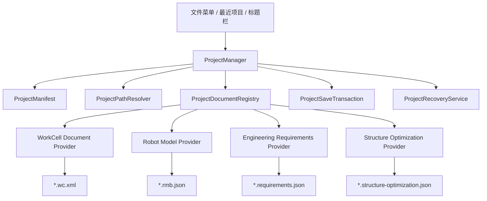
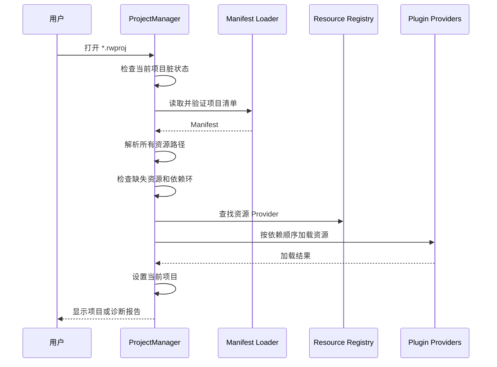

## 总体建议

推荐采用成熟工业软件常见的 **“项目清单文件 + 原生资源文件 + 可选打包文件”** 模式：

- 项目入口文件：`*.rwproj`
- 项目内部资源继续保持现有格式：
  - WorkCell：`*.wc.xml`
  - 机器人模型：`*.rmb.json`
  - 工程需求：`*.requirements.json`
  - 结构优化：`*.structure-optimization.json`
  - 网格、脚本、轨迹等其他资源
- 软件主工作流从“打开 WorkCell”升级为：
  - 新建项目
  - 打开项目
  - 保存项目
  - 项目另存为
  - 关闭项目
- 原有“单独打开 XML/JSON”保留为兼容入口，但定位为：
  - 导入到项目
  - 临时查看
  - 旧格式迁移

不建议第一阶段把所有 XML、JSON、模型文件直接嵌入一个超大 JSON。这样会破坏现有加载器、Git 差异查看、第三方工具编辑和资源复用能力。

---

## 现状判断

当前 RobWorkStudio 主程序仍将 WorkCell 当作顶层文档：

- 文件菜单直接绑定新建、打开、保存 WorkCell：`D:\10_Source_Repos\21_robot\RobWork\RobWork\RobWorkStudio\src\rws\RobWorkStudio.cpp:292`
- 保存操作直接调用 WorkCell XML 保存器：`D:\10_Source_Repos\21_robot\RobWork\RobWork\RobWorkStudio\src\rws\RobWorkStudio.cpp:848`
- 打开文件时根据扩展名判断 WorkCell、网格等类型：`D:\10_Source_Repos\21_robot\RobWork\RobWork\RobWorkStudio\src\rws\RobWorkStudio.cpp:918`

与此同时，各业务插件已经分别形成自己的“局部项目文件”：

- 工程需求自己保存和加载 `*.requirements.json`：`D:\10_Source_Repos\21_robot\RobWork\RobWork\RobWorkStudio\src\rwslibs\engineeringrequirements\EngineeringRequirementsWidget.cpp:1077`
- 结构优化自己保存和加载 `*.structure-optimization.json`：`D:\10_Source_Repos\21_robot\RobWork\RobWork\RobWorkStudio\src\rwslibs\structureoptimizer\StructureOptimizerWidget.cpp:686`
- 机器人模型已有 `RobotModelSpecJson` 和 `*.rmb.json`
- 各插件自己弹出 `QFileDialog`、自己记录文件路径、自己处理版本号

由此带来的核心问题是：

1. 用户无法确认哪些文件属于同一个工程。
2. WorkCell、机器人模型、需求、优化任务之间依赖关系靠人工维护。
3. 移动工程目录后，绝对路径容易失效。
4. 主程序不知道插件数据是否修改，无法统一提示保存。
5. “保存”含义不统一，有时保存 WorkCell，有时保存插件 JSON。
6. 无法完整实现最近项目、自动恢复、项目打包、缺失资源诊断。
7. 各插件可能重复保存相同模型、场景和冻结数据。

---

# 一、候选方案比较

## 方案 A：单体项目文件

把 WorkCell、需求、机器人模型、优化配置全部写进一个 `*.rwproj` JSON。

```text
Demo.rwproj
```

项目文件内部包含所有业务数据。

### 优点

- 用户只看到一个文件。
- 复制和发送简单。
- 不存在相对路径失效问题。
- 保存事务相对容易处理。

### 缺点

- 项目文件会非常大。
- XML、网格、轨迹等数据嵌入困难。
- 原有加载器需要大量重写。
- Git 差异和多人协作体验差。
- 单个插件修改会导致整个大文件变化。
- 外部工具无法直接编辑原生资源。
- 二进制资源通常还需要 Base64，效率较低。

### 结论

不适合作为当前 RobWorkStudio 的主格式。可以作为未来的小型“单文件演示工程”，但不建议作为标准工作格式。

---

## 方案 B：清单型项目文件

`*.rwproj` 只保存项目元数据、资源索引、入口和依赖关系；业务内容继续保存在原有 XML、JSON 文件中。

```text
RobotStation/
├─ RobotStation.rwproj
├─ scenes/
│  └─ main.wc.xml
├─ models/
│  └─ robot.rmb.json
├─ requirements/
│  └─ production.requirements.json
├─ optimization/
│  └─ layout.structure-optimization.json
└─ assets/
   ├─ meshes/
   └─ scripts/
```

### 优点

- 最大程度复用现有格式和加载器。
- Git 友好。
- 资源可独立编辑、验证和复用。
- 大文件不会全部集中在项目清单中。
- 容易支持插件扩展。
- 适合长期演进。

### 缺点

- 用户复制时需要复制整个目录。
- 保存时要处理多个文件的一致性。
- 需要严格制定相对路径和资源所有权规则。

### 结论

**推荐作为标准工作格式。**

---

## 方案 C：压缩包项目

将方案 B 的目录压缩成单个文件，例如：

```text
RobotStation.rwpack
```

内部仍然是：

```text
project.rwproj
scenes/
models/
requirements/
assets/
```

### 优点

- 便于交付、归档和发送。
- 内部仍保持清晰的资源结构。
- 可以加入校验和、签名、版本信息。

### 缺点

- 日常编辑时需要解压或使用虚拟文件系统。
- 保存大资源时需要重写压缩包。
- Git 不友好。
- 崩溃恢复和局部保存更复杂。

### 结论

适合作为后续的 **“项目打包/发布”格式**，不适合作为第一阶段的日常工作格式。

---

# 二、推荐的双格式设计

最终建议同时定义两种格式：

| 格式 | 用途 | 形态 |
|---|---|---|
| `*.rwproj` | 日常编辑项目 | JSON 清单文件加项目目录 |
| `*.rwpack` | 归档、交付、发送 | 压缩包，内部包含 `project.rwproj` 和资源 |

第一阶段只实现 `*.rwproj`。

第二阶段增加：

- 打包项目
- 从项目包打开
- 解包为项目
- 发布只读项目包

---

# 三、建议的项目目录

```text
MyRobotProject/
├─ MyRobotProject.rwproj
│
├─ scenes/
│  ├─ main.wc.xml
│  ├─ main.dwc.xml
│  └─ proximity.prox.xml
│
├─ models/
│  ├─ robot.rmb.json
│  └─ devices/
│
├─ requirements/
│  └─ station.requirements.json
│
├─ optimization/
│  └─ station.structure-optimization.json
│
├─ trajectories/
│  ├─ commissioning.rwplay
│  └─ inspection.csv
│
├─ scripts/
│  ├─ initialize.lua
│  └─ validate.py
│
├─ assets/
│  ├─ meshes/
│  ├─ textures/
│  └─ documents/
│
├─ generated/
│  ├─ reports/
│  └─ exports/
│
└─ .rwproject/
   ├─ autosave/
   ├─ cache/
   └─ session.json
```

## 目录职责

### `scenes`

保存 WorkCell、DynamicWorkCell、碰撞和邻近配置。

### `models`

保存机器人模型源文件和设备定义。

### `requirements`

保存工程需求、工位、工艺模板和冻结需求。

### `optimization`

保存结构优化问题和优化配置。

### `trajectories`

保存轨迹、播放文件和采样结果。

### `assets`

保存项目拥有的网格、纹理和附件。

### `generated`

保存可重新生成的输出，原则上不作为项目权威输入。

### `.rwproject`

保存内部状态：

- 自动恢复文件
- 缓存
- 本机 UI 布局
- 临时事务文件

`.rwproject/session.json` 不应包含必须共享的工程数据，可以加入 `.gitignore`。

---

# 四、`*.rwproj` 文件设计

建议采用 UTF-8 JSON，而不是 XML。

原因：

- 当前新业务模块已经大量使用 Qt JSON。
- 插件扩展字段更容易实现。
- 版本升级和可选字段处理简单。
- 人工查看和 Git 合并相对友好。
- 项目文件主要是清单，不涉及 WorkCell XML 的领域模型优势。

示例：

```json
{
  "format": "RobWorkStudioProject",
  "schemaVersion": 1,

  "project": {
    "id": "857c70d8-9fc2-493f-982c-4149f913ff65",
    "name": "UR85机床上下料",
    "description": "UR-6-85-5-A机床上下料工作站",
    "createdAt": "2026-07-31T10:30:00Z",
    "modifiedAt": "2026-07-31T12:00:00Z",
    "createdWith": {
      "application": "RobWorkStudio",
      "version": "1.0.0"
    }
  },

  "entryPoints": {
    "mainWorkCell": "scene.main",
    "robotModel": "robot.primary",
    "requirements": "requirements.production",
    "optimization": "optimization.layout"
  },

  "resources": [
    {
      "id": "scene.main",
      "kind": "robwork.workcell",
      "path": "scenes/main.wc.xml",
      "required": true,
      "ownership": "project"
    },
    {
      "id": "robot.primary",
      "kind": "robwork.robot-model",
      "path": "models/robot.rmb.json",
      "required": true,
      "ownership": "project"
    },
    {
      "id": "requirements.production",
      "kind": "rws.engineering-requirements",
      "path": "requirements/station.requirements.json",
      "required": false,
      "ownership": "project",
      "dependencies": [
        "scene.main",
        "robot.primary"
      ]
    },
    {
      "id": "optimization.layout",
      "kind": "rws.structure-optimization",
      "path": "optimization/station.structure-optimization.json",
      "required": false,
      "ownership": "project",
      "dependencies": [
        "scene.main",
        "robot.primary",
        "requirements.production"
      ]
    }
  ],

  "plugins": {
    "rws.engineeringrequirements": {
      "enabled": true,
      "activeDocument": "requirements.production"
    },
    "rws.structureoptimizer": {
      "enabled": true,
      "activeDocument": "optimization.layout"
    }
  },

  "settings": {
    "defaultLengthUnit": "m",
    "defaultAngleUnit": "deg",
    "pathPolicy": "project-relative"
  }
}
```

---

# 五、项目清单的关键规则

## 1. 资源必须有稳定 ID

插件之间不要直接依赖文件路径：

```json
"requirements": "requirements/station.requirements.json"
```

更推荐依赖资源 ID：

```json
"requirements": "requirements.production"
```

路径可以变化，资源 ID 保持稳定。

例如用户将：

```text
requirements/station.requirements.json
```

移动为：

```text
requirements/phase2/station.requirements.json
```

只需修改项目清单，不需要重写其他业务文件。

---

## 2. 项目内路径统一使用相对路径

项目清单中的路径：

- 使用 `/` 作为逻辑分隔符。
- 相对于 `*.rwproj` 所在目录。
- 禁止保存当前机器上的普通绝对路径。
- 禁止使用包含项目目录之外的 `..` 路径作为项目自有资源。

正确：

```json
"path": "assets/meshes/fixture.stl"
```

不推荐：

```json
"path": "D:/RobotData/Meshes/fixture.stl"
```

---

## 3. 支持外部引用，但必须显式声明

工业场景中不可完全禁止外部模型库，例如企业标准机器人库、工具库。

可以支持：

```json
{
  "id": "robot.primary",
  "kind": "robwork.robot-model",
  "uri": "rwlib://robots/UR/UR-6-85-5-A",
  "ownership": "external",
  "version": "2.1.0"
}
```

建议区分三种所有权：

| `ownership` | 含义 |
|---|---|
| `project` | 文件由项目拥有，保存和打包时必须包含 |
| `external` | 外部库资源，不由项目修改 |
| `generated` | 可重新生成的结果，可选择不打包 |

第一阶段可以只完整支持 `project`，将绝对路径资源标记为 `external-file`，并在打开时给出可移植性警告。

---

## 4. 项目文件不保存瞬时 UI 状态

以下内容不应进入共享的 `*.rwproj`：

- 窗口坐标
- Dock 布局
- 当前表格列宽
- 最近打开目录
- 临时选中的 Frame
- 当前相机角度
- 本机插件路径

这些信息保存到：

```text
.rwproject/session.json
```

这样不会因为用户拖动窗口而污染 Git。

如果有需要共享的视图，例如“标准验收视角”，应作为明确的项目资源，而不是普通 UI Session。

---

## 5. 项目清单不重复保存业务内容

例如机器人模型已经在：

```text
models/robot.rmb.json
```

项目清单只引用它，不再次嵌入完整 `RobotModelSpec`。

同理，结构优化文件不应再复制整个机器人模型。应优先记录：

```json
{
  "robotModelResource": "robot.primary",
  "modelFingerprint": "sha256:..."
}
```

如果冻结审计确实要求保存不可变快照，可保留冻结快照，但必须明确：

- 它是审计快照，不是当前项目模型。
- 当前模型与冻结模型可以进行指纹比对。
- 不能把冻结快照错误当作新的权威数据源。

---

# 六、软件核心架构

建议在 `RobWorkStudio` 主程序层新增统一项目子系统。



## 核心类建议

### `ProjectManifest`

项目清单的内存模型，负责：

- 项目基本信息
- 资源列表
- 入口资源
- 插件扩展配置
- Schema 版本

### `ProjectManifestJson`

只负责：

- JSON 序列化
- JSON 反序列化
- 必填字段验证
- Schema 升级

避免把磁盘操作、UI 和业务加载混到 JSON 类中。

### `ProjectPathResolver`

统一处理：

- 项目相对路径
- 路径规范化
- 防止越界路径
- 外部引用
- Windows 大小写和分隔符
- 项目移动后的路径解析

### `ProjectManager`

负责整个项目生命周期：

- 新建项目
- 打开项目
- 保存项目
- 项目另存为
- 关闭项目
- 当前项目查询
- 脏状态汇总
- 最近项目
- 项目级事件广播

### `ProjectDocumentRegistry`

注册所有能参与项目生命周期的插件文档。

每个插件不再由主程序硬编码具体 JSON 格式，而是注册自己的 Provider。

### `ProjectSaveTransaction`

负责多文件安全保存：

1. 收集需要保存的文档。
2. 写入同目录临时文件。
3. 对临时文件做格式验证。
4. 原子替换目标文件。
5. 最后保存项目清单。
6. 任一步失败时保留原文件并报告失败项。

### `ProjectRecoveryService`

负责：

- 定时自动保存
- 崩溃恢复
- 检测未完成的保存事务
- 清理过期临时文件

---

# 七、插件项目接口

建议定义一个轻量接口，而不是让 `ProjectManager` 了解每种插件的数据结构。

示意接口：

```cpp
class ProjectDocumentProvider
{
public:
    virtual ~ProjectDocumentProvider() = default;

    virtual QString providerId() const = 0;
    virtual QStringList supportedResourceKinds() const = 0;

    virtual bool loadResource(
        const ProjectResource& resource,
        const ProjectContext& context,
        QString* error) = 0;

    virtual bool saveResource(
        const ProjectResource& resource,
        const ProjectContext& context,
        QString* error) = 0;

    virtual bool isDirty() const = 0;
    virtual bool canClose(QString* reason) const = 0;
    virtual void closeResource() = 0;
};
```

实际实现时还应增加：

- `validateResource()`
- `createDefaultResource()`
- `saveResourceTo(path)`
- `resourceDependencies()`
- 脏状态变化信号
- 保存优先级或者依赖顺序

## 各模块对应关系

| 模块 | Provider |
|---|---|
| 主程序 WorkCell | `WorkCellProjectDocumentProvider` |
| RobotModelBuilder | `RobotModelProjectDocumentProvider` |
| EngineeringRequirements | `EngineeringRequirementsProjectDocumentProvider` |
| StructureOptimizer | `StructureOptimizationProjectDocumentProvider` |

这样新增插件时，只需要注册新的资源类型：

```text
rws.calibration
rws.motion-planning
rws.virtual-commissioning
```

不需要持续修改 `ProjectManager`。

---

# 八、打开项目流程

推荐流程如下：



## 推荐加载顺序

1. 项目清单。
2. 项目设置。
3. 主 WorkCell。
4. 机器人模型。
5. 工程需求。
6. 结构优化项目。
7. 轨迹和分析结果。
8. UI Session。

因为工程需求和结构优化通常依赖 WorkCell、机器人模型及当前状态。

---

## 打开失败策略

不要因为一个非关键插件资源损坏就完全打不开项目。

资源应有：

```json
"required": true
```

或：

```json
"required": false
```

处理策略：

- 必需资源缺失：项目打开失败，显示诊断。
- 可选资源缺失：项目以降级模式打开。
- 插件未安装：保留未知资源，不删除，不覆盖。
- 插件资源版本过新：只读或跳过，给出明确提示。
- 外部资源找不到：允许用户重新定位。
- WorkCell 加载失败：原则上项目无法进入正常编辑状态。

---

# 九、保存项目流程

“保存项目”应保存整个项目的所有已修改文档，而不是只保存当前插件。

推荐步骤：

1. 查询所有 Provider 的脏状态。
2. 按依赖关系验证文档。
3. 检查目标文件是否被外部修改。
4. 将修改内容写到临时文件。
5. 验证临时文件可以重新读取。
6. 原子替换业务文件。
7. 更新资源指纹、修改时间。
8. 最后原子保存 `*.rwproj`。
9. 清除已成功保存文档的脏状态。

## 为什么项目清单最后保存

项目清单相当于本次项目状态的“提交点”。

如果先保存清单，后保存业务文件，中途失败时，清单可能已经指向不完整的新状态。

---

# 十、脏状态模型

主程序标题栏建议显示：

```text
UR85机床上下料* - RobWorkStudio
```

星号表示项目中至少一个权威文档未保存。

不能仅设置一个简单的全局布尔值，应按资源跟踪：

```text
scene.main                    Clean
robot.primary                 Dirty
requirements.production      Dirty
optimization.layout          Clean
```

关闭项目时统一提示：

```text
以下内容尚未保存：

✓ 机器人模型
✓ 工程需求
○ WorkCell
○ 结构优化

[全部保存] [不保存] [取消]
```

插件内部不再各自实现互不关联的关闭提示。

---

# 十一、文件菜单调整

建议将当前文件菜单升级为：

```text
文件
├─ 新建项目...
├─ 打开项目...
├─ 打开最近项目
├─ 关闭项目
├─ ───────────
├─ 保存项目
├─ 项目另存为...
├─ 保存全部
├─ ───────────
├─ 导入资源...
├─ 导出/打包项目...
├─ ───────────
├─ 项目属性...
├─ 首选项...
└─ 退出
```

原有操作调整：

| 当前操作 | 调整后 |
|---|---|
| New WorkCell | 新建项目向导中的“空 WorkCell 项目” |
| Open WorkCell | 导入 WorkCell 或以兼容模式打开 |
| Save WorkCell | 保存项目的一部分 |
| Recent Files | Recent Projects |
| Reload WorkCell | 重新加载项目资源或重新加载 WorkCell |

仍可在高级菜单保留：

```text
文件 → 打开单个资源...
```

用于开发、调试和旧文件查看。

---

# 十二、新建项目向导

第一阶段保持简单，只需三步。

## 第一步：项目信息

- 项目名称
- 项目目录
- 项目模板

模板建议：

- 空项目
- 已有 WorkCell 项目
- 机器人模型设计项目
- 工程需求分析项目
- 结构优化项目

## 第二步：初始资源

- 新建空 WorkCell
- 导入已有 WorkCell
- 绑定已有机器人模型
- 将外部资源复制进项目
- 保持外部引用

## 第三步：确认

显示将要创建的目录和文件。

创建必须是原子的：如果中途失败，清理已生成的空目录和临时文件。

---

# 十三、兼容旧文件

这是迁移风险最低的关键。

## 打开旧 WorkCell

用户直接打开：

```text
GenericSixAxisScene.wc.xml
```

软件提示：

```text
该文件不是 RobWorkStudio 项目。

[基于此文件创建项目]
[临时打开]
[取消]
```

“基于此文件创建项目”可以选择：

- 复制 WorkCell 到项目目录。
- 保留原位置作为外部资源。
- 同时收集 WorkCell 引用的设备、网格和碰撞配置。

---

## 打开旧插件 JSON

例如直接打开：

```text
station.requirements.json
```

可提示：

- 导入当前项目
- 创建新项目并导入
- 临时在对应插件中打开

第一阶段也可继续保留插件内部打开按钮，但打开后应把该文件注册为当前项目资源，或者明确标记为“项目外临时文档”。

---

# 十四、Schema 版本策略

项目文件至少包含两个概念：

```json
{
  "format": "RobWorkStudioProject",
  "schemaVersion": 1
}
```

不要仅依赖应用版本判断格式。

## 规则

- 缺少 `format`：不是项目文件。
- `schemaVersion` 小于当前版本：通过 Migrator 升级。
- `schemaVersion` 大于当前版本：原则上只读打开或拒绝。
- 未识别字段必须尽量原样保留。
- 插件扩展字段由插件自行解释。
- 迁移过程不直接覆盖原文件，先生成备份或等待用户保存。

建议结构：

```cpp
ProjectManifestV1
ProjectManifestMigrator
ProjectManifestValidator
```

不要在主加载函数中堆积大量：

```cpp
if (version == 1) ...
else if (version == 2) ...
```

---

# 十五、资源指纹和外部修改

对关键资源建议记录指纹：

```json
{
  "id": "robot.primary",
  "path": "models/robot.rmb.json",
  "fingerprint": {
    "algorithm": "sha256",
    "value": "..."
  }
}
```

用途：

- 检测文件是否被外部工具修改。
- 验证冻结需求是否仍对应当前模型。
- 检测外部库模型版本变化。
- 支持审计和问题复现。

但不建议第一阶段对所有大型网格每次保存都重新计算哈希。可以只对：

- 机器人模型
- WorkCell
- 工程需求
- 结构优化输入

进行指纹管理。

---

# 十六、项目另存为语义

“项目另存为”不能只是复制 `*.rwproj`。

推荐提供两种模式：

## 另存项目

复制：

- 项目清单
- 所有 `ownership=project` 的资源
- 必需的本地资源

重新计算项目根目录下的相对路径。

## 克隆项目

除复制文件外：

- 生成新的 `project.id`
- 清理自动保存和缓存
- 可选择清理计算结果
- 保留来源项目信息

例如：

```json
"derivedFrom": {
  "projectId": "...",
  "projectName": "OriginalProject"
}
```

---

# 十七、第一阶段暂不做的内容

为避免项目系统一次性膨胀，建议首版明确排除：

- 多个项目同时打开
- 网络协同编辑
- 数据库式项目存储
- 增量压缩包保存
- 资源服务器
- 云端同步
- 插件自动下载安装
- 完整资源版本控制系统
- 项目内文件加密
- 数字签名
- 大型二进制对象数据库

首版坚持：**单应用实例中一个活动项目、目录式项目、JSON 清单、相对路径、统一保存。**

---

# 十八、分阶段实施路线

## 阶段 1：项目基础设施

新增：

- `ProjectManifest`
- `ProjectManifestJson`
- `ProjectPathResolver`
- `ProjectResource`
- `ProjectManager`
- `ProjectValidator`

实现：

- 创建空项目
- 打开 `*.rwproj`
- 关闭项目
- 最近项目
- 主 WorkCell 资源加载
- 项目名称显示在标题栏

这一阶段不急于改造所有插件。

---

## 阶段 2：统一保存和脏状态

实现：

- `ProjectDocumentProvider`
- `ProjectDocumentRegistry`
- 项目级 Dirty 汇总
- 保存项目
- 保存全部
- 关闭前统一提示
- 临时文件加原子替换
- 外部修改检测

首先接入 WorkCell。

---

## 阶段 3：接入现有插件

按依赖顺序接入：

1. RobotModelBuilder
2. EngineeringRequirements
3. StructureOptimizer
4. KinematicAnalysis
5. 轨迹和其他分析插件

把插件内部的 `QFileDialog` 降级为：

- 导入
- 导出副本
- 项目外调试入口

正常工作流由 `ProjectManager` 管理。

---

## 阶段 4：旧文件迁移

实现：

- WorkCell 创建项目
- 机器人模型创建项目
- 工程需求导入项目
- 结构优化文件导入项目
- 自动扫描相邻依赖文件
- 绝对路径转相对路径
- 缺失资源重新定位

---

## 阶段 5：恢复和打包

实现：

- `.rwproject/autosave`
- 崩溃恢复
- 项目完整性检查
- `*.rwpack`
- 项目打包和解包
- 项目资源清理
- 查找未引用资源

---

# 十九、建议的首版验收标准

首版项目系统至少满足：

1. 能创建包含一个 WorkCell 的 `*.rwproj` 项目。
2. 移动整个项目目录后仍能正常打开。
3. 打开项目后自动加载主 WorkCell。
4. 项目清单能引用机器人模型、工程需求和结构优化文件。
5. 某个可选插件不存在时，项目仍能降级打开。
6. 必需资源缺失时显示准确路径和资源 ID。
7. 修改 WorkCell 或插件文档后，标题栏出现脏标志。
8. 点击“保存项目”能保存所有修改资源。
9. 某个资源保存失败时，不把整个项目错误标记为已保存。
10. 关闭项目时统一提示未保存内容。
11. 未识别的插件字段在重新保存时不会被删除。
12. 原有 `*.wc.xml` 可以创建或导入到新项目。
13. 项目内不保存普通绝对路径。
14. 项目文件可以通过 Schema 版本进行后续升级。
15. 项目保存过程中崩溃，不应破坏上一次成功保存的版本。

---

# 二十、最终推荐结论

建议确定以下设计基线：

- 标准项目扩展名：`*.rwproj`
- 文件编码：UTF-8 JSON
- 项目形态：清单文件加资源目录
- 资源定位：稳定资源 ID 加项目相对路径
- 插件接入：`ProjectDocumentProvider`
- 项目生命周期：由主程序 `ProjectManager` 统一管理
- 保存策略：多文件事务，项目清单最后提交
- 用户状态：共享工程数据与本机 Session 分离
- 兼容策略：旧 XML/JSON 支持导入和临时打开
- 发布格式：后续增加压缩型 `*.rwpack`
- 首版边界：单窗口只打开一个活动项目

这套方案能最大程度保留现有 RobWork 格式和业务代码，同时逐步把软件从“WorkCell 查看器加独立插件”升级为真正的工业项目型应用。